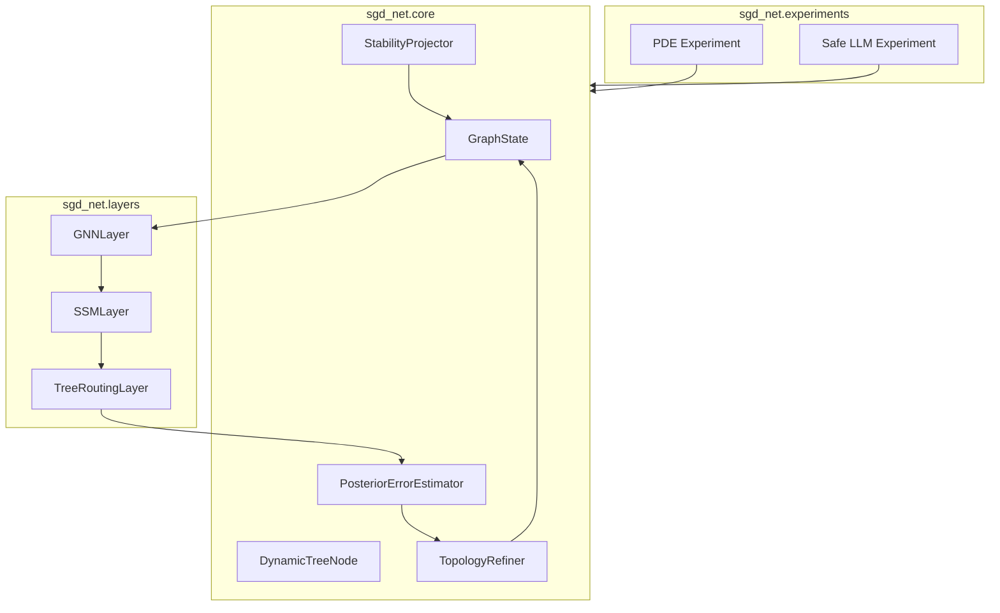

# SGD-Net Python 实现技术白皮书

> 公开研究版 · 2026-09-12。保留模型方法、公式和组件设计；本文描述研究方案，未据此声称已有训练结果、完整实现或芯片性能。章节编号保留原研究索引，缺号表示未随包发布的独立规划内容。

> 文档类型：技术白皮书\
> 版本：v0.1\
> 日期：2026-06-07\
> 面向对象：研发负责人、算法工程师、科学计算工程师、可信 AI 工程团队

**本页目录**

- [1. 执行摘要](#section-001)
- [2. 建设目标](#section-002)
- [3. 适用场景](#section-005)
- [4. 核心技术路线](#section-009)
- [5. 推荐系统架构](#section-014)
- [6. 关键算法](#section-015)
- [7. 数据结构建议](#section-018)
- [8. 工程质量要求](#section-022)
- [9. 风险与应对](#section-026)
- [10. 推荐里程碑](#section-027)
- [11. 结论](#section-028)
- [12. 二期扩展技术路线](#section-029)
- [13. 更新后的工程优先级](#section-037)

---

## 1. 执行摘要 

SGD-Net（State-space Graph-Dynamic Tree Network）是一种融合状态空间模型、图神经网络和动态自适应决策树的新型 AI 架构。其 Python 实现目标不是简单复刻一个普通神经网络层，而是构建一个能够动态扩张图拓扑、执行节点级局部分裂、评估后验误差并施加稳定性投影的实验平台。

本白皮书提出一条从 `NumPy` 概念原型到 `PyTorch / PyTorch Geometric` 可训练版本，再到面向 PDE 和可信推理任务的研究系统的实现路线。

## 2. 建设目标 

### 2.1 总目标 

构建一个可复现、可扩展、可测试的 Python 实验框架，用于验证 SGD-Net 的三类核心能力：

1. **状态递推**：用 SSM 维护长程状态；需要隐式物理步进或固定点层时另接 IM 求解组件；
2. **拓扑约束**：用 GNN 在图邻接边界内传播信息；
3. **结构自适应**：用动态树根据配对误差、归因和预算提出分裂、剪枝和拓扑重构候选。

### 2.2 阶段目标 

| 阶段 | 目标 | 技术栈 |
|---|---|---|
| P0 | 可运行概念原型 | Python + NumPy |
| P1 | 可测试研究原型 | NumPy + pytest |
| P2 | 可微训练版本 | PyTorch |
| P3 | 图批处理版本 | PyTorch Geometric |
| P4 | PDE / Safe LLM 双场景验证 | PyTorch + PyG + 实验脚本 |

## 3. 适用场景 

### 3.1 科学计算 

- 自适应 PDE 求解；
- 激波、裂纹尖端和局部奇异场识别；
- 神经算子与有限元混合方法；
- 多物理场耦合代理模型。

### 3.2 可信 AI / 安全大模型 

- 事实图谱约束推理；
- 多跳逻辑路径验证；
- 长上下文因果状态保持；
- 投毒输入检测、隔离和回滚。

### 3.3 异常检测与动态图学习 

- 传感器网络异常传播隔离；
- 金融交易图风险路径阻断；
- 工业系统状态自适应监测。

## 4. 核心技术路线 

### 4.1 NumPy 原型 

NumPy 原型主要验证数据结构和算法流程：

- 使用二维数组表示节点特征矩阵 `X`；
- 使用二维数组表示邻接矩阵 `A`；
- 使用 Python 类表示动态树节点；
- 使用配对残差与归因提出细化候选；
- 使用 SVD 裁剪模拟稳定性投影。

适合快速验证：

- 拓扑扩张是否正确；
- 旧节点隔离是否生效；
- 新节点是否继承邻域；
- 残差阈值是否仅触发候选评估；
- 谱裁剪是否限制特征爆炸。

### 4.2 PyTorch 可微版本 

PyTorch 版本需要将核心算子变为可训练模块：

- `torch.Tensor` 替代 `numpy.ndarray`；
- 动态树门控采用 sigmoid / Gumbel-Softmax；
- SSM 层采用可训练参数化；
- GNN 消息传递支持反向传播；
- 数值正则化作为训练后 hook 或约束层；稳定性结论另检查整个更新映射的适用条件。

### 4.3 PyTorch Geometric 图批处理版本 

当图节点数量动态变化后，邻接矩阵方式会变得低效。PyG 版本应改用：

- `edge_index` 表示稀疏图边；
- `Data` / `Batch` 管理单图和多图；
- `MessagePassing` 自定义消息函数；
- 动态 remesh 后更新 `edge_index` 和节点特征。

### 4.4 双场景应用层 

应用层包含两类实验任务：

1. PDE 实验：输入空间采样点、边界条件、目标物理场，输出近似解和残差图。
2. Safe LLM 实验：输入事实图谱和推理请求，输出可解释推理路径、异常隔离记录和答案。

## 5. 推荐系统架构 

## 6. 关键算法 

### 6.1 证据驱动候选生长 

1. 按事件时间对活动版本执行 GNN、SSM、路由和预测，保存预测时可用输入。
2. 真实结果到达后按实体、时刻和预测版本配对；无结果时保留未知，不使用未来 target。
3. 区分观测噪声、缺观测、离散误差与容量不足，持续误差只产生候选动作。
4. 明确 representation / expert / candidate 三种树模式；实体图不能任意拆分真实原子或机械连杆。
5. 在隔离候选上更新拓扑，迁移各层节点特征、SSM 状态、树、掩码、优化器和可执行布局。
6. 以留出或时序前向验证检查收益、旧任务回归、数值条件和预算，通过后窗口间自动接纳，否则丢弃候选。

这个流程允许受限在线学习，不要求每次人工批准；更大规模巩固可离线完成。

### 6.2 稳定性投影 

初期可采用 SVD 裁剪：

$$
X=U\Sigma V^T,\quad \Sigma'=\min(\Sigma, s_{max}),\quad X'=U\Sigma'V^T
$$

该操作只约束被裁剪矩阵的奇异值，不能证明整个非线性、时变或闭环系统稳定；不得直接裁剪带物理单位的测量坐标。

后续可扩展为：

- 权重谱归一化；
- 梯度范数裁剪；
- 李雅普诺夫能量下降约束；
- 事实图谱边界约束投影；
- 局部子图回滚。

## 7. 数据结构建议 

### 7.1 GraphState 

保存动态图状态：

- `x`: 节点特征；
- `edge_index` 或 `adjacency`: 图边；
- `node_trees`: 节点到动态树的映射；
- `active_mask`: 节点是否活跃；
- `lineage`: 节点父子谱系；
- `metadata`: 场景相关信息。

### 7.2 DynamicTreeNode 

保存节点内部树结构：

- `depth`;
- `max_depth`;
- `split_feature`;
- `threshold`;
- `left_child`;
- `right_child`;
- `local_bias`;
- `status`。

### 7.3 ErrorReport 

保存后验误差结果：

- `node_id`;
- `residual`;
- `triggered`;
- `reason`;
- `suggested_action`。

## 8. 工程质量要求 

### 8.1 可复现性 

- 所有随机数支持 seed；
- 所有实验配置写入 YAML / JSON；
- 输出节点增长日志和残差曲线；
- 保存模型和图拓扑快照。

### 8.2 可测试性 

- 单元测试覆盖动态树分裂；
- 单元测试覆盖邻接矩阵扩张；
- 单元测试覆盖旧节点隔离；
- 单元测试覆盖谱裁剪；
- 集成测试覆盖完整 split-refine-project 流程。

### 8.3 可扩展性 

- 核心接口不绑定 NumPy 或 PyTorch；
- 后验误差估计器可插拔；
- 拓扑重构策略可插拔；
- 稳定性投影策略可插拔；
- 应用场景通过 adapter 接入。

## 9. 风险与应对 

| 风险 | 影响 | 应对 |
|---|---|---|
| 动态图导致批处理困难 | 训练效率下降 | 优先使用 PyG 稀疏边表示 |
| 决策树硬分裂不可微 | 端到端训练困难 | 使用软门控或 straight-through estimator |
| 理论假设过强 | 论文难以成立 | 明确假设范围，以实验验证补充 |
| 事实图谱质量不足 | Safe LLM 效果受限 | 引入检索、校验和置信度评分 |
| 节点无限增长 | 内存失控 | 设置最大深度、预算和剪枝策略 |

## 10. 推荐里程碑 

1. 两周内完成 NumPy 原型与基础测试。
2. 四周内完成 PyTorch 可微版本。
3. 六周内完成 PyG 稀疏图版本。
4. 八周内完成 PDE 小实验。
5. 十周内完成 Safe LLM 小实验。
6. 十二周内形成论文实验结果和专利实施例补充材料。

## 11. 结论 

SGD-Net Python 实现的核心价值在于把原始构想转化为可运行、可观测、可测试的动态拓扑神经计算平台。第一阶段应避免直接追求大模型规模，而应从小图、小 PDE、小事实图谱入手，优先验证“后验误差驱动分裂 + 拓扑重构 + 稳定投影”是否形成闭环。

## 12. 二期扩展技术路线 

新选中文档将 SGD-Net 扩展到科学大模型、科研 Agent 和硬件加速。Python 实现应在第一阶段核心闭环稳定后，增加以下二期模块。

### 12.1 生物结构适配器 

新增 `sgd_net.bio` 包，用于接入 AlphaFold 3、RFdiffusion、ESMFold 等模型输出。

建议模块：

- `parsers.py`：解析 mmCIF、PDB、FASTA、SMILES；
- `graph_builder.py`：构造残基、原子、配体、离子和修饰残基异构图；
- `posterior_errors.py`：计算 pLDDT/PAE/ipTM、clash、chirality、pocket 等后验误差；
- `local_refiner.py`：对局部高误差区域输出重采样或 refinement 建议；
- `adapters/alphafold3.py`、`adapters/rfdiffusion.py`、`adapters/esmfold.py`：适配不同模型输出。

### 12.2 科研 Agent 适配器 

新增 `sgd_net.agent` 与 `sgd_net.materials` 包，用于支持 `SGD-Scientist`。

建议模块：

- `state_tracker.py`：维护跨轮次科研任务状态；
- `research_graph.py`：构造文献、材料、仿真、实验和表征图谱；
- `experiment_tree.py`：管理候选材料与实验路径动态树；
- `active_learning.py`：根据后验误差选择下一批实验；
- `vasp_adapter.py`、`xrd_analyzer.py`、`sem_analyzer.py`：接入材料仿真和表征数据。

### 12.4 双闭环控制与认知模块 

根据 原始讨论材料（本包不附），Python 实现还应增加 `sgd_net.control` 与 `sgd_net.cognition` 包，用于支持前馈预测、后验反馈、来源监控和知识分类。

建议模块：

- `feedforward_predictor.py`：根据当前 GraphState/SSM state 预测未来高风险区域；
- `posterior_corrector.py`：根据真实后验误差执行校正、回滚和 refinement；
- `control_arbiter.py`：决定前馈计划与反馈断路谁优先；
- `memory_manager.py`：管理长期/中期/短期/瞬时记忆；
- `source_monitor.py`：记录真实实验、仿真、文献、预测、他人经验等来源标签；
- `knowledge_ontology.py`：区分局部正确经验、局部错误教训和待核实知识；
- `shadow_graph.py`：维护低置信影子图-树隔离区。

### 12.5 SGD-Ecosystem 生态接口 

若要让 SGD-Net 进入真实科学闭环，应增加 `sgd_net.ecosystem`、`sgd_net.twin` 与 `sgd_net.synapse` 包。

建议模块：

- `lab_tokens.py`：统一表示实验动作、仪器观测、样品和安全事件；
- `actuator_interface.py`：对接机械臂、合成设备和测试仪器；
- `sensor_interface.py`：对接 XRD/SEM/TEM/Raman/EIS 等多模态采集；
- `world_model.py`：差分数字孪生接口；
- `stochastic_rollout.py`：带扰动的沙箱预演；
- `dual_track_graph.py`：虚拟仿真与真实实验双轨图；
- `cross_domain_error.py`：计算虚实后验误差；
- `promotion_engine.py`：将假说晋升为经验、降级为教训或隔离。

### 12.7 SGD-Retrospection 反省复盘与自进化模块 

根据 原始讨论材料（本包不附），Python 实现还应增加 `sgd_net.retrospection` 包，用于把后验误差、事件日志、多级记忆和知识分类动态整理为快速推理机制。

建议模块：

- `event_recorder.py`：记录惊奇误差、控制动作、来源、稳定性变化和计算成本；
- `replay_buffer.py`：管理在线/离线经验缓冲区；
- `hotness_clustering.py`：识别高频、高收益、低误差处理路径；
- `memory_consolidator.py`：跨层级记忆整合与因果骨架提取；
- `counterfactual_generator.py`：生成反事实扰动和极端工况；
- `retrospection_compiler.py`：将高成本显式处理编译为快速推理候选；
- `fast_path_registry.py`：管理已固化的快速推理路径；
- `decay_pruner.py`：主动遗忘、路径衰减、剪枝、压缩和归档。

### 12.8 JEPA / JSBO 世界模型桥梁模块 

根据 原始讨论材料（本包不附），Python 实现还应增加 `sgd_net.jepa_bridge` 包，用于接入 I-JEPA、V-JEPA 或其他自监督世界模型的隐空间表征，并将其转换为 SGD-Net 可消费的 `GraphState`、`PhysicalState` 或 `BridgeState`。

建议模块：

- `jepa_adapter.py`：接入外部 JEPA encoder / predictor 输出；
- `latent_tensor.py`：定义 `JEPALatentTensor`，保存 latent、mask、位置、action 和来源元数据；
- `bridge_operator.py`：实现 $$\Psi_{bridge}:\mathcal{H}_{J}\rightarrow\mathcal{M}_{SGD}$$ 主映射；
- `metric_pullback.py`：实现隐空间到结构空间的度量拉回；
- `koopman_projector.py`：实现 Koopman 一致性与谱稳定监控；
- `symplectic_projector.py`：在哈密顿场景中实现辛结构残差，在耗散场景中退化为 Lyapunov/能量约束；
- `physical_cost.py`：对接 PPU/PDE/energy residual cost；
- `collapse_regularizer.py`：实现 VICReg/SIGReg 风格的方差、协方差和秩监控；
- `jsbo_compiler.py`：将 JSBO lowering 到 SGD-IR；
- `narrative_adapter.py`：可选，用于把 Retrospection 的离线梦境整理迁移到叙事创作模式。

### 12.9 应用先行与模拟器替换闭环模块 

根据 `SGD-Net应用先行与模拟器闭环/` 的规划，Python 实现还应增加 `sgd_net.runtime`、`sgd_net.backends` 与 `sgd_net.trace`，用于先把真实应用跑在第三方芯片或 CPU/GPU baseline 上，再将同一 workload trace 交给 SGD-TPU 模拟器/CModel 影子执行。

建议模块：

- `runtime/backend_registry.py`：注册 CPU、CUDA、ROCm、TPU/NPU、SGD-TPU simulator 和 hybrid backend；
- `runtime/placement_planner.py`：根据 op 类型、后端能力、安全策略和 profile 选择执行位置；
- `runtime/shadow_executor.py`：vendor backend 主执行，SGD-TPU simulator 旁路 replay；
- `runtime/fallback_manager.py`：管理 CPU/vendor/PPU/simulator fallback；
- `trace/workload_trace.py`：记录 AppTrace、OpTrace、BackendTrace、MemoryTrace 和 ControlTrace；
- `trace/replay_bundle.py`：生成可供 CModel/Simulator 重放的 bundle；
- `backends/cpu_reference.py`：功能金标与保守 fallback；
- `backends/vendor_cuda.py`、`vendor_rocm.py`、`vendor_npu.py`：第三方芯片 baseline adapter；
- `backends/sgd_tpu_sim.py`：对接 `SGD-TPU模拟器与CModel` 的 simulator backend；
- `profiling/bottleneck_analyzer.py`：对比 vendor/simulator，输出 roofline、PGO 和硬件规格建议。

## 13. 更新后的工程优先级 

建议保持渐进路线：

1. 第一优先级：核心 NumPy/PyTorch/PyG 闭环。
2. 第二优先级：生物结构输出诊断，因为它可直接利用现有模型输出，不要求重训大模型。
3. 第三优先级：材料科研 Agent，因为需要更多数据接口和实验流程设计。
4. 第四优先级：双闭环控制与来源监控，因为它能提升所有场景的可信度和可审计性。
5. 第五优先级：动态推理加速 runtime 与 profiling，因为它支撑 SGD-Net 的状态缓存、增量推理、后验误差触发 refinement、动态树分裂/剪枝/回滚，是“边学习、边实践、边进步”的工程底座。
6. 第六优先级：SGD-Retrospection 反省复盘 runtime，因为它负责把常用且可信的复杂处理路径整理、蒸馏和固化为快速推理机制，同时主动遗忘低价值路径。
7. 第七优先级：应用先行与模拟器替换闭环，因为它能先用第三方芯片建立真实应用 baseline，再让 SGD-TPU 模拟器重放真实 trace，避免硬件设计脱离 workload。
8. 第八优先级：JEPA / JSBO 世界模型桥梁，因为它能复用外部自监督视觉/视频/多模态表征，但必须先在软件中验证 latent 到物理/拓扑流形的可辨识性。
9. 第九优先级：SGD-Accelerator soft-IP / SGD-TPU profiling，因为硬件加速应建立在明确 workload 之上。
10. 第十优先级：SGD-XPU 软件模拟器，因为它可以在不流片的情况下验证数字孪生算子切分和数据通路。
11. 第十一优先级：真实湿实验/数字孪生生态闭环，因为它需要设备接口、安全治理和外部合作。

短期不建议直接开发完整自动化实验室、PPU 或 SGD-XSoC ASIC，也不建议直接承诺“通用 JEPA 一键物理化”。应先完成软件可观测闭环、应用先行 MVP、第三方芯片 baseline、动态推理加速 runtime、反省复盘 runtime、JSBO 小规模可辨识实验、可量化 benchmark 和 XPU 级 workload profiling。

---

[← 上一页](15-SGD-Ecosystem物理具身数字孪生与双向流形折叠.md) · [全书目录](../SUMMARY.md) · [下一页 →](04-Python实现概要设计.md)
