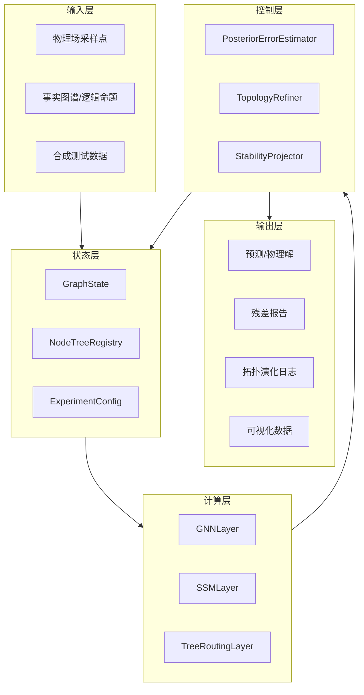
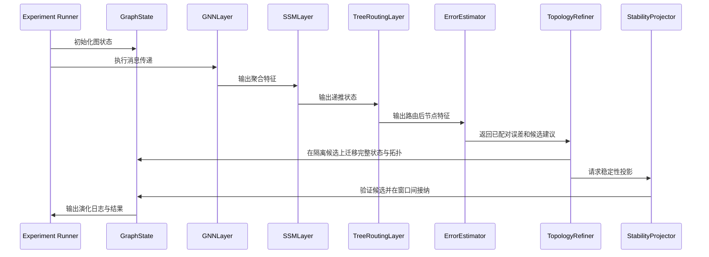

# SGD-Net Python 实现概要设计

> 公开研究版 · 2026-09-12。保留模型方法、公式和组件设计；本文描述研究方案，未据此声称已有训练结果、完整实现或芯片性能。章节编号保留原研究索引，缺号表示未随包发布的独立规划内容。


> 文档类型：概要设计\
> 版本：v0.1\
> 日期：2026-06-07

**本页目录**

- [1. 系统定位](#section-001)
- [2. 设计目标](#section-002)
- [3. 非目标](#section-005)
- [4. 总体架构](#section-006)
- [5. 模块划分](#section-007)
- [6. 数据流](#section-012)
- [7. 关键接口概要](#section-013)
- [8. 配置设计](#section-018)
- [9. 日志与可观测性](#section-019)
- [10. 设计约束](#section-020)
- [11. 运行形态](#section-021)
- [12. 验收标准](#section-024)
- [13. 扩展模块概要设计](#section-025)
- [14. 扩展后的数据流](#section-036)

---

## 1. 系统定位 <a href="#section-001" id="section-001"></a>

SGD-Net Python 实现是一个研究型动态拓扑神经网络框架，用于验证 `SSM + GNN + 动态自适应决策树` 架构在科学计算和可信推理中的可行性。

系统不以第一阶段生产部署为目标，而以可复现实验、算法验证和论文/专利实施例沉淀为目标。

## 2. 设计目标 <a href="#section-002" id="section-002"></a>

### 2.1 功能目标 <a href="#section-003" id="section-003"></a>

- 支持构造动态图状态；
- 支持图消息传递；
- 支持简化 SSM 显式状态递推；
- 支持节点内部动态树路由；
- 支持后验误差估计；
- 支持节点分裂、邻接矩阵扩张和旧节点隔离；
- 支持稳定性投影；
- 支持日志、可视化和测试。

### 2.2 非功能目标 <a href="#section-004" id="section-004"></a>

- 可复现；
- 可测试；
- 模块解耦；
- 易迁移到 PyTorch / PyG；
- 便于写论文实验和专利实施例。

## 3. 非目标 <a href="#section-005" id="section-005"></a>

第一阶段不追求：

- 直接训练大语言模型；
- 直接替代成熟有限元软件；
- 支持分布式 GPU 大规模训练；
- 提供 Web 服务；
- 提供正式产品级 UI。

## 4. 总体架构 <a href="#section-006" id="section-006"></a>



## 5. 模块划分 <a href="#section-007" id="section-007"></a>

### 5.1 `sgd_net.core` <a href="#section-008" id="section-008"></a>

负责核心数据结构和算法控制。

| 模块 | 职责 |
|---|---|
| `graph_state.py` | 动态图状态管理 |
| `dynamic_tree.py` | 动态树节点与分裂逻辑 |
| `error_estimator.py` | 后验误差估计接口 |
| `topology_refiner.py` | 图拓扑扩张、继承、隔离 |
| `stability_projector.py` | 谱裁剪、范数约束、稳定投影 |

### 5.2 `sgd_net.layers` <a href="#section-009" id="section-009"></a>

负责可替换计算层。

| 模块 | 职责 |
|---|---|
| `gnn.py` | 图消息传递 |
| `ssm.py` | 状态空间显式递推 |
| `tree_routing.py` | 动态树路由和局部修正 |

### 5.3 `sgd_net.experiments` <a href="#section-010" id="section-010"></a>

负责实验入口。

| 模块 | 职责 |
|---|---|
| `pde_demo.py` | PDE 残差驱动分裂实验 |
| `safe_llm_demo.py` | 事实图谱推理与异常隔离实验 |
| `synthetic_demo.py` | 合成小图测试 |

### 5.4 `tests` <a href="#section-011" id="section-011"></a>

负责测试。

| 测试 | 内容 |
|---|---|
| `test_dynamic_tree.py` | 树路由与分裂 |
| `test_topology_refiner.py` | 邻接矩阵扩张与隔离 |
| `test_stability_projector.py` | SVD 裁剪与范数约束 |
| `test_end_to_end.py` | 完整 refine 流程 |

## 6. 数据流 <a href="#section-012" id="section-012"></a>



## 7. 关键接口概要 <a href="#section-013" id="section-013"></a>

### 7.1 GraphState <a href="#section-014" id="section-014"></a>

```text
GraphState:
  x: 节点特征矩阵
  adjacency 或 edge_index: 图边
  node_trees: 动态树列表
  active_mask: 活跃节点掩码
  lineage: 节点谱系
```

### 7.2 ErrorEstimator <a href="#section-015" id="section-015"></a>

```text
estimate(prediction_record, matched_observation_or_none, constraints) -> ErrorReport
```

### 7.3 TopologyRefiner <a href="#section-016" id="section-016"></a>

```text
propose_and_migrate(snapshot, report, strategy, budget) -> CandidateBundle
```

### 7.4 StabilityProjector <a href="#section-017" id="section-017"></a>

```text
check_and_regularize(candidate, stability_contract) -> CandidateAndCheckResult
```

## 8. 配置设计 <a href="#section-018" id="section-018"></a>

建议使用 YAML 或 dataclass 管理配置：

```text
model:
  feature_dim: 16
  initial_nodes: 32
  max_tree_depth: 4
  split_threshold: 0.5

stability:
  svd_clip: 5.0
  max_feature_norm: 10.0

experiment:
  seed: 42
  steps: 100
  log_every: 10
```

## 9. 日志与可观测性 <a href="#section-019" id="section-019"></a>

系统应记录：

- 每轮残差均值和最大值；
- 分裂节点 ID；
- 新增节点数量；
- 旧节点隔离记录；
- 特征范数和谱半径；
- 图边数量；
- 随机种子与配置快照。

## 10. 设计约束 <a href="#section-020" id="section-020"></a>

1. 动态节点增长必须有上限，避免内存失控。
2. 分裂策略必须可插拔，便于比较不同后验误差准则。
3. 稳定投影必须可关闭，便于做消融实验。
4. 图结构应支持从稠密邻接矩阵迁移到稀疏边表示。
5. 所有核心路径必须有测试覆盖。

## 11. 运行形态 <a href="#section-021" id="section-021"></a>

### 11.1 本地研究运行 <a href="#section-022" id="section-022"></a>

- 单进程 Python；
- NumPy 或 PyTorch CPU；
- 小规模图；
- 输出 Markdown/CSV/JSON 日志。

### 11.2 GPU 研究运行 <a href="#section-023" id="section-023"></a>

- PyTorch；
- PyG；
- 稀疏图批处理；
- 支持 TensorBoard 或 wandb。

## 12. 验收标准 <a href="#section-024" id="section-024"></a>

概要设计阶段完成后，应能够回答：

- 系统包含哪些模块？
- 数据如何在模块间流动？
- 哪些接口需要保持稳定？
- 如何替换后验误差估计和稳定投影策略？
- 如何从 NumPy 原型迁移到 PyTorch / PyG？

## 13. 扩展模块概要设计 <a href="#section-025" id="section-025"></a>

为支持新选中文档中的科学大模型、科研 Agent 和硬件加速方向，系统在原有 `core/layers/experiments` 之外建议新增以下模块。

### 13.1 `sgd_net.bio` <a href="#section-026" id="section-026"></a>

负责生物分子结构模型输出接入。

| 模块 | 职责 |
|---|---|
| `parsers.py` | 解析 mmCIF、PDB、FASTA、SMILES 等输入 |
| `bio_graph.py` | 构造 residue/atom/ligand/ion 异构图 |
| `bio_error.py` | 计算结构置信度、几何违背、界面残差 |
| `fold_adapter.py` | 适配 AlphaFold 3 / ESMFold 输出 |
| `design_adapter.py` | 适配 RFdiffusion 候选结构 |

### 13.2 `sgd_net.agent` <a href="#section-027" id="section-027"></a>

负责多模态科研 Agent 状态和决策。

| 模块 | 职责 |
|---|---|
| `state_tracker.py` | 长期科研状态与项目上下文 |
| `research_graph.py` | 文献、实验、仿真、材料多模态图谱 |
| `experiment_tree.py` | 候选实验路径动态树 |
| `active_learning.py` | 下一轮实验选择策略 |
| `evidence_store.py` | 证据链、引用和数据血缘 |

### 13.3 `sgd_net.materials` <a href="#section-028" id="section-028"></a>

负责材料发现相关数据接口。

| 模块 | 职责 |
|---|---|
| `cif_parser.py` | 晶体结构解析 |
| `vasp_adapter.py` | VASP/DFT 输出接入 |
| `xrd_analyzer.py` | XRD 谱峰解析 |
| `sem_analyzer.py` | SEM 图像特征接入 |
| `phase_diagram.py` | 相图与稳定性约束 |

### 13.4 `sgd_net.hardware` <a href="#section-029" id="section-029"></a>

负责 SGD-TPU 前期 profiling 和模拟。

| 模块 | 职责 |
|---|---|
| `scan_profiler.py` | SSM scan 工作负载统计 |
| `sparse_router.py` | GNN/MoE 稀疏路由模拟 |
| `tree_pruning.py` | 动态树剪枝成本分析 |
| `stability_ops.py` | SVD/QR 稳定投影算子统计 |
| `moe_compat.py` | Transformer-MoE 兼容分析 |

### 13.5 `sgd_net.control` 与 `sgd_net.cognition` <a href="#section-030" id="section-030"></a>

负责双闭环控制、类脑分级记忆、来源监控和知识分类。

| 模块 | 职责 |
|---|---|
| `feedforward_predictor.py` | 前馈预测未来高风险区域，生成预分裂/预路由计划 |
| `posterior_corrector.py` | 基于后验误差执行校正、回滚、隔离和 refinement |
| `control_arbiter.py` | 仲裁前馈计划和后验反馈动作 |
| `memory_manager.py` | 管理长期、中期、短期、瞬时记忆 |
| `source_monitor.py` | 记录真实、仿真、预测、文献、他人经验等来源标签 |
| `knowledge_ontology.py` | 管理经验、教训、待核实假说的状态转换 |
| `shadow_graph.py` | 维护低置信影子图-树隔离区 |

### 13.6 `sgd_net.ecosystem`、`sgd_net.twin` 与 `sgd_net.synapse` <a href="#section-031" id="section-031"></a>

负责 SGD-Net 与真实实验、数字孪生和虚实双向校正系统的接口。

| 模块 | 职责 |
|---|---|
| `lab_tokens.py` | 统一表示实验动作、观测、样品和安全事件 |
| `actuator_interface.py` | 抽象机械臂和实验设备 |
| `sensor_interface.py` | 抽象 XRD/SEM/TEM/EIS 等仪器输入 |
| `world_model.py` | 差分数字孪生状态推进 |
| `stochastic_rollout.py` | 沙箱扰动模拟与鲁棒性评估 |
| `dual_track_graph.py` | 构造虚拟-真实双轨流形图 |
| `cross_domain_error.py` | 计算仿真与真实实验之间的后验误差 |
| `promotion_engine.py` | 管理假说晋升、证伪和教训沉淀 |

### 13.7 `sgd_net.xpu` <a href="#section-032" id="section-032"></a>

负责 SGD-XPU / SGD-XSoC 的软件模拟、任务切分和 profiling。

| 模块 | 职责 |
|---|---|
| `device_model.py` | 抽象 CPU/Fabric、PPU、SGD-TPU、GPU fallback 等异构设备 |
| `operator_catalog.py` | 定义 fp64_sparse_solve、scan、sparse_message、sensor_dma、render 等算子类型 |
| `xpu_scheduler.py` | 根据算子类型、精度和实时性需求分配设备 |
| `ppu_simulator.py` | 模拟 PPU 的 FP64 PDE、稀疏矩阵和边界条件工作负载 |
| `fabric_runtime.py` | 模拟 CXL/NoC/统一虚拟内存和 zero-copy buffer |
| `xpu_profiler.py` | 输出延迟、带宽、能耗、数据搬运和设备占用统计 |
| `xsoc_planner.py` | 评估 Chiplet/SoC 分区、互联和内存需求 |

### 13.8 `sgd_net.retrospection` <a href="#section-033" id="section-033"></a>

负责反省复盘、动态整理、快速路径固化和主动遗忘。

| 模块 | 职责 |
|---|---|
| `event_recorder.py` | 记录惊奇误差、控制动作、来源、稳定性和计算成本 |
| `replay_buffer.py` | 管理在线事件缓冲和离线重放数据 |
| `hotness_clustering.py` | 根据调用频次、收益、可信度和稳定性识别常用处理路径 |
| `memory_consolidator.py` | 从多级记忆中提取因果骨架和可复用技能 |
| `counterfactual_generator.py` | 生成反事实扰动和极端工况样本 |
| `retrospection_compiler.py` | 将高成本显式处理转换为快速推理候选 |
| `fast_path_registry.py` | 注册、验证、启用或隔离快速推理路径 |
| `decay_pruner.py` | 执行主动遗忘、路径衰减、压缩、归档和剪枝 |

### 13.9 `sgd_net.jepa_bridge` <a href="#section-034" id="section-034"></a>

负责接入外部 JEPA / I-JEPA / V-JEPA 世界模型隐空间，并通过 JSBO 将其转换为 SGD-Net 的结构保持状态。

| 模块 | 职责 |
|---|---|
| `jepa_adapter.py` | 适配外部 JEPA encoder、predictor 和 mask/action 元数据 |
| `latent_tensor.py` | 定义 `JEPALatentTensor` 与来源、位置、动作、置信度字段 |
| `bridge_operator.py` | 执行隐空间到 `GraphState` / `PhysicalState` 的主映射 |
| `metric_pullback.py` | 估计结构空间度量并拉回到 JEPA latent |
| `koopman_projector.py` | 执行 Koopman 一致性和谱监控 |
| `symplectic_projector.py` | 执行辛结构、Lyapunov 或能量约束投影 |
| `physical_cost.py` | 对接 PPU、PDE residual 和物理能量 cost |
| `collapse_regularizer.py` | 监控表征方差、协方差、秩和坍缩风险 |
| `jsbo_compiler.py` | 将 JSBO 算子 lowering 到 SGD-IR |
| `narrative_adapter.py` | 可选：将梦境整理迁移到叙事创作子系统 |

### 13.10 `sgd_net.runtime`、`sgd_net.backends` 与 `sgd_net.trace` <a href="#section-035" id="section-035"></a>

负责应用先行、第三方芯片 baseline、SGD-TPU 模拟器影子后端和 trace replay 闭环。

| 模块 | 职责 |
|---|---|
| `runtime/backend_registry.py` | 注册并查询 CPU、vendor、simulator、hybrid 后端能力 |
| `runtime/placement_planner.py` | 生成 op 到后端的 `PlacementPlan` |
| `runtime/shadow_executor.py` | 执行 vendor-primary + simulator-shadow 双轨运行 |
| `runtime/fallback_manager.py` | 处理 unsupported op、低置信输出和安全 fallback |
| `runtime/safety_supervisor.py` | 管理高风险 op 的 reference check、quarantine 和审计 |
| `backends/cpu_reference.py` | CPU 功能金标和保守 fallback |
| `backends/vendor_cuda.py` / `vendor_rocm.py` / `vendor_npu.py` | 第三方芯片 baseline adapter |
| `backends/sgd_tpu_sim.py` | 对接 SGD-TPU Simulator / CModel backend |
| `trace/workload_trace.py` | 采集 AppTrace、OpTrace、BackendTrace、MemoryTrace 和 ControlTrace |
| `trace/replay_bundle.py` | 生成可复现 replay bundle |
| `profiling/bottleneck_analyzer.py` | 生成 vendor/simulator gap、roofline 和 PGO 建议 |

## 14. 扩展后的数据流 <a href="#section-036" id="section-036"></a>

扩展后系统可形成多类输入流：

1. 原始 PDE / Safe LLM 小实验输入；
2. 生物结构模型输出，如 AF3 / ESMFold / RFdiffusion；
3. 科研 Agent 多模态输入，如文献、DFT、XRD、SEM、实验日志；
4. 控制与认知输入，如前馈预测计划、后验误差报告、来源标签、影子知识状态；
5. 生态闭环输入，如数字孪生 rollout、湿实验 LabToken、虚实跨域误差；
6. 硬件 profiling 输入，如 scan trace、sparse edge trace、MoE routing trace；
7. XPU 系统输入，如 FP64 sparse solve trace、sensor DMA trace、CXL buffer trace、render mesh stream trace；
8. 反省复盘输入，如 surprise event、replay trace、hot path、forget plan、fast path candidate。
9. JEPA/世界模型输入，如 context/target embedding、latent prediction、mask spec、action-conditioned latent trace 和 JSBO bridge report。
10. 应用先行闭环输入，如 vendor backend profile、simulator shadow replay、backend diff、fallback event、PGO suggestion 和硬件规格反馈。

这些输入最终都应转换为统一的 `GraphState + StateTrace + ErrorReport` 三元表示，避免不同应用场景割裂。


---

[← 上一页](03-Python实现技术白皮书.md) · [全书目录](../SUMMARY.md) · [下一页 →](05-Python实现详细设计.md)
