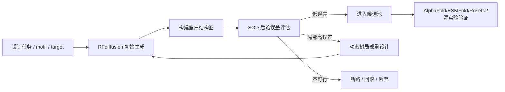

# SGD-Net 赋能科学大模型专题：AlphaFold 3、RFdiffusion 与 ESMFold

> 公开研究版 · 2026-09-12。保留模型方法、公式和组件设计；本文描述研究方案，未据此声称已有训练结果、完整实现或芯片性能。章节编号保留原研究索引，缺号表示未随包发布的独立规划内容。


> 版本：v1.0\
> 日期：2026-06-07\
> 来源：原始讨论材料（本包不附） 与 原始讨论材料（本包不附），并结合公开资料对 AlphaFold 3、RFdiffusion、ESMFold、Mamba/SSM 扩散模型的架构与局限进行整理。

**本页目录**

- [1. 研究定位](#section-001)
- [2. 公开技术背景摘要](#section-002)
- [3. 总体增强框架](#section-007)
- [4. SGD-Fold：面向 AlphaFold 3 的增强方案](#section-008)
- [5. SGD-Design：面向 RFdiffusion 的增强方案](#section-013)
- [6. SGD-ESM：面向 ESMFold 与蛋白语言模型的增强方案](#section-017)
- [7. 实验验证路线](#section-020)
- [8. 风险与边界](#section-024)
- [9. 建议新增工程模块](#section-025)
- [10. 参考资料索引](#section-026)
- [11. 结论](#section-027)
- [2026-09-12 扩展与适用条件校准](#section-028)

---

## 1. 研究定位 <a href="#section-001" id="section-001"></a>

本专题回答一个核心问题：**SGD-Net 是否能够作为科学大模型的“结构保持型增强层”，用于改进 AlphaFold 3、RFdiffusion、ESMFold 等生命科学、化学与材料模型？**

结论是：可以，但不应表述为直接替代这些成熟模型，而应定位为三类能力增强：

1. **动态性增强**：将静态结构预测扩展为受约束的状态演化与多构象探索。
2. **物理拓扑增强**：用 GNN/边界元式拓扑约束限制不合理跨域生成。
3. **局部自适应增强**：用动态树对高残差区域进行局部细化、隔离、回滚或再采样。

可命名为一组面向科学大模型的扩展架构：

| 扩展名 | 面向模型 | 目标 |
|---|---|---|
| `SGD-Fold` | AlphaFold 3 / RoseTTAFold All-Atom | 全原子复合物预测的动态约束与局部残差细化 |
| `SGD-Design` | RFdiffusion / 蛋白设计扩散模型 | 蛋白生成过程的功能 motif 锁定、反向断路与可合成性约束 |
| `SGD-ESM` | ESMFold / 蛋白语言模型 | 超长序列、OOD 蛋白与在线增量结构学习 |
| `SGD-Science-Core` | 科学大模型底座 | 面向生命科学、化学、材料的统一状态-图-树推理核 |

## 2. 公开技术背景摘要 <a href="#section-002" id="section-002"></a>

### 2.1 AlphaFold 3 的关键事实 <a href="#section-003" id="section-003"></a>

公开资料显示，AlphaFold 3 相比 AlphaFold 2 主要有以下变化：

- 预测范围从蛋白质扩展到蛋白质、核酸、小分子配体、离子、修饰残基等更广泛的生物分子复合物；
- 使用更简单的 `Pairformer` 取代 AlphaFold 2 中较复杂的 `Evoformer` 主干；
- 减少 MSA 处理，更多依赖 pair representation；
- 使用扩散模块直接生成原子坐标，而不是通过氨基酸局部坐标框架和侧链扭转角生成结构；
- 输出 mmCIF 结构，并提供 pLDDT、PAE、pTM、ipTM 等置信度指标；
- 在蛋白-配体、蛋白-核酸、抗原-抗体等多个任务上较传统专用工具有显著提升。

同时，AlphaFold 3 仍存在明确局限：

- 主要预测 PDB 风格的静态结构，不能可靠表示溶液中的动态构象集合；
- 对 IDR/IDP 等无序区域存在低置信度幻觉风险；
- 对小分子手性、原子冲突、同源多聚体链重叠等问题仍可能出错；
- 抗原-抗体等困难体系需要大量 seeds/ranking 才能获得更好结果，带来额外计算成本；
- 某些蛋白-配体体系可能学习到统计模式而非真实相互作用物理。

这些局限恰好对应 SGD-Net 的潜在切入点：**动态演化、拓扑约束、后验误差触发局部细化、稳定性投影**。

### 2.2 RFdiffusion 的关键事实 <a href="#section-004" id="section-004"></a>

RFdiffusion 将结构预测网络与扩散生成模型结合，用于设计从未存在过的新蛋白。公开介绍中强调其可用于：

- topology-constrained monomer design；
- protein binder design；
- symmetric oligomer design；
- enzyme active-site scaffolding；
- motif scaffolding；
- therapeutic / metal-binding protein design。

其价值在于：相比传统方法可能需要测试大量候选分子，RFdiffusion 在部分设计挑战中显著降低了需要实验筛选的候选数量。

对应 SGD-Net 的切入点：

- 对功能 motif 和活性口袋施加 GNN 边界条件；
- 对反向扩散路径设置动态树“断路器”；
- 对生成样本引入后验物理/可合成/可表达误差；
- 对高风险区域进行局部再生成，而不是整条链重采样。

### 2.3 ESMFold 的关键事实 <a href="#section-005" id="section-005"></a>

ESMFold 基于大规模蛋白语言模型，在无需 MSA 或较少依赖 MSA 的条件下进行快速结构预测。其优势在于速度和大规模序列覆盖，但对于复杂复合物、超长序列、多构象、OOD 变异、在线增量学习等仍有改进空间。

对应 SGD-Net 的切入点：

- 用 SSM/Mamba 路线降低长序列复杂度；
- 用接触图/GNN 显式表示空间相互作用；
- 用动态树支持 OOD 局部突触生长和回滚；
- 用 Lyapunov/谱约束降低在线更新时的灾难性遗忘。

### 2.4 Mamba / SSM 与扩散模型的结合趋势 <a href="#section-006" id="section-006"></a>

公开 Mamba 扩散模型资料显示，SSM/Mamba 能以线性复杂度处理长序列，并在扩散模型中替换或补充 Transformer 主干。例如 U-Shape Mamba 将 Mamba block 放入 U-Net 式编码器-解码器结构，通过逐级压缩序列长度与 skip connection 降低计算开销。

这为 `SGD-Fold` 和 `SGD-Design` 提供工程启发：

- 扩散去噪时间轴可由 SSM 表示；
- 多尺度结构可由图层与层级 SSM 协同处理；
- 局部高残差区域可通过动态树触发精细 denoising，而不是统一全局扩散步数。

## 3. 总体增强框架 <a href="#section-007" id="section-007"></a>

SGD-Net 面向科学大模型的统一增强公式可写为：

$$
\mathcal{M}_{SGD}(x) = \Pi_{stable}\left(T_{tree}\left(G_{topo}\left(S_{ssm}(x)\right), \eta(x)\right)\right)
$$

其中：

- $$S_{ssm}$$：负责序列、时间、扩散步骤或实验链路的隐式状态演化；
- $$G_{topo}$$：负责空间、化学键、接触图、晶格、知识图谱等拓扑约束；
- $$T_{tree}$$：负责根据后验误差 $$\eta(x)$$ 触发局部细化、剪枝、隔离、回滚；
- $$\Pi_{stable}$$：负责稳定性投影，包括谱半径、能量耗散、物理约束、置信度校准。

对于生命科学模型，后验误差可定义为：

$$
\eta_i = \lambda_1 \eta_i^{geom} + \lambda_2 \eta_i^{energy} + \lambda_3 \eta_i^{contact} + \lambda_4 \eta_i^{confidence} + \lambda_5 \eta_i^{experiment}
$$

其中：

- $$\eta_i^{geom}$$：键长、键角、手性、原子冲突、Ramachandran/rotamer 违背；
- $$\eta_i^{energy}$$：粗粒度势能、力场项、自由能近似；
- $$\eta_i^{contact}$$：接触图、界面、配体口袋、距离矩阵违背；
- $$\eta_i^{confidence}$$：pLDDT、PAE、pTM、ipTM 等低置信度信号；
- $$\eta_i^{experiment}$$：cryo-EM、NMR、cross-linking、突变实验或湿实验反馈。

## 4. `SGD-Fold`：面向 AlphaFold 3 的增强方案 <a href="#section-008" id="section-008"></a>

### 4.1 当前痛点 <a href="#section-009" id="section-009"></a>

AlphaFold 3 的痛点可归纳为：

1. **静态快照问题**：难以生成真实构象集合和动力学转移路径。
2. **IDR/IDP 幻觉问题**：扩散模型可能把无序区域误生成为看似有序的结构。
3. **局部化学违背问题**：手性、原子重叠、小分子构象异常。
4. **抗体/抗原高采样成本**：需要更多 seeds 才能提升 top-ranked 结果。
5. **物理可解释性不足**：部分蛋白-配体结果可能更像统计模板匹配，而非真实相互作用建模。

### 4.2 SGD-Fold 的模块插入点 <a href="#section-010" id="section-010"></a>

| AlphaFold 3 位置 | SGD-Net 增强 | 作用 |
|---|---|---|
| token / atom representation | 全原子异构图构造 | 将残基、核苷酸、配体原子、离子、修饰残基统一成 typed graph |
| Pairformer 输出 | GNN 物理拓扑层 | 补充显式化学键、接触边、空间邻近边、配体口袋边 |
| Diffusion denoising | SSM 去噪轨迹层 | 约束扩散路径具备耗散性与状态连续性 |
| Confidence head | 后验误差估计器 | 汇总 pLDDT/PAE/ipTM 与几何/能量残差 |
| Ranking / sampling | 动态树局部再采样 | 只对高残差区域增加 seeds 或局部重扩散 |
| Output validation | 稳定性与物理投影 | 修正或标记手性、clash、不可达构象 |

### 4.3 关键算法流程 <a href="#section-011" id="section-011"></a>

1. 输入 AlphaFold 3 预测样本集合。
2. 将 mmCIF 输出解析为异构全原子图：
   - 节点：残基 token、核苷酸 token、小分子原子、离子、修饰原子；
   - 边：共价键、空间近邻、氢键、盐桥、界面接触、同源模板边。
3. 计算多源后验误差：
   - 几何违背；
   - 低 pLDDT / 高 PAE；
   - ligand pocket RMSD 近似或 docking plausibility；
   - clash / chirality risk；
   - 与实验约束不一致。
4. 动态树按区域触发操作：
   - IDR/IDP 区域：标记为 ensemble / disorder，不强制收敛为单一有序结构；
   - ligand pocket：局部 h-refinement，增加原子级采样与物理评分；
   - antibody CDR loop：提高局部 seeds，保留界面 ipTM 排名；
   - large complex clash：隔离异常链，执行局部拓扑重构。
5. 输出增强结构与解释报告。

### 4.4 预期价值 <a href="#section-012" id="section-012"></a>

- 对低置信区域给出更明确的“局部不可靠原因”；
- 降低无序区被误读为真实有序结构的风险；
- 将全局多 seeds 的计算成本转化为局部自适应采样；
- 增加对药物设计最关键的配体口袋、界面、修饰位点的可解释诊断。

## 5. `SGD-Design`：面向 RFdiffusion 的增强方案 <a href="#section-013" id="section-013"></a>

### 5.1 当前痛点 <a href="#section-014" id="section-014"></a>

RFdiffusion 的主要挑战包括：

- 生成结构可能形态好看但表达、折叠、稳定性或功能不佳；
- 长程非定域相互作用难以被简单局部条件完全覆盖；
- motif scaffolding 中，功能 motif 可能在生成过程中偏移；
- 反向扩散路径可能进入物理不可行或实验不可合成区域；
- 大量候选仍需 wet lab 筛选，成本不低。

### 5.2 SGD-Design 增强点 <a href="#section-015" id="section-015"></a>

1. **功能 motif 边界元约束**
   - 将功能 motif、活性位点、金属结合点、抗体 CDR、配体口袋作为边界节点；
   - 生成主链和 scaffold 时保持边界节点相对约束不被破坏。

2. **反向扩散断路器**
   - 动态树监控每一步扩散样本的能量残差与拓扑违背；
   - 一旦进入不可合成、不稳定、motif 漂移路径，则中断并回滚。

3. **多目标后验误差**
   - 结构可折叠性；
   - 热稳定性；
   - 结合界面几何；
   - 表达/溶解性代理指标；
   - 合成复杂度与突变鲁棒性。

4. **局部重设计而非整链重生成**
   - 类似自适应有限元，只对高误差局部重新生成；
   - 保留已满足功能和拓扑约束的区域。

### 5.3 典型工作流 <a href="#section-016" id="section-016"></a>



## 6. `SGD-ESM`：面向 ESMFold 与蛋白语言模型的增强方案 <a href="#section-017" id="section-017"></a>

### 6.1 当前痛点 <a href="#section-018" id="section-018"></a>

ESMFold / 蛋白语言模型路线的主要优势是速度和高通量，但挑战在于：

- 超长链与多链复合物仍存在上下文与显存压力；
- 纯序列统计可能无法充分表达真实空间拓扑；
- 新病毒、新物种、人工蛋白等 OOD 场景需要鲁棒增量学习；
- 在线微调可能导致灾难性遗忘。

### 6.2 SGD-ESM 增强点 <a href="#section-019" id="section-019"></a>

1. **SSM/Mamba 长序列替代层**
   - 将部分 Transformer self-attention 替换为选择性状态空间模型；
   - 面向超长序列实现 $$O(N)$$ 或近似线性复杂度。

2. **GNN 接触图记忆层**
   - 从语言模型中间表示预测接触边；
   - 将长程相互作用显式投影到 contact graph。

3. **动态树 OOD 局部突触生长**
   - 对低置信新变异区域建立局部子树；
   - 避免全模型大规模更新导致遗忘。

4. **稳定投影与回滚**
   - 对在线更新参数施加谱半径或范数约束；
   - 若验证集结构/功能指标下降，触发回滚。

## 7. 实验验证路线 <a href="#section-020" id="section-020"></a>

### 7.1 第一阶段：离线诊断增强 <a href="#section-021" id="section-021"></a>

目标：不改动 AlphaFold 3 / RFdiffusion / ESMFold 内部参数，只对输出进行图化诊断与后验细化。

| 实验 | 数据 | 指标 |
|---|---|---|
| AF3 低置信结构诊断 | PDB / AF3 Server 输出 | pLDDT/PAE 与几何违背定位准确率 |
| ligand pocket 局部修正 | PoseBusters 子集 | pocket-aligned RMSD、clash、chirality |
| RFdiffusion 候选筛选 | 公开设计任务 | wet-lab proxy score、motif RMSD |
| ESMFold 长序列接触图 | 长蛋白/多域蛋白 | contact precision、运行时间、显存 |

### 7.2 第二阶段：插件式增强 <a href="#section-022" id="section-022"></a>

目标：将 SGD 模块作为可插拔层加入模型训练或推理链路。

- `BioStructureGraphAdapter`：mmCIF/PDB → heterogeneous graph；
- `DiffusionSSMController`：扩散步长与状态演化控制；
- `PosteriorBioErrorEstimator`：结构/能量/置信/实验约束残差；
- `LocalRefinementTree`：高残差区域分裂、重采样、剪枝；
- `StructureStabilityProjector`：几何与能量投影。

### 7.3 第三阶段：闭环科学设计 <a href="#section-023" id="section-023"></a>

目标：与湿实验、MD、Rosetta、DFT/材料仿真形成闭环。

- 模型生成候选；
- SGD-Net 筛选与局部修正；
- 模拟/实验验证；
- 实验反馈进入后验误差；
- 动态树更新探索空间。

## 8. 风险与边界 <a href="#section-024" id="section-024"></a>

1. **不可夸大替代性**：SGD-Net 当前应定位为增强与验证层，不应宣称已经替代 AlphaFold 3 或 RFdiffusion。
2. **物理误差函数需要专业校准**：粗糙能量项可能误导模型，需要结合 Rosetta、OpenMM、RDKit、MD 或实验数据。
3. **局部重采样不等同真实动力学**：它能增加结构多样性，但不能直接替代分子动力学。
4. **数据许可与服务限制**：AlphaFold 3 公开服务器、开源实现与商业使用存在不同限制，需要在工程计划中单独确认。
5. **湿实验成本仍不可忽视**：蛋白设计最终仍需表达、纯化、稳定性、结合亲和力和功能实验验证。

## 9. 建议新增工程模块 <a href="#section-025" id="section-025"></a>

在 Python 实现文档中建议新增以下模块：

```text
sgd_net.bio/
  parsers.py              # mmCIF/PDB/SMILES/FASTA 输入解析
  graph_builder.py        # 生物分子异构图构建
  posterior_errors.py     # 几何/能量/置信度后验误差
  local_refiner.py        # 局部结构重采样与动态树分裂
  adapters/
    alphafold3.py         # AF3 输出适配
    rfdiffusion.py        # RFdiffusion 候选适配
    esmfold.py            # ESMFold 输出适配
```

## 10. 参考资料索引 <a href="#section-026" id="section-026"></a>

- Abramson et al., *Accurate structure prediction of biomolecular interactions with AlphaFold 3*, Nature, 2024.
- EMBL-EBI Training, *How does AlphaFold 3 work?*
- EMBL-EBI Training, *What AlphaFold 3 struggles with*.
- EMBL-EBI Training, *How have AlphaFold 3’s predictions been validated?*
- Baker Lab, *RFdiffusion: A generative model for protein design*, 2023.
- Lin et al., *Evolutionary-scale prediction of atomic-level protein structure with a language model*, Science, 2023.
- Ergasti et al., *U-Shape Mamba: State Space Model for faster diffusion*, arXiv/CVPRW, 2025.

## 11. 结论 <a href="#section-027" id="section-027"></a>

SGD-Net 对科学大模型的真正价值，不是“再造一个 AlphaFold 3”，而是在成熟模型之上叠加**结构保持、拓扑可解释、局部自适应、稳定可控**的增强层。短期应先做输出诊断与局部细化，中期做插件式推理增强，长期再探索端到端训练和科学实验闭环。

## 2026-09-12 扩展与适用条件校准 <a href="#section-028" id="section-028"></a>

本文件为历史研究设想。扩展方案、训练目标及适用边界见新文档。尤其需要区分去噪步与真实物理时间；谱约束不单独保证不遗忘，结构投影与局部再生成需要检验全局一致性和采样偏差。

参见：[35-SGD-Net跨领域扩展路线与科研任务映射20260912](35-SGD-Net跨领域扩展路线与科研任务映射20260912.md)。


---

[← 上一页](43-SGD-Net信号突触模型构建详解20260912.md) · [全书目录](../SUMMARY.md) · [下一页 →](08-SGD-Net多模态科研Agent与材料自动筛选方案.md)
