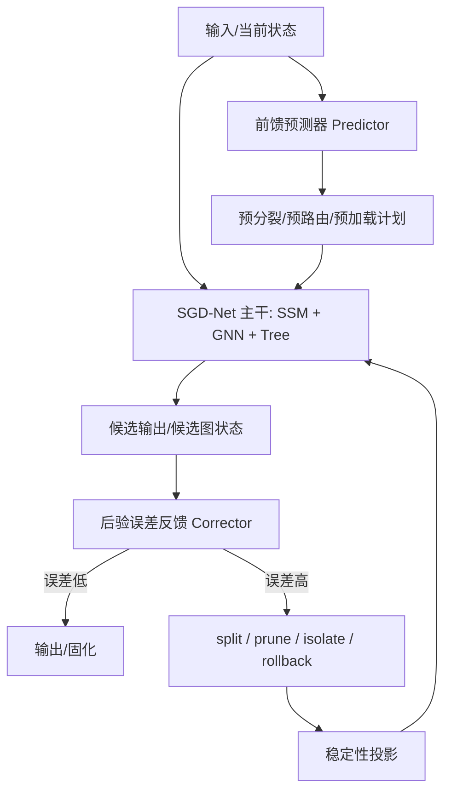

# SGD-Net 双闭环控制与类脑认知架构

> 阅读边界：认知类比、专家视角推演与理论映射是作者的研究讨论，不表示接受过外部专家评审、获得研究机构背书或完成相应定理证明。

> 公开研究版 · 2026-09-12。保留模型方法、公式和组件设计；本文描述研究方案，未据此声称已有训练结果、完整实现或芯片性能。章节编号保留原研究索引，缺号表示未随包发布的独立规划内容。


> 版本：v1.0\
> 日期：2026-06-07\
> 来源：原始讨论材料（本包不附）\
> 关键词：前馈控制、后验误差反馈、Predictor-Corrector、丘脑-皮层循环、BiSRNN、分级记忆、来源监控、知识分类、影子图-树

**本页目录**

- [1. 研究定位](#section-001)
- [2. 核心结论](#section-002)
- [3. 后验误差反馈控制](#section-003)
- [4. 前馈预测控制](#section-007)
- [5. 前馈—反馈双闭环：Predictor-Corrector SGD-Net](#section-011)
- [6. 与丘脑-皮层控制网络的类比](#section-017)
- [7. 与 BiSRNN / Band-Split RNN 的关系](#section-018)
- [8. 类脑分级记忆在 SGD-Net 中的实现](#section-019)
- [9. 来源监控：区分真实经历、预测、梦境、学来知识和别人经历](#section-024)
- [10. 知识分类：经验、教训、待核实知识](#section-028)
- [11. 离线整合与“梦境”机制](#section-032)
- [12. 完整控制循环伪代码](#section-038)
- [13. 建议新增工程模块](#section-039)
- [14. 风险与边界](#section-040)
- [15. 与其他 docs 的关系](#section-041)
- [16. 总结](#section-042)

---

## 1. 研究定位 <a href="#section-001" id="section-001"></a>

本文专门整理 原始讨论材料（本包不附） 中与“控制方法、类脑认知、记忆管理和知识分类”相关的新思想。

此前文档已经明确 SGD-Net 的基础架构是：

```text
SSM + GNN + Dynamic Tree + Posterior Error + Stability Projection
```

本文件进一步将其扩展为：

```text
Feedforward Predictor
+ Posterior Feedback Corrector
+ Cognitive Memory System
+ Source Monitoring
+ Knowledge Ontology Control
```

也就是说，SGD-Net 不只是一个能做结构自适应的模型，而是一个具备“预测—校正—记忆—来源区分—知识晋升/降级”能力的闭环认知动力系统。

## 2. 核心结论 <a href="#section-002" id="section-002"></a>

可以将完整版 SGD-Net 定义为：

> 一种以前馈预测控制追求效率、以后验误差反馈控制守住可信底线，以状态空间模型维护长程记忆，以图神经网络表达事实/物理拓扑，以动态树进行局部自适应学习，并通过稳定性投影防止发散和污染扩散的整体 AI 模型架构。

其关键变化是：

1. **不再只依赖后验误差**：后验误差仍是安全底线，但新增前馈预测模块来提前预热路由、减少停顿和震荡。
2. **不再只有单一记忆**：引入长期、中期、短期、瞬时记忆的分级实现。
3. **不再把所有知识混在一起**：显式区分真实经历、预测推理、梦境/离线整合、学来的知识、别人的经验、待验证假说、正例经验和反例教训。
4. **不再把控制只看作训练 loss**：控制信号被拆成前馈预测风险、后验误差残差、来源置信度、稳定性能量和知识状态转换。

## 3. 后验误差反馈控制 <a href="#section-003" id="section-003"></a>

### 3.1 基本机制 <a href="#section-004" id="section-004"></a>

后验误差反馈控制的基本思想是：模型先执行一步推理或状态推进，然后计算当前状态是否违反任务目标、物理约束、事实拓扑或稳定性条件，再决定是否触发 refinement。

设当前图状态为：

$$
\mathcal{G}_t=(X_t,E_t,H_t,T_t,M_t)
$$

其中：

- $$X_t$$：节点特征；
- $$E_t$$：边和边特征；
- $$H_t$$：SSM 隐状态；
- $$T_t$$：每个节点的动态树；
- $$M_t$$：来源、置信度、证据和元数据。

一次主干前向得到候选状态：

$$
\tilde{\mathcal{G}}_{t+1}=F_{SGD}(\mathcal{G}_t,u_t)
$$

后验误差估计为：

$$
\eta_t=\Phi_{post}(\tilde{\mathcal{G}}_{t+1},y_t,\mathcal{C})
$$

其中 $$\mathcal{C}$$ 是物理、化学、逻辑、事实图谱和安全约束集合。

多项误差可写成：

$$
\eta_i=w_1r_i^{task}+w_2r_i^{physics}+w_3r_i^{topology}+w_4r_i^{drift}+w_5r_i^{confidence}+w_6r_i^{source}
$$

当 $$\eta_i$$ 超过阈值时触发动作：

$$
 a_i=
\begin{cases}
\operatorname{split}, & \eta_i>\epsilon_{split} \\
\operatorname{isolate}, & r_i^{source}>\epsilon_{source} \\
\operatorname{rollback}, & \Delta V_i>\epsilon_V \\
\operatorname{prune}, & usage_i<u_{min}\ \text{and}\ value_i<v_{min} \\
\operatorname{keep}, & \text{otherwise}
\end{cases}
$$

### 3.2 优点 <a href="#section-005" id="section-005"></a>

| 优点 | 说明 |
|---|---|
| 鲁棒 | 不依赖未来预测，只看实际残差 |
| 白盒 | 误差可由物理泛函、事实图谱、几何约束直接计算 |
| 安全 | 一旦残差爆炸，可立即断路、隔离、回滚 |
| 适合 OOD | 遇到分布外输入时，不需要预测器先猜中 |

### 3.3 缺点 <a href="#section-006" id="section-006"></a>

| 缺点 | 说明 |
|---|---|
| 滞后 | 必须先发生偏差，再触发校正 |
| 可能震荡 | 阈值和步长设置不当，会反复 split/prune |
| 硬件流水线气泡 | 临时重构会打断推理流水 |
| 局部视野 | 仅靠当前残差，可能缺少长期规划 |

## 4. 前馈预测控制 <a href="#section-007" id="section-007"></a>

### 4.1 基本机制 <a href="#section-008" id="section-008"></a>

前馈预测控制不是等错误发生，而是提前预测未来高风险区域，为动态树、GNN 路由和硬件流水线预分配资源。

预测器可写为：

$$
\hat{\mathcal{G}}_{t+k}=P_{\theta}(\mathcal{G}_t,H_t,u_{t:t+k})
$$

未来风险估计为：

$$
\hat{\eta}_{t+k}=\Phi_{pred}(\hat{\mathcal{G}}_{t+k},\mathcal{C})
$$

提前生成控制计划：

$$
\mathcal{P}_{t:t+k}=\operatorname{Plan}(\hat{\eta}_{t:t+k})
$$

其中计划可包括：

- 预分裂高风险树节点；
- 预热特定专家或路由路径；
- 提前加载稀疏图邻接；
- 提前准备数字孪生仿真；
- 提前降低步长或提高稳定投影频率。

### 4.2 优点 <a href="#section-009" id="section-009"></a>

| 优点 | 说明 |
|---|---|
| 超前 | 在高梯度/高风险区域到来前准备计算资源 |
| 高效 | 减少临时 split 带来的停顿 |
| 硬件友好 | 可消灭 pipeline bubble，便于 SGD-TPU 预路由 |
| 平滑 | 让推理轨迹更接近全局平滑路径 |

### 4.3 缺点 <a href="#section-010" id="section-010"></a>

| 缺点 | 说明 |
|---|---|
| 预测器也会错 | 前馈模块自身可能误报或漏报 |
| 训练成本 | 需要从历史任务、仿真或实验中学习风险先验 |
| 容易过度自信 | 若无后验校正，会把错误预测放大 |
| 安全性不足 | 不应单独作为零容错控制底线 |

## 5. 前馈—反馈双闭环：Predictor-Corrector SGD-Net <a href="#section-011" id="section-011"></a>

### 5.1 双闭环结构 <a href="#section-012" id="section-012"></a>



### 5.2 数学形式 <a href="#section-013" id="section-013"></a>

**预测步：**

$$
\mathcal{G}_{t+1}^{pred}=P_{\theta}(\mathcal{G}_t,u_t)
$$

**主干推进：**

$$
\tilde{\mathcal{G}}_{t+1}=F_{SGD}(\mathcal{G}_t,u_t,\mathcal{G}_{t+1}^{pred})
$$

**后验校正：**

$$
\eta_{t+1}=\Phi_{post}(\tilde{\mathcal{G}}_{t+1},\mathcal{C})
$$

$$
\mathcal{G}_{t+1}=\Pi_{stable}\left(C_{\eta}(\tilde{\mathcal{G}}_{t+1},\eta_{t+1})\right)
$$

这对应数值分析中的 Predictor-Corrector 方法：

```text
Predictor: 先给出低成本外推
Corrector: 再用真实残差做刚性校正
```

### 5.3 控制仲裁器 <a href="#section-014" id="section-014"></a>

为了避免预测器越权，建议新增 `ControlArbiter`：

$$
\alpha_t=\sigma\left(w^T[\hat{\eta}_t,\eta_t,c_t,\Delta V_t]+b\right)
$$

最终控制动作：

$$
 a_t=\alpha_t a_t^{feedback}+(1-\alpha_t)a_t^{feedforward}
$$

在工程上不一定做连续插值，可采用规则：

```text
if posterior_error is critical:
    feedback takes over
elif predictor_confidence is high and posterior_error is low:
    use predictive plan
else:
    run conservative mode
```

### 5.4 完整版控制策略 <a href="#section-015" id="section-015"></a>

| 场景 | 前馈控制 | 后验反馈 | 推荐策略 |
|---|---|---|---|
| 常规已知任务 | 强 | 弱监控 | 以前馈为主，提高吞吐 |
| 高风险科学任务 | 中 | 强 | 前馈预案 + 后验严审 |
| OOD / 对抗输入 | 弱 | 极强 | 反馈接管，隔离/回滚 |
| 自动化实验 | 中 | 极强 | 预测用于候选排序，实验反馈决定晋升 |
| 硬件流水线 | 强 | 中 | 预路由减少气泡，异常断路 |

### 5.5 在线状态估计与少 BP 适应 <a href="#section-016" id="section-016"></a>

原始讨论材料（本包不附） 进一步指出：运行期适应不应被理解为“每次推理都反向传播并改写大模型主干”。更安全的控制方式，是把在线变化限制在状态估计和小范围调度变量中。

可在线估计的对象包括：

| 对象 | 说明 | 推荐方法 |
|---|---|---|
| SSM hidden state | 当前任务、传感器流或实验流的隐状态 | Kalman / EKF / UKF / Particle Filter |
| residual-gate bias | 残差门控 SSM 中的短时偏置 | recursive least squares / filter update |
| 动态树阈值 | split、prune、isolate、rollback 的触发阈值 | Bayesian calibration / conservative update |
| fast path confidence | 常用路径是否仍可被信任 | posterior residual + source confidence |
| Harness risk threshold | 安全哨兵的风险阈值 | conformal calibration / human-in-the-loop |

在线适应的安全边界是：

```text
允许：更新 hidden state、阈值、小 adapter、fast path 置信度
禁止：未经离线审查直接改写主干权重、核心安全策略或全局知识图谱
```

因此，EKF/UKF/Particle Filter 等方法更适合被放入 `OnlineAdaptationController`，作为 Predictor-Corrector 双闭环的状态估计器，而不是替代训练系统的万能在线学习算法。

## 6. 与丘脑-皮层控制网络的类比 <a href="#section-017" id="section-017"></a>

控制文档中提出将 SGD-Net 与丘脑-皮层循环进行类比。这里应采用“启发式类比”，而不是声称完全等价。

公开资料中，丘脑-皮层系统通常被描述为感觉输入、皮层反馈、注意/状态调制和振荡同步共同参与的信息门控系统。丘脑既接收外部感觉输入，也接收来自皮层的反馈；不同频段的振荡与注意、睡眠、意识状态和短期记忆等有关。

SGD-Net 可作如下工程映射：

| 功能 | 丘脑-皮层启发 | SGD-Net 对应 |
|---|---|---|
| 感觉输入门控 | 丘脑对感觉通路进行门控 | GNN 对真实观测和多模态输入进行拓扑接入 |
| Top-down 预测 | 皮层向下传递预期 | Feedforward Predictor 产生预期轨迹 |
| Bottom-up 误差 | 现实输入与预期不一致 | Posterior Error 计算残差 |
| 状态维持 | 振荡和循环维持工作状态 | SSM 隐状态维护短期/工作记忆 |
| 抑制与过滤 | 抑制无关通路 | Dynamic Tree prune/isolate |
| 稳定节律 | 正常振荡维持认知稳定 | Stability Projection 约束能量不发散 |

重要边界：

> SGD-Net 借鉴的是“门控、预测、反馈、状态维持、抑制过滤”的控制思想，不应把它直接等同为生物丘脑-皮层网络的精确仿真。

## 7. 与 BiSRNN / Band-Split RNN 的关系 <a href="#section-018" id="section-018"></a>

控制文档中提到 BiSRNN / Band-Split RNN 作为类似“快慢通道、双向/分段递推”的算法对照。公开资料显示，Band-Split RNN 常用于音频源分离，将频谱拆成子带，并交替进行 band-level 与 sequence-level 建模；BPIE-BiSRNN 则是较早的长文本切片 RNN 实验实现。

对比可写为：

| 维度 | BiSRNN / BSRNN 类方法 | SGD-Net |
|---|---|---|
| 核心结构 | RNN 双向、切片或频带分组 | SSM + GNN + Dynamic Tree |
| 记忆方式 | 隐状态串行递推 | SSM 可并行 scan 的长程状态 |
| 空间结构 | 通常是序列或频带结构 | 显式图拓扑/物理/知识流形 |
| 自适应能力 | 多为固定网络结构 | 后验误差驱动 split/prune/remesh |
| 来源区分 | 通常不内建 | 可通过 SourceTag / EvidenceTag 内建 |
| 稳定机制 | 梯度裁剪、门控 | Lyapunov / SVD / 谱约束 / rollback |

结论：

> BiSRNN / BSRNN 可以作为“分段/双通道序列建模”的参考，但 SGD-Net 的核心扩展在于动态图拓扑、自适应树和显式控制闭环。

## 8. 类脑分级记忆在 SGD-Net 中的实现 <a href="#section-019" id="section-019"></a>

人类记忆可粗略分为长期、中期、短期、瞬时等层次。SGD-Net 可将这些层次转化为不同的状态存储与更新机制。

| 记忆类型 | 人类类比 | SGD-Net 实现 | 更新频率 | 风险控制 |
|---|---|---|---|---|
| 长期记忆 | 稳定常识、公理、世界模型 | 冻结主干参数 $$W_0$$ + 核心知识图谱 | 很低 | 只读/审批/版本化 |
| 中期记忆 | 近期经验、新技能 | 动态树新增叶片、局部 adapter、经验子图 | 中等 | 后验验证后保留，不稳定则剪枝 |
| 短期记忆 | 当前任务上下文 | SSM 隐状态 $$H_t$$、任务状态流 | 高频 | 状态漂移监控 |
| 瞬时记忆 | 当前感知刺激 | GNN message、当前 batch token/观测 | 每步 | 算完即释放或压缩 |
| 待验证记忆 | 传闻、假说、论文结论 | Shadow Graph-Tree 隔离区 | 条件更新 | 置信度门控与实验晋升 |

### 8.1 长期记忆 <a href="#section-020" id="section-020"></a>

长期记忆应当满足：

$$
\frac{\partial W_0}{\partial t}\approx 0
$$

在线推理时不直接改写主干参数，而是将新经验写入动态树或影子图。

### 8.2 中期记忆 <a href="#section-021" id="section-021"></a>

中期记忆对应动态树的叶片和局部 adapter：

$$
T_i\leftarrow \operatorname{Split}(T_i,\eta_i)
$$

如果多轮验证后收益稳定：

$$
T_i^{temp}\rightarrow T_i^{stable}
$$

否则：

$$
T_i^{temp}\rightarrow \operatorname{Prune}(T_i^{temp})
$$

### 8.3 短期记忆 <a href="#section-022" id="section-022"></a>

短期记忆由 SSM 维护：

$$
H_{t+1}=\bar{A}_tH_t+\bar{B}_tX_t
$$

必要时记录状态漂移：

$$
r_t^{drift}=\frac{\|H_{t+1}-H_t\|_2}{\|H_t\|_2+\epsilon}
$$

### 8.4 瞬时记忆 <a href="#section-023" id="section-023"></a>

GNN message 可看作瞬时脉冲：

$$
 m_{ij}^{t}=\psi(x_i^t,x_j^t,e_{ij}^t)
$$

聚合后写入节点状态，原始 message 不一定长期保存。

## 9. 来源监控：区分真实经历、预测、梦境、学来知识和别人经历 <a href="#section-024" id="section-024"></a>

传统模型容易把训练数据、推理假设、虚构内容和真实观测混合在同一概率空间中。SGD-Net 应显式引入来源标签。

### 9.1 SourceTag 设计 <a href="#section-025" id="section-025"></a>

建议每个节点、边、证据或状态更新携带：

```text
SourceTag:
  source_type: real_experiment | simulation | prediction | literature | third_party | dream | synthetic
  confidence: float
  verification_status: verified | unverified | contradicted | promoted | quarantined
  provenance: list[EvidenceRef]
  timestamp: datetime
  authority: sensor | model | human | paper | simulator
```

### 9.2 五类认知状态 <a href="#section-026" id="section-026"></a>

| 认知状态 | SGD-Net 存放位置 | 是否可直接影响决策 | 晋升条件 |
|---|---|---|---|
| 真实经历 | 实验/传感器 GNN 硬流形 | 可以，但仍需质量检查 | 多模态一致 + 后验残差低 |
| 学来的知识 | 主干只读参数/核心知识图谱 | 可以 | 已验证、版本化、可信来源 |
| 预测/推理 | SSM/Predictor 沙箱轨迹 | 不应直接固化 | 经过后验或实验验证 |
| 梦境/离线整合 | consolidation buffer | 不直接影响外部动作 | 离线评估后转为假说或经验 |
| 别人的经历 | shadow graph-tree | 仅可辅助候选生成 | 多次真实验证后晋升 |

### 9.3 来源误差 <a href="#section-027" id="section-027"></a>

来源不可靠也应进入后验误差：

$$
r_i^{source}=1-c_i^{source}+\lambda_{conflict}\cdot \mathbb{I}[\operatorname{Conflict}(i)=1]
$$

如果某来源与高可信物理观测冲突：

$$
status_i\leftarrow \operatorname{quarantined}
$$

## 10. 知识分类：经验、教训、待核实知识 <a href="#section-028" id="section-028"></a>

控制文档进一步提出：人类不仅区分信息来源，还区分知识在什么范围内正确、什么范围内错误、以及哪些尚待检验。

### 10.1 局部正确经验 <a href="#section-029" id="section-029"></a>

局部经验可表示为条件域：

$$
K^+=\{(c,y)\mid y\ \text{在条件}\ c\ \text{下被验证为真}\}
$$

在动态树中表现为正向叶片：

```text
if condition_region(c):
    use positive leaf adapter
```

数学上可定义吸引域：

$$
\Omega^+=\{x\mid V(F(x))-V(x)\le 0,\ \eta(x)<\epsilon\}
$$

### 10.2 局部错误教训 <a href="#section-030" id="section-030"></a>

教训是局部反例或禁区：

$$
K^-=\{(c,y)\mid y\ \text{在条件}\ c\ \text{下被证伪或高风险}\}
$$

可实现为负边、阻断条件或风险墙：

$$
A_{ij}^{risk}<0\quad \text{or}\quad mask_{path}=0
$$

当推理路径进入禁区：

$$
\operatorname{Breaker}(path)=1
$$

动作：拒绝、剪枝、回滚或请求人工审批。

### 10.3 待核实知识 <a href="#section-031" id="section-031"></a>

待核实知识存入影子图-树：

$$
\mathcal{G}^{shadow}=(V^{shadow},E^{shadow},T^{shadow},c^{shadow})
$$

其只能在沙箱或候选生成中参与，不应直接写入主干。

晋升规则可写为：

$$
\operatorname{Promote}(k)=\mathbb{I}[n_{verified}\ge N_{min}\ \land\ \bar{\eta}_k<\epsilon\ \land\ MI(k;target)>\tau]
$$

证伪规则：

$$
\operatorname{Demote}(k)=\mathbb{I}[n_{contradicted}\ge M_{min}\ \lor\ \bar{\eta}_k>\epsilon_{bad}]
$$

## 11. 离线整合与“梦境”机制 <a href="#section-032" id="section-032"></a>

文档中“梦境”不应理解为神秘概念，而应工程化为离线 consolidation。

### 11.1 离线整合目标 <a href="#section-033" id="section-033"></a>

离线阶段可执行：

1. 回放当天或近期的 SSM 状态轨迹；
2. 对动态树叶片进行收益评估；
3. 合并重复叶片；
4. 剪枝低价值或高风险分支；
5. 将稳定经验转入更长期存储；
6. 将冲突知识转入教训禁区或待核实区。

### 11.2 数学形式 <a href="#section-034" id="section-034"></a>

给定经验缓冲区 $$\mathcal{B}$$：

$$
\mathcal{B}=\{(\mathcal{G}_t,a_t,y_t,\eta_t,source_t)\}_{t=1}^{T}
$$

离线优化：

$$
\min_{T,\theta_{local}}\sum_{(\cdot)\in\mathcal{B}}\eta_t+\lambda_1\operatorname{Complexity}(T)+\lambda_2\operatorname{Conflict}(T)
$$

同时保持：

$$
V_{new}\le V_{old}+\delta
$$

### 11.3 从离线整合到反省复盘 <a href="#section-035" id="section-035"></a>

原始讨论材料（本包不附） 进一步明确：离线整合不是简单清理日志，而是 SGD-Net 自我进化的关键阶段。

双闭环、多级记忆和知识分类之间的关系可理解为：

| 机制 | 在反省中的角色 |
|---|---|
| 内环反馈 | 单步复盘：根据瞬时误差快速纠偏 |
| 外环反馈 | 深度反省：当误差持续扩大时质疑当前策略或范式 |
| 多级记忆 | 反省素材库：保存瞬时、短期、中期、长期和影子经验 |
| 知识分类 | 反省归宿：把经验晋升、把错误沉淀为教训、把假说隔离 |
| 动态推理加速 | 反省结果的执行载体：把常用处理固化为快速路径 |

因此，反省不是额外外挂，而是控制闭环在更长时间尺度上的自然延伸：

```text
后验误差
    → 单步复盘
    → 深度反省
    → 记忆动态整理
    → 知识状态转换
    → 快速推理路径固化或主动遗忘
```

更完整的自进化机制见 [SGD-Net反省复盘与动态自进化机制](17-SGD-Net反省复盘与动态自进化机制.md)。

### 11.4 梦境机制的非工业迁移：叙事创作模式 <a href="#section-036" id="section-036"></a>

原始讨论材料（本包不附） 进一步提出：离线整合和梦境式 replay 不一定只能服务工业控制，也可以在关闭物理执行权限、替换约束函数后，用作小说、剧情和创意方案生成。

工程上应把它定义为独立的 `NarrativeDreamAdapter`，而不是让工业 SGD-Net 直接“写小说”：

| 工业控制模式 | 叙事创作模式 |
|---|---|
| 物理守恒、PDE residual、来源可信 | 世界观一致、人物动机、情节因果、主题回环 |
| PPU / 后验物理校验 | Narrative Critic / 人类审稿反馈 |
| 动态树 refinement | 情节分叉、支线剪枝、伏笔回收 |
| 主动遗忘低价值路径 | 剪除陈词滥调、重复桥段和无效描写 |

因此，“梦境创作”可以作为 Retrospection 的非工业子系统，但不得进入安全控制主干，也不得把叙事想象误标为真实经验。

### 11.5 LeCun AMI 六模块的启发式映射 <a href="#section-037" id="section-037"></a>

Yann LeCun 的 Autonomous Machine Intelligence 路线通常强调 Perception、World Model、Cost、Short-Term Memory、Actor 和 Configurator 等模块。对 SGD-Net 而言，这些模块可作为系统设计启发，但不应被写成一一精确复刻。

| AMI 模块 | SGD-Net / XPU 对应 | 工程含义 |
|---|---|---|
| Perception | JEPA/V-JEPA encoder、InputEncoder、GraphBuilder | 将多模态观测转成 latent 与结构图 |
| World Model | SSM、JSBO、Digital Twin、JEPALatentBuffer | 预测未来状态和候选行动后果 |
| Cost | PosteriorError、SGD-Harness、PPU residual | 评估任务、物理、安全和来源风险 |
| Short-Term Memory | SSM hidden、MemoryManager、任务 cache | 维护当前任务、想象轨迹和工作状态 |
| Actor | DynamicTreePolicy、ControlArbiter、tool/robot action | 选择实验、工具、控制或树动作 |
| Configurator | SolverRouter、TaskPlanner、SourceMonitor | 按上下文选择 solver、模块和约束 |

该映射的价值在于帮助组织系统模块，而不是证明 SGD-Net 已经具备通用自主智能。真正的进展仍需通过物理推理、机器人规划、科学实验闭环和安全审计 benchmark 验证。

## 12. 完整控制循环伪代码 <a href="#section-038" id="section-038"></a>

```text
state = build_initial_graph(raw_input)
state = attach_source_tags(state)

pred_plan = predictor.plan(state, horizon=k)
state = prewarm_routes_and_trees(state, pred_plan)

for block in sgd_blocks:
    state = block(state)

prediction = head(state)
record_immutable_prediction(prediction, versions, available_inputs)
post_report = posterior_error.estimate(prior_prediction_record, matched_observation, constraints)
source_report = source_monitor.check(state)
control_action = arbiter.decide(pred_plan, post_report, source_report)

if control_action.requires_refine:
    candidate = refiner.propose(snapshot(state), control_action)
    enqueue_migration_validation_and_window_publication(candidate)

memory_manager.update(state, post_report, source_report)
knowledge_manager.update_evidence_status(state, independent_validation)

return SGDOutput(prediction, state, reports)
```

## 13. 建议新增工程模块 <a href="#section-039" id="section-039"></a>

```text
sgd_net/control/
  feedforward_predictor.py      # 前馈预测控制
  posterior_corrector.py        # 后验校正控制
  control_arbiter.py            # 前馈/反馈仲裁
  predictor_corrector_loop.py   # 双闭环流程

sgd_net/cognition/
  memory_manager.py             # 长/中/短/瞬时记忆管理
  source_monitor.py             # 来源监控与证据标签
  knowledge_ontology.py         # 经验/教训/待核实知识分类
  shadow_graph.py               # 影子图-树隔离区
  consolidation.py              # 离线整合/剪枝/晋升
```

## 14. 风险与边界 <a href="#section-040" id="section-040"></a>

| 风险 | 说明 | 建议 |
|---|---|---|
| 类脑类比过度 | 生物脑机制复杂，不应宣称完全复刻 | 表述为“启发式映射” |
| 前馈预测误导 | 预测器可能过度自信 | 后验反馈必须有最高优先级 |
| 动态树膨胀 | 频繁分裂导致复杂度失控 | 设置预算、冷却、收益评估 |
| 来源标签伪精确 | 来源置信度本身也可能不准 | 保留证据链和人工审计接口 |
| 待核实知识污染主干 | 假说过早转正 | 必须经过实验或高可信验证 |

## 15. 与其他 docs 的关系 <a href="#section-041" id="section-041"></a>

| 文档 | 关系 |
|---|---|
| [SGD-Net模型架构与层算子详解](13-SGD-Net模型架构与层算子详解.md) | 本文补充前馈预测、来源标签、知识分类等完全体模块 |
| [SGD-Net多模态科研Agent与材料自动筛选方案](08-SGD-Net多模态科研Agent与材料自动筛选方案.md) | 本文的记忆/来源/知识分类机制可用于科研 Agent |
| [SGD-Ecosystem物理具身数字孪生与双向流形折叠](15-SGD-Ecosystem物理具身数字孪生与双向流形折叠.md) | 本文的待核实知识、预测控制和后验反馈在物理实验生态中闭环验证 |
| [SGD-Net反省复盘与动态自进化机制](17-SGD-Net反省复盘与动态自进化机制.md) | 本文的双闭环、多级记忆和知识分类在更长时间尺度上形成反省、动态整理和主动遗忘机制 |
| [SGD-Net与JEPA世界模型融合及JSBO桥梁算子](18-SGD-Net与JEPA世界模型融合及JSBO桥梁算子.md) | 本文的梦境/离线整合机制可迁移为叙事创作模式，JEPA latent planning 可接入前馈预测但须后验保底 |
| [SGD-Net混合求解训练体系与世界模型研究路线](27-SGD-Net混合求解训练体系与世界模型研究路线.md) | 本文的控制闭环进一步扩展为混合求解、在线状态估计和 AMI 六模块启发式映射 |
| `03-06` 实现文档 | 应新增 `control` 与 `cognition` 工程模块 |

## 16. 总结 <a href="#section-042" id="section-042"></a>

原始讨论材料（本包不附） 的核心贡献，是把 SGD-Net 从“后验误差驱动的动态模型”提升为“前馈预测 + 后验反馈 + 类脑记忆 + 知识本体管理”的认知控制系统。

最终应坚持三个原则：

1. **前馈用于效率，不用于最终真理判定**；
2. **后验用于安全，不应因滞后而被取消**；
3. **所有知识都必须带来源、边界、置信度和晋升/降级机制**。

这使 SGD-Net 不只是会计算，而是知道自己在计算什么、依据来自哪里、是否已经验证、何时需要怀疑、何时可以固化。


---

[← 上一页](27-SGD-Net混合求解训练体系与世界模型研究路线.md) · [全书目录](../SUMMARY.md) · [下一页 →](17-SGD-Net反省复盘与动态自进化机制.md)
