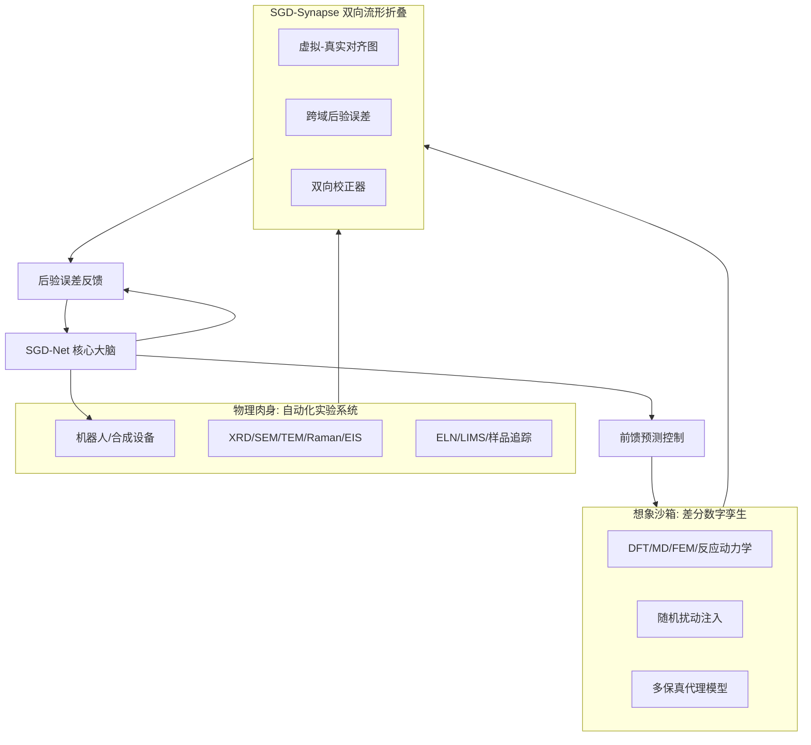
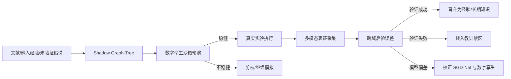

# SGD-Ecosystem：物理具身、差分数字孪生与双向流形折叠方案

> 公开研究版 · 2026-09-12。保留模型方法、公式和组件设计；本文描述研究方案，未据此声称已有训练结果、完整实现或芯片性能。章节编号保留原研究索引，缺号表示未随包发布的独立规划内容。


> 版本：v1.0\
> 日期：2026-06-07\
> 来源：原始讨论材料（本包不附）\
> 关键词：SGD-Ecosystem、物理肉身、湿实验、自动化实验室、数字孪生、差分世界模型、SGD-Synapse、双向流形折叠、科学闭环

**本页目录**

- [1. 研究定位](#section-001)
- [2. 为什么需要生态外壳](#section-002)
- [3. 总体架构](#section-003)
- [4. 物理肉身：自动化湿实验与采集系统](#section-004)
- [5. 想象沙箱：差分数字孪生世界模型](#section-009)
- [6. SGD-Synapse：双向流形折叠网络](#section-015)
- [7. 假说驱动闭环](#section-020)
- [8. 数据与证据链设计](#section-025)
- [9. 工程模块建议](#section-029)
- [10. MVP 路线](#section-030)
- [11. 验证指标](#section-035)
- [12. 安全与治理](#section-036)
- [13. 与 08 号文档的关系](#section-039)
- [15. 风险与现实边界](#section-040)
- [17. 总结](#section-041)

---

## 1. 研究定位 <a href="#section-001" id="section-001"></a>

`SGD-Net` 是模型大脑，但仅有大脑并不足以完成科学发现。科学智能必须能与现实世界发生交互：提出假说、模拟推演、执行实验、采集数据、校正模型、更新知识。

本文提出 `SGD-Ecosystem`：在 SGD-Net 之外配套的物理/数字闭环生态外壳。

其核心由三部分组成：

1. **物理肉身（Physical Embodiment）**：自动化湿实验、机器人执行器、多模态原位表征与采集系统；
2. **想象沙箱（Differential Digital Twin）**：差分数字孪生、随机扰动世界模型、多保真仿真与前馈预演；
3. **双向流形折叠（SGD-Synapse）**：将真实实验和虚拟仿真折叠到同一个异构图流形中，用双向误差同时校正 AI 大脑和数字孪生。

## 2. 为什么需要生态外壳 <a href="#section-002" id="section-002"></a>

SGD-Net 内部可以区分经验、教训、待核实假说和预测推理，但这些状态最终必须通过现实世界或高可信仿真来验证。

如果没有外部验证闭环，模型会面临三类问题：

| 问题 | 说明 |
|---|---|
| 缸中之脑 | 模型只在内部沙箱自洽，无法确认现实正确性 |
| 数字自嗨 | 后验误差只来自模型内部，不接触真实物理反馈 |
| 假说难晋升 | 影子图-树中的待核实知识缺乏验证路径 |

因此，SGD-Net 需要外部生态：

```text
SGD-Net Brain
  + Physical Lab Body
  + Digital Twin Sandbox
  + Bidirectional Manifold Synapse
  = SGD-Ecosystem
```

## 3. 总体架构 <a href="#section-003" id="section-003"></a>



## 4. 物理肉身：自动化湿实验与采集系统 <a href="#section-004" id="section-004"></a>

### 4.1 角色定位 <a href="#section-005" id="section-005"></a>

物理肉身不是普通外设，而是 SGD-Net 的“现实世界传感-执行接口”。

它负责把模型提出的候选假说转化为真实实验动作，并把实验结果转化为 GNN 可消费的多模态观测节点。

### 4.2 执行器层 <a href="#section-006" id="section-006"></a>

常见执行器包括：

| 执行器 | 任务 |
|---|---|
| 液体处理机器人 | 加样、混合、pH 调节、滴定 |
| 固相合成/烧结炉 | 温度曲线、气氛、烧结时间控制 |
| 溅射/蒸镀/涂布设备 | 薄膜材料制备 |
| 机械臂样品转移系统 | 样品运输、封装、上机测试 |
| 微流控平台 | 小剂量高通量合成 |

执行动作可抽象为：

$$
 a_t^{lab}=\operatorname{LabPolicy}(\mathcal{G}_t,\mathcal{P}_t,safety_t)
$$

其中：

- $$\mathcal{G}_t$$ 是当前科研图状态；
- $$\mathcal{P}_t$$ 是前馈预测计划；
- $$safety_t$$ 是安全规则和人工审批状态。

### 4.3 传感器层 <a href="#section-007" id="section-007"></a>

传感器产生真实世界观测：

| 传感器/仪器 | 输出 | 图中表示 |
|---|---|---|
| XRD | 衍射峰、相结构 | phase / lattice node |
| SEM/TEM | 形貌、晶粒、缺陷 | morphology node |
| Raman/IR | 振动峰、官能团 | spectrum node |
| EIS | 阻抗谱、电导率 | electrochemical node |
| 质谱/色谱 | 组成、纯度 | composition node |
| 原位温压传感器 | 实验过程状态 | process node |

观测写入图：

$$
 o_t^{real}\rightarrow \operatorname{EncodeSensor}(o_t^{real})\rightarrow v_t^{real}\in\mathcal{V}^{real}
$$

### 4.4 LabToken：硬件即 Token <a href="#section-008" id="section-008"></a>

建议将实验动作和仪器结果统一为 `LabToken`：

```text
LabToken:
  token_type: action | observation | sample | instrument | safety_event
  modality: xrd | sem | synthesis | simulation | human_approval
  payload: raw data or summary
  source_tag: real_experiment
  sample_id: str
  timestamp: datetime
  uncertainty: float
```

这样，湿实验数据可以进入与文本、结构、仿真相同的 GraphState。

## 5. 想象沙箱：差分数字孪生世界模型 <a href="#section-009" id="section-009"></a>

### 5.1 角色定位 <a href="#section-010" id="section-010"></a>

数字孪生是 SGD-Net 的“想象世界”。它用于在真实实验前进行大规模低成本预演。

但传统数字孪生常假设环境理想，而现实实验存在湿度、纯度、设备漂移、批次差异等扰动。因此本文建议采用差分随机数字孪生。

### 5.2 多保真仿真层 <a href="#section-011" id="section-011"></a>

| 保真度 | 方法 | 用途 |
|---|---|---|
| 高保真 | DFT、MD、FEM、CFD | 少量候选精算 |
| 中保真 | 代理模型、图神经势能 | 批量筛选 |
| 低保真 | 规则、经验公式、快速 predictor | 前馈预案和早期剪枝 |

### 5.3 随机扰动注入 <a href="#section-012" id="section-012"></a>

设数字孪生状态为 $$z_t$$：

$$
 z_{t+1}=f_{twin}(z_t,a_t;\theta_{twin})+\xi_t
$$

其中扰动 $$\xi_t$$ 可表示：

$$
 \xi_t\sim\mathcal{N}(0,\Sigma_{env})+\xi_{batch}+\xi_{instrument}
$$

扰动来源包括：

- 环境温湿度变化；
- 试剂纯度波动；
- 仪器漂移；
- 批次差异；
- 样品制备误差。

### 5.4 沙箱预演 <a href="#section-013" id="section-013"></a>

对一个候选策略 $$\pi$$，在沙箱中运行 $$K$$ 次：

$$
\{\tau_k\}_{k=1}^{K}=\operatorname{Rollout}(f_{twin},\pi,\xi_k)
$$

稳健性评分：

$$
 R_{robust}(\pi)=\mathbb{E}_k[J(\tau_k)]-\lambda\operatorname{Var}_k[J(\tau_k)]-\mu\mathbb{E}_k[\eta_k]
$$

只有当：

$$
R_{robust}(\pi)>\tau_R
$$

且安全约束满足时，才进入真实实验候选队列。

### 5.5 JEPA / V-JEPA 作为外部世界模型前端 <a href="#section-014" id="section-014"></a>

差分数字孪生不一定只能由显式 PDE、FEM、CFD 或规则代理模型构成。对视频、机器人轨迹、传感器流和多模态实验记录，I-JEPA/V-JEPA 等自监督模型可以作为“观察型世界模型前端”，先在隐空间中预测未来或缺失片段。

但 JEPA latent 默认不等于可控物理状态。建议通过 `JSBO` 桥梁算子把它转换为 SGD-Ecosystem 可审计的结构状态：

```text
video/sensor stream
  → JEPA / V-JEPA latent prediction
  → JSBO bridge projection
  → GraphState / PhysicalState / EvidenceRecord
  → SGD-Synapse 虚实对齐与后验校正
```

对应边界是：

- JEPA 负责从大规模未标注观察中学习可预测表征；
- JSBO 负责把 latent 映射为物理/拓扑/知识流形；
- PPU、真实实验和后验误差负责判断该映射是否可信；
- Retrospection 负责把高价值 bridge path 固化为可复用快速路径。

## 6. SGD-Synapse：双向流形折叠网络 <a href="#section-015" id="section-015"></a>

### 6.1 基本思想 <a href="#section-016" id="section-016"></a>

不要把模拟数据和真实数据当成两个割裂的数据集，而是构造统一的双轨异构图：

$$
\mathcal{G}^{syn}=(\mathcal{V}^{sim}\cup\mathcal{V}^{real},\mathcal{E}^{sim}\cup\mathcal{E}^{real}\cup\mathcal{E}^{bridge})
$$

其中：

- $$\mathcal{V}^{sim}$$：数字孪生节点；
- $$\mathcal{V}^{real}$$：真实实验节点；
- $$\mathcal{E}^{bridge}$$：虚实对应边。

### 6.2 虚实对齐映射 <a href="#section-017" id="section-017"></a>

定义模拟到真实的观测映射：

$$
\hat{o}_t^{real}=\mathcal{M}_{sim\to real}(z_t^{sim})
$$

真实观测为 $$o_t^{real}$$，跨域误差为：

$$
\eta_t^{cross}=d(\hat{o}_t^{real},o_t^{real})
$$

例如 XRD 对齐可写为：

$$
\eta_{XRD}=\sum_{p}\left|I_{p}^{sim}-I_{p}^{real}\right|+\lambda\sum_p\left|2\theta_p^{sim}-2\theta_p^{real}\right|
$$

### 6.3 双向校正 <a href="#section-018" id="section-018"></a>

当虚实误差出现时，同时校正两侧：

**校正 AI 大脑：**

$$
T_{SGD}\leftarrow \operatorname{Refine}(T_{SGD},\eta^{cross})
$$

**校正数字孪生：**

$$
\theta_{twin}\leftarrow \theta_{twin}-\alpha\nabla_{\theta}\eta^{cross}
$$

双向校正器写成：

$$
(\mathcal{G}_{SGD}',\theta_{twin}')=\operatorname{SynapseCorrector}(\mathcal{G}_{SGD},\theta_{twin},\eta^{cross})
$$

### 6.4 伴随状态视角 <a href="#section-019" id="section-019"></a>

若数字孪生由微分方程描述：

$$
\dot{z}=f(z,a,\theta)
$$

目标误差：

$$
\mathcal{L}=\|\mathcal{M}(z_T)-o_T^{real}\|^2
$$

可引入伴随变量 $$\lambda(t)$$：

$$
-\dot{\lambda}=\left(\frac{\partial f}{\partial z}\right)^T\lambda+\frac{\partial \ell}{\partial z}
$$

对孪生参数更新：

$$
\frac{d\mathcal{L}}{d\theta}=\int_0^T \lambda(t)^T\frac{\partial f}{\partial \theta}dt
$$

这使数字孪生不是固定模拟器，而是会被真实实验持续校准的世界模型。

## 7. 假说驱动闭环 <a href="#section-020" id="section-020"></a>

SGD-Ecosystem 的完整科学发现循环如下：



### 7.1 影子假说生成 <a href="#section-021" id="section-021"></a>

外部文献或模型生成的假说先进入影子图：

$$
 h\rightarrow \mathcal{G}^{shadow}_h
$$

不直接进入主干。

### 7.2 沙箱筛选 <a href="#section-022" id="section-022"></a>

在数字孪生中评估：

$$
score(h)=R_{robust}(h)-\lambda C(h)-\mu Risk(h)
$$

### 7.3 真实验证 <a href="#section-023" id="section-023"></a>

只有高分候选进入湿实验：

$$
h\in\mathcal{H}_{lab}\iff score(h)>\tau_{lab}\ \land\ Safety(h)=1
$$

### 7.4 晋升与降级 <a href="#section-024" id="section-024"></a>

验证成功：

$$
\mathcal{G}^{shadow}_h\rightarrow \mathcal{G}^{experience}
$$

验证失败：

$$
\mathcal{G}^{shadow}_h\rightarrow \mathcal{G}^{lesson}
$$

## 8. 数据与证据链设计 <a href="#section-025" id="section-025"></a>

### 8.1 EvidenceRecord <a href="#section-026" id="section-026"></a>

```text
EvidenceRecord:
  evidence_id: str
  source_type: simulation | wet_lab | literature | human | instrument
  source_ref: str
  sample_id: str | None
  protocol_id: str | None
  raw_uri: str
  summary: dict
  uncertainty: float
  trust_level: int
  timestamp: datetime
```

### 8.2 SampleLineage <a href="#section-027" id="section-027"></a>

```text
SampleLineage:
  sample_id: str
  parent_samples: list[str]
  synthesis_actions: list[LabToken]
  characterization_records: list[EvidenceRecord]
  storage_condition: dict
  safety_status: str
```

### 8.3 知识状态 <a href="#section-028" id="section-028"></a>

| 状态 | 含义 |
|---|---|
| `hypothesis` | 仅假说，未验证 |
| `sim_supported` | 数字孪生支持 |
| `wet_verified` | 真实实验验证 |
| `contradicted` | 被证伪 |
| `lesson` | 反例教训 |
| `promoted` | 晋升入稳定经验 |
| `quarantined` | 来源或数据质量异常，隔离 |

## 9. 工程模块建议 <a href="#section-029" id="section-029"></a>

```text
sgd_net/ecosystem/
  lab_tokens.py              # 实验动作/观测统一 token
  actuator_interface.py      # 机械臂/设备抽象接口
  sensor_interface.py        # XRD/SEM/TEM/EIS 等采集接口
  protocol_executor.py       # 实验协议执行器
  safety_guard.py            # 安全规则与人工审批
  sample_lineage.py          # 样品谱系

sgd_net/twin/
  world_model.py             # 差分数字孪生接口
  stochastic_rollout.py      # 随机扰动 rollout
  multifidelity.py           # 多保真调度
  twin_calibrator.py         # 孪生参数校正

sgd_net/synapse/
  dual_track_graph.py        # 虚实双轨图
  cross_domain_error.py      # 虚实误差
  adjoint_corrector.py       # 伴随/梯度校正
  promotion_engine.py        # 假说晋升/降级
```

## 10. MVP 路线 <a href="#section-030" id="section-030"></a>

### 10.1 MVP-0：纯软件闭环 <a href="#section-031" id="section-031"></a>

目标：不接真实实验设备，只用公开数据和仿真日志。

交付：

- 数字孪生接口；
- 虚实数据对齐格式；
- 假说影子图；
- 晋升/降级规则原型。

### 10.2 MVP-1：人类在环实验闭环 <a href="#section-032" id="section-032"></a>

目标：系统输出实验建议，人类执行实验并回填结果。

交付：

- 实验建议报告；
- ELN/LIMS 数据导入；
- XRD/SEM 结果解析；
- 后验误差复盘。

### 10.3 MVP-2：半自动化实验闭环 <a href="#section-033" id="section-033"></a>

目标：对接少数安全设备，例如液体处理平台或自动测试仪。

交付：

- 设备 adapter；
- 安全审批；
- 样品谱系追踪；
- 自动数据采集。

### 10.4 MVP-3：全自动高通量闭环 <a href="#section-034" id="section-034"></a>

目标：机器人合成、表征、仿真、SGD-Net 决策形成闭环。

交付：

- 高通量调度；
- 多仪器采集；
- 闭环主动学习；
- 跨域孪生校正。

## 11. 验证指标 <a href="#section-035" id="section-035"></a>

| 指标 | 含义 |
|---|---|
| 候选命中率 | 推荐候选中满足目标的比例 |
| 单位成功成本 | 每获得一个有效样品所需仿真/实验成本 |
| 虚实误差下降 | 数字孪生与真实实验差距是否随轮次降低 |
| 假说晋升准确率 | 晋升为经验的假说后续是否稳定有效 |
| 反例复犯率 | 是否避免重复失败实验 |
| 实验闭环时延 | 从建议到实验回填的周期 |
| 安全拦截率 | 高风险实验是否被阻断 |

## 12. 安全与治理 <a href="#section-036" id="section-036"></a>

自动化实验系统必须有比普通软件更严格的边界。

### 12.1 安全规则 <a href="#section-037" id="section-037"></a>

- 危险试剂、温压、毒性、爆炸风险必须规则硬编码；
- 高风险动作必须人工审批；
- 所有设备指令必须可审计；
- 实验失败和异常必须自动暂停；
- 不允许模型直接绕过安全层控制硬件。

### 12.2 数据治理 <a href="#section-038" id="section-038"></a>

- 原始仪器数据不可被摘要替代；
- 所有处理流程记录版本；
- 模型输出和人类修改分开记录；
- 证据链支持回放；
- 私有实验数据隔离。

## 13. 与 `08` 号文档的关系 <a href="#section-039" id="section-039"></a>

[SGD-Net多模态科研Agent与材料自动筛选方案](08-SGD-Net多模态科研Agent与材料自动筛选方案.md) 主要定义 `SGD-Scientist` 的科研 Agent 和材料筛选流程。

本文进一步补充：

1. 如何接入真实自动化实验系统；
2. 如何建立随机差分数字孪生；
3. 如何通过双向流形折叠同时校正模型和孪生；
4. 如何让待核实假说经过沙箱和湿实验晋升为经验或教训。

因此，`08` 是科研 Agent 方案，本文是其物理/数字生态外壳。

## 15. 风险与现实边界 <a href="#section-040" id="section-040"></a>

| 风险 | 说明 | 建议 |
|---|---|---|
| 自动化实验复杂 | 不同实验室设备差异大 | 先做人类在环和少设备 adapter |
| 数字孪生不准 | 仿真参数和现实偏差大 | 用 SGD-Synapse 持续校准 |
| 湿实验周期长 | 反馈慢 | 先用仿真/公开数据构建 MVP |
| 安全风险 | 化学实验不可完全自动放权 | 强制安全层和人工审批 |
| 商业交付重 | 软硬件集成复杂 | 从单一材料方向切入 |

## 17. 总结 <a href="#section-041" id="section-041"></a>

SGD-Ecosystem 的核心思想是：

> SGD-Net 负责思考，数字孪生负责想象，湿实验负责验证，SGD-Synapse 负责让想象与现实互相校正。

只有加上这套生态外壳，SGD-Net 才能从“完美的数学大脑”走向“能在真实世界中持续试错、验证、学习和自我进化的科学发现系统”。


---

[← 上一页](08-SGD-Net多模态科研Agent与材料自动筛选方案.md) · [全书目录](../SUMMARY.md) · [下一页 →](03-Python实现技术白皮书.md)
