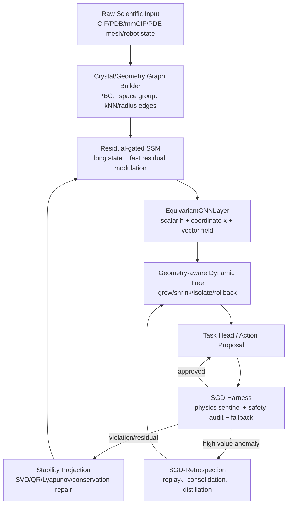

# SGD-Harness 物理守恒哨兵与等变自进化闭环

> 公开研究版 · 2026-09-12。保留模型方法、公式和组件设计；本文描述研究方案，未据此声称已有训练结果、完整实现或芯片性能。章节编号保留原研究索引，缺号表示未随包发布的独立规划内容。

> 版本：v1.1
> 日期：2026-07-09
> 上游来源：[新Idea探讨_20260613_等变GNN与自进化架构](24-新Idea探讨_20260613_等变GNN与自进化架构.md)\
> 对齐文档：[SGD-Net模型架构与层算子详解](13-SGD-Net模型架构与层算子详解.md)、[SGD-Net双闭环控制与类脑认知架构](14-SGD-Net双闭环控制与类脑认知架构.md)、[SGD-Net反省复盘与动态自进化机制](17-SGD-Net反省复盘与动态自进化机制.md)、独立研究材料（本包不附）、独立研究材料（本包不附）\
> 定位：把“等变 GNN + SSM + 动态树 + 物理守恒 Harness”的讨论正式纳入 SGD-Net / SGD-XPU 主线。

**本页目录**

- [1. 结论先行](#section-001)
- [2. 为什么不是另起炉灶](#section-002)
- [2.1 本文的评估与决策过程](#section-003)
- [3. 总体架构](#section-004)
- [4. 核心机制一：EquivariantGNNLayer](#section-005)
- [5. 核心机制二：SGD-Harness](#section-008)
- [6. 核心机制三：Geometry-aware Dynamic Tree](#section-013)
- [7. 核心机制四：Residual-gated SSM](#section-017)
- [8. 核心机制五：CrystalGraphBuilder 与材料场景](#section-020)
- [10. 推荐落地路线](#section-023)
- [11. 风险边界](#section-027)
- [12. 一句话总结](#section-028)

---

## 1. 结论先行 <a href="#section-001" id="section-001"></a>

`24` 号文档对本项目最大的价值不是单独引入 EGNN，而是把当前 SGD-Net 的核心闭环从：

```text
SSM + GNN + Dynamic Tree + Posterior Error + Stability Projection
```

升级为：

```text
SSM + Topological/Equivariant GNN + Dynamic Tree + Physics Harness + Stability Projection + Retrospection
```

其中：

| 新增/强化件 | 作用 | 对当前项目的意义 |
|---|---|---|
| `EquivariantGNNLayer` | 让分子、晶体、粒子场、机器人等 3D 物理对象满足旋转/平移等变 | 把普通 GNN 升级为几何物理 GNN |
| `SGD-Harness` | 外层运行时守恒哨兵，检查物理、安全、审计、fallback | 把 Posterior Error / SafetyAudit / EICU / Retrospection 串成一条可执行安全链 |
| `Geometry-aware Dynamic Tree` | 用不变标量驱动局部 grow/shrink，而非盲目 split/prune | 把动态树变成自适应网格/晶格 refinement 控制器 |
| `Residual-gated SSM` | 将物理残差作为选择性门控输入，推理期快速短时自适应 | 把 SSM 从“记忆层”升级为“控制调制器” |
| `CrystalGraphBuilder` | 显式支持晶胞、周期边界、空间群、不变特征 | 让材料 SDK 与晶体/半导体场景更专业 |
| `Geometry Op Family` | 为 relative distance、等变坐标更新、PBC 邻居等采 trace | 为 SGD-TPU 新硬件机会提供证据 |
| `Metric / Manifold Op Family` | 为 hyperbolic、Lorentz、quasi-metric、exp/log map 等远期算子采 trace | 为 G-GeoS 多度量流形研究期权提供证据 |

一句话：

> SGD-Harness 是 SGD-Net 2.0 的运行时外壳：EGNN 按结构提供几何等变性，动态树决定哪里长/缩，SSM 吸收短时残差，Harness 执行物理与安全边界检查，Retrospection 把高价值新结构长期固化。

## 2. 为什么不是另起炉灶 <a href="#section-002" id="section-002"></a>

当前项目已经具备以下基础：

| 当前能力 | 所在文档 | 与 24 号文档的关系 |
|---|---|---|
| SSM / Mamba 状态演化 | `13`、`11`、`SGD-TPU芯片架构/01` | 可升级为 residual-gated SSM |
| GNN 拓扑传播 | `13` | 可分化为 TopoGNN 与 EGNN 两条路径 |
| 动态树 split/prune/rollback | `13`、`14`、`17`、`11` | 可升级为几何 grow/shrink 控制器 |
| Posterior Error | `13`、`14` | 可并入 Harness 的物理残差输入 |
| Stability Projection | `13`、`11` | 可作为 Harness 的稳定性修复动作 |
| SafetyAudit / EICU | `SGD-XPU系统工程补全/03`、`SGD-XPU扩展功能IP四件套/03` | 可作为 Harness 的安全互锁与审计后端 |
| Trace / Benchmark | `SGD-Trace与Benchmark规范/` | 可记录 geometry / harness / grow-shrink trace |

因此 `24` 号文档不是新路线，而是对已有路线的**几何物理化、运行时安全化、材料晶体化和硬件证据化升级**。

## 2.1 本文的评估与决策过程 <a href="#section-003" id="section-003"></a>

从 `24` 号文档到本文，我采用的判断逻辑不是“看到一个新概念就加入主线”，而是按以下五个准则筛选：

| 准则 | 判断问题 | 结果 |
|---|---|---|
| 架构必要性 | 它是否补齐 SGD-Net 当前核心闭环中的真实短板？ | EGNN、Harness、几何动态树、残差门控 SSM 属于必要增强 |
| 已有基础 | 项目是否已有相邻模块，能低成本接入？ | SSM、GNN、动态树、SafetyAudit、Trace/Benchmark 已存在，可平滑纳入 |
| 差异化 | 它是否能让 SGD-XPU 与主流 GPU/TPU 拉开差异？ | geometry op family、动态 grow/shrink、Harness trace 有硬件差异化潜力 |
| 可验证性 | 是否能用 benchmark、trace、CModel 验证，而不是停留在概念？ | `crystal_egnn_refinement`、geometry trace、harness_check 可形成证据链 |
| 风险可控 | 是否能通过 fallback、rollback、safety level、阶段门禁控制风险？ | Harness + Stability Projection + Retrospection 可兜底 |

据此，我把 `24` 号文档中的大量想法收敛为**六组可引入 Idea**，并按落地优先级排序：

| # | 可引入 Idea | 为什么入选 | 优先级 |
|---|---|---|---|
| 1 | `EquivariantGNNLayer` | 解决普通 GNN 不理解 3D 几何、旋转/平移对称的问题 | P0 |
| 2 | `SGD-Harness` | 把后验误差、物理守恒、安全审计、fallback 统一成运行时外壳 | P0 |
| 3 | `Geometry-aware Dynamic Tree` | 把动态树从抽象 split/prune 升级为几何 grow/shrink 控制器 | P0/P1 |
| 4 | `Residual-gated SSM` | 让 SSM 在推理期吸收残差，实现短时自适应而非频繁微调 | P1 |
| 5 | `CrystalGraphBuilder` | 让晶体/材料场景显式支持晶胞、PBC、空间群、缺陷 mask | P1 |
| 6 | `Geometry Op Family` | 把 EGNN/PBC/Harness 相关算子纳入 trace，为 SGD-TPU 新硬件机会提供证据 | P1/P2 |
| 7 | `Metric / Manifold Op Family` | 把多度量、非欧、准度量和流形映射纳入 trace，而不是立即硬化 | P2/P3 |

同时，有几类想法被明确暂缓：

| 暂缓想法 | 暂缓原因 | 后续条件 |
|---|---|---|
| 立即新增独立 `Geometry Unit` 硬件 IP | 没有真实 trace 与 CModel 收益证据，容易过早硬化 | 多 workload 显示 geometry op 稳定收益 ≥1.5× |
| 一开始完整支持全部 crystallographic space group | 工程复杂度高，容易拖慢 MVP | P0 先做 PBC + radius/kNN，P1/P2 再支持空间群 |
| 推理期直接在线改大模型权重 | 风险高，可能灾难性遗忘或破坏守恒 | 先用 SSM hidden-state 快轨和 Retrospection 慢轨 |
| 把 EGNN 用于所有图任务 | 知识图谱/文本图/MoE 路由不需要 3D 等变，成本不划算 | 只在显式几何任务启用 |
| 立即新增完整 `G-GeoS` 多度量流形硬件 | 多度量/非欧/准度量算子尚无真实 trace 与数值门禁，容易概念先行 | 先做 `MetricTrace`、`ManifoldTrace`、软件 reference 和 CModel |

因此本文不是泛化“等变 + 自进化”的概念，而是明确给出：**六组可引入 Idea、各自接入点、风险边界和工程门禁**。

## 3. 总体架构 <a href="#section-004" id="section-004"></a>



## 4. 核心机制一：EquivariantGNNLayer <a href="#section-005" id="section-005"></a>

### 4.1 分流原则 <a href="#section-006" id="section-006"></a>

EGNN 引入后，节点信息必须分成三类：

| 信息类型 | 例子 | 变换性质 | 处理方式 |
|---|---|---|---|
| 不变标量 | 原子类型、电荷、质量、距离平方、能量密度 | 旋转/平移不变 | MLP / scalar message |
| 等变向量 | 坐标、速度、力、位移 | 随输入旋转同步旋转 | relative vector update |
| 结构元数据 | 晶胞、周期边界、空间群操作、edge type | 任务相关 | GraphBuilder / Compiler 处理 |

### 4.2 基础算子 <a href="#section-007" id="section-007"></a>

对边 $$(i,j)$$：

$$
r_{ij}=\|\mathbf{x}_i-\mathbf{x}_j\|^2
$$

$$
m_{ij}=\phi_e(h_i,h_j,r_{ij},e_{ij})
$$

坐标更新：

$$
\Delta \mathbf{x}_i=\sum_{j\in\mathcal{N}(i)}(\mathbf{x}_i-\mathbf{x}_j)\phi_x(m_{ij})
$$

$$
\mathbf{x}_i'=\mathbf{x}_i+\Delta \mathbf{x}_i
$$

标量更新：

$$
h_i'=\phi_h(h_i,\sum_j m_{ij})
$$

这样，当输入坐标整体旋转 $$R$$、平移 $$t$$ 时，输出坐标也同步变换：

$$
\mathbf{x}'(R\mathbf{x}+t)=R\mathbf{x}'(\mathbf{x})+t
$$

## 5. 核心机制二：SGD-Harness <a href="#section-008" id="section-008"></a>

### 5.1 定义 <a href="#section-009" id="section-009"></a>

`SGD-Harness` 是模型外层的运行时守护壳，不直接替代神经网络计算，而是负责：

1. 物理残差检测；
2. 稳定性/守恒性检查；
3. 安全与审计策略执行；
4. rollback / isolate / fallback；
5. 将失败样本送入 Retrospection；
6. 为硬件机会报告提供 trace 证据。

### 5.2 Harness 输入输出 <a href="#section-010" id="section-010"></a>

```text
SGDHarness.evaluate(
  graph_state,
  predicted_state,
  observed_state=None,
  physics_constraints=None,
  safety_policy=None,
  audit_context=None
) -> HarnessDecision
```

```text
HarnessDecision
  decision: accept | repair | rollback | isolate | fallback | manual_review
  guarantee_level: G0 | G1 | G2 | G3 | G4
  guarantee_contract_ref: str | None
  residuals:
    task_residual
    energy_residual
    momentum_residual
    charge_residual
    geometry_residual
    stability_residual
    safety_risk
  actions[]
  fallback_reason: str | None
  trace_id
  audit_record_ref
  evidence_record_ref: str
```

### 5.3 残差定义 <a href="#section-011" id="section-011"></a>

Harness 可统一管理：

$$
\eta_i=w_1r_i^{task}+w_2r_i^{physics}+w_3r_i^{topology}+w_4r_i^{drift}+w_5r_i^{confidence}+w_6r_i^{source}+w_7r_i^{equivariance}
$$

其中新增：

| 残差 | 含义 |
|---|---|
| $$r^{equivariance}$$ | 输入旋转/平移后，输出是否满足等变一致性 |
| $$r^{geometry}$$ | 原子重叠、键长异常、晶胞边界错误、拓扑撕裂 |
| $$r^{conservation}$$ | 能量、动量、电荷、质量守恒偏差 |

### 5.4 保证契约、决策语义与证据覆盖 <a href="#section-012" id="section-012"></a>

`accept` 只表示候选在当前 Harness 策略下获准进入下一节点，不自动等于“允许真实设备执行”。安全关键动作必须同时满足：

1. `GuaranteeContract` 未过期，且其模型、动力学、状态域、动作域、扰动集、离散步长、输入饱和和数值容差与当前请求一致；
2. G2 局部证书的当前状态位于已验证域内，验证器/求解器版本和残差均有效；
3. G3 monitor、shield、recovery、fallback 与 watchdog 在目标硬件上满足 WCET；
4. 设备级互锁、急停和人工授权没有被模型输出绕过。

| 输入证据级别 | Harness 可做的事 | 不得做的事 |
|---|---|---|
| G0 经验结果 | 仿真、离线排序、影子模式、生成反例 | 授权安全关键动作 |
| G1 表征/统计性质 | 校准风险分数、触发更多观测或验证 | 把 non-collapse/低残差解释为动作安全 |
| G2 指定域局部证书 | 在契约域内交给 G3 runtime assurance 再判断 | 外推到域外、模型错配或不同数值精度 |
| G3 运行时条件保障 | 在 monitor/shield/fallback 在线且时限满足时条件性接受 | 宣称 QP 永不不可行或系统绝对安全 |
| G4 系统 assurance case | 引用已审批的系统级证据包和运维条件 | 由 Harness 单独生成法规或功能安全认证 |

`EvidenceRecord` 必须分别记录 `verified_domain_coverage`、`simulation_coverage`、`hil_coverage` 与 `field_coverage`，并保留失败样本、反例、求解器残差、代码/模型 commit、硬件/驱动、来源许可证和人工复核人。缺失 `GuaranteeContract` 时，Harness 最多按 G0/G1 处理并进入 `fallback` 或 `manual_review`，不得通过默认值把候选升级为 G2/G3。

## 6. 核心机制三：Geometry-aware Dynamic Tree <a href="#section-013" id="section-013"></a>

### 6.1 原则 <a href="#section-014" id="section-014"></a>

动态树不能直接用绝对坐标作为 split 特征，否则会破坏等变性。它应只读取**不变标量**：

| 特征 | 用途 |
|---|---|
| $$\|\mathbf{x}_i-\mathbf{x}_j\|^2$$ | 局部拉伸/压缩 |
| $$\|\mathbf{F}_i\|$$ | 受力异常 |
| local energy density | 高能区域 refinement |
| residual norm | 误差热点 |
| strain / curvature scalar | 晶格缺陷、裂纹、相变 |
| $$\|\dot{h}_i\|$$ | SSM 隐状态突变 |
| uncertainty scalar | 探索性预分裂 |

### 6.2 控制动作 <a href="#section-015" id="section-015"></a>

```text
if conservation_check_invalid_or_failed:
    reject_candidate_or_use_declared_fallback
elif observation_missing_or_noise_dominated:
    request_observation_or_keep_unknown
elif persistent_residual_high and capacity_or_resolution_cause_supported:
    propose_isolated_refinement_with_migration
elif residual_low and merge_consistency_valid and benefit_expected:
    propose_isolated_merge
else:
    keep
# 所有候选经收益、回归、数值、资源与版本验证后，窗口间自动接纳。
```

### 6.3 与自适应有限元的关系 <a href="#section-016" id="section-016"></a>

这相当于把 SGD-Net 的动态树从“机器学习路由器”升级为类似自适应有限元中的 $$h/p$$ refinement 控制器：

| 自适应 FEM | SGD-Net 对应 |
|---|---|
| 网格加密 | graph grow / node split |
| 网格粗化 | graph shrink / node merge |
| 后验误差估计 | Harness residual / posterior error |
| 稳定性修复 | Stability Projection / rollback |

## 7. 核心机制四：Residual-gated SSM <a href="#section-017" id="section-017"></a>

### 7.1 快轨自适应 <a href="#section-018" id="section-018"></a>

SSM 不仅维护长程状态，还可作为推理期短时物理调制器：

$$
h_{t+1}=\bar{A}(x_t,r_t)h_t+\bar{B}(x_t)x_t+G(x_t,r_t)r_t
$$

其中 $$r_t$$ 是 Harness 生成的残差向量或残差 embedding。

### 7.2 三轨自进化 <a href="#section-019" id="section-019"></a>

| 轨道 | 机制 | 是否改权重 | 时间尺度 |
|---|---|---|---|
| 快轨 | SSM 隐状态残差调制 | 不改权重 | 毫秒到分钟 |
| 中轨 | 动态树 grow/shrink + topology refinement | 改结构/局部 adapter | 分钟到小时 |
| 慢轨 | Retrospection replay / distillation / consolidation | 可改参数 | 小时到月 |

## 8. 核心机制五：CrystalGraphBuilder 与材料场景 <a href="#section-020" id="section-020"></a>

### 8.1 为什么需要 <a href="#section-021" id="section-021"></a>

材料、晶体、半导体晶格不应只被粗略转成普通图。它们有一等结构：

- 晶胞 lattice vectors；
- fractional coordinates；
- periodic boundary condition；
- space group operations；
- defect / grain boundary / phase transition；
- XRD/SEM/VASP/DFT 多模态证据。

### 8.2 建议接口 <a href="#section-022" id="section-022"></a>

```text
CrystalGraphBuilder.build(
  cif_or_structure,
  radius_cutoff,
  pbc=True,
  space_group=True,
  defect_policy=None
) -> GeometryGraphState
```

```text
GeometryGraphState
  node_scalar
  node_coord
  edge_index
  edge_attr
  lattice_vectors
  pbc_offsets
  space_group_ops
  defect_masks
  source_tags
```

## 10. 推荐落地路线 <a href="#section-023" id="section-023"></a>

### P0：文档与软件抽象 <a href="#section-024" id="section-024"></a>

- [ ] 在 `13` 号文档中新增 `EquivariantGNNLayer`。
- [ ] 在 Runtime 中新增 `Harness Supervisor`。
- [ ] 在 Trace 中新增 geometry / harness op family。
- [ ] 定义 `CrystalGraphBuilder` 最小接口。

### P1：最小原型 <a href="#section-025" id="section-025"></a>

- [ ] 实现 CPU/PyTorch EGNN baseline。
- [ ] 实现 Harness residual checker（能量/动量/几何合法性）。
- [ ] 实现动态树几何 grow/shrink 策略。
- [ ] 跑通 `crystal_egnn_refinement` benchmark。

### P2：CModel 与硬件机会 <a href="#section-026" id="section-026"></a>

- [ ] 对 relative_distance / pbc_neighbor / equivariant_update 采 trace。
- [ ] 建 Geometry CModel 或复用 ST-Router + Mask CModel。
- [ ] 输出 Hardware Opportunity Report。
- [ ] 决定是否新增 `Geometry Unit` 四件套。

## 11. 风险边界 <a href="#section-027" id="section-027"></a>

| 风险 | 缓解 |
|---|---|
| EGNN 增加计算成本 | 只在 3D 物理场景启用，知识图谱仍用 TopoGNN |
| 动态增删节点导致发散 | Harness + Stability Projection + rollback |
| 空间群实现复杂 | P0 只做 PBC + radius/kNN，空间群作为 P1/P2 |
| Harness 过度保守阻碍探索 | safety level 分级，S0/S1 可放宽，S3/S4 严格 |
| 硬件过早承诺 | trace/CModel/FPGA 门禁前不宣传加速倍数 |
| 多度量/流形概念过早产品化 | 将 G-GeoS 明确限定为 P2/P3 研究期权，近期只做 schema、reference、CModel |

## 12. 一句话总结 <a href="#section-028" id="section-028"></a>

> `24` 号新 Idea 应成为 SGD-Net 2.0 的几何物理闭环增强层：六组近期可引入 Idea 分别是 `EquivariantGNNLayer`、`SGD-Harness`、`Geometry-aware Dynamic Tree`、`Residual-gated SSM`、`CrystalGraphBuilder` 与 `Geometry Op Family`；`26` 号文档进一步把 `Metric / Manifold Op Family` 作为第七组远期研究期权。EGNN 让模型尊重真实空间对称，动态树让图结构按残差自适应生长/粗化，SSM 负责推理期短时吸收异常，SGD-Harness 守住物理/安全边界，CrystalGraphBuilder 把晶体/材料对象结构化，Geometry Op Family 则把这些能力转化为可采 trace、可 replay、可硬件评估的证据；Metric/Manifold Op Family 只在 `MetricTrace/ManifoldTrace → CModel → FPGA` 证明后进入 G-GeoS 远期路线。在硬件上，先把 geometry / harness op family 纳入 trace，等真实 workload 证明收益后再决定是否新增 Geometry Unit；G-GeoS 不作为近期产品承诺。


---

[← 上一页](50-SGD-Net反思回顾复盘的基础与闭环完善20260912.md) · [全书目录](../SUMMARY.md) · [下一页 →](35-SGD-Net跨领域扩展路线与科研任务映射20260912.md)
