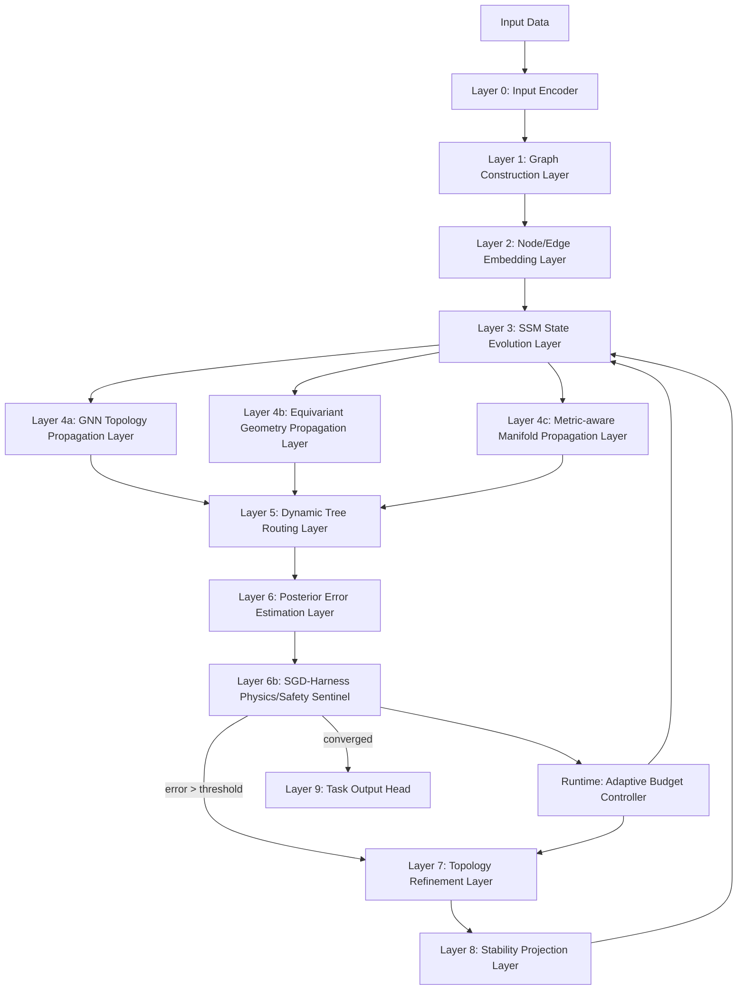

# 3. 整体分层架构

SGD-Net 可分为 9 个层级：

## 3.1 静态主干与动态控制环 

SGD-Net 包含两条路径：

1. **主干前向路径**：输入 → 编码 → SSM → TopoGNN/EGNN → Tree Routing → 输出。
2. **动态控制环**：后验误差 / Harness 残差 → 拓扑重构 → 稳定投影 → 回写图状态。

主干路径类似普通神经网络；动态控制环是 SGD-Net 与普通 SSM/GNN 最大的差异。

---

[← 上一页](section-02.md) · [全书目录](../../../SUMMARY.md) · [下一页 →](section-04.md)
