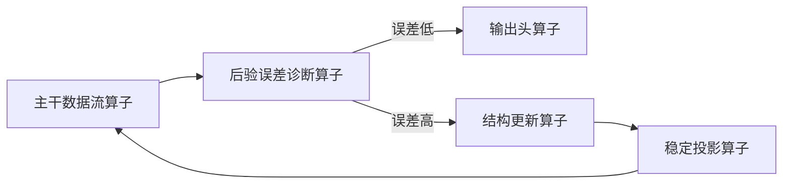

# 18. 算子与 Layer 的关系

本节专门回答一个容易混淆的问题：**算子（operator）和 Layer 到底是什么关系？**

简短回答：

> 算子是最小计算动作；Layer 是围绕某个语义目标组织起来的一组算子；Block 是多个核心 Layer 的可堆叠组合；SGD-Net 是由若干 Block 与控制环组成的完整模型架构。

这四级关系可以表示为：

```text
Operator  →  Layer  →  SGDBlock  →  SGD-Net Model
最小算子      功能层      可堆叠主干单元     完整模型架构
```

也可以类比 Transformer：

| Transformer 中的概念 | SGD-Net 中的对应 |
|---|---|
| Q/K/V projection、softmax、matmul 是算子 | `SSMScan`、`GraphMessage`、`TreeRoute` 是算子 |
| Multi-Head Attention 是 Layer | `SSMStateLayer`、`GNNTopologyLayer`、`DynamicTreeRoutingLayer` 是 Layer |
| Attention + FFN + Norm 是 Block | `SSM + GNN + Tree + Norm` 是 `SGDBlock` |
| 多个 Block 堆叠形成 Transformer | 多个 `SGDBlock` 加后验误差控制形成 SGD-Net |

**本页目录**

- [18.1 四级抽象定义](#section-001)
- [18.2 为什么不是“一层等于一个算子”？](#section-006)
- [18.3 每个 Layer 内部包含哪些算子？](#section-010)
- [18.4 Layer 内部算子执行链](#section-011)
- [18.5 算子在一次 forward 中的生命周期](#section-022)
- [18.6 数据算子、结构算子和稳定算子的区别](#section-026)
- [18.7 主干 Layer 与控制 Layer 的区别](#section-027)
- [18.8 Layer 与算子的嵌套示意](#section-028)
- [18.9 算子清单总表](#section-029)
- [18.10 最小实现时如何简化算子和 Layer？](#section-030)
- [18.11 关键理解](#section-031)
- [18.12 各算子的数学表达式](#section-032)
- [18.13 砖块式组装衔接性审查](#section-043)

---

## 18.1 四级抽象定义 <a href="#section-001" id="section-001"></a>

### 18.1.1 Operator：算子 <a href="#section-002" id="section-002"></a>

算子是最小计算原语，通常只完成一个明确动作。例如：

- `SSMScan`：执行一次状态空间递推或选择性扫描；
- `GraphMessage`：为一条边计算消息；
- `Aggregate`：把邻居消息聚合到节点；
- `TreeRoute`：根据动态树条件选择路由；
- `PosteriorError`：计算后验误差；
- `SVDClip`：裁剪奇异值；
- `Readout`：从节点集合汇聚为图级表示。

算子的特点：

1. 粒度小；
2. 输入输出明确；
3. 可以被多个 Layer 复用；
4. 有些可微，有些不可微；
5. 有些每次 forward 都执行，有些只在误差触发时执行。

### 18.1.2 Layer：功能层 <a href="#section-003" id="section-003"></a>

Layer 是对一组算子的封装。一个 Layer 不只是一个公式，而是围绕某个语义目标组织算子、参数、状态和输出。

例如 `GNNTopologyLayer` 内部可能包含：

```text
EdgeWeight → GraphMessage → Aggregate → NodeUpdate → Normalize
```

因此，Layer 的特点是：

1. 对外暴露统一接口；
2. 内部包含多个算子；
3. 管理该层的参数；
4. 维护必要的中间状态；
5. 输出对下游 Layer 可用的张量或图状态。

### 18.1.3 SGDBlock：可堆叠主干单元 <a href="#section-004" id="section-004"></a>

`SGDBlock` 是若干核心 Layer 的组合，通常包括：

```text
SSMStateLayer
GNNTopologyLayer
DynamicTreeRoutingLayer
ResidualConnection
Normalization
```

`SGDBlock` 负责主干表征学习，可像 Transformer Block 一样堆叠多层。

### 18.1.4 SGD-Net Model：完整模型架构 <a href="#section-005" id="section-005"></a>

完整 SGD-Net 包含：

- 输入编码与图构造；
- 多个 `SGDBlock`；
- 后验误差估计；
- 拓扑自适应重构；
- 稳定性投影；
- 任务输出头；
- refinement 日志与解释路径。

所以，**算子是 Layer 的内部零件，Layer 是 Block 的组成单元，Block 是 SGD-Net 主干的一层，控制环则让 SGD-Net 具备动态自适应能力。**

## 18.2 为什么不是“一层等于一个算子”？ <a href="#section-006" id="section-006"></a>

SGD-Net 中，Layer 和算子不是一一对应关系，而是多对多关系。

### 18.2.1 一个 Layer 通常包含多个算子 <a href="#section-007" id="section-007"></a>

例如 `SSMStateLayer` 至少包含：

```text
ParamGenerate → Discretize → SSMScan → StateUpdate → OutputProject
```

其中：

- `ParamGenerate` 生成输入相关的 $$A(x),B(x),C(x)$$；
- `Discretize` 将连续状态空间参数离散化；
- `SSMScan` 执行扫描或递推；
- `StateUpdate` 写回隐状态；
- `OutputProject` 输出当前层表征。

### 18.2.2 一个算子也可能被多个 Layer 复用 <a href="#section-008" id="section-008"></a>

例如 `Normalize` 可以出现在：

- embedding 层之后；
- GNN 层之后；
- Dynamic Tree 路由之后；
- Stability Projector 内部。

再如 `Project` 可以用于：

- 节点嵌入投影；
- SSM 输出投影；
- GNN 节点更新；
- 输出头映射；
- 稳定性投影。

### 18.2.3 有些算子属于数据流，有些属于控制流 <a href="#section-009" id="section-009"></a>

SGD-Net 的算子可分为两类：

| 类型 | 是否每次 forward 执行 | 是否改变图结构 | 示例 |
|---|---|---|---|
| 数据流算子 | 通常执行 | 否 | `SSMScan`、`GraphMessage`、`Aggregate`、`TreeRoute` |
| 控制流算子 | 条件执行 | 可能改变 | `PosteriorError`、`TreeSplit`、`TopologyRefine`、`StabilityProject` |

这也是 SGD-Net 与普通静态神经网络的关键差异：**它既有普通张量计算算子，也有改变模型结构或图结构的控制算子。**

## 18.3 每个 Layer 内部包含哪些算子？ <a href="#section-010" id="section-010"></a>

下面给出 SGD-Net 各 Layer 与算子的详细对应关系。

| Layer | 语义目标 | 内部主要算子 | 输出 |
|---|---|---|---|
| Layer 0：输入编码层 | 把原始输入变成结构化对象 | `Parse`、`Tokenize`、`FeatureExtract`、`Encode` | `EncodedObjects` |
| Layer 1：图构造层 | 从对象构造图节点和边 | `NodeCreate`、`EdgeCandidate`、`EdgeScore`、`Sparsify`、`GraphBuild` | `GraphState` |
| Layer 2：节点/边嵌入层 | 将节点和边转为向量 | `NodeEmbed`、`EdgeEmbed`、`TypeEmbed`、`PositionEncode`、`Project` | $$X,E$$ |
| Layer 3：SSM 状态演化层 | 沿时间/逻辑/扩散步推进状态 | `ParamGenerate`、`Discretize`、`SSMScan`、`StateUpdate`、`OutputProject` | $$X_{ssm},H'$$ |
| Layer 4：GNN 拓扑传播层 | 沿图边传播拓扑约束信息 | `EdgeWeight`、`GraphMessage`、`Aggregate`、`NodeUpdate`、`Normalize` | $$X_{gnn}$$ |
| Layer 5：动态树路由层 | 节点级条件路由和局部专家修正 | `PredicateEval`、`Gate`、`TreeRoute`、`LeafAdapter`、`TreeSplit`、`TreePrune` | $$X_{tree}$$ 与路由日志 |
| Layer 6：后验误差估计层 | 判断是否需要 refinement | `TaskResidual`、`TopologyViolation`、`StateDrift`、`ConfidenceError`、`ErrorFuse`、`ActionSelect` | `ErrorReport` |
| Layer 7：拓扑重构层 | 根据误差改变图结构 | `SelectNodes`、`CloneNode`、`InheritEdges`、`IsolateNode`、`Reindex`、`Remesh` | `RefineResult` |
| Layer 8：稳定性投影层 | 将状态/参数投影回稳定集合 | `NormClip`、`SpectralClip`、`SVDClip`、`LyapunovCheck`、`Rollback` | 稳定后的 `GraphState` |
| Layer 9：任务输出头 | 输出预测、解释或路径 | `Readout`、`TaskHead`、`Calibrate`、`Explain` | `SGDOutput` |

## 18.4 Layer 内部算子执行链 <a href="#section-011" id="section-011"></a>

### 18.4.1 Layer 0：输入编码层 <a href="#section-012" id="section-012"></a>

```text
raw_input
  → Parse
  → Tokenize / FeatureExtract
  → Encode
  → EncodedObjects
```

说明：这一层不一定是深度学习层，也可以是确定性解析器。例如 PDB/mmCIF 解析、CIF 解析、文本实体抽取都属于这一层。

### 18.4.2 Layer 1：图构造层 <a href="#section-013" id="section-013"></a>

```text
EncodedObjects
  → NodeCreate
  → EdgeCandidate
  → EdgeScore
  → Sparsify
  → GraphBuild
  → GraphState
```

说明：这一层决定图结构。若图结构错误，后续 GNN 和动态树都会在错误拓扑上工作。

### 18.4.3 Layer 2：节点/边嵌入层 <a href="#section-014" id="section-014"></a>

```text
node_attrs, edge_attrs
  → TypeEmbed
  → PositionEncode
  → NodeEmbed / EdgeEmbed
  → Project
  → X, E
```

说明：这一层将离散类型、连续数值、空间位置和任务特征统一到模型维度。

### 18.4.4 Layer 3：SSM 状态演化层 <a href="#section-015" id="section-015"></a>

```text
X, H
  → ParamGenerate
  → Discretize
  → SSMScan
  → StateUpdate
  → OutputProject
  → X_ssm, H_new
```

说明：`SSMScan` 是核心算子，但不是整个 SSM Layer。完整 SSM Layer 还要生成参数、离散化、更新状态和输出投影。

### 18.4.5 Layer 4：GNN 拓扑传播层 <a href="#section-016" id="section-016"></a>

```text
X_ssm, edge_index, edge_attr
  → EdgeWeight
  → GraphMessage
  → Aggregate
  → NodeUpdate
  → Normalize
  → X_gnn
```

说明：`GraphMessage` 只计算边消息，`Aggregate` 把边消息汇聚到节点，`NodeUpdate` 才真正更新节点表示。

### 18.4.6 Layer 5：动态树路由层 <a href="#section-017" id="section-017"></a>

```text
X_gnn, node_trees
  → PredicateEval
  → Gate / HardBranch
  → TreeRoute
  → LeafAdapter
  → RouteLog
  → X_tree
```

若误差触发结构变化，还会调用：

```text
ErrorReport
  → TreeSplit / TreePrune
  → updated node_trees
```

说明：`TreeRoute` 是 forward 数据流算子，`TreeSplit` 和 `TreePrune` 是结构控制算子，不一定每次执行。

### 18.4.7 Layer 6：后验误差估计层 <a href="#section-018" id="section-018"></a>

```text
GraphState, prediction_record, matched_observation_or_none, confidence
  → TaskResidual
  → TopologyViolation
  → StateDrift
  → StabilityViolation
  → ConfidenceError
  → ErrorFuse
  → ActionSelect
  → ErrorReport
```

说明：这一层是 SGD-Net 的“自适应控制器”。它把模型输出误差转化为动作建议，例如 keep、split、prune、isolate、rollback。

### 18.4.8 Layer 7：拓扑自适应重构层 <a href="#section-019" id="section-019"></a>

```text
GraphState, ErrorReport
  → SelectNodes
  → CloneNode
  → InheritEdges
  → IsolateNode
  → Reindex
  → Remesh
  → RefineResult
```

说明：这一层会改变图结构，因此它不是普通可微层，更接近模型运行时的结构更新层。

### 18.4.9 Layer 8：稳定性投影层 <a href="#section-020" id="section-020"></a>

```text
RefinedGraphState
  → NormClip
  → SpectralClip
  → SVDClip
  → LyapunovCheck
  → Rollback if needed
  → StableGraphState
```

说明：这一层实施数值约束和候选隔离；其效果需验证。局部谱裁剪不保证动态增长后的整体稳定，跨拓扑切换还需状态迁移和适用的共同稳定性条件。

### 18.4.10 Layer 9：任务输出头 <a href="#section-021" id="section-021"></a>

```text
StableGraphState / X_final
  → Readout
  → TaskHead
  → Calibrate
  → Explain
  → SGDOutput
```

说明：输出头可以是节点级、边级、图级或路径级，取决于任务。

## 18.5 算子在一次 forward 中的生命周期 <a href="#section-022" id="section-022"></a>

一次完整 forward 中，算子执行可分为三段。

### 18.5.1 主干数据流算子 <a href="#section-023" id="section-023"></a>

这些算子每次 forward 基本都会执行：

```text
Encode
→ GraphBuild
→ NodeEmbed / EdgeEmbed
→ SSMScan
→ GraphMessage / Aggregate / NodeUpdate
→ TreeRoute
→ TaskHead
```

### 18.5.2 诊断控制算子 <a href="#section-024" id="section-024"></a>

这些算子用于判断是否需要结构变化：

```text
PosteriorError
→ ErrorFuse
→ ActionSelect
```

### 18.5.3 条件结构算子 <a href="#section-025" id="section-025"></a>

这些算子只在误差或异常触发时执行：

```text
TreeSplit / TreePrune
→ TopologyRefine
→ StabilityProject
→ Rollback optional
```

因此，SGD-Net 的 forward 不是单纯线性链，而是：



## 18.6 数据算子、结构算子和稳定算子的区别 <a href="#section-026" id="section-026"></a>

SGD-Net 中的算子最好分成三类理解。

| 算子类别 | 是否可微 | 是否改变图结构 | 典型算子 | 主要作用 |
|---|---|---|---|---|
| 数据算子 | 通常可微 | 否 | `SSMScan`、`GraphMessage`、`Aggregate`、`NodeUpdate`、`TreeRoute` | 计算表征 |
| 结构算子 | 通常不可微或半可微 | 是 | `TreeSplit`、`TreePrune`、`CloneNode`、`Remesh`、`IsolateNode` | 改变模型/图结构 |
| 稳定算子 | 可微或不可微均可 | 通常不改变拓扑 | `NormClip`、`SVDClip`、`SpectralClip`、`LyapunovCheck` | 防止发散 |

这三类算子对应 SGD-Net 的三种能力：

1. 数据算子负责“算出表示”；
2. 结构算子负责“改变计算图”；
3. 稳定算子负责“防止改变后失控”。

## 18.7 主干 Layer 与控制 Layer 的区别 <a href="#section-027" id="section-027"></a>

SGD-Net 中还有一个重要区别：有些 Layer 属于主干，有些 Layer 属于控制环。

| Layer | 类型 | 是否堆叠 | 是否每次执行 | 说明 |
|---|---|---|---|---|
| 输入编码层 | 预处理层 | 否 | 是 | 将原始输入结构化 |
| 图构造层 | 预处理/动态图层 | 否 | 通常是 | 构建初始图或动态图 |
| 节点/边嵌入层 | 表征层 | 可选堆叠 | 是 | 向量化输入 |
| SSM 状态演化层 | 主干层 | 是 | 是 | 长程状态建模 |
| GNN 拓扑传播层 | 主干层 | 是 | 是 | 图约束传播 |
| 动态树路由层 | 主干+控制混合层 | 是 | 路由每次执行，分裂条件执行 | 局部自适应 |
| 后验误差估计层 | 控制层 | 否 | 训练/推理可配置 | 产生结构动作信号 |
| 拓扑重构层 | 控制层 | 否 | 条件执行 | 修改图结构 |
| 稳定性投影层 | 控制/约束层 | 否 | 条件或周期执行 | 检查适用稳定性条件 |
| 任务输出头 | 输出层 | 可多头 | 是 | 输出任务结果 |

由此可以看出：

- `SSMStateLayer`、`GNNTopologyLayer`、`DynamicTreeRoutingLayer` 构成可堆叠主干；
- `PosteriorErrorEstimator`、`TopologyRefiner`、`StabilityProjector` 构成动态控制环；
- SGD-Net 的创新不只是某个 Layer，而是主干和控制环之间的闭环耦合。

## 18.8 Layer 与算子的嵌套示意 <a href="#section-028" id="section-028"></a>

可以用下面的结构理解一个完整 SGD-Net 模型：

```text
SGDNet
├── InputEncoder Layer
│   ├── Parse operator
│   ├── Tokenize operator
│   └── Encode operator
├── GraphConstruction Layer
│   ├── NodeCreate operator
│   ├── EdgeCandidate operator
│   ├── EdgeScore operator
│   └── GraphBuild operator
├── Embedding Layer
│   ├── NodeEmbed operator
│   ├── EdgeEmbed operator
│   └── Project operator
├── SGDBlock × L
│   ├── SSMStateLayer
│   │   ├── ParamGenerate operator
│   │   ├── Discretize operator
│   │   └── SSMScan operator
│   ├── GNNTopologyLayer
│   │   ├── GraphMessage operator
│   │   ├── Aggregate operator
│   │   └── NodeUpdate operator
│   └── DynamicTreeRoutingLayer
│       ├── PredicateEval operator
│       ├── TreeRoute operator
│       └── LeafAdapter operator
├── PosteriorErrorEstimator Layer
│   ├── TaskResidual operator
│   ├── TopologyViolation operator
│   ├── ErrorFuse operator
│   └── ActionSelect operator
├── TopologyRefiner Layer
│   ├── TreeSplit operator
│   ├── CloneNode operator
│   ├── InheritEdges operator
│   └── Remesh operator
├── StabilityProjector Layer
│   ├── NormClip operator
│   ├── SVDClip operator
│   └── LyapunovCheck operator
└── TaskHead Layer
    ├── Readout operator
    ├── TaskHead operator
    └── Explain operator
```

## 18.9 算子清单总表 <a href="#section-029" id="section-029"></a>

| 算子 | 所属 Layer | 输入 | 输出 | 作用 |
|---|---|---|---|---|
| `Parse` | Layer 0 | raw input | parsed objects | 解析原始输入 |
| `Tokenize` | Layer 0 | parsed objects | tokens/objects | 切分结构化对象 |
| `FeatureExtract` | Layer 0 | parsed objects | raw features | 提取手工或预训练特征 |
| `Encode` | Layer 0 | raw input/features | encoded objects | 原始输入结构化 |
| `NodeCreate` | Layer 1 | encoded objects | nodes | 创建图节点 |
| `EdgeCandidate` | Layer 1 | nodes | candidate edges | 生成候选边 |
| `EdgeScore` | Layer 1 | candidate edges | edge scores | 计算边权或关系置信度 |
| `Sparsify` | Layer 1 | edge scores | sparse edges | 稀疏化图边 |
| `GraphBuild` | Layer 1 | nodes, edges | graph state | 构造图节点与边 |
| `NodeEmbed` | Layer 2 | node attrs | node features | 节点向量化 |
| `EdgeEmbed` | Layer 2 | edge attrs | edge features | 边向量化 |
| `TypeEmbed` | Layer 2 | type ids | type embeddings | 注入节点/边类型 |
| `PositionEncode` | Layer 2 | positions/order | positional features | 注入空间或序列位置 |
| `ParamGenerate` | Layer 3 | x | SSM params | 生成 SSM 参数 |
| `Discretize` | Layer 3 | continuous params | discrete params | 离散化状态空间参数 |
| `SSMScan` | Layer 3 | x, h | y, h_new | 状态空间递推 |
| `StateUpdate` | Layer 3 | h_new | updated state | 写回隐状态 |
| `OutputProject` | Layer 3 | y | x_ssm | 投影到模型维度 |
| `EdgeWeight` | Layer 4 | edge_attr | weights | 计算边权重 |
| `GraphMessage` | Layer 4 | x, edge_index | messages | 边消息计算 |
| `Aggregate` | Layer 4 | messages | node messages | 邻域聚合 |
| `NodeUpdate` | Layer 4 | x, aggregated message | x_new | 节点更新 |
| `Normalize` | Layer 4 / Block | features | normalized features | 归一化稳定训练 |
| `PredicateEval` | Layer 5 | x, predicate | branch score | 计算树分支条件 |
| `Gate` | Layer 5 | branch score | gate value | 软/硬门控 |
| `TreeRoute` | Layer 5 | x, tree | x_routed | 动态树路由 |
| `LeafAdapter` | Layer 5 | leaf, x | local update | 叶节点局部专家修正 |
| `TreeSplit` | Layer 5 / 7 | tree, error | tree_new | 树分裂 |
| `TreePrune` | Layer 5 / 7 | tree, policy | tree_new | 树剪枝 |
| `TaskResidual` | Layer 6 | prediction_record, matched_observation | residual/UNKNOWN | 配对任务误差 |
| `TopologyViolation` | Layer 6 | graph, hidden links | violation score | 拓扑违背误差 |
| `StateDrift` | Layer 6 | h_t, h_prev | drift score | 状态漂移误差 |
| `ConfidenceError` | Layer 6 | confidence | confidence residual | 置信度误差 |
| `ErrorFuse` | Layer 6 | error terms | eta | 多误差融合 |
| `ActionSelect` | Layer 6 | eta, policy | actions | 选择 keep/split/prune/isolate |
| `SelectNodes` | Layer 7 | error report | node ids | 选择待 refinement 节点 |
| `CloneNode` | Layer 7 | graph, node id | new nodes | 复制/派生新节点 |
| `InheritEdges` | Layer 7 | old node edges | new edges | 继承邻接关系 |
| `IsolateNode` | Layer 7 | node id | isolated graph | 隔离旧节点或异常节点 |
| `Reindex` | Layer 7 | graph | reindexed graph | 重排节点和边索引 |
| `Remesh` | Layer 7 | graph | refined graph | 图拓扑重构 |
| `NormClip` | Layer 8 | features/params | clipped tensors | 范数裁剪 |
| `SpectralClip` | Layer 8 | matrix | clipped matrix | 谱半径约束 |
| `SVDClip` | Layer 8 | matrix | projected matrix | 奇异值裁剪 |
| `LyapunovCheck` | Layer 8 | state energy | pass/fail | 能量下降检查 |
| `Rollback` | Layer 8 | checkpoint | restored state | 回滚异常更新 |
| `Readout` | Layer 9 | node features | graph feature | 图级汇聚 |
| `TaskHead` | Layer 9 | features | prediction | 任务输出 |
| `Calibrate` | Layer 9 | logits/scores | calibrated output | 置信度校准 |
| `Explain` | Layer 9 | logs, paths | explanation | 输出解释信息 |

## 18.10 最小实现时如何简化算子和 Layer？ <a href="#section-030" id="section-030"></a>

MVP 阶段不需要实现所有算子。可以按如下方式简化：

| Layer | MVP 保留算子 | 暂缓算子 |
|---|---|---|
| Layer 0 | `Encode` | 复杂 parser、多模态 tokenizer |
| Layer 1 | `GraphBuild` | `EdgeScore`、复杂 sparsify |
| Layer 2 | `NodeEmbed` | 类型丰富的 `EdgeEmbed` |
| Layer 3 | `SSMScan` | 输入选择性参数生成、复杂离散化 |
| Layer 4 | `Aggregate`、`NodeUpdate` | typed-edge message、守恒消息 |
| Layer 5 | `TreeRoute`、`TreeSplit` | soft gate、复杂 prune policy |
| Layer 6 | `TaskResidual` | 多源误差融合 |
| Layer 7 | `CloneNode`、`InheritEdges`、`IsolateNode` | 子图级 remesh |
| Layer 8 | `NormClip` 或 `SVDClip` | Lyapunov rollback |
| Layer 9 | `TaskHead` | 复杂解释与校准 |

最小实现可以写成：

```text
Layer = 语义封装
Operator = Layer 内部调用的具体函数

SGDNet.forward:
  graph = GraphBuild(Encode(raw_input))
  x = NodeEmbed(graph.nodes)
  x = SSMScan(x, h)
  x = Aggregate(graph, x)
  x = TreeRoute(x, graph.node_trees)
  graph.x = x
  prediction = TaskHead(graph.x)
  RecordPrediction(prediction, available_inputs, versions)
  report = MatchPriorPrediction(arrived_observation)
  EnqueueIsolatedCandidateIfJustified(report, graph)
  return prediction  # 候选迁移/验证/发布在窗口边界独立完成
```

## 18.11 关键理解 <a href="#section-031" id="section-031"></a>

最终可以用一句话总结算子与 Layer 的关系：

> Layer 是“做一类事情的功能模块”，算子是“Layer 内部真正执行的计算动作”。SGD-Net 的每个 Layer 通常由多个算子构成；某些算子负责普通张量计算，某些算子负责动态图结构变化，某些算子负责稳定性约束。SGD-Net 的独特性来自这些 Layer 与算子之间形成了后验误差驱动的闭环，而不是来自某一个孤立算子。

## 18.12 各算子的数学表达式 <a href="#section-032" id="section-032"></a>

为保证 SGD-Net 可以像积木一样组装，先统一约定每一层主干特征维度为 $$d$$，边特征维度为 $$d_e$$，SSM 隐状态维度为 $$d_h$$：

$$
X^{(l)}\in\mathbb{R}^{N\times d},\quad
E^{(l)}\in\mathbb{R}^{M\times d_e},\quad
H^{(l)}\in\mathbb{R}^{N\times d_h}
$$

其中 $$N$$ 为当前节点数，$$M=|\mathcal{E}|$$ 为当前边数。动态图 refinement 后，$$N$$ 和 $$M$$ 可以变化，但每个活跃节点的特征维度 $$d$$ 应保持不变，除非通过显式投影层完成维度对齐。

### 18.12.1 Layer 0 输入编码算子 <a href="#section-033" id="section-033"></a>

**1. `Parse` 算子**

将原始输入 $$\mathcal{D}_{raw}$$ 解析为结构对象集合：

$$
\mathcal{O}=\operatorname{Parse}(\mathcal{D}_{raw})=\{o_1,o_2,\ldots,o_n\}
$$

其中 $$o_i$$ 可表示文本实体、物理采样点、残基、原子、材料结构单元或实验记录。

**2. `Tokenize` 算子**

将结构对象切分为 token 或节点候选：

$$
z_i=\tau(o_i),\qquad Z=\{z_i\}_{i=1}^{n}
$$

对文本任务，$$\tau$$ 是 tokenizer；对分子任务，$$\tau$$ 是 residue/atom tokenizer；对 PDE 任务，$$\tau$$ 可退化为采样点索引。

**3. `FeatureExtract` 算子**

提取原始对象属性：

$$
a_i=f_{feat}(o_i)\in\mathbb{R}^{p}
$$

例如空间坐标、元素类型、残基类型、边界条件、置信度或文本 embedding。

**4. `Encode` 算子**

将原始属性映射到统一编码空间：

$$
u_i=f_{enc}(a_i;\theta_{enc})\in\mathbb{R}^{d_0}
$$

整体输出：

$$
U=[u_1;u_2;\ldots;u_n]\in\mathbb{R}^{n\times d_0}
$$

### 18.12.2 Layer 1 图构造算子 <a href="#section-034" id="section-034"></a>

**5. `NodeCreate` 算子**

将编码对象实例化为图节点：

$$
\mathcal{V}=\{v_i\mid v_i=\operatorname{NodeCreate}(u_i)\}_{i=1}^{N}
$$

节点初始属性为：

$$
r_i^{v}=g_v(u_i)
$$

**6. `EdgeCandidate` 算子**

生成候选边集合：

$$
\mathcal{C}=\{(i,j)\mid \kappa(u_i,u_j)=1\}
$$

其中 $$\kappa$$ 可取不同规则：

$$
\kappa_{knn}(i,j)=\mathbb{I}[j\in kNN(i)]
$$

$$
\kappa_{radius}(i,j)=\mathbb{I}[\|p_i-p_j\|_2\le r]
$$

$$
\kappa_{relation}(i,j)=\mathbb{I}[R(i,j)\in\mathcal{R}_{allow}]
$$

**7. `EdgeScore` 算子**

为候选边计算边权或关系置信度：

$$
s_{ij}=\phi_s([u_i,u_j,r_{ij},t_{ij}];\theta_s)
$$

其中 $$r_{ij}$$ 是距离、方向或相对位置，$$t_{ij}$$ 是边类型。

**8. `Sparsify` 算子**

将候选边稀疏化为真实边：

$$
A_{ij}=\mathbb{I}[s_{ij}>\epsilon_s]\quad \text{or}\quad A_{ij}=\mathbb{I}[j\in\operatorname{TopK}_j(s_{ij})]
$$

边集合为：

$$
\mathcal{E}=\{(i,j)\mid A_{ij}=1\}
$$

**9. `GraphBuild` 算子**

输出图状态：

$$
\mathcal{G}_0=(\mathcal{V},\mathcal{E},A,R^v,R^e)
$$

其中 $$R^v$$ 为节点原始属性，$$R^e$$ 为边原始属性。

### 18.12.3 Layer 2 节点/边嵌入算子 <a href="#section-035" id="section-035"></a>

**10. `TypeEmbed` 算子**

节点类型嵌入：

$$
t_i^v=\operatorname{Emb}_v(type_i)\in\mathbb{R}^{d_t}
$$

边类型嵌入：

$$
t_{ij}^e=\operatorname{Emb}_e(type_{ij})\in\mathbb{R}^{d_{te}}
$$

**11. `PositionEncode` 算子**

对空间坐标或序列位置编码：

$$
p_i=\operatorname{PE}(pos_i)
$$

常见正弦位置编码为：

$$
PE_{2k}(pos)=\sin\left(\frac{pos}{10000^{2k/d}}\right),\quad
PE_{2k+1}(pos)=\cos\left(\frac{pos}{10000^{2k/d}}\right)
$$

**12. `NodeEmbed` 算子**

节点特征向量化：

$$
x_i^{(0)}=\phi_v([r_i^v,t_i^v,p_i];\theta_v)\in\mathbb{R}^{d}
$$

整体：

$$
X^{(0)}=[x_1^{(0)};\ldots;x_N^{(0)}]\in\mathbb{R}^{N\times d}
$$

**13. `EdgeEmbed` 算子**

边特征向量化：

$$
e_{ij}^{(0)}=\phi_e([r_{ij}^e,t_{ij}^e,\Delta p_{ij}];\theta_e)\in\mathbb{R}^{d_e}
$$

**14. `Project` 算子**

任意维度对齐到模型主维度：

$$
\operatorname{Project}_{a\to b}(x)=xW_{a\to b}+b_{a\to b}
$$

若某层输出 $$Z\in\mathbb{R}^{N\times d_z}$$，而下一层要求 $$d$$，则：

$$
X=ZW_z+b_z\in\mathbb{R}^{N\times d}
$$

### 18.12.4 Layer 3 SSM 状态演化算子 <a href="#section-036" id="section-036"></a>

**15. `ParamGenerate` 算子**

生成输入相关的 SSM 参数：

$$
\Delta_i=\operatorname{softplus}(x_iW_{\Delta}+b_{\Delta})
$$

$$
B_i=x_iW_B+b_B,\\ C_i=x_iW_C+b_C
$$

可选地，状态矩阵 $$A$$ 共享于所有节点，或由输入调制：

$$
A_i=A_0+\operatorname{diag}(x_iW_A)
$$

**16. `Discretize` 算子**

零阶保持近似：

$$
\bar{A}_i=\exp(\Delta_i A_i)
$$

$$
\bar{B}_i=(\Delta_i A_i)^{-1}\left(\exp(\Delta_i A_i)-I\right)\Delta_i B_i
$$

双线性变换近似：

$$
\bar{A}_i=\left(I-\frac{\Delta_i}{2}A_i\right)^{-1}\left(I+\frac{\Delta_i}{2}A_i\right)
$$

$$
\bar{B}_i=\left(I-\frac{\Delta_i}{2}A_i\right)^{-1}\Delta_i B_i
$$

**17. `SSMScan` 算子**

节点级递推：

$$
h_i^{(l+1)}=\bar{A}_i h_i^{(l)}+\bar{B}_i x_i^{(l)}
$$

输出：

$$
y_i^{(l)}=C_i h_i^{(l+1)}+D x_i^{(l)}
$$

全图写法：

$$
H^{(l+1)}=\operatorname{SSMScan}(X^{(l)},H^{(l)};\bar{A},\bar{B})
$$

**18. `StateUpdate` 算子**

将新隐状态写回图状态：

$$
\mathcal{G}.H\leftarrow H^{(l+1)}
$$

若动态图新增节点 $$k$$，需要初始化：

$$
h_k=\operatorname{InitState}(x_k)=x_kW_h+b_h
$$

**19. `OutputProject` 算子**

将 SSM 输出投影回主干维度：

$$
x_{i,ssm}^{(l)}=y_i^{(l)}W_o+b_o\in\mathbb{R}^{d}
$$

并可使用残差：

$$
\widetilde{x}_i^{(l)}=x_i^{(l)}+x_{i,ssm}^{(l)}
$$

### 18.12.5 Layer 4 GNN 拓扑传播算子 <a href="#section-037" id="section-037"></a>

**20. `EdgeWeight` 算子**

根据边特征计算边权：

$$
\alpha_{ij}=\operatorname{softmax}_{j\in\mathcal{N}(i)}\left(a^T\sigma(W_xx_i+W_x'x_j+W_ee_{ij})\right)
$$

简化版：

$$
\alpha_{ij}=\frac{A_{ij}}{\sum_{k}A_{ik}+\epsilon}
$$

**21. `GraphMessage` 算子**

边消息：

$$
m_{ij}=\psi_m(x_i,x_j,e_{ij})
$$

常用实现：

$$
m_{ij}=\alpha_{ij}\,\phi_m([x_i,x_j,e_{ij}];\theta_m)
$$

或 typed-edge 版本：

$$
m_{ij}=\alpha_{ij}W_{type(e_{ij})}x_j
$$

**22. `Aggregate` 算子**

邻域聚合：

$$
m_i=\operatorname{AGG}_{j\in\mathcal{N}(i)}m_{ij}
$$

其中：

$$
\operatorname{AGG}\in\{\sum,\operatorname{mean},\max,\operatorname{attention}\}
$$

最常用：

$$
m_i=\sum_{j\in\mathcal{N}(i)}m_{ij}
$$

**23. `NodeUpdate` 算子**

节点更新：

$$
x_i'=\phi_u([x_i,m_i];\theta_u)
$$

带残差形式：

$$
x_{i,gnn}=x_i+\phi_u([x_i,m_i];\theta_u)
$$

矩阵简化版：

$$
X_{gnn}=\sigma(D^{-1}AXW_g)
$$

**24. `Normalize` 算子**

层归一化：

$$
\operatorname{LN}(x)=\gamma\frac{x-\mu(x)}{\sqrt{\sigma^2(x)+\epsilon}}+\beta
$$

图归一化可按节点或按图 batch 归一化。

### 18.12.6 Layer 5 动态树路由算子 <a href="#section-038" id="section-038"></a>

**25. `PredicateEval` 算子**

对树节点 $$q$$ 计算分支分数：

$$
s_q(x_i)=w_q^Tx_i-\tau_q
$$

硬阈值版本可取 $$w_q=e_{k_q}$$，即只检查某个特征维度。

**26. `Gate` 算子**

软门控：

$$
g_q(x_i)=\sigma\left(\frac{s_q(x_i)}{T}\right)
$$

硬门控：

$$
g_q(x_i)=\mathbb{I}[s_q(x_i)>0]
$$

**27. `TreeRoute` 算子**

递归软路由：

$$
R_q(x_i)=(1-g_q(x_i))R_{left(q)}(x_i)+g_q(x_i)R_{right(q)}(x_i)
$$

若 $$q$$ 是叶节点 $$\ell$$：

$$
R_{\ell}(x_i)=x_i+a_{\ell}(x_i)
$$

硬路由则只选择一条路径：

$$
R_q(x_i)=R_{left(q)}(x_i)\ \text{or}\ R_{right(q)}(x_i)
$$

**28. `LeafAdapter` 算子**

叶节点局部修正：

$$
a_{\ell}(x_i)=W_{2,\ell}\sigma(W_{1,\ell}x_i+b_{1,\ell})+b_{2,\ell}
$$

或低秩 adapter：

$$
a_{\ell}(x_i)=x_iA_{\ell}B_{\ell},\quad rank(A_{\ell}B_{\ell})\ll d
$$

**29. `TreeSplit` 算子**

当 $$\eta_i>\epsilon_{split}$$ 时，对叶节点 $$\ell$$ 分裂：

$$
\ell\rightarrow(\ell_L,\ell_R)
$$

新阈值可取：

$$
k^*=\arg\max_k \left|\frac{\partial \eta_i}{\partial x_{ik}}\right|
$$

$$
\mathrm{tau}^*=\operatorname{median}\{x_{ik^*}\mid i\in\mathcal{B}_{\ell}\}
$$

新叶 adapter 初始化：

$$
\mathrm{theta}_{\ell_L}=\theta_{\ell}+\epsilon_L,
\quad
\mathrm{theta}_{\ell_R}=\theta_{\ell}+\epsilon_R
$$

**30. `TreePrune` 算子**

若子树 $$S$$ 的贡献低且成本高：

$$
score(S)=\frac{\Delta \mathcal{L}_S}{Cost(S)+\epsilon}
$$

当：

$$
score(S)<\epsilon_{prune}
$$

执行：

$$
T_i\leftarrow T_i\setminus S
$$

### 18.12.7 Layer 6 后验误差估计算子 <a href="#section-039" id="section-039"></a>

**31. `TaskResidual` 算子**

监督残差：

$$
r_i^{task}=\|\hat{y}_i-y_i\|_2
$$

PDE 残差：

$$
r_i^{pde}=\left|\mathcal{N}[u_{\theta}](p_i)-f(p_i)\right|
$$

其中 $$\mathcal{N}$$ 是微分算子。

**32. `TopologyViolation` 算子**

若模型产生隐式相关矩阵 $$S$$，但图中无合法边：

$$
r_i^{topo}=\sum_j (1-A_{ij})\cdot |S_{ij}|
$$

**33. `StateDrift` 算子**

状态漂移：

$$
r_i^{drift}=\|h_i^{(t)}-h_i^{(t-1)}\|_2
$$

相对漂移：

$$
r_i^{rel}=\frac{\|h_i^{(t)}-h_i^{(t-1)}\|_2}{\|h_i^{(t-1)}\|_2+\epsilon}
$$

**34. `ConfidenceError` 算子**

若置信度 $$c_i\in[0,1]$$：

$$
r_i^{conf}=1-c_i
$$

结构预测中若使用 pLDDT：

$$
r_i^{conf}=1-\frac{pLDDT_i}{100}
$$

**35. `ErrorFuse` 算子**

多源误差融合：

$$
\eta_i=w_1r_i^{task}+w_2r_i^{topo}+w_3r_i^{drift}+w_4r_i^{conf}+w_5r_i^{stable}
$$

也可用可学习门控：

$$
\eta_i=w(x_i)^Tr_i,\quad w(x_i)=\operatorname{softmax}(W_ex_i+b_e)
$$

**36. `ActionSelect` 算子**

动作选择：

$$
a_i=
\begin{cases}
\operatorname{split}, & \eta_i>\epsilon_{split} \\
\operatorname{isolate}, & r_i^{anomaly}>\epsilon_{iso} \\
\operatorname{prune}, & \eta_i<\epsilon_{prune}\ \text{and}\ usage_i<u_{min} \\
\operatorname{keep}, & \text{otherwise}
\end{cases}
$$

### 18.12.8 Layer 7 拓扑重构算子 <a href="#section-040" id="section-040"></a>

**37. `SelectNodes` 算子**

选择待 refinement 节点：

$$
\mathcal{S}=\{i\mid a_i\in\{split,isolate,prune\}\}
$$

限制每步最多处理 $$K$$ 个：

$$
\mathcal{S}_K=\operatorname{TopK}_{i}(\eta_i,K)
$$

**38. `CloneNode` 算子**

分裂节点 $$i$$ 为两个子节点：

$$
x_{i_L}=x_i+\epsilon_L,
\quad
x_{i_R}=x_i+\epsilon_R
$$

其中：

$$
\epsilon_L,\epsilon_R\sim\mathcal{N}(0,\sigma^2I)
$$

隐状态也需要复制或投影：

$$
h_{i_L}=h_i+\delta_L,
\quad
h_{i_R}=h_i+\delta_R
$$

**39. `InheritEdges` 算子**

继承邻居：

$$
\forall j\in\mathcal{N}(i):
A'_{i_Lj}=A'_{ji_L}=A_{ij},
\quad
A'_{i_Rj}=A'_{ji_R}=A_{ij}
$$

新子节点内部连边：

$$
A'_{i_Li_R}=A'_{i_Ri_L}=1
$$

**40. `IsolateNode` 算子**

隔离旧节点：

$$
A'_{i,:}=0,
\quad
A'_{:,i}=0
$$

并更新活跃掩码：

$$
mask_i=0
$$

**41. `Reindex` 算子**

若删除或压缩节点索引，定义重映射：

$$
\pi: \mathcal{V}'\rightarrow\{1,2,\ldots,N'\}
$$

边索引更新：

$$
(i,j)\mapsto(\pi(i),\pi(j))
$$

**42. `Remesh` 算子**

综合节点、边、特征、树和状态更新：

$$
\mathcal{G}'=\operatorname{Remesh}(\mathcal{G},\mathcal{S},\mathcal{A})
$$

并保持：

$$
X'\in\mathbb{R}^{N'\times d},\quad
H'\in\mathbb{R}^{N'\times d_h},\quad
A'\in\mathbb{R}^{N'\times N'}
$$

### 18.12.9 Layer 8 稳定性投影算子 <a href="#section-041" id="section-041"></a>

**43. `NormClip` 算子**

节点特征范数裁剪：

$$
x_i'=x_i\cdot\min\left(1,\frac{c}{\|x_i\|_2+\epsilon}\right)
$$

**44. `SpectralClip` 算子**

对矩阵 $$W$$ 控制谱半径：

$$
W'=\frac{W}{\max(1,\rho(W)/\rho_{max})}
$$

其中 $$\rho(W)=\max_i|\lambda_i(W)|$$，仅对方阵有此定义。该缩放约束单矩阵谱半径；非正规瞬态放大、非线性反馈与切换系统仍需完整分析。

**45. `SVDClip` 算子**

奇异值裁剪：

$$
W=U\Sigma V^T
$$

$$
\Sigma'_{kk}=\min(\Sigma_{kk},\sigma_{max})
$$

$$
W'=U\Sigma'V^T
$$

**46. `LyapunovCheck` 算子**

定义能量：

$$
V_t=\frac{1}{2}\operatorname{tr}(H_t^TPH_t)+\Pi(X_t,\mathcal{G}_t)
$$

若：

$$
V_{t+1}-V_t>\delta
$$

则判定本次更新不稳定。

**47. `Rollback` 算子**

回滚到最近稳定 checkpoint：

$$
(X,H,A,T)\leftarrow(X,H,A,T)_{checkpoint}
$$

### 18.12.10 Layer 9 输出算子 <a href="#section-042" id="section-042"></a>

**48. `Readout` 算子**

图级汇聚：

$$
g=\operatorname{Readout}(X)=\sum_i \alpha_i x_i
$$

其中注意力权重：

$$
\alpha_i=\frac{\exp(q^Tx_i)}{\sum_j\exp(q^Tx_j)}
$$

简单 mean pooling：

$$
g=\frac{1}{N}\sum_{i=1}^{N}x_i
$$

**49. `TaskHead` 算子**

节点级任务：

$$
\hat{y}_i=f_{head}(x_i)=x_iW_y+b_y
$$

图级任务：

$$
\hat{y}=f_{head}(g)
$$

**50. `Calibrate` 算子**

温度校准：

$$
p=\operatorname{softmax}\left(\frac{z}{T_c}\right)
$$

回归不确定性可输出：

$$
(\mu,\log\sigma^2)=f_{head}(g)
$$

**51. `Explain` 算子**

解释路径和 refinement 日志：

$$
\mathcal{E}_{explain}=\{path,\eta,actions,lineage,blocked\_edges\}
$$

其中 lineage 记录：

$$
i\rightarrow(i_L,i_R)
$$

## 18.13 砖块式组装衔接性审查 <a href="#section-043" id="section-043"></a>

本节从工程接口角度审查 SGD-Net 是否真的能像积木一样搭起来。结论是：**可以搭起来，但必须遵守一组维度、状态和拓扑不变量；否则会出现层间无法衔接的问题。**

### 18.13.1 标准接口契约 <a href="#section-044" id="section-044"></a>

建议所有主干 Layer 都接收并返回 `GraphState`，而不是只传一个裸张量。标准 `GraphState` 应包含：

```text
GraphState:
  x:          [N, d]
  edge_index: [2, M]
  edge_attr:  [M, d_e]
  h:          [N, d_h]
  node_trees: List[DynamicTree], len = N
  active_mask:[N]
  lineage:    dict
  metadata:   dict
```

于是每个 Layer 都满足：

$$
\mathcal{G}^{(l+1)}=\operatorname{Layer}^{(l)}(\mathcal{G}^{(l)})
$$

而不是只满足：

$$
X^{(l+1)}=\operatorname{Layer}^{(l)}(X^{(l)})
$$

这样才能支持动态图、动态树和隐状态同步更新。

### 18.13.2 主干维度衔接检查 <a href="#section-045" id="section-045"></a>

主干层的关键衔接如下：

| 上游输出 | 下游输入要求 | 是否直接衔接 | 必要条件 |
|---|---|---|---|
| `NodeEmbed`: $$X^{(0)}\in\mathbb{R}^{N\times d}$$ | `SSMStateLayer`: $$X\in\mathbb{R}^{N\times d}$$ | 可以 | 统一 `d_model=d` |
| `SSMStateLayer`: $$X_{ssm}\in\mathbb{R}^{N\times d_s}$$ | `GNNTopologyLayer`: $$X\in\mathbb{R}^{N\times d}$$ | 需要检查 | 若 $$d_s\ne d$$，必须 `OutputProject` |
| `GNNTopologyLayer`: $$X_{gnn}\in\mathbb{R}^{N\times d_g}$$ | `DynamicTreeRoutingLayer`: $$X\in\mathbb{R}^{N\times d}$$ | 需要检查 | 若 $$d_g\ne d$$，必须 `Project` |
| `DynamicTreeRoutingLayer`: $$X_{tree}\in\mathbb{R}^{N\times d}$$ | `PosteriorErrorEstimator` | 可以 | TreeRoute 必须保持节点数和维度 |
| `TopologyRefiner`: $$N\to N'$$ | `StabilityProjector` | 可以 | 必须同步扩展 $$X,H,A,T,mask$$ |
| `StabilityProjector`: $$X'\in\mathbb{R}^{N'\times d}$$ | 下一轮 `SGDBlock` | 可以 | 投影不得改变维度 |

最重要的工程结论：

> 所有主干 Layer 最好统一输出 $$[N,d]$$。凡是输出不是 $$d$$ 的地方，都必须显式加 `Project` 算子。

### 18.13.3 节点数变化衔接检查 <a href="#section-046" id="section-046"></a>

SGD-Net 的难点不在普通 tensor 维度，而在 refinement 后节点数变化。

若：

$$
N\rightarrow N'=N+2K
$$

则以下对象必须同步变化：

$$
X\in\mathbb{R}^{N\times d}\rightarrow X'\in\mathbb{R}^{N'\times d}
$$

$$
H\in\mathbb{R}^{N\times d_h}\rightarrow H'\in\mathbb{R}^{N'\times d_h}
$$

$$
A\in\mathbb{R}^{N\times N}\rightarrow A'\in\mathbb{R}^{N'\times N'}
$$

```text
len(node_trees) = N  →  len(node_trees') = N'
len(active_mask) = N →  len(active_mask') = N'
```

如果只扩展 $$X$$ 而忘记扩展 $$H$$ 或 `node_trees`，模型就不能像积木一样继续向下搭。

### 18.13.4 边特征衔接检查 <a href="#section-047" id="section-047"></a>

GNN 层要求：

$$
edge\_index\in\mathbb{N}^{2\times M},\quad edge\_attr\in\mathbb{R}^{M\times d_e}
$$

拓扑重构后若新增边数为 $$M'$$，必须同步：

$$
edge\_index'\in\mathbb{N}^{2\times M'},\quad edge\_attr'\in\mathbb{R}^{M'\times d_e}
$$

新增边属性可初始化为：

$$
e_{i_Lj}'=e_{ij}+\xi_L,
\quad
e_{i_Rj}'=e_{ij}+\xi_R
$$

或按节点特征重新计算：

$$
e_{uv}'=\phi_e([x_u,x_v,r_{uv},type_{uv}])
$$

### 18.13.5 动态树衔接检查 <a href="#section-048" id="section-048"></a>

每个活跃图节点必须能找到对应动态树：

$$
\forall i\in\mathcal{V}_{active},\quad T_i\ne\varnothing
$$

节点分裂时有两种策略：

**策略 A：复制父节点树**

$$
T_{i_L}=\operatorname{Copy}(T_i)+\epsilon_L,
\quad
T_{i_R}=\operatorname{Copy}(T_i)+\epsilon_R
$$

**策略 B：创建浅层新树**

$$
T_{i_L}=\operatorname{InitTree}(depth=0),
\quad
T_{i_R}=\operatorname{InitTree}(depth=0)
$$

为了让积木更稳，MVP 推荐策略 B，因为更容易控制树深和复杂度。

### 18.13.6 SSM 隐状态衔接检查 <a href="#section-049" id="section-049"></a>

SSM 层不仅依赖 $$X$$，还依赖 $$H$$。因此节点分裂后必须初始化新隐状态：

$$
h_{i_L}=h_i+\delta_L,
\quad
h_{i_R}=h_i+\delta_R
$$

或者：

$$
h_{i_L}=x_{i_L}W_h,
\quad
h_{i_R}=x_{i_R}W_h
$$

如果不初始化新节点隐状态，则下一轮 SSMScan 无法执行。

### 18.13.7 控制环衔接检查 <a href="#section-050" id="section-050"></a>

控制环必须满足：

```text
ErrorReport.actions
  → TopologyRefiner 能识别
  → StabilityProjector 能处理 RefineResult
  → 下一轮 SGDBlock 能接收 StableGraphState
```

数学上：

$$
\mathcal{R}_{err}: \mathcal{G}\rightarrow\mathcal{A}
$$

$$
\mathcal{R}_{topo}: (\mathcal{G},\mathcal{A})\rightarrow\mathcal{G}'
$$

$$
\Pi_{stable}: \mathcal{G}'\rightarrow\tilde{\mathcal{G}}
$$

要求：

$$
\widetilde{\mathcal{G}}\in\operatorname{Domain}(SGDBlock)
$$

也就是说，稳定投影后的图状态必须重新满足 SGDBlock 的输入契约。

### 18.13.8 “可组装性”审查结论 <a href="#section-051" id="section-051"></a>

按上述接口契约，SGD-Net 可以像砖块一样合理组装。关键原因是：

1. 主干 Layer 统一使用 `GraphState` 作为输入输出；
2. 节点特征维度 $$d$$ 在主干中保持不变；
3. SSM 输出通过 `OutputProject` 对齐到 $$d$$；
4. GNN 输出通过 `NodeUpdate/Project` 对齐到 $$d$$；
5. TreeRoute 默认保持 $$[N,d]$$ 不变；
6. TopologyRefiner 虽然改变 $$N,M$$，但同步更新 $$X,H,A,E,T,mask$$；
7. StabilityProjector 只投影数值，不破坏形状和索引；
8. TaskHead 可以接收节点级或图级 readout 输出。

### 18.13.9 当前架构需要特别注意的衔接风险 <a href="#section-052" id="section-052"></a>

| 风险 | 原因 | 修正方式 |
|---|---|---|
| SSM 输出维度和 GNN 输入维度不一致 | $$d_s\ne d$$ | 强制加入 `OutputProject` |
| GNN 输出维度和 TreeRoute 输入维度不一致 | $$d_g\ne d$$ | `NodeUpdate` 输出固定为 $$d$$ |
| refinement 后 `H` 未扩展 | 只复制了节点特征 | 对新节点执行 `InitState` |
| refinement 后 `node_trees` 未扩展 | 只更新图结构 | 为新节点创建或复制动态树 |
| 新增边没有 `edge_attr` | 只更新 `edge_index` | 继承或重算边特征 |
| StabilityProject 改变张量形状 | 错用 SVD/投影 | 规定投影只改数值不改 shape |
| TreeSplit 每步无限增长 | 缺少预算 | 设置 `max_nodes/max_splits/cooldown` |
| 控制算子不可微 | 结构更新离散 | 采用周期性 refinement 或 straight-through |

### 18.13.10 推荐的砖块式实现接口 <a href="#section-053" id="section-053"></a>

最终建议所有 Layer 使用如下接口风格：

```text
class Layer:
  def forward(self, state: GraphState) -> GraphState:
    ...
```

控制层使用：

```text
class PosteriorErrorEstimator:
  def estimate(self, prediction_record, matched_observation=None) -> ErrorReport:
    ...

class TopologyRefiner:
  def propose(self, snapshot: GraphState, report: ErrorReport) -> CandidateBundle:
    ...

class StabilityProjector:
  def project(self, state: GraphState) -> GraphState:
    ...
```

这样，SGD-Net 的组装方式就是：

```text
state = encoder_and_graph_builder(raw_input)
for block in blocks:
  state = block(state)
prediction = head(state)
record_immutable_prediction(prediction, versions)
report = error_estimator.estimate(prior_prediction_record, matched_observation)
if report.has_candidate:
  candidate = refiner.propose(snapshot(state), report)
  enqueue_migration_training_validation_and_window_publication(candidate)
```

这就是 SGD-Net “像砖块一样搭建”的最小闭环。


---

[← 上一页](section-19.md) · [全书目录](../../../SUMMARY.md) · [下一页 →](section-21.md)
