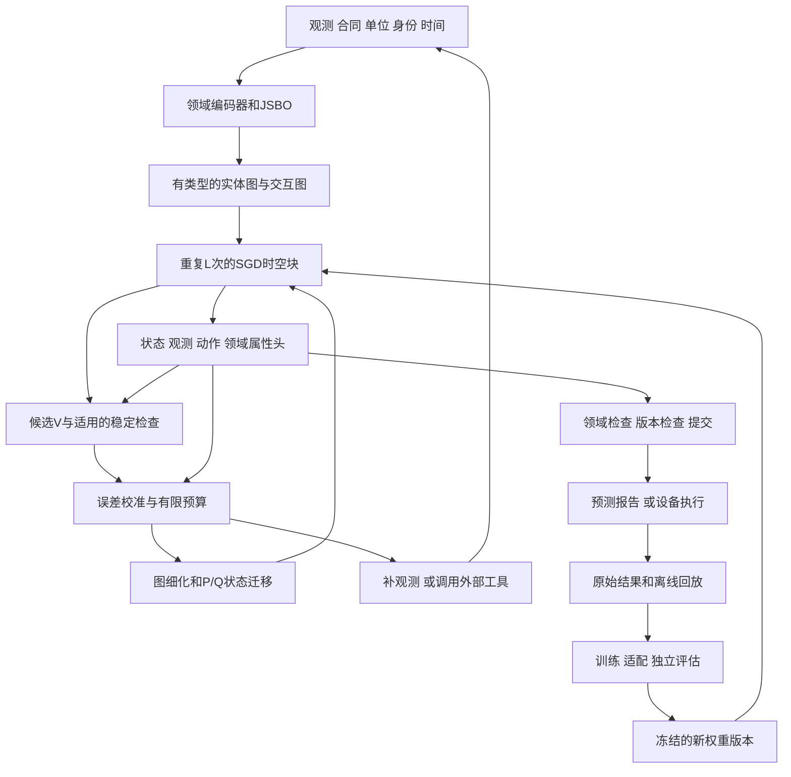

# 3. 系统连接图

图中反馈边具有不同时间含义：R 不推进真实时间；Q 可能等待新的物理测量；G 生成候选权重，经过约定验证与版本发布后生效；可包含受限在线适配和离线巩固。D/E 是神经前向；L 含可训练 V 及条件检查/修正，H 属于外部运行时。

---

[← 上一页](section-03.md) · [全书目录](../../../SUMMARY.md) · [下一页 →](section-05.md)
