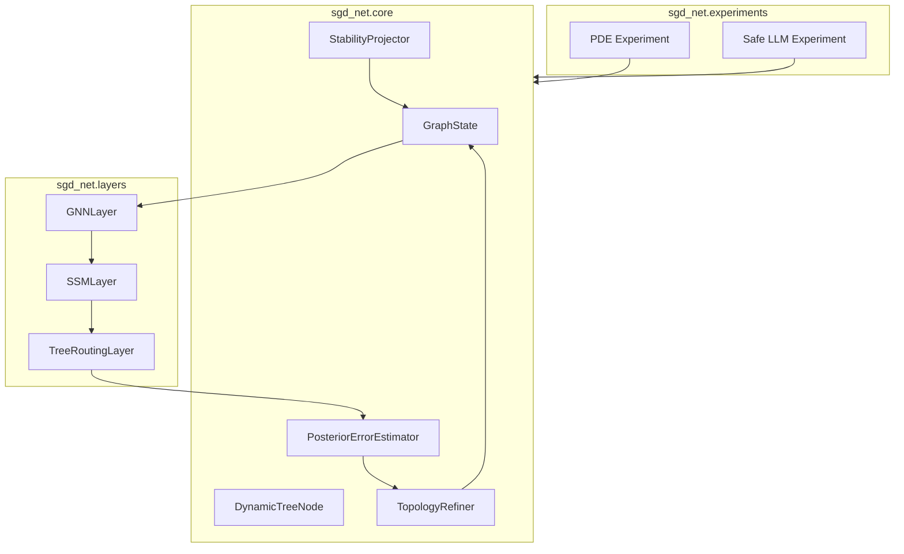

# SGD-Net Python Implementation Technical White Paper

> Public research edition · 2026-09-12. Model methods, formulas, and component designs are retained. This document describes a research proposal and does not claim existing training results, a complete implementation, or chip performance. Chapter numbering follows the original research index; gaps indicate separate planning material not published in this package.

> Document type: Technical white paper\
> Version: v0.1\
> Date: 2026-06-07\
> Audience: R&D leads, algorithm engineers, scientific computing engineers, and trustworthy AI engineering teams

**Contents on this page**

- [1. Executive Summary](#section-001)
- [2. Development Objectives](#section-002)
- [3. Application Scenarios](#section-005)
- [4. Core Technical Roadmap](#section-009)
- [5. Recommended System Architecture](#section-014)
- [6. Key Algorithms](#section-015)
- [7. Recommended Data Structures](#section-018)
- [8. Engineering Quality Requirements](#section-022)
- [9. Risks and Mitigations](#section-026)
- [10. Recommended Milestones](#section-027)
- [11. Conclusion](#section-028)
- [12. Phase-Two Extension Roadmap](#section-029)
- [13. Updated Engineering Priorities](#section-037)

---

## 1. Executive Summary 

SGD-Net (State-space Graph-Dynamic Tree Network) is a new AI architecture combining state-space models, graph neural networks, and dynamic adaptive decision trees. Its Python implementation aims to build an experimental platform that can dynamically expand graph topology, perform local node-level splits, assess posterior error, and apply stability projection, rather than simply reproduce an ordinary neural network layer.

This white paper proposes an implementation path from a `NumPy` proof-of-concept prototype to a trainable `PyTorch / PyTorch Geometric` version, and then to a research system for PDE and trustworthy reasoning tasks.

## 2. Development Objectives 

### 2.1 Overall Objective 

Build a reproducible, extensible, testable Python experimental framework to validate three core SGD-Net capabilities:

1. **State recurrence**: maintain long-range state with an SSM; connect a separate IM solver component when implicit physical time stepping or a fixed-point layer is needed.
2. **Topological constraints**: propagate information within graph adjacency boundaries using a GNN.
3. **Structural adaptation**: use dynamic trees to propose split, pruning, and topology reconstruction candidates based on matched error, attribution, and budgets.

### 2.2 Phased Objectives 

| Phase | Objective | Technology stack |
|---|---|---|
| P0 | Runnable proof-of-concept prototype | Python + NumPy |
| P1 | Testable research prototype | NumPy + pytest |
| P2 | Differentiable training version | PyTorch |
| P3 | Graph batching version | PyTorch Geometric |
| P4 | Validation in both PDE / Safe LLM scenarios | PyTorch + PyG + experiment scripts |

## 3. Application Scenarios 

### 3.1 Scientific Computing 

- Adaptive PDE solving;
- Identification of shocks, crack tips, and locally singular fields;
- Hybrid neural operator and finite element methods;
- Surrogate models for coupled multiphysics.

### 3.2 Trustworthy AI / Safe Large Models 

- Fact-graph-constrained reasoning;
- Verification of multi-hop logical paths;
- Preservation of causal state over long contexts;
- Detection, isolation, and rollback of poisoned inputs.

### 3.3 Anomaly Detection and Dynamic Graph Learning 

- Isolation of anomaly propagation in sensor networks;
- Blocking risk paths in financial transaction graphs;
- Adaptive state monitoring in industrial systems.

## 4. Core Technical Roadmap 

### 4.1 NumPy Prototype 

The NumPy prototype primarily validates data structures and algorithm flow:

- Represent node feature matrix `X` with a two-dimensional array;
- Represent adjacency matrix `A` with a two-dimensional array;
- Represent dynamic tree nodes with Python classes;
- Propose refinement candidates using matched residuals and attribution;
- Simulate stability projection using SVD clipping.

It is suitable for quickly checking:

- Whether topology expansion is correct;
- Whether old-node isolation takes effect;
- Whether new nodes inherit neighborhoods;
- Whether residual thresholds trigger candidate evaluation only;
- Whether spectral clipping limits feature explosion.

### 4.2 Differentiable PyTorch Version 

The PyTorch version needs to turn core operators into trainable modules:

- Replace `numpy.ndarray` with `torch.Tensor`;
- Use sigmoid / Gumbel-Softmax for dynamic tree gating;
- Use a trainable parameterization for the SSM layer;
- Support backpropagation through GNN message passing;
- Implement numerical regularization as a post-training hook or constraint layer; separately check the applicability conditions of the entire update mapping before drawing stability conclusions.

### 4.3 PyTorch Geometric Graph Batching Version 

As graph node counts change dynamically, adjacency matrices become inefficient. The PyG version should use:

- `edge_index` for sparse graph edges;
- `Data` / `Batch` to manage individual and multiple graphs;
- `MessagePassing` for custom message functions;
- Updates to `edge_index` and node features after dynamic remeshing.

### 4.4 Application Layer for Two Scenarios 

The application layer contains two experimental tasks:

1. PDE experiment: inputs are spatial sample points, boundary conditions, and a target physical field; outputs are an approximate solution and residual map.
2. Safe LLM experiment: inputs are a fact graph and reasoning request; outputs are an interpretable reasoning path, anomaly isolation records, and an answer.

## 5. Recommended System Architecture 

## 6. Key Algorithms 

### 6.1 Evidence-Driven Candidate Growth 

1. Execute GNN, SSM, routing, and prediction on the active version in event-time order, saving the inputs available at prediction time.
2. When actual outcomes arrive, match them by entity, time, and prediction version; preserve unknown status when outcomes are absent, without using future targets.
3. Distinguish observation noise, missing observations, discretization error, and insufficient capacity; persistent error produces candidate actions only.
4. Explicitly distinguish the representation / expert / candidate tree modes; an entity graph cannot arbitrarily split real atoms or mechanical links.
5. Update topology on an isolated candidate, migrating node features at every layer, SSM states, trees, masks, the optimizer, and executable layout.
6. Check benefits, old-task regressions, numerical conditions, and budgets using holdout or temporal forward validation. Automatically accept between windows if checks pass; otherwise discard the candidate.

This process allows constrained online learning without requiring manual approval each time; larger-scale consolidation can be performed offline.

### 6.2 Stability Projection 

SVD clipping can be used initially:

$$
X=U\Sigma V^T,\quad \Sigma'=\min(\Sigma, s_{max}),\quad X'=U\Sigma'V^T
$$

This operation constrains only the singular values of the clipped matrix. It cannot prove stability of the entire nonlinear, time-varying, or closed-loop system; measurement coordinates with physical units must not be clipped directly.

Possible subsequent extensions include:

- Weight spectral normalization;
- Gradient norm clipping;
- Lyapunov energy-decrease constraints;
- Projection onto fact-graph boundary constraints;
- Local subgraph rollback.

## 7. Recommended Data Structures 

### 7.1 GraphState 

Stores dynamic graph state:

- `x`: node features;
- `edge_index` or `adjacency`: graph edges;
- `node_trees`: mapping from nodes to dynamic trees;
- `active_mask`: whether each node is active;
- `lineage`: parent-child node lineage;
- `metadata`: scenario-specific information.

### 7.2 DynamicTreeNode 

Stores the internal tree structure of a node:

- `depth`;
- `max_depth`;
- `split_feature`;
- `threshold`;
- `left_child`;
- `right_child`;
- `local_bias`;
- `status`.

### 7.3 ErrorReport 

Stores posterior error results:

- `node_id`;
- `residual`;
- `triggered`;
- `reason`;
- `suggested_action`.

## 8. Engineering Quality Requirements 

### 8.1 Reproducibility 

- Support seeds for all random numbers;
- Write all experiment configurations to YAML / JSON;
- Output node growth logs and residual curves;
- Save model and graph topology snapshots.

### 8.2 Testability 

- Unit tests cover dynamic tree splits;
- Unit tests cover adjacency matrix expansion;
- Unit tests cover old-node isolation;
- Unit tests cover spectral clipping;
- Integration tests cover the complete split-refine-project process.

### 8.3 Extensibility 

- Core interfaces are not tied to NumPy or PyTorch;
- Posterior error estimators are pluggable;
- Topology reconstruction strategies are pluggable;
- Stability projection strategies are pluggable;
- Application scenarios connect through adapters.

## 9. Risks and Mitigations 

| Risk | Impact | Mitigation |
|---|---|---|
| Dynamic graphs complicate batching | Lower training efficiency | Prefer PyG sparse edge representations |
| Hard decision-tree splits are nondifferentiable | Difficult end-to-end training | Use soft gating or a straight-through estimator |
| Theoretical assumptions are too strong | Paper claims are difficult to substantiate | Define the assumption scope and supplement with experimental validation |
| Insufficient fact-graph quality | Limited Safe LLM effectiveness | Introduce retrieval, verification, and confidence scoring |
| Unbounded node growth | Uncontrolled memory use | Set maximum depth, budgets, and pruning strategies |

## 10. Recommended Milestones 

1. Complete the NumPy prototype and basic tests within two weeks.
2. Complete the differentiable PyTorch version within four weeks.
3. Complete the PyG sparse graph version within six weeks.
4. Complete a small PDE experiment within eight weeks.
5. Complete a small Safe LLM experiment within ten weeks.
6. Produce paper experiment results and supplementary patent embodiment material within twelve weeks.

## 11. Conclusion 

The core value of the SGD-Net Python implementation is to turn the original concept into a runnable, observable, testable dynamic-topology neural computing platform. The first phase should avoid directly pursuing large-model scale. It should start with small graphs, small PDEs, and small fact graphs, prioritizing validation of whether “posterior-error-driven splitting + topology reconstruction + stability projection” forms a closed loop.

## 12. Phase-Two Extension Roadmap 

The newly selected documents extend SGD-Net to scientific large models, research agents, and hardware acceleration. Once the phase-one core loop is stable, the Python implementation should add the following phase-two modules.

### 12.1 Biological Structure Adapters 

Add the `sgd_net.bio` package to ingest outputs from models such as AlphaFold 3, RFdiffusion, and ESMFold.

Suggested modules:

- `parsers.py`: parse mmCIF, PDB, FASTA, and SMILES;
- `graph_builder.py`: construct a heterogeneous graph of residues, atoms, ligands, ions, and modified residues;
- `posterior_errors.py`: compute posterior errors involving pLDDT/PAE/ipTM, clashes, chirality, pockets, and related indicators;
- `local_refiner.py`: output resampling or refinement suggestions for local high-error regions;
- `adapters/alphafold3.py`, `adapters/rfdiffusion.py`, and `adapters/esmfold.py`: adapt outputs from different models.

### 12.2 Research Agent Adapters 

Add the `sgd_net.agent` and `sgd_net.materials` packages to support `SGD-Scientist`.

Suggested modules:

- `state_tracker.py`: maintain research task state across rounds;
- `research_graph.py`: construct graphs of literature, materials, simulations, experiments, and characterization;
- `experiment_tree.py`: manage dynamic trees of candidate materials and experimental paths;
- `active_learning.py`: select the next batch of experiments based on posterior error;
- `vasp_adapter.py`, `xrd_analyzer.py`, and `sem_analyzer.py`: ingest materials simulation and characterization data.

### 12.4 Dual-Loop Control and Cognition Modules 

According to the original discussion material (not included in this package), the Python implementation should also add `sgd_net.control` and `sgd_net.cognition` packages to support feedforward prediction, posterior feedback, source monitoring, and knowledge classification.

Suggested modules:

- `feedforward_predictor.py`: predict future high-risk regions from the current GraphState/SSM state;
- `posterior_corrector.py`: perform correction, rollback, and refinement using actual posterior error;
- `control_arbiter.py`: determine precedence between feedforward plans and feedback circuit breaking;
- `memory_manager.py`: manage long-, medium-, short-term, and instantaneous memory;
- `source_monitor.py`: record source tags for real experiments, simulation, literature, prediction, others' experience, and so on;
- `knowledge_ontology.py`: distinguish locally correct experience, locally incorrect lessons, and unverified knowledge;
- `shadow_graph.py`: maintain a low-confidence shadow graph-tree isolation area.

### 12.5 SGD-Ecosystem Interfaces 

To bring SGD-Net into a real scientific closed loop, add the `sgd_net.ecosystem`, `sgd_net.twin`, and `sgd_net.synapse` packages.

Suggested modules:

- `lab_tokens.py`: uniformly represent experimental actions, instrument observations, samples, and safety events;
- `actuator_interface.py`: connect robotic arms, synthesis equipment, and test instruments;
- `sensor_interface.py`: connect multimodal acquisition such as XRD/SEM/TEM/Raman/EIS;
- `world_model.py`: differential digital twin interface;
- `stochastic_rollout.py`: sandbox rehearsal with perturbations;
- `dual_track_graph.py`: dual-track graph of virtual simulations and real experiments;
- `cross_domain_error.py`: compute virtual-real posterior error;
- `promotion_engine.py`: promote hypotheses to experience, downgrade them to lessons, or isolate them.

### 12.7 SGD-Retrospection: Retrospective Analysis and Self-Evolution Modules 

According to the original discussion material (not included in this package), the Python implementation should also add the `sgd_net.retrospection` package to dynamically organize posterior error, event logs, multilevel memory, and knowledge classification into fast reasoning mechanisms.

Suggested modules:

- `event_recorder.py`: record surprise error, control actions, sources, stability changes, and computational cost;
- `replay_buffer.py`: manage online/offline experience buffers;
- `hotness_clustering.py`: identify frequent, high-benefit, low-error processing paths;
- `memory_consolidator.py`: integrate memory across levels and extract causal skeletons;
- `counterfactual_generator.py`: generate counterfactual perturbations and extreme operating conditions;
- `retrospection_compiler.py`: compile expensive explicit processing into fast reasoning candidates;
- `fast_path_registry.py`: manage consolidated fast reasoning paths;
- `decay_pruner.py`: perform active forgetting, path decay, pruning, compression, and archiving.

### 12.8 JEPA / JSBO World-Model Bridge Modules 

According to the original discussion material (not included in this package), the Python implementation should also add the `sgd_net.jepa_bridge` package to ingest latent representations from I-JEPA, V-JEPA, or other self-supervised world models and convert them into `GraphState`, `PhysicalState`, or `BridgeState` consumable by SGD-Net.

Suggested modules:

- `jepa_adapter.py`: ingest external JEPA encoder / predictor outputs;
- `latent_tensor.py`: define `JEPALatentTensor`, storing latent, mask, position, action, and source metadata;
- `bridge_operator.py`: implement the main mapping $$\Psi_{bridge}:\mathcal{H}_{J}\rightarrow\mathcal{M}_{SGD}$$;
- `metric_pullback.py`: implement metric pullback from structure space to latent space;
- `koopman_projector.py`: implement Koopman consistency and spectral stability monitoring;
- `symplectic_projector.py`: implement symplectic structure residuals in Hamiltonian scenarios, reducing to Lyapunov/energy constraints in dissipative scenarios;
- `physical_cost.py`: connect PPU/PDE/energy residual costs;
- `collapse_regularizer.py`: implement VICReg/SIGReg-style variance, covariance, and rank monitoring;
- `jsbo_compiler.py`: lower JSBO to SGD-IR;
- `narrative_adapter.py`: optional, to transfer Retrospection's offline dream consolidation to a narrative creation mode.

### 12.9 Application-First and Simulator Substitution Loop Modules 

According to the plan in `SGD-Net应用先行与模拟器闭环/`, the Python implementation should also add `sgd_net.runtime`, `sgd_net.backends`, and `sgd_net.trace`: first run real applications on third-party chips or CPU/GPU baselines, then pass the same workload trace to the SGD-TPU simulator/CModel for shadow execution.

Suggested modules:

- `runtime/backend_registry.py`: register CPU, CUDA, ROCm, TPU/NPU, SGD-TPU simulator, and hybrid backends;
- `runtime/placement_planner.py`: select execution placement based on op type, backend capability, safety policy, and profile;
- `runtime/shadow_executor.py`: primary execution on the vendor backend and side-path replay on the SGD-TPU simulator;
- `runtime/fallback_manager.py`: manage CPU/vendor/PPU/simulator fallback;
- `trace/workload_trace.py`: record AppTrace, OpTrace, BackendTrace, MemoryTrace, and ControlTrace;
- `trace/replay_bundle.py`: generate bundles replayable by the CModel/Simulator;
- `backends/cpu_reference.py`: functional gold standard and conservative fallback;
- `backends/vendor_cuda.py`, `vendor_rocm.py`, and `vendor_npu.py`: third-party chip baseline adapters;
- `backends/sgd_tpu_sim.py`: connect the simulator backend of `SGD-TPU模拟器与CModel`;
- `profiling/bottleneck_analyzer.py`: compare vendor/simulator and output roofline, PGO, and hardware specification suggestions.

## 13. Updated Engineering Priorities 

A progressive roadmap is recommended:

1. First priority: the core NumPy/PyTorch/PyG loop.
2. Second priority: biological structure output diagnostics, because they can directly reuse existing model outputs without retraining large models.
3. Third priority: materials research agents, because they require more data interfaces and experimental workflow design.
4. Fourth priority: dual-loop control and source monitoring, because they can improve trustworthiness and auditability in every scenario.
5. Fifth priority: the dynamic reasoning acceleration runtime and profiling, because they support SGD-Net state caching, incremental reasoning, posterior-error-triggered refinement, and dynamic tree splitting/pruning/rollback—the engineering foundation for “learning, practicing, and improving together.”
6. Sixth priority: the SGD-Retrospection runtime, which organizes, distills, and consolidates commonly used trustworthy complex processing paths into fast reasoning mechanisms while actively forgetting low-value paths.
7. Seventh priority: the application-first and simulator substitution loop, which first establishes real application baselines on third-party chips and then replays real traces on the SGD-TPU simulator, keeping hardware design aligned with workloads.
8. Eighth priority: the JEPA / JSBO world-model bridge, which can reuse external self-supervised visual/video/multimodal representations, but must first validate the identifiability of the latent-to-physical/topological-manifold mapping in software.
9. Ninth priority: SGD-Accelerator soft-IP / SGD-TPU profiling, because hardware acceleration should be based on clearly defined workloads.
10. Tenth priority: the SGD-XPU software simulator, which can validate digital twin operator partitioning and data paths without fabrication.
11. Eleventh priority: the real wet-lab/digital-twin ecosystem loop, because it requires equipment interfaces, safety governance, and external collaboration.

In the near term, direct development of a complete automated laboratory, PPU, or SGD-XSoC ASIC is not recommended, nor is a promise of “one-click universal JEPA physicalization.” First complete the observable software loop, application-first MVP, third-party chip baseline, dynamic reasoning acceleration runtime, retrospective analysis runtime, small-scale identifiable JSBO experiments, measurable benchmarks, and XPU-level workload profiling.

---

[← Previous](15.md) · [Book contents](../SUMMARY.md) · [Next →](04.md)
