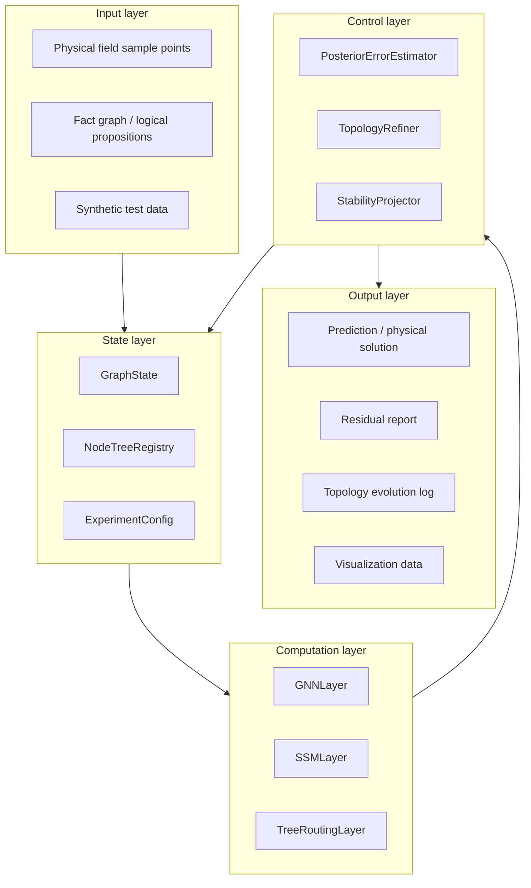
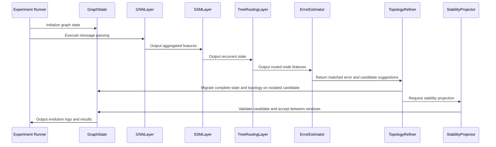

# SGD-Net Python Implementation High-Level Design

> Public research edition · 2026-09-12. Model methods, formulas, and component designs are retained. This document describes a research proposal and does not claim existing training results, a complete implementation, or chip performance. Chapter numbering follows the original research index; gaps indicate separate planning material not published in this package.

> Document type: High-level design\
> Version: v0.1\
> Date: 2026-06-07

**Contents on this page**

- [1. System Positioning](#section-001)
- [2. Design Objectives](#section-002)
- [3. Non-Goals](#section-005)
- [4. Overall Architecture](#section-006)
- [5. Module Breakdown](#section-007)
- [6. Data Flow](#section-012)
- [7. Key Interface Overview](#section-013)
- [8. Configuration Design](#section-018)
- [9. Logging and Observability](#section-019)
- [10. Design Constraints](#section-020)
- [11. Execution Modes](#section-021)
- [12. Acceptance Criteria](#section-024)
- [13. Extension Module Design](#section-025)
- [14. Extended Data Flow](#section-036)

---

## 1. System Positioning <a href="#section-001" id="section-001"></a>

The SGD-Net Python implementation is a research framework for dynamic-topology neural networks, intended to validate the feasibility of the `SSM + GNN + dynamic adaptive decision tree` architecture for scientific computing and trustworthy reasoning.

The system targets reproducible experiments, algorithm validation, and material for papers/patent embodiments, rather than production deployment in its first phase.

## 2. Design Objectives <a href="#section-002" id="section-002"></a>

### 2.1 Functional Objectives <a href="#section-003" id="section-003"></a>

- Support construction of dynamic graph state;
- Support graph message passing;
- Support simplified explicit SSM state recurrence;
- Support dynamic tree routing inside nodes;
- Support posterior error estimation;
- Support node splitting, adjacency matrix expansion, and old-node isolation;
- Support stability projection;
- Support logging, visualization, and testing.

### 2.2 Nonfunctional Objectives <a href="#section-004" id="section-004"></a>

- Reproducible;
- Testable;
- Decoupled modules;
- Easy migration to PyTorch / PyG;
- Convenient preparation of paper experiments and patent embodiments.

## 3. Non-Goals <a href="#section-005" id="section-005"></a>

The first phase does not pursue:

- Direct training of large language models;
- Direct replacement of mature finite element software;
- Distributed large-scale GPU training;
- Web services;
- A formal product-grade UI.

## 4. Overall Architecture <a href="#section-006" id="section-006"></a>



## 5. Module Breakdown <a href="#section-007" id="section-007"></a>

### 5.1 `sgd_net.core` <a href="#section-008" id="section-008"></a>

Handles core data structures and algorithm control.

| Module | Responsibility |
|---|---|
| `graph_state.py` | Dynamic graph state management |
| `dynamic_tree.py` | Dynamic tree nodes and splitting logic |
| `error_estimator.py` | Posterior error estimation interface |
| `topology_refiner.py` | Graph topology expansion, inheritance, and isolation |
| `stability_projector.py` | Spectral clipping, norm constraints, and stability projection |

### 5.2 `sgd_net.layers` <a href="#section-009" id="section-009"></a>

Handles replaceable computation layers.

| Module | Responsibility |
|---|---|
| `gnn.py` | Graph message passing |
| `ssm.py` | Explicit state-space recurrence |
| `tree_routing.py` | Dynamic tree routing and local correction |

### 5.3 `sgd_net.experiments` <a href="#section-010" id="section-010"></a>

Handles experiment entry points.

| Module | Responsibility |
|---|---|
| `pde_demo.py` | PDE residual-driven splitting experiment |
| `safe_llm_demo.py` | Fact-graph reasoning and anomaly isolation experiment |
| `synthetic_demo.py` | Small synthetic graph test |

### 5.4 `tests` <a href="#section-011" id="section-011"></a>

Handles testing.

| Test | Coverage |
|---|---|
| `test_dynamic_tree.py` | Tree routing and splitting |
| `test_topology_refiner.py` | Adjacency matrix expansion and isolation |
| `test_stability_projector.py` | SVD clipping and norm constraints |
| `test_end_to_end.py` | Complete refinement process |

## 6. Data Flow <a href="#section-012" id="section-012"></a>



## 7. Key Interface Overview <a href="#section-013" id="section-013"></a>

### 7.1 GraphState <a href="#section-014" id="section-014"></a>

```text
GraphState:
  x: node feature matrix
  adjacency or edge_index: graph edges
  node_trees: dynamic tree list
  active_mask: active node mask
  lineage: node lineage
```

### 7.2 ErrorEstimator <a href="#section-015" id="section-015"></a>

```text
estimate(prediction_record, matched_observation_or_none, constraints) -> ErrorReport
```

### 7.3 TopologyRefiner <a href="#section-016" id="section-016"></a>

```text
propose_and_migrate(snapshot, report, strategy, budget) -> CandidateBundle
```

### 7.4 StabilityProjector <a href="#section-017" id="section-017"></a>

```text
check_and_regularize(candidate, stability_contract) -> CandidateAndCheckResult
```

## 8. Configuration Design <a href="#section-018" id="section-018"></a>

YAML or dataclasses are recommended for configuration management:

```text
model:
  feature_dim: 16
  initial_nodes: 32
  max_tree_depth: 4
  split_threshold: 0.5

stability:
  svd_clip: 5.0
  max_feature_norm: 10.0

experiment:
  seed: 42
  steps: 100
  log_every: 10
```

## 9. Logging and Observability <a href="#section-019" id="section-019"></a>

The system should record:

- Mean and maximum residual in each round;
- IDs of split nodes;
- Number of added nodes;
- Old-node isolation records;
- Feature norms and spectral radius;
- Graph edge count;
- Random seeds and configuration snapshots.

## 10. Design Constraints <a href="#section-020" id="section-020"></a>

1. Dynamic node growth must be bounded to prevent uncontrolled memory use.
2. Splitting strategies must be pluggable to compare different posterior error criteria.
3. Stability projection must be switchable off for ablation experiments.
4. Graph structures should support migration from dense adjacency matrices to sparse edge representations.
5. All core paths must have test coverage.

## 11. Execution Modes <a href="#section-021" id="section-021"></a>

### 11.1 Local Research Execution <a href="#section-022" id="section-022"></a>

- Single-process Python;
- NumPy or PyTorch CPU;
- Small graphs;
- Markdown/CSV/JSON log output.

### 11.2 GPU Research Execution <a href="#section-023" id="section-023"></a>

- PyTorch;
- PyG;
- Sparse graph batching;
- TensorBoard or wandb support.

## 12. Acceptance Criteria <a href="#section-024" id="section-024"></a>

After the high-level design stage, the following questions should be answerable:

- Which modules does the system contain?
- How does data flow between modules?
- Which interfaces must remain stable?
- How can posterior error estimation and stability projection strategies be replaced?
- How can the NumPy prototype migrate to PyTorch / PyG?

## 13. Extension Module Design <a href="#section-025" id="section-025"></a>

To support the scientific large-model, research-agent, and hardware-acceleration directions in the newly selected documents, the following modules are suggested in addition to the existing `core/layers/experiments`.

### 13.1 `sgd_net.bio` <a href="#section-026" id="section-026"></a>

Handles ingestion of biomolecular structure model outputs.

| Module | Responsibility |
|---|---|
| `parsers.py` | Parse inputs such as mmCIF, PDB, FASTA, and SMILES |
| `bio_graph.py` | Construct residue/atom/ligand/ion heterogeneous graphs |
| `bio_error.py` | Compute structural confidence, geometry violations, and interface residuals |
| `fold_adapter.py` | Adapt AlphaFold 3 / ESMFold outputs |
| `design_adapter.py` | Adapt RFdiffusion candidate structures |

### 13.2 `sgd_net.agent` <a href="#section-027" id="section-027"></a>

Handles multimodal research agent state and decisions.

| Module | Responsibility |
|---|---|
| `state_tracker.py` | Long-term research state and project context |
| `research_graph.py` | Multimodal graphs of literature, experiments, simulations, and materials |
| `experiment_tree.py` | Dynamic trees of candidate experimental paths |
| `active_learning.py` | Next-round experiment selection strategies |
| `evidence_store.py` | Evidence chains, citations, and data lineage |

### 13.3 `sgd_net.materials` <a href="#section-028" id="section-028"></a>

Handles data interfaces for materials discovery.

| Module | Responsibility |
|---|---|
| `cif_parser.py` | Crystal structure parsing |
| `vasp_adapter.py` | VASP/DFT output ingestion |
| `xrd_analyzer.py` | XRD spectral peak parsing |
| `sem_analyzer.py` | SEM image feature ingestion |
| `phase_diagram.py` | Phase diagrams and stability constraints |

### 13.4 `sgd_net.hardware` <a href="#section-029" id="section-029"></a>

Handles preliminary SGD-TPU profiling and simulation.

| Module | Responsibility |
|---|---|
| `scan_profiler.py` | SSM scan workload statistics |
| `sparse_router.py` | GNN/MoE sparse routing simulation |
| `tree_pruning.py` | Dynamic tree pruning cost analysis |
| `stability_ops.py` | SVD/QR stability projection operator statistics |
| `moe_compat.py` | Transformer-MoE compatibility analysis |

### 13.5 `sgd_net.control` and `sgd_net.cognition` <a href="#section-030" id="section-030"></a>

Handle dual-loop control, brain-inspired hierarchical memory, source monitoring, and knowledge classification.

| Module | Responsibility |
|---|---|
| `feedforward_predictor.py` | Predict future high-risk regions through feedforward computation and generate pre-splitting/pre-routing plans |
| `posterior_corrector.py` | Perform correction, rollback, isolation, and refinement based on posterior error |
| `control_arbiter.py` | Arbitrate between feedforward plans and posterior feedback actions |
| `memory_manager.py` | Manage long-, medium-, short-term, and instantaneous memory |
| `source_monitor.py` | Record source tags for reality, simulation, prediction, literature, others' experience, and so on |
| `knowledge_ontology.py` | Manage state transitions among experience, lessons, and unverified hypotheses |
| `shadow_graph.py` | Maintain a low-confidence shadow graph-tree isolation area |

### 13.6 `sgd_net.ecosystem`, `sgd_net.twin`, and `sgd_net.synapse` <a href="#section-031" id="section-031"></a>

Handle SGD-Net interfaces to real experiments, digital twins, and bidirectional virtual-real correction systems.

| Module | Responsibility |
|---|---|
| `lab_tokens.py` | Uniformly represent experimental actions, observations, samples, and safety events |
| `actuator_interface.py` | Abstract robotic arms and laboratory equipment |
| `sensor_interface.py` | Abstract instrument inputs such as XRD/SEM/TEM/EIS |
| `world_model.py` | Differential digital twin state advancement |
| `stochastic_rollout.py` | Sandbox perturbation simulation and robustness evaluation |
| `dual_track_graph.py` | Construct a virtual-real dual-track manifold graph |
| `cross_domain_error.py` | Compute posterior error between simulations and real experiments |
| `promotion_engine.py` | Manage hypothesis promotion, falsification, and consolidation of lessons |

### 13.7 `sgd_net.xpu` <a href="#section-032" id="section-032"></a>

Handles software simulation, task partitioning, and profiling for SGD-XPU / SGD-XSoC.

| Module | Responsibility |
|---|---|
| `device_model.py` | Abstract heterogeneous devices such as CPU/Fabric, PPU, SGD-TPU, and GPU fallback |
| `operator_catalog.py` | Define operator types such as fp64_sparse_solve, scan, sparse_message, sensor_dma, and render |
| `xpu_scheduler.py` | Allocate devices according to operator type, precision, and real-time requirements |
| `ppu_simulator.py` | Simulate PPU FP64 PDE, sparse matrix, and boundary-condition workloads |
| `fabric_runtime.py` | Simulate CXL/NoC/unified virtual memory and zero-copy buffers |
| `xpu_profiler.py` | Output latency, bandwidth, energy, data movement, and device utilization statistics |
| `xsoc_planner.py` | Evaluate Chiplet/SoC partitioning, interconnect, and memory requirements |

### 13.8 `sgd_net.retrospection` <a href="#section-033" id="section-033"></a>

Handles retrospective analysis, dynamic organization, fast-path consolidation, and active forgetting.

| Module | Responsibility |
|---|---|
| `event_recorder.py` | Record surprise error, control actions, sources, stability, and computational cost |
| `replay_buffer.py` | Manage online event buffers and offline replay data |
| `hotness_clustering.py` | Identify frequently used processing paths by invocation frequency, benefit, trustworthiness, and stability |
| `memory_consolidator.py` | Extract causal skeletons and reusable skills from multilevel memory |
| `counterfactual_generator.py` | Generate counterfactual perturbations and extreme-condition samples |
| `retrospection_compiler.py` | Convert expensive explicit processing into fast reasoning candidates |
| `fast_path_registry.py` | Register, validate, enable, or isolate fast reasoning paths |
| `decay_pruner.py` | Perform active forgetting, path decay, compression, archiving, and pruning |

### 13.9 `sgd_net.jepa_bridge` <a href="#section-034" id="section-034"></a>

Handles ingestion of external JEPA / I-JEPA / V-JEPA world-model latent spaces and their conversion through JSBO into structure-preserving SGD-Net states.

| Module | Responsibility |
|---|---|
| `jepa_adapter.py` | Adapt external JEPA encoders, predictors, and mask/action metadata |
| `latent_tensor.py` | Define `JEPALatentTensor` and its source, position, action, and confidence fields |
| `bridge_operator.py` | Execute the main latent-space mapping to `GraphState` / `PhysicalState` |
| `metric_pullback.py` | Estimate the structure-space metric and pull it back to JEPA latent space |
| `koopman_projector.py` | Perform Koopman consistency and spectral monitoring |
| `symplectic_projector.py` | Perform symplectic-structure, Lyapunov, or energy-constraint projection |
| `physical_cost.py` | Connect PPU, PDE residual, and physical energy costs |
| `collapse_regularizer.py` | Monitor representation variance, covariance, rank, and collapse risk |
| `jsbo_compiler.py` | Lower JSBO operators to SGD-IR |
| `narrative_adapter.py` | Optional: transfer dream consolidation to a narrative creation subsystem |

### 13.10 `sgd_net.runtime`, `sgd_net.backends`, and `sgd_net.trace` <a href="#section-035" id="section-035"></a>

Handle the application-first approach, third-party chip baselines, the SGD-TPU simulator shadow backend, and the trace replay loop.

| Module | Responsibility |
|---|---|
| `runtime/backend_registry.py` | Register and query CPU, vendor, simulator, and hybrid backend capabilities |
| `runtime/placement_planner.py` | Generate a `PlacementPlan` mapping ops to backends |
| `runtime/shadow_executor.py` | Execute vendor-primary + simulator-shadow dual-track operation |
| `runtime/fallback_manager.py` | Handle unsupported ops, low-confidence outputs, and safe fallback |
| `runtime/safety_supervisor.py` | Manage reference checks, quarantine, and auditing for high-risk ops |
| `backends/cpu_reference.py` | CPU functional gold standard and conservative fallback |
| `backends/vendor_cuda.py` / `vendor_rocm.py` / `vendor_npu.py` | Third-party chip baseline adapters |
| `backends/sgd_tpu_sim.py` | Connect the SGD-TPU Simulator / CModel backend |
| `trace/workload_trace.py` | Collect AppTrace, OpTrace, BackendTrace, MemoryTrace, and ControlTrace |
| `trace/replay_bundle.py` | Generate reproducible replay bundles |
| `profiling/bottleneck_analyzer.py` | Generate vendor/simulator gaps, roofline analysis, and PGO suggestions |

## 14. Extended Data Flow <a href="#section-036" id="section-036"></a>

The extended system may have several input streams:

1. Original small PDE / Safe LLM experiment inputs;
2. Biological structure model outputs such as AF3 / ESMFold / RFdiffusion;
3. Multimodal research agent inputs such as literature, DFT, XRD, SEM, and experiment logs;
4. Control and cognition inputs such as feedforward prediction plans, posterior error reports, source tags, and shadow knowledge states;
5. Ecosystem loop inputs such as digital twin rollouts, wet-lab LabTokens, and virtual-real cross-domain errors;
6. Hardware profiling inputs such as scan traces, sparse edge traces, and MoE routing traces;
7. XPU system inputs such as FP64 sparse solve traces, sensor DMA traces, CXL buffer traces, and render mesh stream traces;
8. Retrospective analysis inputs such as surprise events, replay traces, hot paths, forget plans, and fast path candidates.
9. JEPA/world-model inputs such as context/target embeddings, latent predictions, mask specs, action-conditioned latent traces, and JSBO bridge reports.
10. Application-first loop inputs such as vendor backend profiles, simulator shadow replay, backend diffs, fallback events, PGO suggestions, and hardware specification feedback.

All these inputs should ultimately be converted to a unified `GraphState + StateTrace + ErrorReport` triple to prevent fragmentation across application scenarios.

---

[← Previous](03.md) · [Book contents](../SUMMARY.md) · [Next →](05.md)
