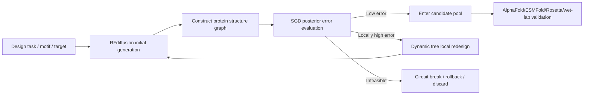

# SGD-Net for Scientific Large Models: AlphaFold 3, RFdiffusion, and ESMFold

> Public research edition · 2026-09-12. Model methods, formulas, and component designs are retained. This document describes a research proposal and does not claim existing training results, a complete implementation, or chip performance. Chapter numbering follows the original research index; gaps indicate separate planning material not published in this package.

> Version: v1.0\
> Date: 2026-06-07\
> Sources: original discussion material (not included in this package) and original discussion material (not included in this package), combined with public material on the architectures and limitations of AlphaFold 3, RFdiffusion, ESMFold, and Mamba/SSM diffusion models.

**Contents on this page**

- [1. Research Positioning](#section-001)
- [2. Public Technical Background](#section-002)
- [3. Overall Augmentation Framework](#section-007)
- [4. SGD-Fold: Augmenting AlphaFold 3](#section-008)
- [5. SGD-Design: Augmenting RFdiffusion](#section-013)
- [6. SGD-ESM: Augmenting ESMFold and Protein Language Models](#section-017)
- [7. Experimental Validation Roadmap](#section-020)
- [8. Risks and Boundaries](#section-024)
- [9. Suggested Engineering Modules](#section-025)
- [10. Reference Index](#section-026)
- [11. Conclusion](#section-027)
- [2026-09-12 Extension and Applicability Calibration](#section-028)

---

## 1. Research Positioning <a href="#section-001" id="section-001"></a>

This study addresses a central question: **Can SGD-Net serve as a “structure-preserving augmentation layer” for scientific large models, improving life science, chemistry, and materials models such as AlphaFold 3, RFdiffusion, and ESMFold?**

The conclusion is that it can, but it should be positioned as augmentation in three areas rather than direct replacement of these mature models:

1. **Dynamic augmentation**: extend static structure prediction to constrained state evolution and exploration of multiple conformations.
2. **Physical topology augmentation**: use GNN/boundary-element-style topological constraints to restrict unreasonable cross-domain generation.
3. **Local adaptive augmentation**: use dynamic trees to refine, isolate, roll back, or resample high-residual regions locally.

These extensions for scientific large models can be named as follows:

| Extension | Target models | Objective |
|---|---|---|
| `SGD-Fold` | AlphaFold 3 / RoseTTAFold All-Atom | Dynamic constraints and local residual refinement for all-atom complex prediction |
| `SGD-Design` | RFdiffusion / protein design diffusion models | Functional motif locking, reverse-process circuit breaking, and synthesizability constraints in protein generation |
| `SGD-ESM` | ESMFold / protein language models | Very long sequences, OOD proteins, and online incremental structure learning |
| `SGD-Science-Core` | Scientific large-model foundation | Unified state-graph-tree reasoning core for life sciences, chemistry, and materials |

## 2. Public Technical Background <a href="#section-002" id="section-002"></a>

### 2.1 Key Facts about AlphaFold 3 <a href="#section-003" id="section-003"></a>

Public material describes the following principal changes from AlphaFold 2 to AlphaFold 3:

- Prediction expands from proteins to a broader range of biomolecular complexes including proteins, nucleic acids, small-molecule ligands, ions, and modified residues;
- A simpler `Pairformer` replaces AlphaFold 2's more complex `Evoformer` backbone;
- MSA processing is reduced, with greater reliance on pair representations;
- A diffusion module directly generates atomic coordinates instead of generating structures through amino-acid local coordinate frames and side-chain torsion angles;
- Outputs include mmCIF structures and confidence metrics such as pLDDT, PAE, pTM, and ipTM;
- Significant improvements over traditional specialized tools are reported on tasks including protein-ligand, protein-nucleic-acid, and antigen-antibody prediction.

AlphaFold 3 also retains clear limitations:

- It mainly predicts PDB-style static structures and cannot reliably represent dynamic conformational ensembles in solution;
- Disordered regions such as IDRs/IDPs carry a risk of low-confidence hallucination;
- Errors can still occur in small-molecule chirality, atomic clashes, and overlapping chains in homomultimers;
- Difficult systems such as antigen-antibody complexes require many seeds/ranking operations for better results, adding computational cost;
- Some protein-ligand systems may reflect learned statistical patterns rather than actual interaction physics.

These limitations align with potential SGD-Net entry points: **dynamic evolution, topological constraints, posterior-error-triggered local refinement, and stability projection**.

### 2.2 Key Facts about RFdiffusion <a href="#section-004" id="section-004"></a>

RFdiffusion combines a structure prediction network with a diffusion generative model to design novel proteins that have never existed. Public descriptions highlight applications including:

- topology-constrained monomer design;
- protein binder design;
- symmetric oligomer design;
- enzyme active-site scaffolding;
- motif scaffolding;
- therapeutic / metal-binding protein design.

Its value is that, compared with traditional methods that may require testing many candidate molecules, RFdiffusion significantly reduces the number of candidates requiring experimental screening in some design challenges.

Corresponding SGD-Net entry points:

- Apply GNN boundary conditions to functional motifs and active pockets;
- Add dynamic tree “circuit breakers” to reverse diffusion paths;
- Introduce posterior physical/synthesizability/expressibility error for generated samples;
- Regenerate high-risk regions locally instead of resampling the entire chain.

### 2.3 Key Facts about ESMFold <a href="#section-005" id="section-005"></a>

ESMFold uses a large protein language model for rapid structure prediction without, or with less reliance on, MSAs. Its strengths are speed and large-scale sequence coverage, while complex assemblies, very long sequences, multiple conformations, OOD variants, and online incremental learning leave room for improvement.

Corresponding SGD-Net entry points:

- Reduce long-sequence complexity through an SSM/Mamba approach;
- Explicitly represent spatial interactions using contact graphs/GNNs;
- Support OOD local synaptic growth and rollback using dynamic trees;
- Reduce catastrophic forgetting during online updates through Lyapunov/spectral constraints.

### 2.4 Trends in Combining Mamba / SSM with Diffusion Models <a href="#section-006" id="section-006"></a>

Public material on Mamba diffusion models indicates that SSM/Mamba can process long sequences with linear complexity and replace or supplement Transformer backbones in diffusion models. For example, U-Shape Mamba places Mamba blocks in a U-Net-style encoder-decoder architecture, reducing computation through progressive sequence compression and skip connections.

This offers engineering inspiration for `SGD-Fold` and `SGD-Design`:

- An SSM can represent the diffusion denoising time axis;
- Graph layers and hierarchical SSMs can jointly handle multiscale structures;
- Dynamic trees can trigger fine denoising in local high-residual regions instead of using a uniform number of global diffusion steps.

## 3. Overall Augmentation Framework <a href="#section-007" id="section-007"></a>

A unified SGD-Net augmentation formula for scientific large models can be written as:

$$
\mathcal{M}_{SGD}(x) = \Pi_{stable}\left(T_{tree}\left(G_{topo}\left(S_{ssm}(x)\right), \eta(x)\right)\right)
$$

Here:

- $$S_{ssm}$$: handles implicit state evolution over sequences, time, diffusion steps, or experimental workflows;
- $$G_{topo}$$: handles topology constraints involving space, chemical bonds, contact graphs, lattices, knowledge graphs, and so on;
- $$T_{tree}$$: triggers local refinement, pruning, isolation, and rollback based on posterior error $$\eta(x)$$;
- $$\Pi_{stable}$$: handles stability projection, including spectral radius, energy dissipation, physical constraints, and confidence calibration.

For life science models, posterior error can be defined as:

$$
\eta_i = \lambda_1 \eta_i^{geom} + \lambda_2 \eta_i^{energy} + \lambda_3 \eta_i^{contact} + \lambda_4 \eta_i^{confidence} + \lambda_5 \eta_i^{experiment}
$$

Here:

- $$\eta_i^{geom}$$: bond length, bond angle, chirality, atomic clashes, and Ramachandran/rotamer violations;
- $$\eta_i^{energy}$$: coarse-grained potential energy, force-field terms, and free-energy approximations;
- $$\eta_i^{contact}$$: violations involving contact graphs, interfaces, ligand pockets, and distance matrices;
- $$\eta_i^{confidence}$$: low-confidence signals such as pLDDT, PAE, pTM, and ipTM;
- $$\eta_i^{experiment}$$: cryo-EM, NMR, cross-linking, mutational experiments, or wet-lab feedback.

## 4. `SGD-Fold`: Augmenting AlphaFold 3 <a href="#section-008" id="section-008"></a>

### 4.1 Current Pain Points <a href="#section-009" id="section-009"></a>

AlphaFold 3's pain points can be summarized as:

1. **Static snapshots**: difficulty generating real conformational ensembles and dynamical transition paths.
2. **IDR/IDP hallucination**: diffusion models may mistakenly generate seemingly ordered structures for disordered regions.
3. **Local chemical violations**: chirality errors, atomic overlap, and abnormal small-molecule conformations.
4. **High antibody/antigen sampling cost**: more seeds are needed to improve top-ranked results.
5. **Insufficient physical interpretability**: some protein-ligand results may resemble statistical template matching more than actual interaction modeling.

### 4.2 SGD-Fold Module Insertion Points <a href="#section-010" id="section-010"></a>

| AlphaFold 3 location | SGD-Net augmentation | Role |
|---|---|---|
| token / atom representation | All-atom heterogeneous graph construction | Unify residues, nucleotides, ligand atoms, ions, and modified residues in a typed graph |
| Pairformer output | GNN physical topology layer | Add explicit chemical bonds, contact edges, spatial proximity edges, and ligand pocket edges |
| Diffusion denoising | SSM denoising trajectory layer | Constrain diffusion paths to have dissipation and state continuity |
| Confidence head | Posterior error estimator | Aggregate pLDDT/PAE/ipTM with geometry/energy residuals |
| Ranking / sampling | Dynamic tree local resampling | Add seeds or local re-diffusion only in high-residual regions |
| Output validation | Stability and physical projection | Correct or flag chirality, clashes, and unreachable conformations |

### 4.3 Key Algorithm Flow <a href="#section-011" id="section-011"></a>

1. Input a collection of AlphaFold 3 prediction samples.
2. Parse mmCIF outputs into heterogeneous all-atom graphs:
   - Nodes: residue tokens, nucleotide tokens, small-molecule atoms, ions, and modified atoms;
   - Edges: covalent bonds, spatial neighbors, hydrogen bonds, salt bridges, interface contacts, and homologous-template edges.
3. Compute multisource posterior error:
   - Geometry violations;
   - Low pLDDT / high PAE;
   - Approximate ligand pocket RMSD or docking plausibility;
   - Clash / chirality risk;
   - Disagreement with experimental constraints.
4. Trigger region-specific dynamic tree operations:
   - IDR/IDP regions: mark as ensemble / disorder without forcing convergence to a single ordered structure;
   - Ligand pockets: local h-refinement with more atom-level sampling and physical scoring;
   - Antibody CDR loops: increase local seeds while retaining interface ipTM ranking;
   - Large-complex clashes: isolate anomalous chains and reconstruct topology locally.
5. Output augmented structures and explanatory reports.

### 4.4 Expected Value <a href="#section-012" id="section-012"></a>

- Give clearer “reasons for local unreliability” in low-confidence regions;
- Reduce the risk of interpreting disordered regions as real ordered structures;
- Convert global multi-seed computational cost into local adaptive sampling;
- Add interpretable diagnostics for ligand pockets, interfaces, and modification sites that are especially important to drug design.

## 5. `SGD-Design`: Augmenting RFdiffusion <a href="#section-013" id="section-013"></a>

### 5.1 Current Pain Points <a href="#section-014" id="section-014"></a>

RFdiffusion's main challenges include:

- Generated structures may look appealing but express, fold, remain stable, or function poorly;
- Simple local conditions cannot fully cover long-range nonlocal interactions;
- Functional motifs may drift during motif scaffolding;
- Reverse diffusion paths may enter physically infeasible or experimentally unsynthesizable regions;
- Many candidates still require costly wet-lab screening.

### 5.2 SGD-Design Augmentations <a href="#section-015" id="section-015"></a>

1. **Boundary-element constraints on functional motifs**
   - Treat functional motifs, active sites, metal-binding sites, antibody CDRs, and ligand pockets as boundary nodes;
   - Preserve relative constraints among boundary nodes when generating backbones and scaffolds.

2. **Reverse diffusion circuit breakers**
   - Use dynamic trees to monitor energy residuals and topological violations in each diffusion-step sample;
   - Interrupt and roll back when a path becomes unsynthesizable, unstable, or exhibits motif drift.

3. **Multiobjective posterior error**
   - Structural foldability;
   - Thermal stability;
   - Binding interface geometry;
   - Expression/solubility proxy metrics;
   - Synthesis complexity and mutational robustness.

4. **Local redesign rather than whole-chain regeneration**
   - Regenerate only high-error local regions, analogously to adaptive finite elements;
   - Preserve regions already satisfying functional and topological constraints.

### 5.3 Typical Workflow <a href="#section-016" id="section-016"></a>



## 6. `SGD-ESM`: Augmenting ESMFold and Protein Language Models <a href="#section-017" id="section-017"></a>

### 6.1 Current Pain Points <a href="#section-018" id="section-018"></a>

The ESMFold / protein language model approach offers speed and high throughput, but faces these challenges:

- Very long chains and multichain complexes still strain context capacity and GPU memory;
- Pure sequence statistics may not fully express real spatial topology;
- OOD scenarios such as new viruses, new species, and artificial proteins require robust incremental learning;
- Online fine-tuning may cause catastrophic forgetting.

### 6.2 SGD-ESM Augmentations <a href="#section-019" id="section-019"></a>

1. **SSM/Mamba replacement layers for long sequences**
   - Replace some Transformer self-attention with selective state-space models;
   - Achieve $$O(N)$$ or approximately linear complexity for very long sequences.

2. **GNN contact-graph memory layers**
   - Predict contact edges from language-model intermediate representations;
   - Explicitly project long-range interactions onto a contact graph.

3. **Dynamic tree local synaptic growth for OOD inputs**
   - Build local subtrees for low-confidence new variant regions;
   - Avoid forgetting caused by large-scale whole-model updates.

4. **Stability projection and rollback**
   - Apply spectral-radius or norm constraints to parameters updated online;
   - Trigger rollback if validation-set structure/function metrics decline.

## 7. Experimental Validation Roadmap <a href="#section-020" id="section-020"></a>

### 7.1 Phase One: Offline Diagnostic Augmentation <a href="#section-021" id="section-021"></a>

Goal: perform graph-based output diagnostics and posterior refinement without changing internal AlphaFold 3 / RFdiffusion / ESMFold parameters.

| Experiment | Data | Metrics |
|---|---|---|
| AF3 low-confidence structure diagnosis | PDB / AF3 Server outputs | Localization accuracy for pLDDT/PAE and geometry violations |
| Ligand pocket local correction | PoseBusters subset | Pocket-aligned RMSD, clashes, chirality |
| RFdiffusion candidate screening | Public design tasks | Wet-lab proxy score, motif RMSD |
| ESMFold long-sequence contact graphs | Long/multidomain proteins | Contact precision, runtime, GPU memory |

### 7.2 Phase Two: Plugin Augmentation <a href="#section-022" id="section-022"></a>

Goal: insert SGD modules as pluggable layers in model training or inference pipelines.

- `BioStructureGraphAdapter`: mmCIF/PDB → heterogeneous graph;
- `DiffusionSSMController`: control diffusion step size and state evolution;
- `PosteriorBioErrorEstimator`: structure/energy/confidence/experimental-constraint residuals;
- `LocalRefinementTree`: split, resample, and prune high-residual regions;
- `StructureStabilityProjector`: geometry and energy projection.

### 7.3 Phase Three: Closed-Loop Scientific Design <a href="#section-023" id="section-023"></a>

Goal: form a loop with wet-lab experiments, MD, Rosetta, and DFT/materials simulation.

- Generate candidates with the model;
- Screen and locally correct with SGD-Net;
- Validate through simulation/experiments;
- Feed experimental feedback into posterior error;
- Update exploration space using the dynamic tree.

## 8. Risks and Boundaries <a href="#section-024" id="section-024"></a>

1. **Do not overstate replacement capability**: SGD-Net should currently be positioned as an augmentation and validation layer; it should not be claimed to have replaced AlphaFold 3 or RFdiffusion.
2. **Physical error functions require specialist calibration**: crude energy terms may mislead the model; combine them with Rosetta, OpenMM, RDKit, MD, or experimental data.
3. **Local resampling is not real dynamics**: it can increase structural diversity but cannot directly replace molecular dynamics.
4. **Data licensing and service restrictions**: AlphaFold 3's public server, open-source implementation, and commercial use have different restrictions that need separate confirmation in engineering plans.
5. **Wet-lab costs remain significant**: protein design ultimately still requires expression, purification, stability, binding affinity, and functional validation experiments.

## 9. Suggested Engineering Modules <a href="#section-025" id="section-025"></a>

Suggested additions to the Python implementation documentation:

```text
sgd_net.bio/
  parsers.py              # mmCIF/PDB/SMILES/FASTA input parsing
  graph_builder.py        # Biomolecular heterogeneous graph construction
  posterior_errors.py     # Geometry/energy/confidence posterior error
  local_refiner.py        # Local structure resampling and dynamic tree splitting
  adapters/
    alphafold3.py         # AF3 output adaptation
    rfdiffusion.py        # RFdiffusion candidate adaptation
    esmfold.py            # ESMFold output adaptation
```

## 10. Reference Index <a href="#section-026" id="section-026"></a>

- Abramson et al., *Accurate structure prediction of biomolecular interactions with AlphaFold 3*, Nature, 2024.
- EMBL-EBI Training, *How does AlphaFold 3 work?*
- EMBL-EBI Training, *What AlphaFold 3 struggles with*.
- EMBL-EBI Training, *How have AlphaFold 3’s predictions been validated?*
- Baker Lab, *RFdiffusion: A generative model for protein design*, 2023.
- Lin et al., *Evolutionary-scale prediction of atomic-level protein structure with a language model*, Science, 2023.
- Ergasti et al., *U-Shape Mamba: State Space Model for faster diffusion*, arXiv/CVPRW, 2025.

## 11. Conclusion <a href="#section-027" id="section-027"></a>

SGD-Net's real value for scientific large models lies in adding a **structure-preserving, topologically interpretable, locally adaptive, and stably controllable** augmentation layer to mature models, rather than “recreating AlphaFold 3.” In the near term, prioritize output diagnosis and local refinement; in the medium term, plugin inference augmentation; and in the long term, explore end-to-end training and closed loops with scientific experiments.

## 2026-09-12 Extension and Applicability Calibration <a href="#section-028" id="section-028"></a>

This document records a historical research concept. See the new document for extension proposals, training objectives, and applicability boundaries. In particular, denoising steps must be distinguished from real physical time; spectral constraints alone do not guarantee freedom from forgetting, and structural projection and local regeneration require checks of global consistency and sampling bias.

See: [35-SGD-Net Cross-Domain Extension Roadmap and Research Task Mapping 20260912](35.md).

---

[← Previous](43.md) · [Book contents](../SUMMARY.md) · [Next →](08.md)
