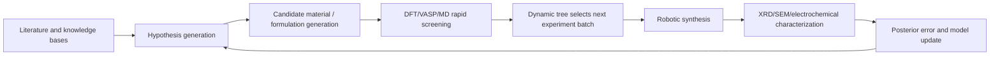

# SGD-Net Multimodal Research Agent and Automated Materials Screening Proposal

> Public research edition · 2026-09-12. Model methods, formulas, and component designs are retained. This document describes a research proposal and does not claim existing training results, a complete implementation, or chip performance. Chapter numbering follows the original research index; gaps indicate separate planning material not published in this package.

> Version: v1.0\
> Date: 2026-06-07\
> Keywords: SGD-Scientist, materials discovery, automated laboratories, DFT, VASP, XRD, SEM, Active Learning, Phase Diagram

**Contents on this page**

- [1. Research Positioning](#section-001)
- [2. One-Sentence Vision](#section-002)
- [3. Target Scenarios](#section-003)
- [4. SGD-Scientist Architecture](#section-007)
- [5. Graph Modeling of Materials Exploration Space](#section-010)
- [6. The Role of SSM in Research Agents](#section-014)
- [7. The Role of Dynamic Trees in Active Learning](#section-015)
- [8. Posterior Error Definition](#section-019)
- [9. Example: Solid-State Electrolyte Screening](#section-020)
- [10. Example: MOF Gas Adsorption Materials](#section-023)
- [11. Engineering Implementation Suggestions](#section-026)
- [12. Minimum Viable Product (MVP)](#section-027)
- [13. Risks and Governance](#section-030)
- [14. Correspondence with Original SGD-Net Theory](#section-031)
- [15. Conclusion](#section-032)
- [16. Connection to Dual-Loop Control](#section-033)
- [17. Physical Embodiment and Differential Digital Twins](#section-034)
- [18. Knowledge State Management](#section-038)
- [2026-09-12 Extension and Applicability Calibration](#section-039)

---

## 1. Research Positioning <a href="#section-001" id="section-001"></a>

This proposal extends SGD-Net from “neural architecture innovation” to a “foundation for closed-loop research agents.” The central idea is to build `SGD-Scientist`: a multimodal research agent for experimental loops in materials science, chemistry, and life sciences.

It is neither merely a chatbot nor a single generative model, but a research system with three layers of capabilities:

1. **SSM state streams for long experimental workflows**: retain long-term state from literature, hypotheses, simulation, synthesis, and characterization through retrospective analysis.
2. **GNN multimodal research graphs**: express constraints among material structures, crystal topology, reaction paths, experimental equipment, characterization results, and knowledge from papers.
3. **Dynamic tree exploration-space refiner**: adaptively split, prune, roll back, and locally refine candidate materials, process parameters, and experimental paths.

## 2. One-Sentence Vision <a href="#section-002" id="section-002"></a>

> Enable AI not only to “read papers and generate candidates,” but also, like an adaptive mesh in numerical computing, to discover automatically where real research space merits further refinement, where exploration should stop, and where rollback is needed.

## 3. Target Scenarios <a href="#section-003" id="section-003"></a>

### 3.1 Automated Materials Generation and Screening <a href="#section-004" id="section-004"></a>

Typical tasks:

- Solid-state electrolyte discovery;
- MOF / COF porous material design;
- Catalyst active-site screening;
- Optimization of photovoltaic/thermoelectric/energy-storage materials;
- Formulation search for high-entropy alloys and composites;
- Low-dimensional materials, two-dimensional materials, and defect engineering.

### 3.2 Multimodal Characterization Loop <a href="#section-005" id="section-005"></a>

Data that can be ingested:

| Modality | Examples | Graph representation |
|---|---|---|
| Literature text | Papers, patents, experimental records | Knowledge nodes, hypothesis edges |
| Crystal structures | CIF, POSCAR, space groups | Lattice nodes, periodic edges |
| Simulation outputs | DFT/VASP, band structures, DOS, formation energy | Physical property nodes |
| Characterization images | XRD, SEM, TEM, AFM | Spectral peak/morphology nodes |
| Process parameters | Temperature, pressure, pH, precursor ratios | Experimental condition nodes |
| Wet-lab results | Yield, purity, stability, conductivity | Objective-function nodes |

### 3.3 Automated Laboratories <a href="#section-006" id="section-006"></a>

The system can connect to robotic platforms to form the following loop:



## 4. SGD-Scientist Architecture <a href="#section-007" id="section-007"></a>

### 4.1 Three-Layer Core <a href="#section-008" id="section-008"></a>

| Layer | Name | Function |
|---|---|---|
| State layer | `ScientificAgentStateTracker` | Record long-term research task state, hypothesis evolution, and experimental history |
| Topology layer | `ResearchGraphEngine` | Uniformly represent material, reaction, equipment, literature, and experimental constraints |
| Decision layer | `AdaptiveExperimentTree` | Split, prune, and prioritize candidates based on posterior error |

### 4.2 Supporting Toolchain <a href="#section-009" id="section-009"></a>

| Tool/system | Purpose | SGD-Net interface |
|---|---|---|
| Literature retrieval system | Obtain papers, patents, datasets | Literature nodes and evidence edges |
| LLM / scientific model | Hypothesis generation, code generation, experiment interpretation | Semantic state input |
| VASP / Quantum ESPRESSO / GPAW | DFT simulation | Physical property feedback |
| RDKit / OpenMM / ASE | Molecular and atomic simulation | Structural graph input |
| XRD/SEM/TEM analysis tools | Parse characterization results | Multimodal observation nodes |
| Robotic synthesis platform | Execute experiments automatically | Action nodes and execution logs |
| ELN/LIMS | Experimental records and sample management | Data loop and auditing |

## 5. Graph Modeling of Materials Exploration Space <a href="#section-010" id="section-010"></a>

### 5.1 Node Types <a href="#section-011" id="section-011"></a>

```text
MaterialNode
  - composition
  - crystal_system
  - space_group
  - lattice_parameters
  - defects
  - dopants

ProcessNode
  - temperature
  - pressure
  - solvent
  - precursor_ratio
  - synthesis_time

SimulationNode
  - formation_energy
  - band_gap
  - conductivity_proxy
  - elastic_modulus
  - migration_barrier

CharacterizationNode
  - xrd_peaks
  - sem_morphology
  - impedance_spectrum
  - stability_test

HypothesisNode
  - textual_claim
  - confidence
  - evidence_links
```

### 5.2 Edge Types <a href="#section-012" id="section-012"></a>

```text
has_composition
has_phase
similar_to
substitutes
synthesized_by
measured_by
simulated_by
contradicts
supports
requires_condition
improves_property
```

### 5.3 Graph Message-Passing Objectives <a href="#section-013" id="section-013"></a>

The GNN layer propagates research constraints in addition to “aggregating features”:

- Propagate feasible processes from similar materials;
- Propagate stability risks from crystal structures;
- Propagate phase-purity assessments from XRD peaks;
- Propagate exclusion boundaries from failed experiments;
- Propagate local refinement directions for questionable candidates from DFT results.

## 6. The Role of SSM in Research Agents <a href="#section-014" id="section-014"></a>

Research is a long, nonstationary sequential process with feedback. SSM/Mamba can maintain the following state:

$$
h_{t+1} = A_t h_t + B_t u_t + \epsilon_t
$$

Here:

- $$h_t$$: current research project latent state;
- $$u_t$$: new literature, simulation, experiment, and characterization inputs;
- $$A_t$$: task-stage-dependent state transition;
- $$B_t$$: selective injection of input modalities;
- $$\epsilon_t$$: uncertainty and experimental noise.

Compared with conventional RAG/agents, the SSM layer offers:

- More stable long-term state updates;
- Linear-complexity processing of very long experimental logs;
- Continuous memory of phase-specific research objectives;
- Sharing of local exploration state with the dynamic tree.

## 7. The Role of Dynamic Trees in Active Learning <a href="#section-015" id="section-015"></a>

A dynamic tree can be viewed as an adaptive mesh over research space.

### 7.1 Splitting Conditions <a href="#section-016" id="section-016"></a>

Node splitting may be triggered by:

- High uncertainty in simulation predictions;
- Large discrepancies between experimental results and predictions;
- Conflicting literature evidence;
- A candidate close to the target performance threshold;
- Strong local sensitivity to process parameters;
- Conflicting multimodal data, such as XRD showing impurity phases while DFT predicts stability.

### 7.2 Pruning Conditions <a href="#section-017" id="section-017"></a>

Node pruning may be triggered by:

- Clearly excessive formation energy;
- An overly narrow synthesis window;
- Failure to satisfy toxicity, cost, or scarce-element constraints;
- Repeated experimental failure with decreasing uncertainty;
- High similarity to known ineffective regions.

### 7.3 Rollback and Isolation <a href="#section-018" id="section-018"></a>

Branches with data contamination, instrument anomalies, sample mix-ups, or incorrect simulation parameters should be isolated rather than directly discarded, preserving an auditable trail.

## 8. Posterior Error Definition <a href="#section-019" id="section-019"></a>

Posterior error in materials tasks can be defined as:

$$
\eta = \lambda_1 \eta_{sim-exp} + \lambda_2 \eta_{physics} + \lambda_3 \eta_{uncertainty} + \lambda_4 \eta_{cost} + \lambda_5 \eta_{synthesis}
$$

| Error term | Meaning |
|---|---|
| $$\eta_{sim-exp}$$ | Simulation-experiment discrepancy |
| $$\eta_{physics}$$ | Violations of physical, chemical, and crystal constraints |
| $$\eta_{uncertainty}$$ | Model prediction uncertainty |
| $$\eta_{cost}$$ | Cost, scarcity, equipment time |
| $$\eta_{synthesis}$$ | Synthesizability, reproducibility, safety |

## 9. Example: Solid-State Electrolyte Screening <a href="#section-020" id="section-020"></a>

### 9.1 Objective Function <a href="#section-021" id="section-021"></a>

Goal: discover new solid-state electrolytes with high ionic conductivity, a wide electrochemical window, low interfacial impedance, synthesizability, and low cost.

Objective function:

$$
J = w_1 \sigma_{ion} - w_2 E_{barrier} + w_3 W_{stability} - w_4 C_{cost} - w_5 R_{toxicity}
$$

### 9.2 Workflow <a href="#section-022" id="section-022"></a>

1. Retrieve literature and construct a candidate chemical space;
2. Propagate candidate priors through the known materials graph using a GNN;
3. Maintain experimental state across rounds using an SSM;
4. Subdivide high-potential regions into doping, defect, and synthesis-condition subspaces using the dynamic tree;
5. Compute formation energy, migration barriers, and band gaps with DFT/VASP;
6. Execute small-batch synthesis robotically;
7. Assess phase purity with XRD, morphology with SEM, and ionic conductivity with EIS;
8. Drive the next round of splitting or pruning using posterior error.

## 10. Example: MOF Gas Adsorption Materials <a href="#section-023" id="section-023"></a>

### 10.1 Graph Representation <a href="#section-024" id="section-024"></a>

- Nodes: metal centers, organic ligands, topological networks, pore sizes, functional groups;
- Edges: coordination bonds, pore connectivity, adsorption sites, synthesis routes;
- States: adsorption capacity, selectivity, stability, regeneration energy consumption.

### 10.2 SGD-Net Value <a href="#section-025" id="section-025"></a>

- GNNs represent pore topology and adsorption sites;
- SSMs represent temperature-pressure cycles and adsorption-desorption dynamics;
- Dynamic trees perform local ligand substitution for candidates with high adsorption but low stability;
- Posterior error combines GCMC simulations and experimental adsorption isotherms.

## 11. Engineering Implementation Suggestions <a href="#section-026" id="section-026"></a>

Suggested additions to the Python project:

```text
sgd_net.agent/
  state_tracker.py        # Long-term research state stream
  research_graph.py       # Literature-material-experiment multimodal graph
  experiment_tree.py      # Adaptive experimental decision tree
  active_learning.py      # Active learning strategies
  lab_executor.py         # Abstract robotic/laboratory platform interface
  evidence_store.py       # Evidence chains and audit records

sgd_net.materials/
  cif_parser.py
  vasp_adapter.py
  xrd_analyzer.py
  sem_analyzer.py
  phase_diagram.py
  property_predictor.py
```

## 12. Minimum Viable Product (MVP) <a href="#section-027" id="section-027"></a>

### 12.1 MVP Scope <a href="#section-028" id="section-028"></a>

- Choose only one materials direction, such as solid-state electrolytes or MOFs;
- Initially operate as “experiment suggestions + data entry” without directly controlling robots;
- Connect public data and local simulation outputs;
- Implement graph construction, candidate ranking, dynamic tree splitting, and experimental record write-back.

### 12.2 MVP Deliverables <a href="#section-029" id="section-029"></a>

1. Materials candidate graph construction tool;
2. Posterior error evaluator;
3. Active learning candidate selector;
4. Interpretable experiment recommendation report;
5. Failed-experiment pruning and rollback records.

## 13. Risks and Governance <a href="#section-030" id="section-030"></a>

| Risk | Description | Mitigation |
|---|---|---|
| Data quality | High noise in literature, experimental records, and characterization data | Establish evidence levels and data lineage |
| Simulation cost | DFT/VASP computation is expensive | Multifidelity surrogates + local dynamic tree refinement |
| Experimental safety | Automated experiments may involve hazardous chemicals | Human approval, rule engines, safety boundaries |
| Hallucinated hypotheses | LLMs generate incorrect scientific hypotheses | Mandatory citations, graph validation, experiment traceability |
| Closed-loop overfitting | Repeated exploration of only a local space | Uncertainty sampling and diversity constraints |

## 14. Correspondence with Original SGD-Net Theory <a href="#section-031" id="section-031"></a>

| Original theory | Research agent counterpart |
|---|---|
| FEM h-refinement | Local subdivision of candidate materials/process parameters |
| BEM boundary constraints | Functional goals, equipment, safety, synthesis windows |
| Lyapunov stability | Nondivergent experimental strategies with controlled cost and risk |
| Posterior error estimation | Simulation-experiment-literature conflicts drive the next step |
| Dynamic tree pruning | Elimination of low-value or high-risk exploration regions |
| SSM state evolution | Memory for long research projects |
| GNN topological propagation | Propagation of multimodal research knowledge and physical constraints |

## 15. Conclusion <a href="#section-032" id="section-032"></a>

The key to `SGD-Scientist` is not “having AI guess the answer in one shot,” but enabling it, like an adaptive numerical method, to continually judge which research regions deserve refinement, pruning, or remeasurement. It extends SGD-Net's theoretical advantages from internal model structure to real research workflows and is one of the directions with the strongest industrial possibilities.

## 16. Connection to Dual-Loop Control <a href="#section-033" id="section-033"></a>

According to the original discussion material (not included in this package), `SGD-Scientist` should evolve from a simple “posterior-error-driven experiment tree” into a dual-loop research agent with “feedforward prediction + posterior feedback.”

| Control module | Role in the research agent |
|---|---|
| Feedforward predictive control | Use historical experiments and digital twins to predict material regions that may offer high value or high risk |
| Posterior error feedback | Correct the model using actual simulation/experimental results, triggering splitting, pruning, isolation, and rollback |
| Control arbitration | Treat posterior feedback as the safety baseline when feedforward predictions conflict with actual feedback |
| Source monitoring | Distinguish real wet-lab experiments, simulation, literature, others' experience, and model predictions |
| Knowledge classification | Consolidate results into experience, lessons, or unverified hypotheses |

The research agent control loop can be written as:

```text
predict next promising/risky regions
→ run simulation or experiment
→ collect multimodal evidence
→ compute posterior error
→ split/prune/isolate/promote/demote
→ update research graph and memory
```

## 17. Physical Embodiment and Differential Digital Twins <a href="#section-034" id="section-034"></a>

A mature `SGD-Scientist` needs to connect to [SGD-Ecosystem Physical Embodiment, Digital Twins, and Bidirectional Manifold Folding](15.md).

### 17.1 Physical Embodiment <a href="#section-035" id="section-035"></a>

Physical embodiment includes:

- Automated synthesis platforms;
- Sample transfer and management systems;
- Characterization instruments such as XRD/SEM/TEM/Raman/EIS;
- ELN/LIMS data management;
- Safety approval and human takeover mechanisms.

These devices should be encapsulated as `LabToken` streams entering research graph state, rather than serving only as external tools.

### 17.2 Differential Digital Twins <a href="#section-036" id="section-036"></a>

Digital twins provide sandbox rehearsals before real experiments:

- High-fidelity simulations such as DFT/MD/FEM;
- Surrogate and empirical models;
- Random perturbation injection;
- Multifidelity scheduling;
- Candidate-path robustness scoring.

### 17.3 Bidirectional Manifold Folding <a href="#section-037" id="section-037"></a>

When digital twin predictions disagree with real experiments, the cause need not be only a model error; digital twin parameters, boundary conditions, or experimental data may also be biased.

Therefore, correction should address all three:

1. SGD-Net's internal dynamic trees and research graph;
2. The digital twin's physical parameters and boundary conditions;
3. Experimental data source confidence and quality tags.

## 18. Knowledge State Management <a href="#section-038" id="section-038"></a>

Materials research should explicitly distinguish three knowledge classes:

| Knowledge state | Example | Action |
|---|---|---|
| Locally correct experience | A doping ratio improves conductivity in a specific temperature window | Enter an experience leaf and prioritize subsequent use |
| Locally incorrect lesson | A sintering route causes impurity phases or irreproducibility | Enter a counterexample exclusion region and block subsequent use |
| Unverified hypothesis | A new structure proposed in literature but not experimentally reproduced | Enter the shadow graph-tree and use only in a sandbox or low-risk experiments |

This prevents agents from conflating claims in papers, model predictions, and real experiments.

## 2026-09-12 Extension and Applicability Calibration <a href="#section-039" id="section-039"></a>

This document presents a research system concept. The new document adds periodic crystals, energy/forces, multifidelity error, experimental data, and domain acceptance requirements. Dynamic tree candidate management is not automatically equivalent to optimal experimental design, and real experiments cannot be undone by state rollback.

See: [35-SGD-Net Cross-Domain Extension Roadmap and Research Task Mapping 20260912](35.md).

---

[← Previous](07.md) · [Book contents](../SUMMARY.md) · [Next →](15.md)
