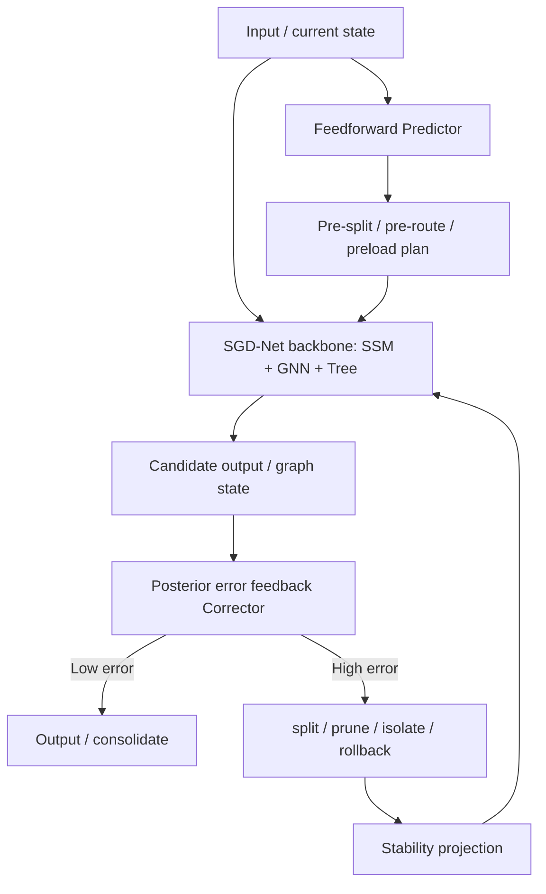

# SGD-Net Dual-Loop Control and Brain-Inspired Cognitive Architecture

> Reading boundary: cognitive analogies, reasoning from expert perspectives, and theoretical mappings are the author's research discussion. They do not imply external expert review, endorsement by a research institution, or completed proofs of the corresponding theorems.

> Public research edition · 2026-09-12. Model methods, formulas, and component designs are retained. This document describes a research proposal and does not claim existing training results, a complete implementation, or chip performance. Chapter numbering follows the original research index; gaps indicate separate planning material not published in this package.

> Version: v1.0\
> Date: 2026-06-07\
> Source: original discussion material (not included in this package)\
> Keywords: feedforward control, posterior error feedback, Predictor-Corrector, thalamocortical loops, BiSRNN, hierarchical memory, source monitoring, knowledge classification, shadow graph-tree

**Contents on this page**

- [1. Research Positioning](#section-001)
- [2. Core Conclusions](#section-002)
- [3. Posterior Error Feedback Control](#section-003)
- [4. Feedforward Predictive Control](#section-007)
- [5. Feedforward-Feedback Dual Loop: Predictor-Corrector SGD-Net](#section-011)
- [6. Analogy to Thalamocortical Control Networks](#section-017)
- [7. Relationship to BiSRNN / Band-Split RNN](#section-018)
- [8. Implementing Brain-Inspired Hierarchical Memory in SGD-Net](#section-019)
- [9. Source Monitoring: Real Experience, Prediction, Dreams, Learned Knowledge, and Others' Experience](#section-024)
- [10. Knowledge Classification: Experience, Lessons, and Unverified Knowledge](#section-028)
- [11. Offline Consolidation and the “Dream” Mechanism](#section-032)
- [12. Complete Control Loop Pseudocode](#section-038)
- [13. Suggested Engineering Modules](#section-039)
- [14. Risks and Boundaries](#section-040)
- [15. Relationship to Other Documents](#section-041)
- [16. Summary](#section-042)

---

## 1. Research Positioning <a href="#section-001" id="section-001"></a>

This document specifically organizes new ideas on “control methods, brain-inspired cognition, memory management, and knowledge classification” from the original discussion material (not included in this package).

Earlier documents defined SGD-Net's basic architecture as:

```text
SSM + GNN + Dynamic Tree + Posterior Error + Stability Projection
```

This document extends it with:

```text
Feedforward Predictor
+ Posterior Feedback Corrector
+ Cognitive Memory System
+ Source Monitoring
+ Knowledge Ontology Control
```

In other words, SGD-Net is not only a structurally adaptive model, but a closed-loop cognitive dynamical system with “prediction—correction—memory—source discrimination—knowledge promotion/demotion” capabilities.

## 2. Core Conclusions <a href="#section-002" id="section-002"></a>

The full SGD-Net can be defined as:

> An overall AI model architecture that pursues efficiency through feedforward predictive control, preserves a trustworthiness baseline through posterior error feedback, maintains long-range memory with state-space models, represents factual/physical topology with graph neural networks, performs local adaptive learning with dynamic trees, and uses stability projection to prevent divergence and contamination propagation.

The key changes are:

1. **No longer relying only on posterior error**: posterior error remains the safety baseline, while a feedforward prediction module prewarms routes to reduce stalls and oscillation.
2. **No longer using a single memory**: introduce hierarchical long-, medium-, short-term, and instantaneous memory.
3. **No longer mixing all knowledge together**: explicitly distinguish real experience, predictive reasoning, dreams/offline consolidation, learned knowledge, others' experience, unverified hypotheses, positive experience, and counterexample lessons.
4. **No longer treating control solely as training loss**: separate control signals into feedforward predicted risk, posterior residual error, source confidence, stability energy, and knowledge state transitions.

## 3. Posterior Error Feedback Control <a href="#section-003" id="section-003"></a>

### 3.1 Basic Mechanism <a href="#section-004" id="section-004"></a>

The basic idea is to first execute one inference or state-advancement step, then calculate whether the current state violates task objectives, physical constraints, factual topology, or stability conditions, and decide whether to trigger refinement.

Let the current graph state be:

$$
\mathcal{G}_t=(X_t,E_t,H_t,T_t,M_t)
$$

Here:

- $$X_t$$: node features;
- $$E_t$$: edges and edge features;
- $$H_t$$: SSM hidden states;
- $$T_t$$: the dynamic tree at each node;
- $$M_t$$: sources, confidence, evidence, and metadata.

A backbone forward pass yields a candidate state:

$$
\tilde{\mathcal{G}}_{t+1}=F_{SGD}(\mathcal{G}_t,u_t)
$$

Posterior error is estimated as:

$$
\eta_t=\Phi_{post}(\tilde{\mathcal{G}}_{t+1},y_t,\mathcal{C})
$$

Here $$\mathcal{C}$$ is the set of physical, chemical, logical, fact-graph, and safety constraints.

Multiple error terms can be written as:

$$
\eta_i=w_1r_i^{task}+w_2r_i^{physics}+w_3r_i^{topology}+w_4r_i^{drift}+w_5r_i^{confidence}+w_6r_i^{source}
$$

Actions are triggered when $$\eta_i$$ exceeds a threshold:

$$
 a_i=
\begin{cases}
\operatorname{split}, & \eta_i>\epsilon_{split} \\
\operatorname{isolate}, & r_i^{source}>\epsilon_{source} \\
\operatorname{rollback}, & \Delta V_i>\epsilon_V \\
\operatorname{prune}, & usage_i<u_{min}\ \text{and}\ value_i<v_{min} \\
\operatorname{keep}, & \text{otherwise}
\end{cases}
$$

### 3.2 Advantages <a href="#section-005" id="section-005"></a>

| Advantage | Explanation |
|---|---|
| Robust | Depends on actual residuals rather than future predictions |
| White-box | Error can be computed directly from physical functionals, fact graphs, and geometric constraints |
| Safe | Exploding residuals can immediately trigger circuit breaking, isolation, and rollback |
| Suitable for OOD | The predictor need not guess correctly before an out-of-distribution input arrives |

### 3.3 Disadvantages <a href="#section-006" id="section-006"></a>

| Disadvantage | Explanation |
|---|---|
| Delayed | A deviation must occur before correction is triggered |
| Possible oscillation | Poor threshold and step-size choices can cause repeated split/prune cycles |
| Hardware pipeline bubbles | Ad hoc reconstruction interrupts the inference pipeline |
| Local perspective | Current residuals alone may provide insufficient long-term planning |

## 4. Feedforward Predictive Control <a href="#section-007" id="section-007"></a>

### 4.1 Basic Mechanism <a href="#section-008" id="section-008"></a>

Feedforward predictive control anticipates future high-risk regions and preallocates resources for dynamic trees, GNN routing, and hardware pipelines instead of waiting for errors.

The predictor can be written as:

$$
\hat{\mathcal{G}}_{t+k}=P_{\theta}(\mathcal{G}_t,H_t,u_{t:t+k})
$$

Future risk is estimated as:

$$
\hat{\eta}_{t+k}=\Phi_{pred}(\hat{\mathcal{G}}_{t+k},\mathcal{C})
$$

Generate a control plan in advance:

$$
\mathcal{P}_{t:t+k}=\operatorname{Plan}(\hat{\eta}_{t:t+k})
$$

The plan may include:

- Pre-splitting high-risk tree nodes;
- Prewarming specific experts or routing paths;
- Loading sparse graph adjacency in advance;
- Preparing digital twin simulations in advance;
- Reducing step size or increasing stability projection frequency in advance.

### 4.2 Advantages <a href="#section-009" id="section-009"></a>

| Advantage | Explanation |
|---|---|
| Anticipatory | Prepare computing resources before high-gradient/high-risk regions arrive |
| Efficient | Reduce stalls from ad hoc splits |
| Hardware-friendly | Can eliminate pipeline bubbles and facilitate SGD-TPU pre-routing |
| Smooth | Bring inference trajectories closer to globally smooth paths |

### 4.3 Disadvantages <a href="#section-010" id="section-010"></a>

| Disadvantage | Explanation |
|---|---|
| Predictors also err | The feedforward module can produce false alarms or miss events |
| Training cost | Risk priors must be learned from historical tasks, simulations, or experiments |
| Prone to overconfidence | Without posterior correction, incorrect predictions are amplified |
| Insufficient safety | Should not independently serve as a zero-tolerance control baseline |

## 5. Feedforward-Feedback Dual Loop: Predictor-Corrector SGD-Net <a href="#section-011" id="section-011"></a>

### 5.1 Dual-Loop Structure <a href="#section-012" id="section-012"></a>



### 5.2 Mathematical Form <a href="#section-013" id="section-013"></a>

**Prediction step:**

$$
\mathcal{G}_{t+1}^{pred}=P_{\theta}(\mathcal{G}_t,u_t)
$$

**Backbone advancement:**

$$
\tilde{\mathcal{G}}_{t+1}=F_{SGD}(\mathcal{G}_t,u_t,\mathcal{G}_{t+1}^{pred})
$$

**Posterior correction:**

$$
\eta_{t+1}=\Phi_{post}(\tilde{\mathcal{G}}_{t+1},\mathcal{C})
$$

$$
\mathcal{G}_{t+1}=\Pi_{stable}\left(C_{\eta}(\tilde{\mathcal{G}}_{t+1},\eta_{t+1})\right)
$$

This corresponds to Predictor-Corrector methods in numerical analysis:

```text
Predictor: first provide a low-cost extrapolation
Corrector: then apply firm correction using actual residuals
```

### 5.3 Control Arbiter <a href="#section-014" id="section-014"></a>

To prevent predictor overreach, add a `ControlArbiter`:

$$
\alpha_t=\sigma\left(w^T[\hat{\eta}_t,\eta_t,c_t,\Delta V_t]+b\right)
$$

Final control action:

$$
 a_t=\alpha_t a_t^{feedback}+(1-\alpha_t)a_t^{feedforward}
$$

Engineering implementations need not use continuous interpolation; rules can be used:

```text
if posterior_error is critical:
    feedback takes over
elif predictor_confidence is high and posterior_error is low:
    use predictive plan
else:
    run conservative mode
```

### 5.4 Complete Control Strategy <a href="#section-015" id="section-015"></a>

| Scenario | Feedforward control | Posterior feedback | Recommended strategy |
|---|---|---|---|
| Routine known tasks | Strong | Light monitoring | Primarily feedforward for higher throughput |
| High-risk scientific tasks | Medium | Strong | Feedforward contingency plans + strict posterior checks |
| OOD / adversarial inputs | Weak | Very strong | Feedback takeover, isolation/rollback |
| Automated experiments | Medium | Very strong | Predictions rank candidates; experimental feedback determines promotion |
| Hardware pipelines | Strong | Medium | Pre-routing reduces bubbles; anomalies trigger circuit breaking |

### 5.5 Online State Estimation and Adaptation with Limited BP <a href="#section-016" id="section-016"></a>

The original discussion material (not included in this package) further notes that runtime adaptation should not mean “backpropagating and rewriting the large-model backbone at every inference.” Safer control confines online changes to state estimation and a small set of scheduling variables.

Objects that can be estimated online include:

| Object | Explanation | Recommended methods |
|---|---|---|
| SSM hidden state | Latent state of the current task, sensor stream, or experiment stream | Kalman / EKF / UKF / Particle Filter |
| residual-gate bias | Short-term bias in a residual-gated SSM | recursive least squares / filter update |
| Dynamic tree thresholds | Trigger thresholds for split, prune, isolate, and rollback | Bayesian calibration / conservative update |
| fast path confidence | Whether frequently used paths remain trustworthy | posterior residual + source confidence |
| Harness risk threshold | Risk thresholds of the safety sentinel | conformal calibration / human-in-the-loop |

Safety boundaries for online adaptation:

```text
Allowed: update hidden states, thresholds, small adapters, fast-path confidence
Prohibited: directly rewrite backbone weights, core safety policies, or the global knowledge graph without offline review
```

EKF/UKF/Particle Filter methods are therefore better placed in an `OnlineAdaptationController` as state estimators for the Predictor-Corrector dual loop, rather than treated as universal online learning algorithms replacing the training system.

## 6. Analogy to Thalamocortical Control Networks <a href="#section-017" id="section-017"></a>

The control document proposes an analogy between SGD-Net and thalamocortical loops. This should be a “heuristic analogy,” not a claim of complete equivalence.

Public descriptions commonly characterize thalamocortical systems as information-gating systems involving sensory input, cortical feedback, attention/state modulation, and oscillatory synchronization. The thalamus receives both external sensory input and cortical feedback; oscillations in different frequency bands relate to attention, sleep, consciousness, and short-term memory.

The following engineering mapping can be made for SGD-Net:

| Function | Thalamocortical inspiration | SGD-Net counterpart |
|---|---|---|
| Sensory input gating | Thalamic gating of sensory pathways | GNN topological integration of real observations and multimodal inputs |
| Top-down prediction | Cortex sends expectations downward | Feedforward Predictor produces expected trajectories |
| Bottom-up error | Real input disagrees with expectation | Posterior Error computes residuals |
| State maintenance | Oscillations and loops maintain working states | SSM hidden states maintain short-term/working memory |
| Inhibition and filtering | Suppress irrelevant pathways | Dynamic Tree prune/isolate |
| Stable rhythms | Normal oscillations maintain cognitive stability | Stability Projection constrains energy against divergence |

Key boundary:

> SGD-Net borrows control ideas of “gating, prediction, feedback, state maintenance, and inhibitory filtering.” It should not be equated with an exact simulation of biological thalamocortical networks.

## 7. Relationship to BiSRNN / Band-Split RNN <a href="#section-018" id="section-018"></a>

The control document mentions BiSRNN / Band-Split RNN as algorithmic comparisons resembling “fast/slow channels and bidirectional/segmented recurrence.” Public material describes Band-Split RNN as commonly used in audio source separation, splitting spectra into subbands and alternating band-level and sequence-level modeling; BPIE-BiSRNN is an earlier experimental sliced-RNN implementation for long text.

The comparison can be written as:

| Dimension | BiSRNN / BSRNN-style methods | SGD-Net |
|---|---|---|
| Core structure | Bidirectional, sliced, or frequency-band-grouped RNNs | SSM + GNN + Dynamic Tree |
| Memory | Serial hidden-state recurrence | Long-range SSM state with parallel scan |
| Spatial structure | Usually sequences or frequency bands | Explicit graph topology / physical / knowledge manifolds |
| Adaptation | Mostly fixed network structures | Posterior-error-driven split/prune/remesh |
| Source discrimination | Usually not built in | Can be built in through SourceTag / EvidenceTag |
| Stability mechanisms | Gradient clipping and gating | Lyapunov / SVD / spectral constraints / rollback |

Conclusion:

> BiSRNN / BSRNN can inform “segmented/dual-channel sequence modeling,” but SGD-Net's core extensions are dynamic graph topology, adaptive trees, and explicit control loops.

## 8. Implementing Brain-Inspired Hierarchical Memory in SGD-Net <a href="#section-019" id="section-019"></a>

Human memory can be roughly divided into long-, medium-, short-term, and instantaneous levels. SGD-Net can translate these levels into different state storage and update mechanisms.

| Memory type | Human analogy | SGD-Net implementation | Update frequency | Risk control |
|---|---|---|---|---|
| Long-term memory | Stable common sense, axioms, world models | Frozen backbone parameters $$W_0$$ + core knowledge graph | Very low | Read-only / approval / versioning |
| Medium-term memory | Recent experience, new skills | New dynamic tree leaves, local adapters, experience subgraphs | Medium | Retain after posterior validation; prune if unstable |
| Short-term memory | Current task context | SSM hidden states $$H_t$$, task state streams | High | State drift monitoring |
| Instantaneous memory | Current sensory stimuli | GNN messages, current batch tokens/observations | Every step | Release or compress after computation |
| Unverified memory | Rumors, hypotheses, paper conclusions | Shadow Graph-Tree isolation area | Conditional updates | Confidence gating and experimental promotion |

### 8.1 Long-Term Memory <a href="#section-020" id="section-020"></a>

Long-term memory should satisfy:

$$
\frac{\partial W_0}{\partial t}\approx 0
$$

During online inference, write new experience into dynamic trees or shadow graphs rather than directly rewriting backbone parameters.

### 8.2 Medium-Term Memory <a href="#section-021" id="section-021"></a>

Medium-term memory corresponds to dynamic tree leaves and local adapters:

$$
T_i\leftarrow \operatorname{Split}(T_i,\eta_i)
$$

If benefits remain stable after multiple validation rounds:

$$
T_i^{temp}\rightarrow T_i^{stable}
$$

Otherwise:

$$
T_i^{temp}\rightarrow \operatorname{Prune}(T_i^{temp})
$$

### 8.3 Short-Term Memory <a href="#section-022" id="section-022"></a>

An SSM maintains short-term memory:

$$
H_{t+1}=\bar{A}_tH_t+\bar{B}_tX_t
$$

Record state drift when needed:

$$
r_t^{drift}=\frac{\|H_{t+1}-H_t\|_2}{\|H_t\|_2+\epsilon}
$$

### 8.4 Instantaneous Memory <a href="#section-023" id="section-023"></a>

GNN messages can be viewed as instantaneous impulses:

$$
 m_{ij}^{t}=\psi(x_i^t,x_j^t,e_{ij}^t)
$$

After aggregation, they are written into node states; raw messages need not be retained long-term.

## 9. Source Monitoring: Real Experience, Prediction, Dreams, Learned Knowledge, and Others' Experience <a href="#section-024" id="section-024"></a>

Conventional models easily mix training data, reasoning assumptions, fictional content, and real observations in the same probability space. SGD-Net should explicitly introduce source tags.

### 9.1 SourceTag Design <a href="#section-025" id="section-025"></a>

Each node, edge, evidence item, or state update should carry:

```text
SourceTag:
  source_type: real_experiment | simulation | prediction | literature | third_party | dream | synthetic
  confidence: float
  verification_status: verified | unverified | contradicted | promoted | quarantined
  provenance: list[EvidenceRef]
  timestamp: datetime
  authority: sensor | model | human | paper | simulator
```

### 9.2 Five Cognitive States <a href="#section-026" id="section-026"></a>

| Cognitive state | SGD-Net storage location | May it directly affect decisions? | Promotion conditions |
|---|---|---|---|
| Real experience | Experimental/sensor GNN hard manifold | Yes, subject to quality checks | Multimodal consistency + low posterior residual |
| Learned knowledge | Read-only backbone parameters/core knowledge graph | Yes | Verified, versioned, trustworthy source |
| Prediction/reasoning | SSM/Predictor sandbox trajectories | Should not be directly consolidated | Posterior or experimental validation |
| Dreams/offline consolidation | consolidation buffer | No direct external actions | Convert into hypotheses or experience after offline evaluation |
| Others' experience | shadow graph-tree | Candidate generation assistance only | Promotion after repeated real validation |

### 9.3 Source Error <a href="#section-027" id="section-027"></a>

Source unreliability should also contribute to posterior error:

$$
r_i^{source}=1-c_i^{source}+\lambda_{conflict}\cdot \mathbb{I}[\operatorname{Conflict}(i)=1]
$$

If a source conflicts with highly trustworthy physical observations:

$$
status_i\leftarrow \operatorname{quarantined}
$$

## 10. Knowledge Classification: Experience, Lessons, and Unverified Knowledge <a href="#section-028" id="section-028"></a>

The control document further proposes that humans distinguish not only information sources but also the domains in which knowledge is correct, incorrect, or still awaiting tests.

### 10.1 Locally Correct Experience <a href="#section-029" id="section-029"></a>

Local experience can be represented as a conditional domain:

$$
K^+=\{(c,y)\mid y\ \text{在条件}\ c\ \text{下被验证为真}\}
$$

It appears as a positive leaf in the dynamic tree:

```text
if condition_region(c):
    use positive leaf adapter
```

Mathematically, an attraction region can be defined:

$$
\Omega^+=\{x\mid V(F(x))-V(x)\le 0,\ \eta(x)<\epsilon\}
$$

### 10.2 Locally Incorrect Lessons <a href="#section-030" id="section-030"></a>

Lessons are local counterexamples or exclusion regions:

$$
K^-=\{(c,y)\mid y\ \text{在条件}\ c\ \text{下被证伪或高风险}\}
$$

They can be implemented as negative edges, blocking conditions, or risk barriers:

$$
A_{ij}^{risk}<0\quad \text{or}\quad mask_{path}=0
$$

When a reasoning path enters an exclusion region:

$$
\operatorname{Breaker}(path)=1
$$

Actions: reject, prune, roll back, or request human approval.

### 10.3 Unverified Knowledge <a href="#section-031" id="section-031"></a>

Unverified knowledge is stored in a shadow graph-tree:

$$
\mathcal{G}^{shadow}=(V^{shadow},E^{shadow},T^{shadow},c^{shadow})
$$

It may participate only in sandbox execution or candidate generation and should not be written directly into the backbone.

Promotion rules can be written as:

$$
\operatorname{Promote}(k)=\mathbb{I}[n_{verified}\ge N_{min}\ \land\ \bar{\eta}_k<\epsilon\ \land\ MI(k;target)>\tau]
$$

Falsification rule:

$$
\operatorname{Demote}(k)=\mathbb{I}[n_{contradicted}\ge M_{min}\ \lor\ \bar{\eta}_k>\epsilon_{bad}]
$$

## 11. Offline Consolidation and the “Dream” Mechanism <a href="#section-032" id="section-032"></a>

“Dreams” here should be engineered as offline consolidation, not interpreted mystically.

### 11.1 Offline Consolidation Objectives <a href="#section-033" id="section-033"></a>

The offline stage can:

1. Replay SSM state trajectories from the day or recent period;
2. Evaluate the benefits of dynamic tree leaves;
3. Merge duplicate leaves;
4. Prune low-value or high-risk branches;
5. Move stable experience into longer-term storage;
6. Move conflicting knowledge into lesson exclusion or unverified areas.

### 11.2 Mathematical Form <a href="#section-034" id="section-034"></a>

Given an experience buffer $$\mathcal{B}$$:

$$
\mathcal{B}=\{(\mathcal{G}_t,a_t,y_t,\eta_t,source_t)\}_{t=1}^{T}
$$

Offline optimization:

$$
\min_{T,\theta_{local}}\sum_{(\cdot)\in\mathcal{B}}\eta_t+\lambda_1\operatorname{Complexity}(T)+\lambda_2\operatorname{Conflict}(T)
$$

While maintaining:

$$
V_{new}\le V_{old}+\delta
$$

### 11.3 From Offline Consolidation to Retrospective Analysis <a href="#section-035" id="section-035"></a>

The original discussion material (not included in this package) further clarifies that offline consolidation is a key stage in SGD-Net self-evolution, not merely log cleanup.

The relationship among dual loops, multilevel memory, and knowledge classification can be understood as:

| Mechanism | Role in retrospective analysis |
|---|---|
| Inner-loop feedback | Single-step review: quickly correct deviations from instantaneous error |
| Outer-loop feedback | Deep reflection: question the current strategy or paradigm when error continues growing |
| Multilevel memory | Source material: retain instantaneous, short-, medium-, long-term, and shadow experience |
| Knowledge classification | Destination of reflection: promote experience, consolidate mistakes into lessons, isolate hypotheses |
| Dynamic reasoning acceleration | Execution vehicle for reflection outcomes: consolidate frequent processing into fast paths |

Retrospective analysis is thus a natural extension of the control loop to longer time scales, rather than an external add-on:

```text
Posterior error
    → single-step review
    → deep reflection
    → dynamic memory organization
    → knowledge state transitions
    → fast reasoning path consolidation or active forgetting
```

See [SGD-Net Retrospective Analysis and Dynamic Self-Evolution Mechanisms](17.md) for the fuller mechanism.

### 11.4 Nonindustrial Transfer of the Dream Mechanism: Narrative Creation Mode <a href="#section-036" id="section-036"></a>

The original discussion material (not included in this package) further proposes that offline consolidation and dream-like replay need not serve only industrial control. After disabling physical execution privileges and replacing constraint functions, they can generate fiction, plots, and creative proposals.

Engineering should define an independent `NarrativeDreamAdapter`, rather than having industrial SGD-Net directly “write novels”:

| Industrial control mode | Narrative creation mode |
|---|---|
| Physical conservation, PDE residuals, source trustworthiness | World-building consistency, character motivation, plot causality, thematic recurrence |
| PPU / posterior physical checks | Narrative Critic / human editorial feedback |
| Dynamic tree refinement | Plot branching, subplot pruning, resolving foreshadowing |
| Active forgetting of low-value paths | Removing clichés, repeated scenes, and ineffective description |

“Dream creation” can therefore be a nonindustrial Retrospection subsystem, but must not enter the safety-control backbone or mislabel narrative imagination as real experience.

### 11.5 Heuristic Mapping of LeCun's Six AMI Modules <a href="#section-037" id="section-037"></a>

Yann LeCun's Autonomous Machine Intelligence direction commonly emphasizes modules such as Perception, World Model, Cost, Short-Term Memory, Actor, and Configurator. These can inspire SGD-Net system design, but should not be described as an exact one-to-one reproduction.

| AMI module | SGD-Net / XPU counterpart | Engineering meaning |
|---|---|---|
| Perception | JEPA/V-JEPA encoder, InputEncoder, GraphBuilder | Convert multimodal observations into latents and structural graphs |
| World Model | SSM, JSBO, Digital Twin, JEPALatentBuffer | Predict future states and consequences of candidate actions |
| Cost | PosteriorError, SGD-Harness, PPU residual | Evaluate task, physical, safety, and source risks |
| Short-Term Memory | SSM hidden, MemoryManager, task cache | Maintain current tasks, imagined trajectories, and working states |
| Actor | DynamicTreePolicy, ControlArbiter, tool/robot action | Select experiments, tools, control actions, or tree actions |
| Configurator | SolverRouter, TaskPlanner, SourceMonitor | Select solvers, modules, and constraints by context |

This mapping helps organize system modules; it does not prove that SGD-Net already possesses general autonomous intelligence. Actual progress must still be validated through benchmarks of physical reasoning, robotic planning, scientific experimental loops, and safety auditing.

## 12. Complete Control Loop Pseudocode <a href="#section-038" id="section-038"></a>

```text
state = build_initial_graph(raw_input)
state = attach_source_tags(state)

pred_plan = predictor.plan(state, horizon=k)
state = prewarm_routes_and_trees(state, pred_plan)

for block in sgd_blocks:
    state = block(state)

prediction = head(state)
record_immutable_prediction(prediction, versions, available_inputs)
post_report = posterior_error.estimate(prior_prediction_record, matched_observation, constraints)
source_report = source_monitor.check(state)
control_action = arbiter.decide(pred_plan, post_report, source_report)

if control_action.requires_refine:
    candidate = refiner.propose(snapshot(state), control_action)
    enqueue_migration_validation_and_window_publication(candidate)

memory_manager.update(state, post_report, source_report)
knowledge_manager.update_evidence_status(state, independent_validation)

return SGDOutput(prediction, state, reports)
```

## 13. Suggested Engineering Modules <a href="#section-039" id="section-039"></a>

```text
sgd_net/control/
  feedforward_predictor.py      # Feedforward predictive control
  posterior_corrector.py        # Posterior correction control
  control_arbiter.py            # Feedforward/feedback arbitration
  predictor_corrector_loop.py   # Dual-loop process

sgd_net/cognition/
  memory_manager.py             # Long-/medium-/short-term/instantaneous memory management
  source_monitor.py             # Source monitoring and evidence tags
  knowledge_ontology.py         # Experience/lesson/unverified knowledge classification
  shadow_graph.py               # Shadow graph-tree isolation area
  consolidation.py              # Offline consolidation/pruning/promotion
```

## 14. Risks and Boundaries <a href="#section-040" id="section-040"></a>

| Risk | Explanation | Recommendation |
|---|---|---|
| Excessive brain analogy | Biological brain mechanisms are complex; do not claim complete reproduction | Describe it as a “heuristic mapping” |
| Misleading feedforward prediction | Predictors may be overconfident | Posterior feedback must have highest priority |
| Dynamic tree expansion | Frequent splits make complexity unmanageable | Set budgets, cooldowns, and benefit evaluation |
| False precision in source tags | Source confidence may itself be inaccurate | Retain evidence chains and human audit interfaces |
| Unverified knowledge contaminates the backbone | Premature hypothesis promotion | Require experiments or highly trustworthy validation |

## 15. Relationship to Other Documents <a href="#section-041" id="section-041"></a>

| Document | Relationship |
|---|---|
| [SGD-Net Model Architecture and Layer Operators](13.md) | This document adds full-system modules such as feedforward prediction, source tags, and knowledge classification |
| [SGD-Net Multimodal Research Agent and Automated Materials Screening Proposal](08.md) | Its research agents can use the memory/source/knowledge classification mechanisms described here |
| [SGD-Ecosystem Physical Embodiment, Digital Twins, and Bidirectional Manifold Folding](15.md) | Unverified knowledge, predictive control, and posterior feedback are validated in a loop with the physical experimental ecosystem |
| [SGD-Net Retrospective Analysis and Dynamic Self-Evolution Mechanisms](17.md) | Dual loops, multilevel memory, and knowledge classification form retrospective analysis, dynamic organization, and active forgetting over longer time scales |
| [SGD-Net and JEPA World-Model Integration with the JSBO Bridge Operator](18.md) | Dreams/offline consolidation can transfer to narrative creation; JEPA latent planning can enter feedforward prediction with posterior safeguards |
| [SGD-Net Hybrid Solving and Training System and World-Model Research Roadmap](27.md) | The control loop extends to hybrid solving, online state estimation, and a heuristic mapping of six AMI modules |
| `03-06` implementation documents | Add `control` and `cognition` engineering modules |

## 16. Summary <a href="#section-042" id="section-042"></a>

The core contribution of the original discussion material (not included in this package) is to elevate SGD-Net from a “posterior-error-driven dynamic model” to a cognitive control system combining “feedforward prediction + posterior feedback + brain-inspired memory + knowledge ontology management.”

Three principles should be maintained:

1. **Feedforward control serves efficiency, not final truth determination**;
2. **Posterior feedback serves safety and should not be removed because it is delayed**;
3. **All knowledge must carry sources, boundaries, confidence, and promotion/demotion mechanisms**.

This lets SGD-Net do more than compute: it knows what it is computing, where its evidence comes from, whether it has been validated, when to doubt, and when consolidation is justified.

---

[← Previous](27.md) · [Book contents](../SUMMARY.md) · [Next →](17.md)
