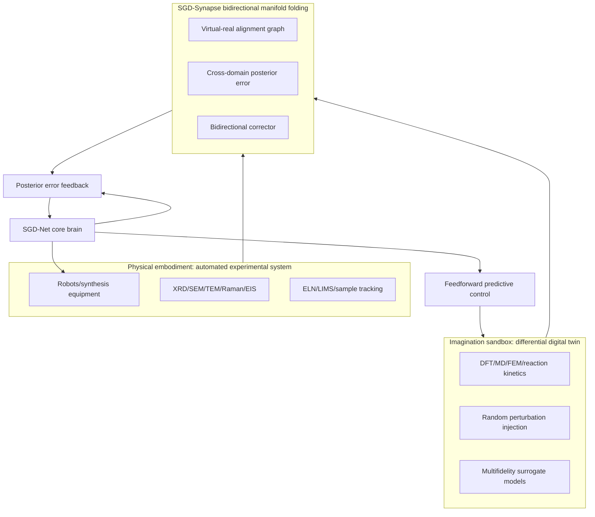
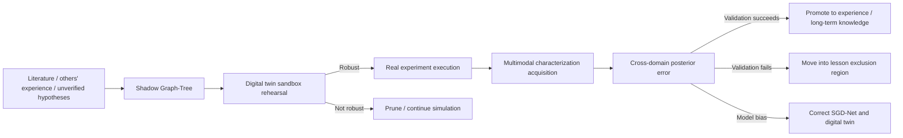

# SGD-Ecosystem: Physical Embodiment, Differential Digital Twins, and Bidirectional Manifold Folding

> Public research edition · 2026-09-12. Model methods, formulas, and component designs are retained. This document describes a research proposal and does not claim existing training results, a complete implementation, or chip performance. Chapter numbering follows the original research index; gaps indicate separate planning material not published in this package.

> Version: v1.0\
> Date: 2026-06-07\
> Source: original discussion material (not included in this package)\
> Keywords: SGD-Ecosystem, physical embodiment, wet-lab experiments, automated laboratories, digital twins, differential world models, SGD-Synapse, bidirectional manifold folding, scientific closed loop

**Contents on this page**

- [1. Research Positioning](#section-001)
- [2. Why an Ecosystem Layer Is Needed](#section-002)
- [3. Overall Architecture](#section-003)
- [4. Physical Embodiment: Automated Wet-Lab Experiments and Acquisition](#section-004)
- [5. Imagination Sandbox: Differential Digital Twin World Model](#section-009)
- [6. SGD-Synapse: Bidirectional Manifold Folding Network](#section-015)
- [7. Hypothesis-Driven Loop](#section-020)
- [8. Data and Evidence Chain Design](#section-025)
- [9. Suggested Engineering Modules](#section-029)
- [10. MVP Roadmap](#section-030)
- [11. Validation Metrics](#section-035)
- [12. Safety and Governance](#section-036)
- [13. Relationship to Document 08](#section-039)
- [15. Risks and Practical Boundaries](#section-040)
- [17. Summary](#section-041)

---

## 1. Research Positioning <a href="#section-001" id="section-001"></a>

`SGD-Net` is the model's brain, but a brain alone cannot accomplish scientific discovery. Scientific intelligence must interact with reality: propose hypotheses, simulate, execute experiments, collect data, correct models, and update knowledge.

This document proposes `SGD-Ecosystem`: a supporting physical/digital closed-loop ecosystem layer outside SGD-Net.

Its core has three parts:

1. **Physical Embodiment**: automated wet-lab experiments, robotic actuators, and multimodal in situ characterization and acquisition systems;
2. **Imagination Sandbox (Differential Digital Twin)**: differential digital twins, stochastic-perturbation world models, multifidelity simulation, and feedforward rehearsal;
3. **Bidirectional Manifold Folding (SGD-Synapse)**: fold real experiments and virtual simulations into the same heterogeneous graph manifold, using bidirectional error to correct both the AI brain and digital twin.

## 2. Why an Ecosystem Layer Is Needed <a href="#section-002" id="section-002"></a>

SGD-Net can internally distinguish experience, lessons, unverified hypotheses, and predictive reasoning, but these states must ultimately be validated against reality or highly trustworthy simulations.

Without an external validation loop, the model faces three problems:

| Problem | Explanation |
|---|---|
| Brain in a vat | The model is consistent only within its internal sandbox and cannot establish real-world correctness |
| Digital self-indulgence | Posterior error comes only from inside the model, without real physical feedback |
| Difficult hypothesis promotion | Unverified knowledge in the shadow graph-tree lacks a validation path |

SGD-Net therefore needs an external ecosystem:

```text
SGD-Net Brain
  + Physical Lab Body
  + Digital Twin Sandbox
  + Bidirectional Manifold Synapse
  = SGD-Ecosystem
```

## 3. Overall Architecture <a href="#section-003" id="section-003"></a>



## 4. Physical Embodiment: Automated Wet-Lab Experiments and Acquisition <a href="#section-004" id="section-004"></a>

### 4.1 Role <a href="#section-005" id="section-005"></a>

Physical embodiment is SGD-Net's “real-world sensing and actuation interface,” rather than an ordinary peripheral.

It converts candidate hypotheses proposed by the model into real experimental actions and turns experimental results into multimodal observation nodes consumable by the GNN.

### 4.2 Actuator Layer <a href="#section-006" id="section-006"></a>

Common actuators include:

| Actuator | Tasks |
|---|---|
| Liquid-handling robot | Dispensing, mixing, pH adjustment, titration |
| Solid-phase synthesis/sintering furnace | Temperature-profile, atmosphere, and sintering-time control |
| Sputtering/evaporation/coating equipment | Thin-film material preparation |
| Robotic sample transfer system | Sample transport, packaging, and instrument loading |
| Microfluidic platform | Small-volume high-throughput synthesis |

Execution actions can be abstracted as:

$$
 a_t^{lab}=\operatorname{LabPolicy}(\mathcal{G}_t,\mathcal{P}_t,safety_t)
$$

Here:

- $$\mathcal{G}_t$$ is the current research graph state;
- $$\mathcal{P}_t$$ is the feedforward prediction plan;
- $$safety_t$$ is the safety-rule and human-approval state.

### 4.3 Sensor Layer <a href="#section-007" id="section-007"></a>

Sensors produce real-world observations:

| Sensor/instrument | Output | Graph representation |
|---|---|---|
| XRD | Diffraction peaks, phase structures | phase / lattice node |
| SEM/TEM | Morphology, grains, defects | morphology node |
| Raman/IR | Vibrational peaks, functional groups | spectrum node |
| EIS | Impedance spectra, conductivity | electrochemical node |
| Mass spectrometry/chromatography | Composition, purity | composition node |
| In situ temperature/pressure sensors | Experimental process state | process node |

Write observations into the graph:

$$
 o_t^{real}\rightarrow \operatorname{EncodeSensor}(o_t^{real})\rightarrow v_t^{real}\in\mathcal{V}^{real}
$$

### 4.4 LabToken: Hardware as Tokens <a href="#section-008" id="section-008"></a>

Experimental actions and instrument results should be unified as `LabToken`:

```text
LabToken:
  token_type: action | observation | sample | instrument | safety_event
  modality: xrd | sem | synthesis | simulation | human_approval
  payload: raw data or summary
  source_tag: real_experiment
  sample_id: str
  timestamp: datetime
  uncertainty: float
```

Wet-lab data can thus enter the same GraphState as text, structures, and simulations.

## 5. Imagination Sandbox: Differential Digital Twin World Model <a href="#section-009" id="section-009"></a>

### 5.1 Role <a href="#section-010" id="section-010"></a>

The digital twin is SGD-Net's “imagined world,” used for large-scale, low-cost rehearsal before real experiments.

Conventional digital twins often assume ideal environments, whereas real experiments contain humidity, purity, equipment-drift, batch-variation, and other perturbations. This document therefore suggests a differential stochastic digital twin.

### 5.2 Multifidelity Simulation Layer <a href="#section-011" id="section-011"></a>

| Fidelity | Methods | Purpose |
|---|---|---|
| High | DFT, MD, FEM, CFD | Detailed calculations for a few candidates |
| Medium | Surrogate models, graph neural potentials | Batch screening |
| Low | Rules, empirical formulas, fast predictors | Feedforward contingency plans and early pruning |

### 5.3 Random Perturbation Injection <a href="#section-012" id="section-012"></a>

Let the digital twin state be $$z_t$$:

$$
 z_{t+1}=f_{twin}(z_t,a_t;\theta_{twin})+\xi_t
$$

The perturbation $$\xi_t$$ can be represented as:

$$
 \xi_t\sim\mathcal{N}(0,\Sigma_{env})+\xi_{batch}+\xi_{instrument}
$$

Perturbation sources include:

- Environmental temperature and humidity changes;
- Reagent purity fluctuations;
- Instrument drift;
- Batch differences;
- Sample preparation errors.

### 5.4 Sandbox Rehearsal <a href="#section-013" id="section-013"></a>

Run a candidate policy $$\pi$$ in the sandbox $$K$$ times:

$$
\{\tau_k\}_{k=1}^{K}=\operatorname{Rollout}(f_{twin},\pi,\xi_k)
$$

Robustness score:

$$
 R_{robust}(\pi)=\mathbb{E}_k[J(\tau_k)]-\lambda\operatorname{Var}_k[J(\tau_k)]-\mu\mathbb{E}_k[\eta_k]
$$

Only when:

$$
R_{robust}(\pi)>\tau_R
$$

and safety constraints are satisfied may it enter the real-experiment candidate queue.

### 5.5 JEPA / V-JEPA as an External World-Model Frontend <a href="#section-014" id="section-014"></a>

Differential digital twins need not consist only of explicit PDE, FEM, CFD, or rule-based surrogate models. For videos, robot trajectories, sensor streams, and multimodal experimental records, self-supervised models such as I-JEPA/V-JEPA can serve as “observational world-model frontends,” first predicting future or missing segments in latent space.

However, a JEPA latent is not automatically a controllable physical state. A `JSBO` bridge operator is recommended to convert it into an auditable structural state for SGD-Ecosystem:

```text
video/sensor stream
  → JEPA / V-JEPA latent prediction
  → JSBO bridge projection
  → GraphState / PhysicalState / EvidenceRecord
  → SGD-Synapse virtual-real alignment and posterior correction
```

The corresponding boundaries are:

- JEPA learns predictable representations from large-scale unlabeled observations;
- JSBO maps latents onto physical/topological/knowledge manifolds;
- PPU, real experiments, and posterior error determine whether that mapping is trustworthy;
- Retrospection consolidates high-value bridge paths into reusable fast paths.

## 6. SGD-Synapse: Bidirectional Manifold Folding Network <a href="#section-015" id="section-015"></a>

### 6.1 Basic Idea <a href="#section-016" id="section-016"></a>

Construct a unified dual-track heterogeneous graph instead of treating simulated and real data as disconnected datasets:

$$
\mathcal{G}^{syn}=(\mathcal{V}^{sim}\cup\mathcal{V}^{real},\mathcal{E}^{sim}\cup\mathcal{E}^{real}\cup\mathcal{E}^{bridge})
$$

Here:

- $$\mathcal{V}^{sim}$$: digital twin nodes;
- $$\mathcal{V}^{real}$$: real experiment nodes;
- $$\mathcal{E}^{bridge}$$: virtual-real correspondence edges.

### 6.2 Virtual-Real Alignment Mapping <a href="#section-017" id="section-017"></a>

Define a simulation-to-reality observation mapping:

$$
\hat{o}_t^{real}=\mathcal{M}_{sim\to real}(z_t^{sim})
$$

Given real observation $$o_t^{real}$$, cross-domain error is:

$$
\eta_t^{cross}=d(\hat{o}_t^{real},o_t^{real})
$$

For example, XRD alignment can be written as:

$$
\eta_{XRD}=\sum_{p}\left|I_{p}^{sim}-I_{p}^{real}\right|+\lambda\sum_p\left|2\theta_p^{sim}-2\theta_p^{real}\right|
$$

### 6.3 Bidirectional Correction <a href="#section-018" id="section-018"></a>

When virtual-real error occurs, correct both sides:

**Correct the AI brain:**

$$
T_{SGD}\leftarrow \operatorname{Refine}(T_{SGD},\eta^{cross})
$$

**Correct the digital twin:**

$$
\theta_{twin}\leftarrow \theta_{twin}-\alpha\nabla_{\theta}\eta^{cross}
$$

The bidirectional corrector is written as:

$$
(\mathcal{G}_{SGD}',\theta_{twin}')=\operatorname{SynapseCorrector}(\mathcal{G}_{SGD},\theta_{twin},\eta^{cross})
$$

### 6.4 Adjoint-State Perspective <a href="#section-019" id="section-019"></a>

If the digital twin is described by a differential equation:

$$
\dot{z}=f(z,a,\theta)
$$

Objective error:

$$
\mathcal{L}=\|\mathcal{M}(z_T)-o_T^{real}\|^2
$$

Introduce an adjoint variable $$\lambda(t)$$:

$$
-\dot{\lambda}=\left(\frac{\partial f}{\partial z}\right)^T\lambda+\frac{\partial \ell}{\partial z}
$$

For twin parameter updates:

$$
\frac{d\mathcal{L}}{d\theta}=\int_0^T \lambda(t)^T\frac{\partial f}{\partial \theta}dt
$$

This makes the digital twin a world model continually calibrated by real experiments rather than a fixed simulator.

## 7. Hypothesis-Driven Loop <a href="#section-020" id="section-020"></a>

The complete SGD-Ecosystem scientific discovery cycle is:



### 7.1 Shadow Hypothesis Generation <a href="#section-021" id="section-021"></a>

Hypotheses from external literature or model generation first enter the shadow graph:

$$
 h\rightarrow \mathcal{G}^{shadow}_h
$$

They do not enter the main graph directly.

### 7.2 Sandbox Screening <a href="#section-022" id="section-022"></a>

Evaluate within the digital twin:

$$
score(h)=R_{robust}(h)-\lambda C(h)-\mu Risk(h)
$$

### 7.3 Real-World Validation <a href="#section-023" id="section-023"></a>

Only high-scoring candidates enter wet-lab experiments:

$$
h\in\mathcal{H}_{lab}\iff score(h)>\tau_{lab}\ \land\ Safety(h)=1
$$

### 7.4 Promotion and Demotion <a href="#section-024" id="section-024"></a>

Successful validation:

$$
\mathcal{G}^{shadow}_h\rightarrow \mathcal{G}^{experience}
$$

Failed validation:

$$
\mathcal{G}^{shadow}_h\rightarrow \mathcal{G}^{lesson}
$$

## 8. Data and Evidence Chain Design <a href="#section-025" id="section-025"></a>

### 8.1 EvidenceRecord <a href="#section-026" id="section-026"></a>

```text
EvidenceRecord:
  evidence_id: str
  source_type: simulation | wet_lab | literature | human | instrument
  source_ref: str
  sample_id: str | None
  protocol_id: str | None
  raw_uri: str
  summary: dict
  uncertainty: float
  trust_level: int
  timestamp: datetime
```

### 8.2 SampleLineage <a href="#section-027" id="section-027"></a>

```text
SampleLineage:
  sample_id: str
  parent_samples: list[str]
  synthesis_actions: list[LabToken]
  characterization_records: list[EvidenceRecord]
  storage_condition: dict
  safety_status: str
```

### 8.3 Knowledge States <a href="#section-028" id="section-028"></a>

| State | Meaning |
|---|---|
| `hypothesis` | Hypothesis only, unverified |
| `sim_supported` | Supported by the digital twin |
| `wet_verified` | Validated in real experiments |
| `contradicted` | Falsified |
| `lesson` | Counterexample lesson |
| `promoted` | Promoted into stable experience |
| `quarantined` | Isolated because of source or data-quality anomalies |

## 9. Suggested Engineering Modules <a href="#section-029" id="section-029"></a>

```text
sgd_net/ecosystem/
  lab_tokens.py              # Unified tokens for experimental actions/observations
  actuator_interface.py      # Abstract robotic arm/equipment interfaces
  sensor_interface.py        # Acquisition interfaces for XRD/SEM/TEM/EIS, etc.
  protocol_executor.py       # Experimental protocol executor
  safety_guard.py            # Safety rules and human approval
  sample_lineage.py          # Sample lineage

sgd_net/twin/
  world_model.py             # Differential digital twin interface
  stochastic_rollout.py      # Rollouts with random perturbations
  multifidelity.py           # Multifidelity scheduling
  twin_calibrator.py         # Twin parameter correction

sgd_net/synapse/
  dual_track_graph.py        # Virtual-real dual-track graph
  cross_domain_error.py      # Virtual-real error
  adjoint_corrector.py       # Adjoint/gradient correction
  promotion_engine.py        # Hypothesis promotion/demotion
```

## 10. MVP Roadmap <a href="#section-030" id="section-030"></a>

### 10.1 MVP-0: Software-Only Loop <a href="#section-031" id="section-031"></a>

Goal: use public data and simulation logs without connecting real experimental equipment.

Deliverables:

- Digital twin interface;
- Virtual-real data alignment format;
- Hypothesis shadow graph;
- Prototype promotion/demotion rules.

### 10.2 MVP-1: Human-in-the-Loop Experiments <a href="#section-032" id="section-032"></a>

Goal: the system outputs experiment suggestions; humans execute experiments and enter results.

Deliverables:

- Experiment recommendation reports;
- ELN/LIMS data import;
- XRD/SEM result parsing;
- Posterior-error retrospective analysis.

### 10.3 MVP-2: Semiautomated Experimental Loop <a href="#section-033" id="section-033"></a>

Goal: connect a few safe devices, such as a liquid-handling platform or automated tester.

Deliverables:

- Device adapters;
- Safety approval;
- Sample lineage tracking;
- Automated data acquisition.

### 10.4 MVP-3: Fully Automated High-Throughput Loop <a href="#section-034" id="section-034"></a>

Goal: close the loop among robotic synthesis, characterization, simulation, and SGD-Net decisions.

Deliverables:

- High-throughput scheduling;
- Multi-instrument acquisition;
- Closed-loop active learning;
- Cross-domain twin correction.

## 11. Validation Metrics <a href="#section-035" id="section-035"></a>

| Metric | Meaning |
|---|---|
| Candidate hit rate | Proportion of recommended candidates satisfying the objective |
| Cost per success | Simulation/experimental cost to obtain one effective sample |
| Virtual-real error reduction | Whether the gap between the twin and real experiments decreases across rounds |
| Hypothesis promotion accuracy | Whether hypotheses promoted to experience remain reliably effective |
| Counterexample recurrence rate | Whether repeated failed experiments are avoided |
| Experimental loop latency | Time from recommendation to result entry |
| Safety interception rate | Whether high-risk experiments are blocked |

## 12. Safety and Governance <a href="#section-036" id="section-036"></a>

Automated experimental systems require stricter boundaries than ordinary software.

### 12.1 Safety Rules <a href="#section-037" id="section-037"></a>

- Rules for hazardous reagents, temperature/pressure, toxicity, and explosion risk must be hard-coded;
- High-risk actions require human approval;
- All equipment instructions must be auditable;
- Experimental failures and anomalies must cause an automatic pause;
- Models may not bypass the safety layer to control hardware directly.

### 12.2 Data Governance <a href="#section-038" id="section-038"></a>

- Summaries must not replace raw instrument data;
- Record versions of all processing workflows;
- Record model outputs and human edits separately;
- Support evidence-chain replay;
- Isolate private experimental data.

## 13. Relationship to Document `08` <a href="#section-039" id="section-039"></a>

[SGD-Net Multimodal Research Agent and Automated Materials Screening Proposal](08.md) primarily defines the `SGD-Scientist` research agent and materials screening workflow.

This document further explains:

1. How to connect real automated experimental systems;
2. How to construct stochastic differential digital twins;
3. How to correct both the model and twin through bidirectional manifold folding;
4. How unverified hypotheses pass through sandbox and wet-lab experiments to become experience or lessons.

Thus, `08` is the research agent proposal, and this document describes its physical/digital ecosystem layer.

## 15. Risks and Practical Boundaries <a href="#section-040" id="section-040"></a>

| Risk | Explanation | Recommendation |
|---|---|---|
| Experimental automation is complex | Equipment differs greatly among laboratories | Start with human involvement and adapters for a few devices |
| Inaccurate digital twins | Large simulation-parameter/reality discrepancies | Continually calibrate using SGD-Synapse |
| Long wet-lab cycles | Slow feedback | Build the MVP with simulations/public data first |
| Safety risks | Chemical experiments cannot be given unrestricted automation | Mandatory safety layer and human approval |
| Heavy commercial delivery burden | Complex hardware/software integration | Start with one materials direction |

## 17. Summary <a href="#section-041" id="section-041"></a>

The core idea of SGD-Ecosystem is:

> SGD-Net thinks, the digital twin imagines, wet-lab experiments validate, and SGD-Synapse makes imagination and reality correct one another.

Only with this ecosystem layer can SGD-Net move from a “perfect mathematical brain” toward a “scientific discovery system that continually tries, validates, learns, and evolves in the real world.”

---

[← Previous](08.md) · [Book contents](../SUMMARY.md) · [Next →](03.md)
