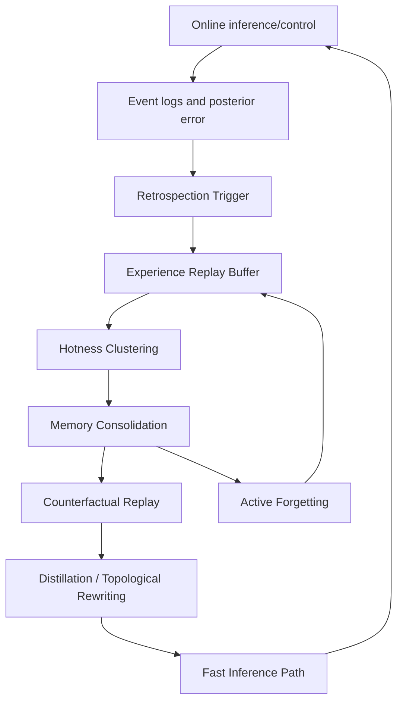
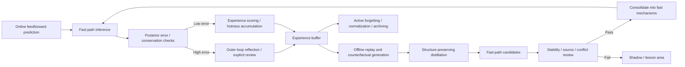

# SGD-Net Retrospective Analysis and Dynamic Self-Evolution Mechanisms: White Paper

> Reading boundary: cognitive analogies, reasoning from expert perspectives, and theoretical mappings are the author's research discussion. They do not imply external expert review, endorsement by a research institution, or completed proofs of the corresponding theorems.

> Public research edition · 2026-09-12. Model methods, formulas, and component designs are retained. This document describes a research proposal and does not claim existing training results, a complete implementation, or chip performance. Chapter numbering follows the original research index; gaps indicate separate planning material not published in this package.

> Version: v1.0\
> Date: 2026-06-07\
> Source: original discussion material (not included in this package)\
> Keywords: reflection, retrospective analysis, single-step review, deep reflection, dynamic organization, subconscious internalization, conscious processing, offline hippocampal replay, active forgetting, synaptic pruning, dynamic self-evolution, SGD-Retrospection

**Contents on this page**

- [1. Research Positioning](#section-001)
- [2. Core Conclusions](#section-002)
- [3. Engineering Abstraction of Human Reflection](#section-003)
- [4. Existing SGD-Net Mechanisms and Reflection](#section-008)
- [5. Core Addition: SGD-Retrospection Layer](#section-012)
- [6. Dynamic Organization: Turning Frequent Processing into Fast Reasoning](#section-015)
- [7. Internalizing Explicit Processing into Implicit Fast Mechanisms](#section-021)
- [8. Mechanism A: Offline Hippocampal Replay and Active Generative Adversarial Evolution](#section-025)
- [9. Mechanism B: Brain-Inspired Synaptic Decay and Active Forgetting in Multilevel Memory](#section-030)
- [10. Four Major Online Evolution Mechanisms](#section-035)
- [11. Complete Operational Loop](#section-042)
- [12. Suggested Engineering Modules](#section-043)
- [13. Validation Metrics](#section-047)
- [14. Relationship to Other Documents](#section-048)
- [15. Risks and Boundaries](#section-049)
- [16. Conclusion](#section-050)
- [Reflection, Review, and Retrospective Analysis Supplement (2026-09-12)](#section-051)

---

## 1. Research Positioning <a href="#section-001" id="section-001"></a>

Earlier documents defined:

1. The `SGD-Net` model backbone: SSM + GNN + Dynamic Tree + Posterior Error + Stability Projection;
2. `SGD-Control` dual-loop control: feedforward prediction + posterior feedback + memory + source monitoring + knowledge classification;
3. The `SGD-Ecosystem` virtual-real loop: wet-lab experiments, digital twins, and bidirectional manifold folding;
4. The `SGD-XPU / SGD-XSoC` hardware foundation: CPU/Fabric + PPU + SGD-TPU.

The original discussion material (not included in this package) raises a further key question:

> If SGD-Net is positioned as a model architecture that continually evolves through practice and learning, what mechanisms actually make it “smarter with use”?

This document answers:

> SGD-Net self-evolution should not depend solely on traditional backpropagation. A dynamic organization system should combine “dual-loop control, multilevel memory, knowledge classification, dynamic reasoning acceleration, offline retrospective analysis, and active forgetting.” It progressively organizes, compresses, distills, and consolidates frequently used, effective, stable complex processing paths from expensive explicit reasoning into fast reasoning mechanisms, while actively forgetting low-value, outdated, redundant, and non-structure-preserving details.

This document develops [SGD-Net Dual-Loop Control and Brain-Inspired Cognitive Architecture](14.md): document `14` explains the control and cognitive skeleton; this document explains how that skeleton drives continual model improvement.

## 2. Core Conclusions <a href="#section-002" id="section-002"></a>

SGD-Net's reflection and improvement mechanism can be summarized in one sentence:

> Online, posterior error discovers “surprise”; in the short term, single-step review corrects deviations; in the medium term, dynamic organization internalizes frequent successful paths as fast reasoning pipelines; offline, counterfactual replay and active forgetting provide long-term self-evolution.

It contains four levels:

| Level | Mechanism | Role | Human analogy |
|---|---|---|---|
| Single-step review | Inner-loop error correction | Quickly correct the current action without changing the overall paradigm | Small steering adjustments while driving |
| Deep reflection | Outer-loop posterior review | Question and modify current strategies, topology, or knowledge classification | Reviewing why a failure occurred |
| Dynamic organization | Memory consolidation and fast-path consolidation | Organize frequent processing into low-latency paths | Skill internalization, muscle memory |
| Active forgetting | Decay, pruning, normalization, compression | Prevent continued learning from bloating the model | Synaptic pruning, forgetting noise |

“Subconscious/conscious processing” and “hippocampus/sleep” here are heuristic engineering analogies, not claims that SGD-Net precisely simulates a biological brain.

The original discussion material (not included in this package) further extends self-evolution from single-device retrospective analysis to a generational mechanism of “constrained edge adaptation + safe cloud merging”: edge devices produce only small auditable, privacy-sanitizable deltas; the cloud uses conflict detection, sandbox merging, reverse self-distillation, and regression gates to form next-generation candidate kernels. This remains an engineering research direction and should not be described as unrestricted self-rewriting.

## 3. Engineering Abstraction of Human Reflection <a href="#section-003" id="section-003"></a>

Human reflection and retrospective analysis can be abstracted into four mechanisms.

### 3.1 Experience Replay <a href="#section-004" id="section-004"></a>

During rest, sleep, or pauses, people replay compressed recent experiences. The engineering counterpart is:

```text
experience buffer
  → replay sampler
  → trajectory reconstruction
  → rule extraction
  → long-term consolidation
```

In SGD-Net, an experience buffer can be represented as:

$$
\mathcal{B}=\{(\mathcal{G}_t,a_t,\hat{y}_t,y_t,\eta_t,source_t,cost_t)\}_{t=1}^{T}
$$

Here:

- $$\mathcal{G}_t$$ is graph state;
- $$a_t$$ is the control action;
- $$\hat{y}_t$$ is the model prediction;
- $$y_t$$ is real feedback or a highly trustworthy simulation;
- $$\eta_t$$ is posterior error;
- $$source_t$$ is the source tag;
- $$cost_t$$ is computational cost or latency.

### 3.2 Dual-System Conflict <a href="#section-005" id="section-005"></a>

Humans have a fast intuitive system and a slow rational system. SGD-Net counterparts are:

| Human cognition | SGD-Net model/system mapping | Role |
|---|---|---|
| System 1 / fast intuition | SSM + GNN + Dynamic Tree fast paths | Low-cost forward computation in routine conditions |
| System 2 / slow reasoning | Posterior error, stability projection, PPU/high-precision solving | Re-examine abnormal conditions |
| Conflict signal | Posterior error $$\eta$$, drift $$r^{drift}$$, conservation violations | Trigger reflection and reconstruction |

### 3.3 Counterfactual Reasoning <a href="#section-006" id="section-006"></a>

Reflection not only replays what happened; it also asks:

> What would have happened with a different action, boundary condition, temperature, or pressure?

The SGD-Net counterpart is a counterfactual sandbox:

$$
\tau^{cf}=\operatorname{Rollout}(f_{twin},s_t,a_t+\Delta a,b_t+\Delta b)
$$

Here $$\Delta a,\Delta b$$ are action or boundary-condition perturbations.

### 3.4 Metacognitive Monitoring <a href="#section-007" id="section-007"></a>

People can sense “I am uncertain” or “my current intuition is unreliable.” In SGD-Net this corresponds to a metacognitive threshold:

$$
\Gamma_t=\phi_\Gamma(\eta_t,r_t^{drift},r_t^{source},V_t,uncertainty_t)
$$

When $$\Gamma_t$$ is high, the system enters cautious mode:

- Increase posterior check frequency;
- Reduce feedforward plan weight;
- Require high-precision correction;
- Increase data sampling or experimental validation;
- Prohibit direct hypothesis promotion.

## 4. Existing SGD-Net Mechanisms and Reflection <a href="#section-008" id="section-008"></a>

### 4.1 Dual-Loop Control <a href="#section-009" id="section-009"></a>

Dual-loop control is the control-theoretic engine of reflection.

| Control layer | Review type | Role |
|---|---|---|
| Inner-loop feedback | Single-step review | Adjust the current state or action using instantaneous error $$\delta_t$$ |
| Outer-loop feedback | Deep reflection | Modify strategy, structure, or knowledge classification using long-term posterior error $$\eta_{t:t-k}$$ |

Single-step error can be written as:

$$
\delta_t=d(\hat{y}_t,y_t)
$$

Outer-loop reflection error can be written as:

$$
\eta_t^{deep}=\sum_{k=0}^{K}\gamma^k\eta_{t-k}+\lambda_d r_t^{drift}+\lambda_s r_t^{source}
$$

When:

$$
\eta_t^{deep}>\epsilon_{reflect}
$$

deep reflection is triggered.

### 4.2 Multilevel Memory System <a href="#section-010" id="section-010"></a>

Multilevel memory supplies reflection with material and time scales.

| Memory level | Reflection use | Engineering implementation |
|---|---|---|
| Instantaneous memory | Current single-step correction | register / current graph message |
| Short-term memory | Review recent segments | SSM hidden state / local cache |
| Medium-term memory | Reorganize recent experience | dynamic tree leaves / adapters |
| Long-term memory | Major offline reflection | replay buffer / evidence store / HBM |
| Shadow memory | Low-confidence hypothesis sandbox | shadow graph-tree |

### 4.3 Knowledge Classification <a href="#section-011" id="section-011"></a>

Knowledge classification is the destination of reflection outcomes, rather than static drawers.

| Reflection result | Storage destination | Subsequent behavior |
|---|---|---|
| Stable effective path | Positive experience / fast path | Prioritize use and allow consolidation |
| Failed path | Lesson exclusion region / blocked path | Trigger circuit breaking or rollback next time |
| Unverified inference | Shadow graph-tree | Participate in reasoning only in a sandbox |
| Outdated path | Decay candidate | Enter pruning or forgetting |
| High-value anomaly | replay buffer | Offline counterfactual review |

## 5. Core Addition: SGD-Retrospection Layer <a href="#section-012" id="section-012"></a>

Introduce a new level in the full SGD-Net: the `SGD-Retrospection Layer`.

This is a reflection and dynamic organization layer spanning online/offline phases, rather than an ordinary forward layer.



### 5.1 Trigger Conditions <a href="#section-013" id="section-013"></a>

The reflection layer may be triggered by:

| Condition | Meaning |
|---|---|
| $$\eta_t>\epsilon$$ | Abnormal posterior error |
| $$r_t^{drift}>\epsilon_d$$ | Concept drift |
| $$Cost(path)>\epsilon_c$$ | Excessive cost of a frequently used path |
| $$freq(path)>\epsilon_f$$ | A path occurs frequently |
| idle / offline | An idle or offline system window |
| memory pressure | Multilevel memory capacity is tight |

### 5.2 Reflection Layer Outputs <a href="#section-014" id="section-014"></a>

| Output | Role |
|---|---|
| `FastPathCandidate` | Fast reasoning pipeline awaiting consolidation |
| `LessonPatch` | Lessons, blocking conditions, or risk barriers |
| `ForgetPlan` | Memory/topology awaiting pruning, decay, or normalization |
| `ThresholdUpdate` | Updates to metacognitive thresholds and arbitration policies |
| `ReplayDataset` | Offline replay and counterfactual sample collection |

## 6. Dynamic Organization: Turning Frequent Processing into Fast Reasoning <a href="#section-015" id="section-015"></a>

The key point raised by the user is “dynamic organization.” This is structural rewriting during model operation, rather than simple acceleration.

### 6.1 Hotness Clustering <a href="#section-016" id="section-016"></a>

Define a hotness score for processing path $$p$$:

$$
H(p)=\frac{Freq(p)\cdot Gain(p)\cdot Trust(p)\cdot Stability(p)}{Cost(p)+\epsilon}
$$

Here:

- $$Freq(p)$$: invocation frequency;
- $$Gain(p)$$: latency or computation saved by accelerating the path;
- $$Trust(p)$$: posterior validation confidence;
- $$Stability(p)$$: whether conservation/stability constraints are met;
- $$Cost(p)$$: storage, maintenance, and inference cost.

When:

$$
H(p)>\tau_{hot}
$$

the path enters the dynamic organization candidate set.

### 6.2 Memory Consolidation across Levels <a href="#section-017" id="section-017"></a>

A processing path may be scattered across memory levels:

```text
instant messages
+ short-term SSM trace
+ medium-term tree leaves
+ long-term replay records
+ source/evidence tags
```

The organization process is:

$$
Z_p=\operatorname{Consolidate}(\mathcal{B}_p^{inst},\mathcal{B}_p^{short},\mathcal{B}_p^{mid},\mathcal{B}_p^{long})
$$

### 6.3 Privacy Sanitization and Causal Skeleton Extraction <a href="#section-018" id="section-018"></a>

Not all details should be consolidated. Retain:

- Reproducible input-output mappings;
- Main causal chains satisfying physical/logical conservation;
- Features with high mutual information with task objectives;
- Evidence with low posterior error and trustworthy sources.

Define:

$$
CausalCore(p)=\arg\max_{z\subset Z_p}\left[MI(z;y)-\lambda Noise(z)-\mu Complexity(z)\right]
$$

### 6.4 Reconstruction Compilation <a href="#section-019" id="section-019"></a>

Dynamic organization centers on compiling expensive explicit processing into fast reasoning pipelines:

$$
FastPath_p=\operatorname{Compile}_{retro}(CausalCore(p))
$$

In engineering terms:

```text
high-cost explicit routine
  → causal feature chain
  → low-rank adapter / tree path / SSM state shortcut
  → fast inference path
```

### 6.5 Consolidation Conditions <a href="#section-020" id="section-020"></a>

A fast path cannot be consolidated merely because it is “frequent.” It must also satisfy:

$$
\bar{\eta}_p<\epsilon_{fast},\quad
\Delta V_p\le \delta_V,\quad
Trust(p)>\tau_{trust},\quad
Conflict(p)=0
$$

Otherwise it remains a candidate and does not enter the backbone fast paths.

## 7. Internalizing Explicit Processing into Implicit Fast Mechanisms <a href="#section-021" id="section-021"></a>

### 7.1 Structural Transfer, Not Merely a Speed Difference <a href="#section-022" id="section-022"></a>

The key to “conscious/subconscious processing” is not speed, but:

| Dimension | Explicit processing | Implicit fast mechanism |
|---|---|---|
| Representation | High-dimensional, interpretable, preserves degrees of freedom | Low-rank, compressed, topological |
| Execution | Dynamic solving | Direct routing/scanning |
| Knowledge form | Equations, evidence, counterfactual trajectories | Adapters, tree paths, state caches, topology weights |
| Trigger | Anomalies or high risk | Routine high-frequency conditions |

### 7.2 Structure-Preserving Distillation <a href="#section-023" id="section-023"></a>

Use a highly trustworthy explicit solver or PPU trajectories as the teacher:

$$
\mathcal{L}_{distill}=\|F_{fast}(x;\theta_f)-F_{explicit}(x)\|^2
+\lambda\mathcal{L}_{inv}+\mu\mathcal{L}_{complexity}
$$

Here $$\mathcal{L}_{inv}$$ represents conservation or invariant constraints.

### 7.3 Topological Hardening <a href="#section-024" id="section-024"></a>

When a path remains frequent, low-error, and low-risk over time, stabilize its local parameters:

$$
\theta_p \leftarrow (1-\alpha)\theta_p+\alpha\theta_p^{distilled}
$$

Also reduce path-search cost:

$$
route(x)\rightarrow p^* \quad \text{if } condition_{p^*}(x)=1
$$

This is model-level “internalization of frequent processing.”

## 8. Mechanism A: Offline Hippocampal Replay and Active Generative Adversarial Evolution <a href="#section-025" id="section-025"></a>

### 8.1 Basic Idea <a href="#section-026" id="section-026"></a>

Online systems handle errors that have already occurred. Offline replay permits intensive review of historical errors and high-value anomalies during idle periods.

Counterfactual replay goes further by actively generating plausible extreme situations that have not occurred.

### 8.2 Counterfactual Generation <a href="#section-027" id="section-027"></a>

Perturb historical trajectory $$\tau$$:

$$
\tau^{cf}=\operatorname{Counterfactual}(\tau,\xi)
$$

Perturbation $$\xi$$ may include:

- Boundary-condition changes;
- Action changes;
- Environmental parameter changes;
- Sensor noise changes;
- Material parameter changes;
- Local graph topology breaks or reconnections.

### 8.3 Adversarial Self-Evolution Objective <a href="#section-028" id="section-028"></a>

This can be written as:

$$
\min_{\theta_{fast}}\max_{\xi\in\Xi}\ \mathcal{L}_{retro}(F_{fast}(\tau^{cf};\theta_{fast}),F_{teacher}(\tau^{cf}))
+\lambda\mathcal{L}_{stable}
$$

The meaning is:

- The generator searches for harder counterfactual conditions;
- Fast paths learn to retain low error under those conditions;
- The stability term prevents fitting extreme samples from damaging normal-condition performance.

### 8.4 Offline Replay Process <a href="#section-029" id="section-029"></a>

```text
collect surprise events
  → sample high-value replay traces
  → generate counterfactual perturbations
  → teacher solver / high-trust simulator evaluates
  → distill into fast path candidates
  → validate invariants
  → promote / quarantine / discard
```

## 9. Mechanism B: Brain-Inspired Synaptic Decay and Active Forgetting in Multilevel Memory <a href="#section-030" id="section-030"></a>

### 9.1 Why Forgetting Is Needed <a href="#section-031" id="section-031"></a>

Learning and consolidation without forgetting cause:

- Unbounded dynamic tree expansion;
- Conflicting fast paths;
- HBM/replay buffers overwhelmed by low-value samples;
- Old-environment experience interfering with new environments;
- Inference becoming slower rather than faster.

Forgetting is therefore a necessary part of self-evolution, rather than a defect.

### 9.2 Path Value State <a href="#section-032" id="section-032"></a>

Define a value state for fast path $$p$$:

$$
S_p(t+1)=\beta S_p(t)+r_p(t)-\lambda_c Cost_p(t)-\lambda_r Risk_p(t)
$$

Here $$r_p(t)$$ comes from rewards for successful prediction, low error, and low latency.

If:

$$
S_p(t)<\tau_{decay}
$$

the path becomes a decay candidate.

If it remains below:

$$
S_p(t)<\tau_{prune}
$$

prune or archive it.

### 9.3 Three-Layer Active Forgetting Filter <a href="#section-033" id="section-033"></a>

| Layer | Target | Action |
|---|---|---|
| Noise evaporation | Instantaneous noise and low-confidence data without sources | Delete after computation or retain only a summary |
| Topology pruning | Long-inactive or high-risk fast paths | Downweight, break, archive |
| Manifold normalization | Multiple similar experience groups | Merge into invariants and remove redundant raw samples |

### 9.4 Forgetting Does Not Mean Deleting Evidence <a href="#section-034" id="section-034"></a>

In scientific scenarios, raw evidence chains may need to be retained for auditing. Distinguish:

| Action | Meaning |
|---|---|
| `evaporate` | Delete instantaneous low-value noise |
| `compress` | Retain summaries and fingerprints; delete redundant details |
| `archive` | Move to low-cost long-term storage, excluded from fast reasoning |
| `prune` | Remove from fast paths and dynamic trees |
| `quarantine` | Isolate questionable knowledge while retaining audit evidence |

## 10. Four Major Online Evolution Mechanisms <a href="#section-035" id="section-035"></a>

SGD-Net can currently adopt four classes of self-evolution mechanisms.

### 10.1 Dynamic Topological Plasticity <a href="#section-036" id="section-036"></a>

This corresponds to human synaptic plasticity. A rule can be written as a local Hebbian / STDP-like update:

$$
\Delta w_{ij}=\alpha\cdot pre_i(t)\cdot post_j(t+\Delta t)\cdot R_t
$$

Here $$R_t$$ is a posterior validation or stability reward.

### 10.2 Structure-Preserving Distillation <a href="#section-037" id="section-037"></a>

Distill highly trustworthy explicit solve results into fast paths:

$$
\theta_{fast}^{*}=\arg\min_\theta \mathcal{L}_{distill}(\theta)
$$

### 10.3 Memory Consolidation across Levels <a href="#section-038" id="section-038"></a>

Organize fragmented experience in multilevel memory into reusable skills:

$$
Skill_k=\operatorname{Consolidate}(\{\tau_i\}_{i\in\mathcal{I}_k})
$$

### 10.4 Metacognitive Threshold Evolution <a href="#section-039" id="section-039"></a>

Adjust trust in fast paths according to environmental stability:

$$
\epsilon_{reflect}(t+1)=\epsilon_{reflect}(t)+\alpha(Trust_t-Risk_t)
$$

### 10.5 Edge Delta Snapshots and Collective Feedback <a href="#section-040" id="section-040"></a>

A deployment becoming “smarter with use” should not directly mean rewriting backbone weights online. A safer approach is local constrained adaptation and retrospective analysis, uploading only small privacy-sanitized, signed, locally validated increments as `EvolutionaryDeltaSnapshot`.

Suggested snapshot fields:

```text
EvolutionaryDeltaSnapshot:
  device_id_hash: str
  model_version: str
  task_domain: str
  source_policy: str
  delta_type: ssm_bias | adapter | tree_rule | harness_threshold | jsbo_calibration
  delta_payload_ref: str
  validation_summary: dict
  safety_summary: dict
  privacy_summary: dict
  trace_refs: list[str]
  signature: str
```

After receiving a delta, the cloud must perform:

```text
verify signature / source / privacy
  → cluster by domain and geometry
  → detect conflict and poisoned update
  → merge in sandbox
  → distill to candidate adapter or fast path
  → run Harness regression and replay benchmark
  → canary rollout / rollback
```

Optional merging methods include FedAvg, Model Soup, Task Arithmetic, TIES-Merging, and Riemannian / tangent-space merging that first aligns manifold parameters in a tangent space. All merge results must record a `ModelMergeTrace` and by default be promoted only to candidate adapters, fast paths, or local calibration, rather than directly overwriting the backbone.

### 10.6 Reverse Self-Distillation and Generational Kernel Upgrades <a href="#section-041" id="section-041"></a>

Collective feedback aims to generate verifiable next-generation candidates, rather than mechanically average all edge experience:

```text
G_k kernel
  + verified deltas
  + replay / counterfactual suite
  + Harness regression
  → distilled G_{k+1} candidate
  → canary rollout
  → rollback if safety metrics regress
```

This can be called “reverse self-distillation”: edge experience first forms a candidate teacher ensemble; the cloud then distills shared capabilities into unified adapters, fast paths, or calibration tables. If regression tests reveal forgetting, conflict, or safety degradation, quarantine the candidate rather than release it.

## 11. Complete Operational Loop <a href="#section-042" id="section-042"></a>



## 12. Suggested Engineering Modules <a href="#section-043" id="section-043"></a>

### 12.1 Main Engineering Package <a href="#section-044" id="section-044"></a>

Add the `sgd_net.retrospection` package to the Python implementation.

```text
sgd_net/retrospection/
  event_recorder.py             # Record surprise error, control actions, sources, and costs
  replay_buffer.py              # Manage online/offline experience buffers
  hotness_clustering.py          # Identify frequent, beneficial, trustworthy processing paths
  memory_consolidator.py         # Cross-level memory consolidation and causal skeleton extraction
  counterfactual_generator.py    # Generate counterfactual perturbations and extreme conditions
  retrospection_compiler.py      # Compile expensive processing into fast reasoning candidates
  distillation_trainer.py        # Structure-preserving distillation and fast-path training
  fast_path_registry.py          # Manage consolidated fast paths
  decay_pruner.py                # Decay, pruning, compression, and active forgetting
  metacognitive_threshold.py     # Metacognitive thresholds and reflection triggers
  delta_snapshot.py              # Edge delta snapshots and privacy-sanitized summaries
  merge_trace.py                 # Collective merge process and audit records
sgd_net/collective/
  merge_sandbox.py               # Cloud sandbox merging and regression gates
  conflict_resolver.py           # Delta conflict, sign direction, and poisoning detection
  distillation_merger.py         # Reverse self-distillation and candidate generational kernels
```

### 12.1 Key Data Structures <a href="#section-045" id="section-045"></a>

```text
ReflectionEvent:
  event_id: str
  graph_state_ref: str
  action: str
  prediction_ref: str
  observation_ref: str
  posterior_error: float
  stability_delta: float
  source_report: dict
  compute_cost: dict
  timestamp: datetime
```

```text
FastPathCandidate:
  path_id: str
  trigger_condition: dict
  compressed_core: dict
  adapter_ref: str
  expected_gain: float
  validation_error: float
  stability_report: dict
  source_confidence: float
  status: candidate | promoted | quarantined | pruned
```

```text
ForgetPlan:
  target_id: str
  target_type: fast_path | replay_trace | tree_branch | memory_record
  action: evaporate | compress | archive | prune | quarantine
  reason: str
  expected_memory_saved: int
  audit_policy: dict
```

```text
EvolutionaryDeltaSnapshot:
  snapshot_id: str
  model_version: str
  task_domain: str
  delta_type: str
  delta_payload_ref: str
  validation_summary: dict
  safety_summary: dict
  privacy_summary: dict
  trace_refs: list[str]
  status: local_only | submitted | accepted | rejected | quarantined
```

```text
CollectiveMergeReport:
  merge_id: str
  input_snapshot_refs: list[str]
  merge_method: fedavg | model_soup | task_vector | ties | distillation | tangent_space
  conflict_summary: dict
  regression_summary: dict
  harness_summary: dict
  promoted_artifact_ref: str | None
  rollback_policy: dict
```

### 12.2 Optional: Narrative Dream Creation Subsystem <a href="#section-046" id="section-046"></a>

The original discussion material (not included in this package) notes that Retrospection's “offline replay + counterfactual perturbation + dynamic organization + active forgetting” can transfer to nonindustrial creative scenarios. It should be an independent subsystem, not part of the industrial control backbone by default.

```text
sgd_net/retrospection/narrative/
  story_graph.py              # Characters, events, places, themes, and foreshadowing graph
  plot_tree.py                # Plot branching, conflict escalation, subplot pruning
  dream_perturbation.py       # Random perturbations of imagery, emotion, and conflict
  narrative_critic.py         # Scores for world-building consistency, character motivation, causal closure
  cliche_pruner.py            # Prune clichés and repeated scenes
  draft_consolidator.py       # Review drafts, merge scenes, resolve foreshadowing
```

The corresponding objective is narrative consistency rather than physical conservation:

$$
\mathcal{L}_{story}=\lambda_1\mathcal{L}_{character}
+\lambda_2\mathcal{L}_{causality}
+\lambda_3\mathcal{L}_{theme}
+\lambda_4\mathcal{L}_{novelty}
-\lambda_5\mathcal{L}_{cliche}
$$

Explicit boundary: narrative dream outputs are creative candidates only; they must not be labeled real experience, experimental facts, or a basis for engineering control.

## 13. Validation Metrics <a href="#section-047" id="section-047"></a>

| Metric | Meaning |
|---|---|
| Single-step review latency | Time for inner-loop error correction |
| Reflection trigger accuracy | Whether high-value anomalies are captured |
| Fast-path hit rate | Proportion of later tasks using consolidated paths |
| Fast-path error | Error of consolidated paths relative to explicit paths |
| Mean inference cost reduction | Whether cost decreases after dynamic organization |
| Error recurrence reduction | Whether similar errors become less frequent |
| Memory compression ratio | Compression benefits for replay buffers / trees / fast paths |
| Active forgetting false-deletion rate | Whether valuable paths are mistakenly deleted |
| OOD safety rate | Whether out-of-distribution scenarios trigger outer-loop reflection |

## 14. Relationship to Other Documents <a href="#section-048" id="section-048"></a>

| Document | Relationship |
|---|---|
| [SGD-Net Model Architecture and Layer Operators](13.md) | Adds reflection, dynamic organization, and fast-path consolidation beyond the forward pass |
| [SGD-Net Dual-Loop Control and Brain-Inspired Cognitive Architecture](14.md) | Develops how dual loops, multilevel memory, and knowledge classification become self-evolution capabilities |
| [SGD-Ecosystem Physical Embodiment, Digital Twins, and Bidirectional Manifold Folding](15.md) | Counterfactual replay and experiment review depend on virtual-real loop data |
| Separate research material (not included in this package) | XPU/XSoC provides the hardware foundation for offline replay, unified memory, and fast-path consolidation |
| [SGD-Net and JEPA World-Model Integration with the JSBO Bridge Operator](18.md) | JEPA latent traces can supply replay data; JSBO bridge paths can enter dynamic organization and fast-path consolidation |
| [SGD-Net Hybrid Solving and Training System and World-Model Research Roadmap](27.md) | Extends self-evolution to edge deltas, collective merging, reverse self-distillation, and generational kernel upgrades |
| `03-06` implementation documents | Add the `sgd_net.retrospection` engineering package, interfaces, and development plan |

## 15. Risks and Boundaries <a href="#section-049" id="section-049"></a>

| Risk | Explanation | Mitigation |
|---|---|---|
| Excessive brain analogy | Cannot claim exact reproduction of a biological brain | Use only heuristic engineering language |
| Fast-path overfitting | Frequent paths may apply only under local conditions | Require source, stability, and counterfactual validation before consolidation |
| Mistaken active forgetting | Low-frequency but critical safety knowledge is deleted | Make safety knowledge read-only or archived, without direct pruning |
| Offline replay contaminates the backbone | Generated counterfactual samples may be unrealistic | Add physical conservation and source tags; first place in the shadow area |
| Dynamic organization disrupts real-time control | Background organization competes for resources | Set offline windows, priorities, and lock-protection protocols |
| Poisoned collective merging | Edge deltas may contain malicious, conflicting, or privacy-sensitive information | Signatures, privacy sanitization, source tags, anomaly detection, sandbox merge, TIES-like conflict resolution, and rollback |

## 16. Conclusion <a href="#section-050" id="section-050"></a>

The core contribution of the original discussion material (not included in this package) is to turn SGD-Net's “dynamic evolution” from a vision into an implementable chain of mechanisms:

```text
Posterior error discovers surprise
→ single-step review quickly corrects deviations
→ deep reflection identifies paradigm problems
→ multilevel memory is dynamically organized
→ frequent processing is consolidated into fast reasoning paths
→ offline counterfactual replay improves robustness
→ safely merged edge deltas form generational candidates
→ active forgetting releases capacity and prevents bloat
```

Becoming “smarter with use” therefore means more than simple continuous training:

> Discover valuable experience through retrospective analysis, internalize frequent processing into fast mechanisms through dynamic organization, keep the model lightweight through active forgetting, and use metacognitive thresholds to judge when intuition is trustworthy and when renewed reflection is required.

SGD-Net should therefore be a closed-loop model architecture capable of self-organization, self-compression, self-pruning, and self-evolution, in addition to reasoning.

## Reflection, Review, and Retrospective Analysis Supplement (2026-09-12) <a href="#section-051" id="section-051"></a>

This update distinguishes review, retrospective analysis, and reflection, and clarifies event memory, error attribution, counterfactual boundaries, and subsequent validation. The original human cognition analogies do not prove mechanisms; real feedback and simulation outputs should be recorded separately.

See [50-SGD-Net Foundations and Closed-Loop Completion of Reflection, Review, and Retrospective Analysis 20260912](50.md) for detailed responsibilities, mathematical connections, a grasping example, and experimental controls. This is a documentation design extension, not yet implemented or validated through training.

---

[← Previous](14.md) · [Book contents](../SUMMARY.md) · [Next →](50.md)
