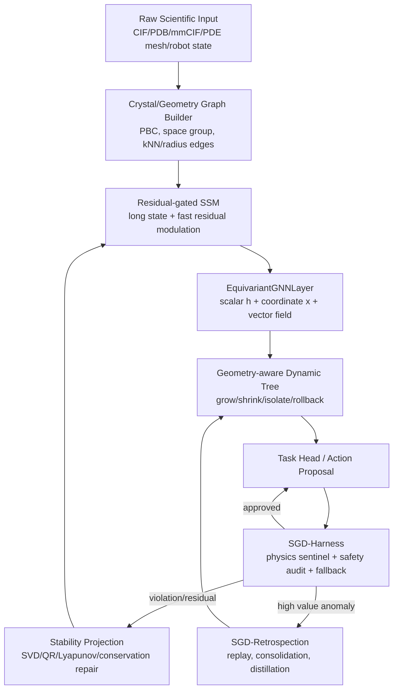

# SGD-Harness Physical Conservation Sentinel and Equivariant Self-Evolution Loop

> Public research edition · 2026-09-12. Model methods, equations, and component designs are retained; this document describes research proposals and does not claim existing training results, a complete implementation, or chip performance. Section numbering follows the original research index; gaps indicate independent planning content not included in this release.

> Version: v1.1
> Date: 2026-07-09
> Upstream source: [New Idea Discussion_20260613_Equivariant GNN and Self-Evolving Architecture](24.md)\
> Aligned documents: [SGD-Net Model Architecture and Layer Operators in Detail](13.md), [SGD-Net Dual-Loop Control and Brain-Inspired Cognitive Architecture](14.md), [SGD-Net Reflection, Retrospective Analysis, and Dynamic Self-Evolution Mechanisms](17.md), independent research materials (not included), independent research materials (not included)\
> Positioning: Formally incorporate discussion of “equivariant GNN + SSM + dynamic trees + physical-conservation Harness” into the SGD-Net / SGD-XPU main track.

**On this page**

- [1. Conclusions First](#section-001)
- [2. Why This Builds on the Existing Direction](#section-002)
- [2.1 Assessment and Decision Process](#section-003)
- [3. Overall Architecture](#section-004)
- [4. Core Mechanism One: EquivariantGNNLayer](#section-005)
- [5. Core Mechanism Two: SGD-Harness](#section-008)
- [6. Core Mechanism Three: Geometry-aware Dynamic Tree](#section-013)
- [7. Core Mechanism Four: Residual-gated SSM](#section-017)
- [8. Core Mechanism Five: CrystalGraphBuilder and Materials Applications](#section-020)
- [10. Recommended Implementation Roadmap](#section-023)
- [11. Risk Boundaries](#section-027)
- [12. One-Sentence Summary](#section-028)

---

## 1. Conclusions First <a href="#section-001" id="section-001"></a>

The greatest value of document `24` to this project is not introducing EGNN alone, but upgrading SGD-Net's core loop from:

```text
SSM + GNN + Dynamic Tree + Posterior Error + Stability Projection
```

to:

```text
SSM + Topological/Equivariant GNN + Dynamic Tree + Physics Harness + Stability Projection + Retrospection
```

Specifically:

| Added/strengthened component | Role | Significance for the current project |
|---|---|---|
| `EquivariantGNNLayer` | Gives 3D physical objects such as molecules, crystals, particle fields, and robots rotation/translation equivariance | Upgrades ordinary GNNs to geometric physical GNNs |
| `SGD-Harness` | Outer runtime conservation sentinel checking physics, safety, audit, and fallback | Connects Posterior Error / SafetyAudit / EICU / Retrospection into an executable safety chain |
| `Geometry-aware Dynamic Tree` | Uses invariant scalars for local grow/shrink rather than blind split/prune | Turns dynamic trees into adaptive mesh/lattice refinement controllers |
| `Residual-gated SSM` | Uses physical residuals as selective-gating inputs for fast short-term inference adaptation | Upgrades SSMs from “memory layers” to “control modulators” |
| `CrystalGraphBuilder` | Explicitly supports unit cells, periodic boundaries, space groups, and invariant features | Makes the materials SDK and crystal/semiconductor applications more specialized |
| `Geometry Op Family` | Collects traces for relative distance, equivariant coordinate updates, PBC neighbors, etc. | Supplies evidence for new SGD-TPU hardware opportunities |
| `Metric / Manifold Op Family` | Collects traces for longer-term hyperbolic, Lorentz, quasi-metric, exp/log map, and related operators | Supplies evidence for the G-GeoS multimetric-manifold research option |

In one sentence:

> SGD-Harness is SGD-Net 2.0's runtime shell: EGNN provides structural geometric equivariance, dynamic trees decide where to grow/shrink, SSM absorbs short-term residuals, Harness checks physical and safety boundaries, and Retrospection consolidates valuable new structures over the long term.

## 2. Why This Builds on the Existing Direction <a href="#section-002" id="section-002"></a>

The project already has these foundations:

| Current capability | Document location | Relationship to document 24 |
|---|---|---|
| SSM / Mamba state evolution | `13`, `11`, `SGD-TPU芯片架构/01` | Can become residual-gated SSM |
| GNN topology propagation | `13` | Can split into TopoGNN and EGNN paths |
| Dynamic-tree split/prune/rollback | `13`, `14`, `17`, `11` | Can become geometric grow/shrink controllers |
| Posterior Error | `13`, `14` | Can enter Harness physical-residual inputs |
| Stability Projection | `13`, `11` | Can serve as Harness stability-repair actions |
| SafetyAudit / EICU | `SGD-XPU系统工程补全/03`, `SGD-XPU扩展功能IP四件套/03` | Can serve as Harness safety-interlock and audit backends |
| Trace / Benchmark | `SGD-Trace与Benchmark规范/` | Can record geometry / harness / grow-shrink traces |

Document `24` therefore enhances the existing direction through **geometric physics, runtime safety, materials/crystal specialization, and hardware evidence**, rather than creating a new direction.

## 2.1 Assessment and Decision Process <a href="#section-003" id="section-003"></a>

From document `24` to this document, my reasoning filters ideas through five criteria rather than adding every new concept to the main track:

| Criterion | Assessment question | Result |
|---|---|---|
| Architectural necessity | Does it fill a real gap in SGD-Net's current core loop? | EGNN, Harness, geometric dynamic trees, and residual-gated SSM are necessary enhancements |
| Existing foundations | Are adjacent modules already available for inexpensive integration? | SSM, GNN, dynamic trees, SafetyAudit, and Trace/Benchmark exist and can be incorporated smoothly |
| Differentiation | Can it distinguish SGD-XPU from mainstream GPUs/TPUs? | Geometry op families, dynamic grow/shrink, and Harness traces have hardware-differentiation potential |
| Verifiability | Can benchmarks, traces, and CModels validate it beyond concepts? | `crystal_egnn_refinement`, geometry traces, and harness_check can form an evidence chain |
| Controllable risk | Can fallback, rollback, safety levels, and phase gates manage risks? | Harness + Stability Projection + Retrospection can provide fallback support |

Accordingly, I narrow document `24`'s many ideas to **six groups of adoptable ideas**, ordered by implementation priority:

| # | Adoptable idea | Why selected | Priority |
|---|---|---|---|
| 1 | `EquivariantGNNLayer` | Addresses ordinary GNN limitations in 3D geometry and rotation/translation symmetry | P0 |
| 2 | `SGD-Harness` | Unifies posterior errors, physical conservation, safety audits, and fallback in a runtime shell | P0 |
| 3 | `Geometry-aware Dynamic Tree` | Upgrades abstract split/prune into geometric grow/shrink control | P0/P1 |
| 4 | `Residual-gated SSM` | Lets SSMs absorb residuals during inference for short-term adaptation instead of frequent fine-tuning | P1 |
| 5 | `CrystalGraphBuilder` | Explicitly supports unit cells, PBC, space groups, and defect masks in crystal/material tasks | P1 |
| 6 | `Geometry Op Family` | Adds EGNN/PBC/Harness operators to traces for evidence of SGD-TPU hardware opportunities | P1/P2 |
| 7 | `Metric / Manifold Op Family` | Adds multimetric, non-Euclidean, quasimetric, and manifold mappings to traces rather than immediate hardware realization | P2/P3 |

Several ideas are explicitly deferred:

| Deferred idea | Reason | Later condition |
|---|---|---|
| Immediately add independent `Geometry Unit` hardware IP | No real trace or CModel benefit evidence; risks premature hardening | Multiple workloads show stable geometry-op gains ≥1.5× |
| Fully support all crystallographic space groups from the start | High engineering complexity may slow the MVP | P0 starts with PBC + radius/kNN; add space groups in P1/P2 |
| Directly modify large-model weights online during inference | High risk of catastrophic forgetting or broken conservation | Start with SSM hidden-state fast paths and Retrospection slow paths |
| Use EGNN for every graph task | Knowledge/text graphs and MoE routing do not need 3D equivariance; cost is unjustified | Enable only for explicit geometry tasks |
| Immediately add complete `G-GeoS` multimetric-manifold hardware | Multimetric/non-Euclidean/quasimetric operators lack real traces and numerical gates; concepts risk leading evidence | Start with `MetricTrace`, `ManifoldTrace`, software references, and CModels |

Thus this document specifies **six groups of adoptable ideas, their integration points, risk boundaries, and engineering gates**, rather than broadly generalizing “equivariance + self-evolution.”

## 3. Overall Architecture <a href="#section-004" id="section-004"></a>



## 4. Core Mechanism One: EquivariantGNNLayer <a href="#section-005" id="section-005"></a>

### 4.1 Separation Principle <a href="#section-006" id="section-006"></a>

After adding EGNN, node information must be separated into three types:

| Information type | Examples | Transformation properties | Processing |
|---|---|---|---|
| Invariant scalars | Atom types, charge, mass, squared distances, energy density | Rotation/translation invariant | MLP / scalar message |
| Equivariant vectors | Coordinates, velocities, forces, displacements | Rotate together with inputs | Relative vector update |
| Structural metadata | Unit cells, periodic boundaries, space-group operations, edge types | Task dependent | GraphBuilder / Compiler |

### 4.2 Basic Operators <a href="#section-007" id="section-007"></a>

For edge $$(i,j)$$:

$$
r_{ij}=\|\mathbf{x}_i-\mathbf{x}_j\|^2
$$

$$
m_{ij}=\phi_e(h_i,h_j,r_{ij},e_{ij})
$$

Coordinate update:

$$
\Delta \mathbf{x}_i=\sum_{j\in\mathcal{N}(i)}(\mathbf{x}_i-\mathbf{x}_j)\phi_x(m_{ij})
$$

$$
\mathbf{x}_i'=\mathbf{x}_i+\Delta \mathbf{x}_i
$$

Scalar update:

$$
h_i'=\phi_h(h_i,\sum_j m_{ij})
$$

Thus, when input coordinates undergo global rotation $$R$$ and translation $$t$$, output coordinates transform correspondingly:

$$
\mathbf{x}'(R\mathbf{x}+t)=R\mathbf{x}'(\mathbf{x})+t
$$

## 5. Core Mechanism Two: SGD-Harness <a href="#section-008" id="section-008"></a>

### 5.1 Definition <a href="#section-009" id="section-009"></a>

`SGD-Harness` is an outer runtime guard shell. It does not directly replace neural computation; its responsibilities are:

1. Physical-residual detection;
2. Stability/conservation checks;
3. Enforcement of safety and audit policies;
4. Rollback / isolate / fallback;
5. Sending failed samples to Retrospection;
6. Trace evidence for hardware-opportunity reports.

### 5.2 Harness Inputs and Outputs <a href="#section-010" id="section-010"></a>

```text
SGDHarness.evaluate(
  graph_state,
  predicted_state,
  observed_state=None,
  physics_constraints=None,
  safety_policy=None,
  audit_context=None
) -> HarnessDecision
```

```text
HarnessDecision
  decision: accept | repair | rollback | isolate | fallback | manual_review
  guarantee_level: G0 | G1 | G2 | G3 | G4
  guarantee_contract_ref: str | None
  residuals:
    task_residual
    energy_residual
    momentum_residual
    charge_residual
    geometry_residual
    stability_residual
    safety_risk
  actions[]
  fallback_reason: str | None
  trace_id
  audit_record_ref
  evidence_record_ref: str
```

### 5.3 Residual Definitions <a href="#section-011" id="section-011"></a>

Harness can jointly manage:

$$
\eta_i=w_1r_i^{task}+w_2r_i^{physics}+w_3r_i^{topology}+w_4r_i^{drift}+w_5r_i^{confidence}+w_6r_i^{source}+w_7r_i^{equivariance}
$$

New residuals include:

| Residual | Meaning |
|---|---|
| $$r^{equivariance}$$ | Whether outputs satisfy equivariant consistency after input rotation/translation |
| $$r^{geometry}$$ | Atomic overlap, abnormal bond lengths, unit-cell boundary errors, topological tears |
| $$r^{conservation}$$ | Deviations from energy, momentum, charge, and mass conservation |

### 5.4 Guarantee Contracts, Decision Semantics, and Evidence Coverage <a href="#section-012" id="section-012"></a>

`accept` only permits a candidate to enter the next node under the current Harness policy; it does not automatically authorize execution on real devices. Safety-critical actions must simultaneously satisfy:

1. `GuaranteeContract` has not expired, and its model, dynamics, state domain, action domain, disturbance set, discrete step size, input saturation, and numerical tolerances match the current request;
2. The current state lies in the G2 local certificate's verified domain, with valid verifier/solver versions and residuals;
3. G3 monitor, shield, recovery, fallback, and watchdog meet WCET on target hardware;
4. Device interlocks, emergency stops, and human authorization are not bypassed by model outputs.

| Input evidence level | What Harness may do | What it must not do |
|---|---|---|
| G0 Empirical results | Simulation, offline ranking, shadow mode, counterexample generation | Authorize safety-critical actions |
| G1 Representation/statistical properties | Calibrate risk scores and trigger more observations or verification | Interpret non-collapse/low residuals as action safety |
| G2 Local certificates in specified domains | Pass to G3 runtime assurance for further decisions within contract domains | Extrapolate out of domain, across model mismatches, or to different precision |
| G3 Conditional runtime assurance | Conditionally accept with monitor/shield/fallback online and deadlines met | Claim QPs are never infeasible or systems absolutely safe |
| G4 System assurance case | Reference approved system-level evidence packages and operational conditions | Generate regulatory or functional-safety certification through Harness alone |

`EvidenceRecord` must separately record `verified_domain_coverage`, `simulation_coverage`, `hil_coverage`, and `field_coverage`, retaining failed samples, counterexamples, solver residuals, code/model commits, hardware/drivers, source licenses, and human reviewers. Without `GuaranteeContract`, Harness may operate at most at G0/G1 and enter `fallback` or `manual_review`; defaults must not upgrade candidates to G2/G3.

## 6. Core Mechanism Three: Geometry-aware Dynamic Tree <a href="#section-013" id="section-013"></a>

### 6.1 Principle <a href="#section-014" id="section-014"></a>

Dynamic trees must not directly use absolute coordinates as split features, which would break equivariance. They should read only **invariant scalars**:

| Feature | Use |
|---|---|
| $$\|\mathbf{x}_i-\mathbf{x}_j\|^2$$ | Local stretching/compression |
| $$\|\mathbf{F}_i\|$$ | Abnormal forces |
| local energy density | High-energy-region refinement |
| residual norm | Error hotspots |
| strain / curvature scalar | Lattice defects, cracks, phase transitions |
| $$\|\dot{h}_i\|$$ | SSM hidden-state jumps |
| uncertainty scalar | Exploratory pre-splitting |

### 6.2 Control Actions <a href="#section-015" id="section-015"></a>

```text
if conservation_check_invalid_or_failed:
    reject_candidate_or_use_declared_fallback
elif observation_missing_or_noise_dominated:
    request_observation_or_keep_unknown
elif persistent_residual_high and capacity_or_resolution_cause_supported:
    propose_isolated_refinement_with_migration
elif residual_low and merge_consistency_valid and benefit_expected:
    propose_isolated_merge
else:
    keep
# Automatically accept candidates between windows after benefit, regression, numerical, resource, and version validation.
```

### 6.3 Relationship to Adaptive Finite Elements <a href="#section-016" id="section-016"></a>

This upgrades SGD-Net dynamic trees from “machine-learning routers” to controllers analogous to $$h/p$$ refinement in adaptive finite elements:

| Adaptive FEM | SGD-Net counterpart |
|---|---|
| Mesh refinement | graph grow / node split |
| Mesh coarsening | graph shrink / node merge |
| A posteriori error estimation | Harness residual / posterior error |
| Stability repair | Stability Projection / rollback |

## 7. Core Mechanism Four: Residual-gated SSM <a href="#section-017" id="section-017"></a>

### 7.1 Fast-Track Adaptation <a href="#section-018" id="section-018"></a>

SSMs can maintain long-range states and act as short-term physical modulators during inference:

$$
h_{t+1}=\bar{A}(x_t,r_t)h_t+\bar{B}(x_t)x_t+G(x_t,r_t)r_t
$$

where $$r_t$$ is a Harness-generated residual vector or residual embedding.

### 7.2 Three-Track Self-Evolution <a href="#section-019" id="section-019"></a>

| Track | Mechanism | Weight changes? | Time scale |
|---|---|---|---|
| Fast track | SSM hidden-state residual modulation | No weight changes | Milliseconds to minutes |
| Medium track | Dynamic-tree grow/shrink + topology refinement | Changes structure/local adapters | Minutes to hours |
| Slow track | Retrospection replay / distillation / consolidation | Parameters may change | Hours to months |

## 8. Core Mechanism Five: CrystalGraphBuilder and Materials Applications <a href="#section-020" id="section-020"></a>

### 8.1 Why It Is Needed <a href="#section-021" id="section-021"></a>

Materials, crystals, and semiconductor lattices should not be roughly converted into ordinary graphs. They have first-class structures:

- Unit-cell lattice vectors;
- Fractional coordinates;
- Periodic boundary conditions;
- Space-group operations;
- Defects / grain boundaries / phase transitions;
- XRD/SEM/VASP/DFT multimodal evidence.

### 8.2 Proposed Interface <a href="#section-022" id="section-022"></a>

```text
CrystalGraphBuilder.build(
  cif_or_structure,
  radius_cutoff,
  pbc=True,
  space_group=True,
  defect_policy=None
) -> GeometryGraphState
```

```text
GeometryGraphState
  node_scalar
  node_coord
  edge_index
  edge_attr
  lattice_vectors
  pbc_offsets
  space_group_ops
  defect_masks
  source_tags
```

## 10. Recommended Implementation Roadmap <a href="#section-023" id="section-023"></a>

### P0: Documentation and Software Abstractions <a href="#section-024" id="section-024"></a>

- [ ] Add `EquivariantGNNLayer` to document `13`.
- [ ] Add `Harness Supervisor` to Runtime.
- [ ] Add geometry / harness op families to Trace.
- [ ] Define the minimal `CrystalGraphBuilder` interface.

### P1: Minimal Prototype <a href="#section-025" id="section-025"></a>

- [ ] Implement a CPU/PyTorch EGNN baseline.
- [ ] Implement a Harness residual checker for energy/momentum/geometric validity.
- [ ] Implement geometric grow/shrink policies for dynamic trees.
- [ ] Run the `crystal_egnn_refinement` benchmark end to end.

### P2: CModel and Hardware Opportunities <a href="#section-026" id="section-026"></a>

- [ ] Collect relative_distance / pbc_neighbor / equivariant_update traces.
- [ ] Build a Geometry CModel or reuse ST-Router + Mask CModel.
- [ ] Produce a Hardware Opportunity Report.
- [ ] Decide whether to add a four-part `Geometry Unit` package.

## 11. Risk Boundaries <a href="#section-027" id="section-027"></a>

| Risk | Mitigation |
|---|---|
| EGNN adds computation costs | Enable only for 3D physical applications; retain TopoGNN for knowledge graphs |
| Dynamic node addition/removal causes divergence | Harness + Stability Projection + rollback |
| Complex space-group implementation | P0 uses only PBC + radius/kNN; space groups in P1/P2 |
| Overly conservative Harness hinders exploration | Tiered safety levels: S0/S1 may be relaxed, S3/S4 strict |
| Premature hardware promises | No advertised speedups before trace/CModel/FPGA gates |
| Premature productization of multimetric/manifold concepts | Explicitly limit G-GeoS to a P2/P3 research option; near-term work only on schemas, references, and CModels |

## 12. One-Sentence Summary <a href="#section-028" id="section-028"></a>

> The new ideas in document `24` should become SGD-Net 2.0's geometric-physical closed-loop enhancement: six near-term idea groups are `EquivariantGNNLayer`, `SGD-Harness`, `Geometry-aware Dynamic Tree`, `Residual-gated SSM`, `CrystalGraphBuilder`, and `Geometry Op Family`; document `26` further adds `Metric / Manifold Op Family` as a seventh, longer-term research option. EGNN makes the model respect real spatial symmetries; dynamic trees adaptively grow/coarsen graph structures from residuals; SSM absorbs anomalies over short inference-time intervals; SGD-Harness maintains physical/safety boundaries; CrystalGraphBuilder structures crystal/material objects; Geometry Op Family turns these capabilities into traceable, replayable evidence for hardware evaluation. Metric/Manifold Op Family enters the longer-term G-GeoS roadmap only after validation through `MetricTrace/ManifoldTrace → CModel → FPGA`. For hardware, first add geometry / harness op families to traces, then decide on a Geometry Unit once real workloads demonstrate benefits; G-GeoS is not a near-term product commitment.

---

[← Previous page](50.md) · [Book contents](../SUMMARY.md) · [Next page →](35.md)
