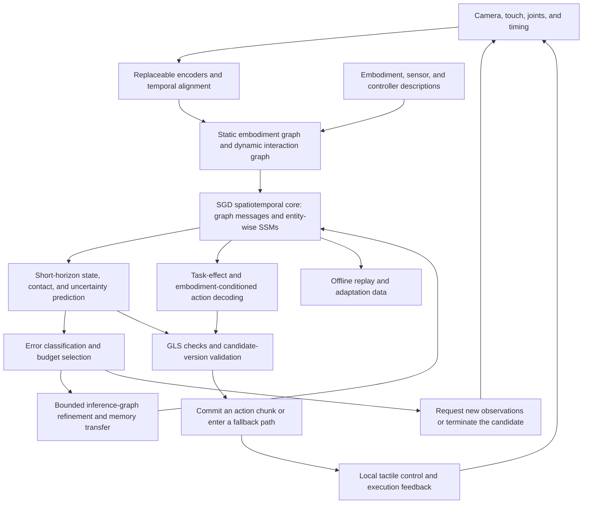

# SGD-Net-TC: A Topology- and Contact-Conditioned World-Model Architecture Proposal

> Public research edition · 2026-09-12. Model methods, equations, and component designs are retained. This document describes a research proposal and does not claim existing training results, a complete implementation, or chip performance. Section numbers retain the original research index; gaps indicate separate planning material not included in this package.

> v0.1 research proposal · 2026-09-12 · TC = Topology and Contact. The name identifies this project's research; it does not imply external priority or an already trained model.
>
> [Integration rationale and innovation boundaries](32.md) · [Validation and software/hardware proposal](34.md)

**On this page**

- [1. Objective](#section-001)
- [2. Overall structure](#section-002)
- [3. Three graphs and two state domains](#section-003)
- [4. Trainable spatiotemporal core](#section-006)
- [5. Joint modeling of task effects and embodiment actions](#section-009)
- [6. Memory transfer during inference-graph refinement](#section-010)
- [7. Uncertainty-driven bounded computation](#section-013)
- [8. Multiple rates and within-chunk correction](#section-014)
- [9. Training objectives and sequence](#section-015)
- [10. Connection to GLS and boundaries of guarantees](#section-016)
- [11. Deliverables as a new model](#section-017)
- [References](#section-018)

---

## 1. Objective 

SGD-Net-TC proposes to learn the mapping “current structure and history + candidate actions → future object/robot states, contacts, and task effects,” while generating actions compatible with the target embodiment within the same core. Relative to the original SGD-Net, the main additions are an explicit distinction between embodiment, interaction, and inference topology; learned state transfer during graph refinement; choosing computation or observation according to error sources; and training action decoding under contact-prediction constraints.

The first task domain is short-horizon manipulation with a fixed robotic arm and a dexterous hand; semantic/visual encoding can come from frozen models. The system consists of a trainable model and an external runtime. The trainable part handles prediction, representation, and policy, while GLS/Aegis-related parts enforce resource boundaries, handle errors, and commit actions. The latter cannot replace training of the former or automatically confer correctness guarantees.

## 2. Overall structure 

The model's inference loop has bounds on iteration count, elapsed time, and memory. Requesting an observation is a system action with waiting and timeout behavior, not instantaneous access to missing ground truth. Internal loops without new observations must not advance real-time memory.

## 3. Three graphs and two state domains 

### 3.1 Structural definitions 

$$
\mathcal B=(V_B,E_B,\beta),\qquad
\mathcal I_t=(V_O\cup V_B,E_{I,t},c_t),\qquad
\mathcal R_t^{\ell}=\operatorname{Refine}_{\ell}(\mathcal I_t).
$$

`B` is the embodiment graph: links, joints, transmission couplings, joint limits, sensor locations, and known physical parameters. It is specified by a versioned description; replacing an embodiment is an explicit configuration event. URDF may not cover friction, tendon transmission, hysteresis, or tactile calibration. Missing parameters carry unknown status or intervals.

`I` is the interaction graph between objects and the embodiment. Edges encode proximity, estimated contact, slip, and relative geometry. A proximity edge is not evidence that contact has occurred; separate edge types, observation provenance, and uncertainty are required.

`R` is the inference graph, which coarsens or refines object surfaces/contact regions to allocate computation. Splitting inference nodes does not create physical fingers or change the device's actual mass or joint count. Task semantics can serve as additional conditions, but semantic edges are not interpreted as identified causal relationships.

### 3.2 State-domain isolation 

$$
S_t^{obs}=(\hat x_t,h_t,\mathcal I_t,U_t,\nu_t),
\quad S_{t,k}^{imag}=F_\theta(S_t^{obs},a_{t:t+k-1},\mathcal B).
$$

$$\nu_t$$ includes embodiment, model, calibration, controller, and observation versions. Only actual feedback and state estimation update `obs`; `imag` stores rollouts for independent candidates. Selecting an action chunk does not authorize writing predicted future states back as real observations. Historical states are corrected only after new feedback arrives.

Time uses the tuple `(sensor_time, rollout_step, refinement_iter)`. Nodes use stable entity IDs rather than treating array indices as identities. If object-tracking identity is uncertain, clear or degrade the relevant memory; never assign object A's history to object B.

## 4. Trainable spatiotemporal core 

### 4.1 Embodiment-conditioned graph propagation and state updates 

For the currently available input $$u_{i,t}$$ of entity $$i$$, use shared-parameter message aggregation and recurrence along physical time:

$$
m_{i,t}=\sum_{j\in\mathcal N(i)}\phi_\theta(h_{i,t-1},h_{j,t-1},e_{ij,t},\beta_i,\beta_j),
$$
$$
\bar h_{i,t}=\bar A_\theta(u_{i,t},m_{i,t},\Delta t_i)h_{i,t-1}
             +\bar B_\theta(u_{i,t},m_{i,t},\Delta t_i)u_{i,t},
$$
$$
h_{i,t}=\bar h_{i,t}+K_\theta(u_{i,t},m_{i,t},M_{i,t})\,\tilde r_{i,t}.
$$

$$M$$ is the modality-validity mask. $$\tilde r$$ is the dimensionally normalized and clipped observation innovation: the current observation minus an earlier prediction for the same time. When a matched prediction/observation is unavailable, do not fabricate a zero residual; disable this correction and mark it unknown. This is a research design inspired by selective state spaces, not a claim that every combination of gates is inherently stable.[^R01][^R03]

The SSM advances along each stable entity's time series, while permutation-invariant aggregation handles spatial interaction. Training may use masked temporal scans; scanning serially in an arbitrary node-number order does not justify a claim of node-permutation equivariance. Gravity directions and joint axes included in the inputs must transform consistently with coordinate changes. For chirality-sensitive tasks, prioritize validation of SE(3) rather than unconditional reflection symmetry.[^R05]

### 4.2 Bridging semantics and physics 

Keep semantic representations $$z_t$$ separate from measurable physical states $$x_t$$:

$$
(\hat x_t,U_t)=\Psi_\omega(z_t,\text{proprio}_t,\text{touch}_t,\mathcal B,M_t).
$$

This inherits JSBO's structural-bridge concept. Training physical heads requires paired trajectories or trusted simulation labels; JEPA alignment loss alone cannot supply meanings such as newtons or radians. JEPA can provide initialization or an auxiliary objective, while its identifiability results depend on specific distributional conditions.[^R13][^R14]

Future-prediction heads output states, contact modes, and sensor predictions, retaining units for physical quantities. Hidden vectors may be regularized, but measured values must not undergo indiscriminate norm clipping. The first iteration uses explicit short-horizon prediction. Implicit root finding, symplectic layers, multiple curvatures, and global causal discovery are not mandatory components.

## 5. Joint modeling of task effects and embodiment actions 

Denote task-relevant effects by $$y_{t:t+H}$$. These may include changes in object pose, permitted contact regions, and tactile summaries. They are transferable conditions, not an assumption that different hands can produce identical contacts.

$$
y^*\sim\pi_{effect}(S_t^{obs},g),\qquad
a^B=D_\psi(S_t^{obs},y^*,\mathcal B,\kappa),
$$
$$
(\hat x^+,\hat c^+,\hat y^+)=F_\theta(S_t^{obs},a^B,\mathcal B,\kappa).
$$

$$g$$ is the task, and $$\kappa$$ specifies controller mode/calibration conditions. Early action heads may use a flow head with a fixed number of steps or a small deterministic head as the baseline; training a VLA from scratch is not required. The head may output native joint targets or keypoint targets, but the keypoint path must include a checkable IK mapping. The two output types use different schemas.

Supervise $$F$$ with real transitions, then constrain action effects through $$\|\hat y^+-y^*\|$$. To prevent the action head from exploiting world-model errors, freeze or slowly update the world model during training, constrain actions to data-supported domains and bounded magnitudes, and inspect results in independent real-data replay. Imagined reward is not actual task reward.

This module is related to CGP's state–touch–goal mapping and is also bounded by prior work on cross-embodiment graph world models. Its candidate contribution lies in interaction with H1's state transfer and H2's budget control, rather than another claim to have discovered action-conditioned prediction.[^R06][^R07][^R09]

## 6. Memory transfer during inference-graph refinement 

### 6.1 Change representations only at the same physical time 

Let $$P_{\ell\to\ell+1}$$ be refinement prolongation and $$Q_{\ell+1\to\ell}$$ be restriction. Define each separately for scalars, geometry, extensive physical quantities, and hidden states. For the same coarse-level state, use:

$$
\mathcal L_{transfer}=\|Q_hP_hh-h\|_W^2,
$$
$$
\mathcal L_{comm}=\|Q_hF_{\ell+1}(P_hh,a)-F_\ell(h,a)\|_W^2,
$$
$$
\mathcal L_{readout}=\|D_{\ell+1}(P_hh)-D_\ell(h)\|_{W_y}^2.
$$

These relations are training and diagnostic objectives, not established equalities. The second term compares predictions for the same future step, while the third compares current states/task summaries **at the instant refinement occurs**. Do not force refined future predictions to remain identical to coarse predictions indefinitely, since that would suppress refinement benefits. Include real future supervision to prevent constant outputs from satisfying consistency objectives.

Coarse/fine comparisons apply only to shared, projectable components; newly introduced detail must not incorrectly be required to reconstruct coarse-level ground truth. Divide conserved quantities using volume/mass weights rather than copying them. Compare poses in local tangent spaces instead of averaging rotation matrices elementwise. Do not impose unsupported claims of physical conservation on ordinary hidden states.

### 6.2 Inference and transaction semantics 

Refinement creates candidate structures in a preallocated pool. Replace the internal representation only after checking IDs/shapes, mapping errors, budgets, and current-state continuity; retain the original representation on failure. Changing embodiments does not reuse the same $$P_h$$ mapping and requires target-embodiment adaptation or reinitialization. H1's cross-resolution consistency does not automatically solve transfer across hand morphologies.

Retain the existing “copy the parent and add noise” method as a baseline. TC proposes to learn conditional transfer and estimate its error. Dynamic trees may refine object/interaction representations or add candidate branches; they must not modify the authoritative embodiment topology used by the action gate.

## 7. Uncertainty-driven bounded computation 

Distinguish discretization/solver error reducible through computation, $$e_{comp}$$; observation/calibration error, $$e_{obs}$$; model epistemic uncertainty, $$e_{model}$$; and contact randomness, $$e_{noise}$$. This is not an exactly identifiable ground-truth decomposition, but an estimate with evidence labels. Mark the decomposition unknown when it lacks support.

Candidate computational actions $$k$$ include retaining the current representation, refining locally, adding a rollout, using higher precision, requesting an observation, or terminating the candidate. Use a small benefit estimator:

$$
k^*=\arg\max_{k\in\mathcal K_{admissible}}
\{\widehat{\Delta L}(k)-\lambda_T\hat T_k-\lambda_M\hat M_k\},
$$
$$
\mathcal K_{admissible}=\{k:\hat T_k+T_{check}^{reserve}+T_{fallback}^{reserve}\leq T_{remain},\ M_k\leq M_{max}\}.
$$

Predicted latency is used only for selection; independent timers, interruptible boundaries, and reserved paths enforce hard deadlines. Estimated latency is not a WCET proof. The proposed addition over conventional adaptive computation is to distinguish “more computation” from “more information,” rather than only halt/continue decisions.[^R15]

Benefit labels can be generated from offline replay of each candidate computational action, without reading future deployment ground truth. Safety thresholds and minimum checking intensity are not freely optimized by this model. High-risk situations may require abandoning a candidate earlier, rather than allowing unlimited depth.

## 8. Multiple rates and within-chunk correction 

Semantic conditions, visual state, tactile state, and servo execution have different update rates. T-Rex's within-chunk tactile corrections and RLDX-1's organization of physical signals and memory can provide inspiration, but these modules are not equivalent.[^R10][^R11]

TC separates the committed prefix of an action chunk from its replaceable suffix. Local corrections may adjust only within the permitted control space, magnitude, and deadline; otherwise, regenerate a candidate. A 30 Hz sensor cannot be interpreted as providing real 1000 Hz touch merely because an internal loop runs at 1000 Hz. Actual rates must be established from the hardware and task, not frozen in advance by this proposal.

## 9. Training objectives and sequence 

The overall objective is:

$$
\mathcal L=\lambda_{pred}\mathcal L_{pred}+\lambda_{act}\mathcal L_{act}
+\lambda_{contact}\mathcal L_{contact}+\lambda_{effect}\mathcal L_{effect}
+\lambda_{transfer}\mathcal L_{transfer}+\lambda_{comm}\mathcal L_{comm}
+\lambda_{readout}\mathcal L_{readout}+\lambda_{cal}\mathcal L_{cal}.
$$

The terms apply respectively to masked real futures, demonstrated actions, contact labels, action effects, memory transfer, coarse/fine prediction, current-readout consistency, and uncertainty calibration. Normalize different units using fixed scales from the training set. Missing tactile labels must not be treated as zero-touch supervision. Use independent episodes for calibration; training loss cannot double as evidence of coverage.

1. **Base dynamics**: freeze external perception; train state, contact, and action heads with fixed graphs and budgets.
2. **Embodiment adaptation**: mix known embodiments and hold out complete new embodiments. Train a small decoder or adapter first and plot adaptation-data curves.
3. **Structural transfer**: train $$P,Q$$ with paired coarse/fine representations. First fix a preselected refinement schedule to avoid attribution ambiguity from changing routing and prediction simultaneously.
4. **Budget allocator**: train a small ranker with offline benefit labels, then compare it under fixed budgets.
5. **Joint fine-tuning**: jointly optimize at a low learning rate, retaining original-task replay and individual ablations; generate a new checkpoint after offline updates.

Human video can pretrain visual and keypoint branches, but without direct tactile/force ground truth it provides only supervision for the available modalities. DPP's experience with zero robot demonstrations does not imply that TC automatically shares that property.[^R12]

## 10. Connection to GLS and boundaries of guarantees 

The physical prediction error set $$\mathcal E$$, embodiment and controller versions, observation freshness, and model domain form the B-layer summary. The A layer checks action contracts, while SAFE/independent controllers handle final limiting and failure. Status labels retain the existing `CERTIFIED / VIOLATED / UNKNOWN` semantics; low predictive variance alone is not promoted to a certificate.

A checkable local example: for a specified state domain, action, and time interval, suppose the true one-step error satisfies $$\|x^+-\hat x^+\|\leq\epsilon$$, the safety function $$b$$ is $$L_b$$-Lipschitz on that domain, numerical evaluation error is bounded by $$\epsilon_b$$, and

$$
\tilde b(\hat x^+)\geq L_b\epsilon+\epsilon_b,
$$

then $$b(x^+)\geq0$$. This is a one-step conditional conclusion obtained from the triangle inequality. The state/action must actually lie within the domain, and $$\epsilon$$ must include latency and execution errors. Checking endpoints alone does not prove collision-free motion throughout an action; multistep invariance additionally requires recursive feasibility and temporal coverage.

If $$\epsilon$$ is only a statistical interval, the conclusion is statistical as well. Distribution shift, online adaptation, and selective admission can invalidate coverage. Reassess interval coverage for the distribution after budget allocation and action selection. Model graph edges, Jacobians, and attention weights do not individually establish causal identification.

## 11. Deliverables as a new model 

A research implementation should eventually deliver trainable model configurations, training/evaluation code, frozen data splits, checkpoints, model cards, candidate and state schemas, replayable prediction trajectories, and ablation results. Hardware-side deliverables additionally include actual operator traces, memory lifetimes, and end-to-end latency records. This document only defines these artifacts; it does not produce trained weights or performance conclusions.

Success does not require enabling every component simultaneously. It requires a reproducible, attributable benefit from at least one of H1–H3 at an acceptable total cost. If a fixed-graph model already meets the task, stop at the fixed graph. If the budget allocator underperforms a fixed policy, do not make it mandatory. If embodiment-conditioned decoding provides no transfer benefit, revise the problem definition rather than amplify promotional claims.

## References 

[^R01]: [Mamba: Linear-Time Sequence Modeling with Selective State Spaces](https://arxiv.org/abs/2312.00752). 2023; revised 2024. Scope checked: abstract and mechanism. Accessed: 2026-09-12.
[^R03]: [FACTS: A Factored State-Space Framework For World Modelling](https://arxiv.org/abs/2410.20922). 2024; revised 2025. Scope checked: abstract; no code reproduction completed. Accessed: 2026-09-12.
[^R05]: [E(n) Equivariant Graph Neural Networks](https://proceedings.mlr.press/v139/satorras21a.html). 2021. Scope checked: publication page and abstract. Accessed: 2026-09-12.
[^R06]: [Scaling Cross-Embodiment World Models for Dexterous Manipulation](https://arxiv.org/html/2511.01177v3). Initial version: 2025-11-03; v3: 2026-07-21; the abstract page lists IROS 2026. Scope checked: abstract, introduction, and method representations; not reproduced. Accessed: 2026-09-12.
[^R07]: [Graph-Operator World Models for Morphology-Parameter Generalization in Continuous Control](https://arxiv.org/abs/2608.20936). 2026-08-21. Scope checked: abstract; no unified SOTA performance conclusion is drawn. Accessed: 2026-09-12.
[^R09]: [Contact-Grounded Policy (CGP)](https://arxiv.org/html/2603.05687v1). 2026-03-05. Scope checked: paper; retain the specific control and sensing conditions. Accessed: 2026-09-12.
[^R10]: [T-Rex official code repository](https://github.com/ZhuoyangLiu2005/T-Rex). A changing repository. Scope checked: official description; training not reproduced. Accessed: 2026-09-12.
[^R11]: [RLDX-1 official code repository](https://github.com/RLWRLD/RLDX-1). A changing repository. Scope checked: official description; code and weight licenses are separate. Accessed: 2026-09-12.
[^R12]: [Dexterous Point Policy: Learning Point-based Dexterous Hand Policies from Human Demonstrations](https://arxiv.org/html/2606.10614v1). 2026-06-09. Scope checked: paper; zero robot demonstrations does not mean zero data. Accessed: 2026-09-12.
[^R13]: [V-JEPA 2 official code repository](https://github.com/facebookresearch/vjepa2). A changing repository. Scope checked: official model and code descriptions. Accessed: 2026-09-12.
[^R14]: [When Does LeJEPA Learn a World Model?](https://arxiv.org/abs/2605.26379). 2026-05-25. Scope checked: abstract and assumptions; not generalized into a universal identifiability guarantee. Accessed: 2026-09-12.
[^R15]: [Adaptive Computation Time for Recurrent Neural Networks](https://arxiv.org/abs/1603.08983). 2016. Scope checked: abstract and prior adaptive-computation work. Accessed: 2026-09-12.

---

[← Previous](18.md) · [Full contents](../SUMMARY.md) · [Next →](44.md)
