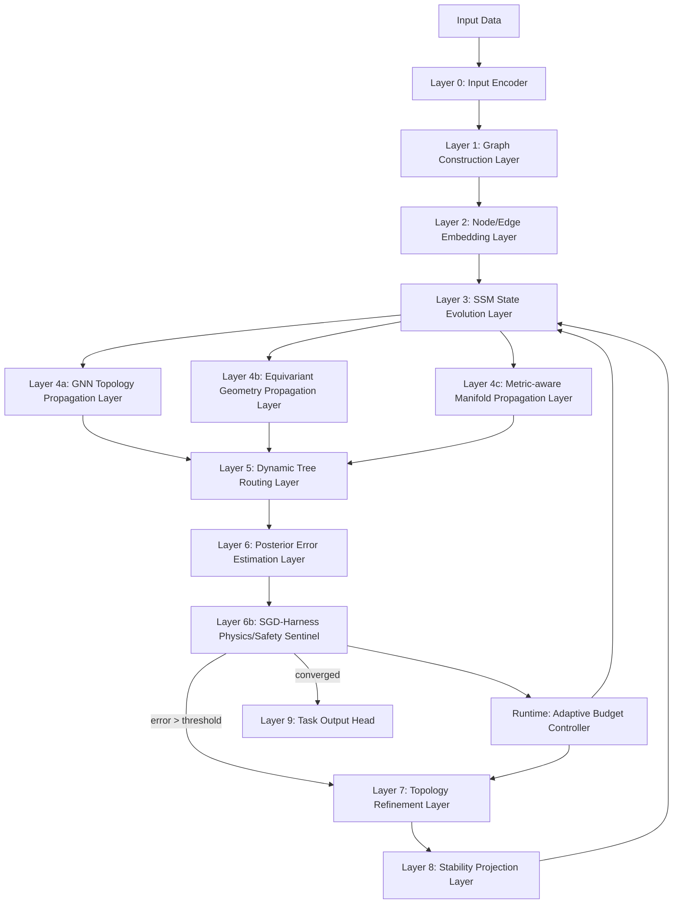

# 3. Overall Layered Architecture

SGD-Net can be divided into nine levels:

## 3.1 Static Backbone and Dynamic Control Loop 

SGD-Net contains two paths:

1. **Backbone forward path**: input → encoding → SSM → TopoGNN/EGNN → Tree Routing → output.
2. **Dynamic control loop**: posterior error / Harness residual → topology reconstruction → stability projection → graph-state writeback.

The backbone path resembles an ordinary neural network; the dynamic control loop is the main difference between SGD-Net and ordinary SSMs/GNNs.

---

[← Previous](section-02.md) · [Contents](../../../SUMMARY.md) · [Next →](section-04.md)
