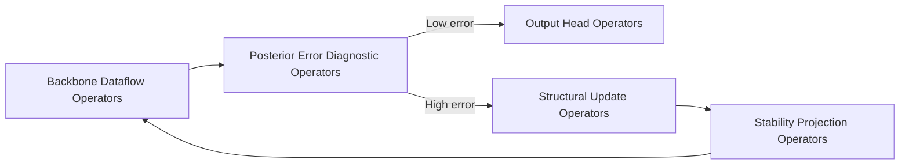

# 18. Relationship Between Operators and Layers

This section addresses a common source of confusion: **What exactly is the relationship between an operator and a layer?**

The short answer:

> An operator is a minimal computational action; a layer groups operators around a semantic objective; a block is a stackable combination of core layers; SGD-Net is the complete model architecture consisting of blocks and control loops.

This four-level relationship can be represented as:

```text
Operator  →  Layer  →  SGDBlock  →  SGD-Net Model
Minimal operator   Functional layer   Stackable backbone unit   Complete model architecture
```

An analogy with the Transformer is also useful:

| Transformer concept | SGD-Net counterpart |
|---|---|
| Q/K/V projection, softmax, and matmul are operators | `SSMScan`, `GraphMessage`, and `TreeRoute` are operators |
| Multi-Head Attention is a layer | `SSMStateLayer`, `GNNTopologyLayer`, and `DynamicTreeRoutingLayer` are layers |
| Attention + FFN + Norm is a block | `SSM + GNN + Tree + Norm` is an `SGDBlock` |
| Stacking multiple blocks forms a Transformer | Multiple `SGDBlock`s plus posterior-error control form SGD-Net |

**On This Page**

- [18.1 Definitions of the Four Abstraction Levels](#section-001)
- [18.2 Why Is One Layer Not One Operator?](#section-006)
- [18.3 Which Operators Does Each Layer Contain?](#section-010)
- [18.4 Operator Execution Chains Within Layers](#section-011)
- [18.5 Operator Lifecycle in a Forward Pass](#section-022)
- [18.6 Differences Between Data, Structural, and Stability Operators](#section-026)
- [18.7 Differences Between Backbone and Control Layers](#section-027)
- [18.8 Nesting of Layers and Operators](#section-028)
- [18.9 Complete Operator Inventory](#section-029)
- [18.10 How Can Operators and Layers Be Simplified for a Minimal Implementation?](#section-030)
- [18.11 Key Understanding](#section-031)
- [18.12 Mathematical Expressions for the Operators](#section-032)
- [18.13 Review of Compatibility for Modular Assembly](#section-043)

---

## 18.1 Definitions of the Four Abstraction Levels <a href="#section-001" id="section-001"></a>

### 18.1.1 Operator: Computational Primitive <a href="#section-002" id="section-002"></a>

An operator is a minimal computational primitive, usually performing one specific action. For example:

- `SSMScan`: perform a state-space recurrence or selective scan;
- `GraphMessage`: compute a message for an edge;
- `Aggregate`: aggregate neighbor messages into a node;
- `TreeRoute`: select a route according to dynamic-tree conditions;
- `PosteriorError`: compute posterior error;
- `SVDClip`: clip singular values;
- `Readout`: pool a node set into a graph-level representation.

Operator characteristics:

1. Fine granularity;
2. Explicit inputs and outputs;
3. Reusable across multiple layers;
4. Some are differentiable; others are not;
5. Some run on every forward pass; others only when triggered by errors.

### 18.1.2 Layer: Functional Layer <a href="#section-003" id="section-003"></a>

A layer encapsulates a group of operators. It is more than one equation: it organizes operators, parameters, states, and outputs around a semantic objective.

For example, `GNNTopologyLayer` may contain:

```text
EdgeWeight → GraphMessage → Aggregate → NodeUpdate → Normalize
```

A layer therefore:

1. exposes a unified interface;
2. contains multiple operators;
3. manages its parameters;
4. maintains necessary intermediate states;
5. outputs tensors or graph states usable by downstream layers.

### 18.1.3 SGDBlock: Stackable Backbone Unit <a href="#section-004" id="section-004"></a>

An `SGDBlock` combines several core layers, usually including:

```text
SSMStateLayer
GNNTopologyLayer
DynamicTreeRoutingLayer
ResidualConnection
Normalization
```

`SGDBlock` handles backbone representation learning and can be stacked in multiple layers like a Transformer block.

### 18.1.4 SGD-Net Model: Complete Model Architecture <a href="#section-005" id="section-005"></a>

A complete SGD-Net contains:

- input encoding and graph construction;
- multiple `SGDBlock`s;
- posterior error estimation;
- adaptive topology reconstruction;
- stability projection;
- Task Output Head;
- refinement logs and explanatory paths.

Thus, **operators are the internal parts of layers, layers are the components of blocks, blocks form the levels of the SGD-Net backbone, and control loops provide dynamic adaptation.**

## 18.2 Why Is One Layer Not One Operator? <a href="#section-006" id="section-006"></a>

In SGD-Net, layers and operators have a many-to-many relationship rather than a one-to-one correspondence.

### 18.2.1 One Layer Usually Contains Multiple Operators <a href="#section-007" id="section-007"></a>

For example, `SSMStateLayer` includes at least:

```text
ParamGenerate → Discretize → SSMScan → StateUpdate → OutputProject
```

where:

- `ParamGenerate` generates input-dependent $$A(x),B(x),C(x)$$;
- `Discretize` discretizes continuous state-space parameters;
- `SSMScan` performs a scan or recurrence;
- `StateUpdate` writes back the hidden state;
- `OutputProject` outputs the current layer's representation.

### 18.2.2 One Operator May Be Reused by Multiple Layers <a href="#section-008" id="section-008"></a>

For example, `Normalize` can appear:

- after an embedding layer;
- after a GNN layer;
- after Dynamic Tree routing;
- inside the Stability Projector.

Similarly, `Project` can be used for:

- node-embedding projection;
- SSM output projection;
- GNN node updates;
- output-head mappings;
- stability projection.

### 18.2.3 Some Operators Belong to Dataflow, Others to Control Flow <a href="#section-009" id="section-009"></a>

SGD-Net operators can be divided into two categories:

| Type | Runs on every forward pass | Changes graph structure | Examples |
|---|---|---|---|
| Dataflow operators | Usually executes | No | `SSMScan`, `GraphMessage`, `Aggregate`, `TreeRoute` |
| Control-flow operators | Conditional execution | May change it | `PosteriorError`, `TreeSplit`, `TopologyRefine`, `StabilityProject` |

This is also a key difference between SGD-Net and ordinary static neural networks: **it contains both ordinary tensor-computation operators and control operators that change model or graph structure.**

## 18.3 Which Operators Does Each Layer Contain? <a href="#section-010" id="section-010"></a>

The table below details the correspondence between SGD-Net layers and operators.

| Layer | Semantic objective | Main internal operators | Output |
|---|---|---|---|
| Layer 0: Input Encoding Layer | Convert raw input into structured objects | `Parse`, `Tokenize`, `FeatureExtract`, `Encode` | `EncodedObjects` |
| Layer 1: Graph Construction Layer | Construct graph nodes and edges from objects | `NodeCreate`, `EdgeCandidate`, `EdgeScore`, `Sparsify`, `GraphBuild` | `GraphState` |
| Layer 2: Node/Edge Embedding Layer | Vectorize nodes and edges | `NodeEmbed`, `EdgeEmbed`, `TypeEmbed`, `PositionEncode`, `Project` | $$X,E$$ |
| Layer 3: SSM State Evolution Layer | Advance states across time/logic/diffusion steps | `ParamGenerate`, `Discretize`, `SSMScan`, `StateUpdate`, `OutputProject` | $$X_{ssm},H'$$ |
| Layer 4: GNN Topology Propagation Layer | Propagate topology-constrained information along graph edges | `EdgeWeight`, `GraphMessage`, `Aggregate`, `NodeUpdate`, `Normalize` | $$X_{gnn}$$ |
| Layer 5: Dynamic Tree Routing Layer | Node-level conditional routing and local-expert corrections | `PredicateEval`, `Gate`, `TreeRoute`, `LeafAdapter`, `TreeSplit`, `TreePrune` | $$X_{tree}$$ and routing logs |
| Layer 6: Posterior Error Estimation Layer | Determine whether refinement is needed | `TaskResidual`, `TopologyViolation`, `StateDrift`, `ConfidenceError`, `ErrorFuse`, `ActionSelect` | `ErrorReport` |
| Layer 7: Topology Reconstruction Layer | Change graph structure according to errors | `SelectNodes`, `CloneNode`, `InheritEdges`, `IsolateNode`, `Reindex`, `Remesh` | `RefineResult` |
| Layer 8: Stability Projection Layer | Project states/parameters back into a stable set | `NormClip`, `SpectralClip`, `SVDClip`, `LyapunovCheck`, `Rollback` | Stabilized `GraphState` |
| Layer 9: Task Output Head | Output predictions, explanations, or paths | `Readout`, `TaskHead`, `Calibrate`, `Explain` | `SGDOutput` |

## 18.4 Operator Execution Chains Within Layers <a href="#section-011" id="section-011"></a>

### 18.4.1 Layer 0: Input Encoding Layer <a href="#section-012" id="section-012"></a>

```text
raw_input
  → Parse
  → Tokenize / FeatureExtract
  → Encode
  → EncodedObjects
```

Note: This need not be a deep-learning layer; it may be a deterministic parser. PDB/mmCIF parsing, CIF parsing, and textual entity extraction all belong here.

### 18.4.2 Layer 1: Graph Construction Layer <a href="#section-013" id="section-013"></a>

```text
EncodedObjects
  → NodeCreate
  → EdgeCandidate
  → EdgeScore
  → Sparsify
  → GraphBuild
  → GraphState
```

Note: This layer determines graph structure. If that structure is wrong, subsequent GNN and dynamic-tree operations work on an incorrect topology.

### 18.4.3 Layer 2: Node/Edge Embedding Layer <a href="#section-014" id="section-014"></a>

```text
node_attrs, edge_attrs
  → TypeEmbed
  → PositionEncode
  → NodeEmbed / EdgeEmbed
  → Project
  → X, E
```

Note: This layer maps discrete types, continuous values, spatial positions, and task features into a common model dimension.

### 18.4.4 Layer 3: SSM State Evolution Layer <a href="#section-015" id="section-015"></a>

```text
X, H
  → ParamGenerate
  → Discretize
  → SSMScan
  → StateUpdate
  → OutputProject
  → X_ssm, H_new
```

Note: `SSMScan` is the core operator, not the entire SSM layer. The complete layer also generates parameters, discretizes, updates states, and projects outputs.

### 18.4.5 Layer 4: GNN Topology Propagation Layer <a href="#section-016" id="section-016"></a>

```text
X_ssm, edge_index, edge_attr
  → EdgeWeight
  → GraphMessage
  → Aggregate
  → NodeUpdate
  → Normalize
  → X_gnn
```

Note: `GraphMessage` computes only edge messages, `Aggregate` pools them into nodes, and `NodeUpdate` actually updates node representations.

### 18.4.6 Layer 5: Dynamic Tree Routing Layer <a href="#section-017" id="section-017"></a>

```text
X_gnn, node_trees
  → PredicateEval
  → Gate / HardBranch
  → TreeRoute
  → LeafAdapter
  → RouteLog
  → X_tree
```

If errors trigger structural changes, the following are also called:

```text
ErrorReport
  → TreeSplit / TreePrune
  → updated node_trees
```

Note: `TreeRoute` is a forward-pass dataflow operator. `TreeSplit` and `TreePrune` are structural control operators and need not execute every time.

### 18.4.7 Layer 6: Posterior Error Estimation Layer <a href="#section-018" id="section-018"></a>

```text
GraphState, prediction_record, matched_observation_or_none, confidence
  → TaskResidual
  → TopologyViolation
  → StateDrift
  → StabilityViolation
  → ConfidenceError
  → ErrorFuse
  → ActionSelect
  → ErrorReport
```

Note: This layer is SGD-Net's adaptive controller. It turns model-output errors into suggested actions such as keep, split, prune, isolate, or rollback.

### 18.4.8 Layer 7: Adaptive Topology Reconstruction Layer <a href="#section-019" id="section-019"></a>

```text
GraphState, ErrorReport
  → SelectNodes
  → CloneNode
  → InheritEdges
  → IsolateNode
  → Reindex
  → Remesh
  → RefineResult
```

Note: This layer changes graph structure, so it is closer to a runtime structural-update layer than an ordinary differentiable layer.

### 18.4.9 Layer 8: Stability Projection Layer <a href="#section-020" id="section-020"></a>

```text
RefinedGraphState
  → NormClip
  → SpectralClip
  → SVDClip
  → LyapunovCheck
  → Rollback if needed
  → StableGraphState
```

Note: This layer enforces numerical constraints and candidate isolation; its effects require validation. Local spectral clipping does not guarantee overall stability after dynamic growth. Cross-topology switching also requires state migration and applicable common stability conditions.

### 18.4.10 Layer 9: Task Output Head <a href="#section-021" id="section-021"></a>

```text
StableGraphState / X_final
  → Readout
  → TaskHead
  → Calibrate
  → Explain
  → SGDOutput
```

Note: Depending on the task, the output head may be node-, edge-, graph-, or path-level.

## 18.5 Operator Lifecycle in a Forward Pass <a href="#section-022" id="section-022"></a>

Operator execution in a complete forward pass can be divided into three stages.

### 18.5.1 Backbone Dataflow Operators <a href="#section-023" id="section-023"></a>

These operators generally execute on every forward pass:

```text
Encode
→ GraphBuild
→ NodeEmbed / EdgeEmbed
→ SSMScan
→ GraphMessage / Aggregate / NodeUpdate
→ TreeRoute
→ TaskHead
```

### 18.5.2 Diagnostic Control Operators <a href="#section-024" id="section-024"></a>

These operators determine whether structural changes are needed:

```text
PosteriorError
→ ErrorFuse
→ ActionSelect
```

### 18.5.3 Conditional Structural Operators <a href="#section-025" id="section-025"></a>

These operators execute only when triggered by errors or anomalies:

```text
TreeSplit / TreePrune
→ TopologyRefine
→ StabilityProject
→ Rollback optional
```

Thus, SGD-Net's forward pass is not a simple linear chain:



## 18.6 Differences Between Data, Structural, and Stability Operators <a href="#section-026" id="section-026"></a>

SGD-Net operators are best understood in three categories.

| Operator category | Differentiable | Changes graph structure | Typical operators | Main role |
|---|---|---|---|---|
| Data operators | Usually differentiable | No | `SSMScan`, `GraphMessage`, `Aggregate`, `NodeUpdate`, `TreeRoute` | Compute representations |
| Structural operators | Usually nondifferentiable or partially differentiable | Yes | `TreeSplit`, `TreePrune`, `CloneNode`, `Remesh`, `IsolateNode` | Change model/graph structure |
| Stability operators | May be differentiable or nondifferentiable | Usually does not change topology | `NormClip`, `SVDClip`, `SpectralClip`, `LyapunovCheck` | Prevent divergence |

These categories correspond to three SGD-Net capabilities:

1. Data operators compute representations;
2. Structural operators change the computational graph;
3. Stability operators prevent loss of control after changes.

## 18.7 Differences Between Backbone and Control Layers <a href="#section-027" id="section-027"></a>

Another important distinction in SGD-Net is that some layers belong to the backbone and others to the control loop.

| Layer | Type | Stackable | Runs every time | Description |
|---|---|---|---|---|
| Input Encoding Layer | Preprocessing layer | No | Yes | Structure raw input |
| Graph Construction Layer | Preprocessing/dynamic-graph layer | No | Usually yes | Build initial or dynamic graphs |
| Node/Edge Embedding Layer | Representation layer | Optionally stackable | Yes | Vectorize inputs |
| SSM State Evolution Layer | Backbone layer | Yes | Yes | Long-range state modeling |
| GNN Topology Propagation Layer | Backbone layer | Yes | Yes | Graph-constrained propagation |
| Dynamic Tree Routing Layer | Hybrid backbone/control layer | Yes | Routing always runs; splitting is conditional | Local adaptation |
| Posterior Error Estimation Layer | Control layer | No | Configurable in training/inference | Generate structural-action signals |
| Topology Reconstruction Layer | Control layer | No | Conditional execution | Modify graph structure |
| Stability Projection Layer | Control/constraint layer | No | Conditional or periodic execution | Check applicable stability conditions |
| Task Output Head | Output layer | Multiple heads possible | Yes | Output task results |

It follows that:

- `SSMStateLayer`, `GNNTopologyLayer`, and `DynamicTreeRoutingLayer` form the stackable backbone;
- `PosteriorErrorEstimator`, `TopologyRefiner`, and `StabilityProjector` form the dynamic control loop;
- SGD-Net's innovation lies beyond any individual layer, in the closed-loop coupling between backbone and control loop.

## 18.8 Nesting of Layers and Operators <a href="#section-028" id="section-028"></a>

A complete SGD-Net model can be understood through the following structure:

```text
SGDNet
├── InputEncoder Layer
│   ├── Parse operator
│   ├── Tokenize operator
│   └── Encode operator
├── GraphConstruction Layer
│   ├── NodeCreate operator
│   ├── EdgeCandidate operator
│   ├── EdgeScore operator
│   └── GraphBuild operator
├── Embedding Layer
│   ├── NodeEmbed operator
│   ├── EdgeEmbed operator
│   └── Project operator
├── SGDBlock × L
│   ├── SSMStateLayer
│   │   ├── ParamGenerate operator
│   │   ├── Discretize operator
│   │   └── SSMScan operator
│   ├── GNNTopologyLayer
│   │   ├── GraphMessage operator
│   │   ├── Aggregate operator
│   │   └── NodeUpdate operator
│   └── DynamicTreeRoutingLayer
│       ├── PredicateEval operator
│       ├── TreeRoute operator
│       └── LeafAdapter operator
├── PosteriorErrorEstimator Layer
│   ├── TaskResidual operator
│   ├── TopologyViolation operator
│   ├── ErrorFuse operator
│   └── ActionSelect operator
├── TopologyRefiner Layer
│   ├── TreeSplit operator
│   ├── CloneNode operator
│   ├── InheritEdges operator
│   └── Remesh operator
├── StabilityProjector Layer
│   ├── NormClip operator
│   ├── SVDClip operator
│   └── LyapunovCheck operator
└── TaskHead Layer
    ├── Readout operator
    ├── TaskHead operator
    └── Explain operator
```

## 18.9 Complete Operator Inventory <a href="#section-029" id="section-029"></a>

| Operator | Layer | Input | Output | Role |
|---|---|---|---|---|
| `Parse` | Layer 0 | raw input | parsed objects | Parse raw input |
| `Tokenize` | Layer 0 | parsed objects | tokens/objects | Split structured objects |
| `FeatureExtract` | Layer 0 | parsed objects | raw features | Extract handcrafted or pretrained features |
| `Encode` | Layer 0 | raw input/features | encoded objects | Structure raw input |
| `NodeCreate` | Layer 1 | encoded objects | nodes | Create graph nodes |
| `EdgeCandidate` | Layer 1 | nodes | candidate edges | Generate candidate edges |
| `EdgeScore` | Layer 1 | candidate edges | edge scores | Compute edge weights or relation confidence |
| `Sparsify` | Layer 1 | edge scores | sparse edges | Sparsify graph edges |
| `GraphBuild` | Layer 1 | nodes, edges | graph state | Construct graph nodes and edges |
| `NodeEmbed` | Layer 2 | node attrs | node features | Vectorize nodes |
| `EdgeEmbed` | Layer 2 | edge attrs | edge features | Vectorize edges |
| `TypeEmbed` | Layer 2 | type ids | type embeddings | Inject node/edge types |
| `PositionEncode` | Layer 2 | positions/order | positional features | Inject spatial or sequence positions |
| `ParamGenerate` | Layer 3 | x | SSM params | Generate SSM parameters |
| `Discretize` | Layer 3 | continuous params | discrete params | Discretize state-space parameters |
| `SSMScan` | Layer 3 | x, h | y, h_new | State-space recurrence |
| `StateUpdate` | Layer 3 | h_new | updated state | writes back the hidden state |
| `OutputProject` | Layer 3 | y | x_ssm | Project to the model dimension |
| `EdgeWeight` | Layer 4 | edge_attr | weights | Compute edge weights |
| `GraphMessage` | Layer 4 | x, edge_index | messages | Compute edge messages |
| `Aggregate` | Layer 4 | messages | node messages | Neighborhood aggregation |
| `NodeUpdate` | Layer 4 | x, aggregated message | x_new | Node update |
| `Normalize` | Layer 4 / Block | features | normalized features | Normalize to stabilize training |
| `PredicateEval` | Layer 5 | x, predicate | branch score | Evaluate tree branch conditions |
| `Gate` | Layer 5 | branch score | gate value | Soft/hard gating |
| `TreeRoute` | Layer 5 | x, tree | x_routed | Dynamic tree routing |
| `LeafAdapter` | Layer 5 | leaf, x | local update | Leaf-local expert correction |
| `TreeSplit` | Layer 5 / 7 | tree, error | tree_new | Tree splitting |
| `TreePrune` | Layer 5 / 7 | tree, policy | tree_new | Tree pruning |
| `TaskResidual` | Layer 6 | prediction_record, matched_observation | residual/UNKNOWN | Paired task error |
| `TopologyViolation` | Layer 6 | graph, hidden links | violation score | Topology violation error |
| `StateDrift` | Layer 6 | h_t, h_prev | drift score | State-drift error |
| `ConfidenceError` | Layer 6 | confidence | confidence residual | Confidence error |
| `ErrorFuse` | Layer 6 | error terms | eta | Fuse multiple errors |
| `ActionSelect` | Layer 6 | eta, policy | actions | Select keep/split/prune/isolate |
| `SelectNodes` | Layer 7 | error report | node ids | Select nodes for refinement |
| `CloneNode` | Layer 7 | graph, node id | new nodes | Clone/derive new nodes |
| `InheritEdges` | Layer 7 | old node edges | new edges | Inherit adjacency |
| `IsolateNode` | Layer 7 | node id | isolated graph | Isolate old or anomalous nodes |
| `Reindex` | Layer 7 | graph | reindexed graph | Reorder node and edge indices |
| `Remesh` | Layer 7 | graph | refined graph | Graph topology reconstruction |
| `NormClip` | Layer 8 | features/params | clipped tensors | Norm clipping |
| `SpectralClip` | Layer 8 | matrix | clipped matrix | Spectral-radius constraint |
| `SVDClip` | Layer 8 | matrix | projected matrix | Singular-value clipping |
| `LyapunovCheck` | Layer 8 | state energy | pass/fail | Energy-descent check |
| `Rollback` | Layer 8 | checkpoint | restored state | Roll back anomalous updates |
| `Readout` | Layer 9 | node features | graph feature | Graph-level pooling |
| `TaskHead` | Layer 9 | features | prediction | Task output |
| `Calibrate` | Layer 9 | logits/scores | calibrated output | Confidence calibration |
| `Explain` | Layer 9 | logs, paths | explanation | Output explanatory information |

## 18.10 How Can Operators and Layers Be Simplified for a Minimal Implementation? <a href="#section-030" id="section-030"></a>

Not all operators need to be implemented at the MVP stage. They can be simplified as follows:

| Layer | Operators retained in MVP | Deferred operators |
|---|---|---|
| Layer 0 | `Encode` | Complex parsers, multimodal tokenizers |
| Layer 1 | `GraphBuild` | `EdgeScore`, Complex sparsification |
| Layer 2 | `NodeEmbed` | `EdgeEmbed` with rich types |
| Layer 3 | `SSMScan` | Input-selective parameter generation, complex discretization |
| Layer 4 | `Aggregate`, `NodeUpdate` | typed-edge message, Conservative messages |
| Layer 5 | `TreeRoute`, `TreeSplit` | soft gate, Complex pruning policies |
| Layer 6 | `TaskResidual` | Multisource error fusion |
| Layer 7 | `CloneNode`, `InheritEdges`, `IsolateNode` | Subgraph-level remeshing |
| Layer 8 | `NormClip` or `SVDClip` | Lyapunov rollback |
| Layer 9 | `TaskHead` | Complex explanation and calibration |

A minimal implementation can be written as:

```text
Layer = semantic encapsulation
Operator = specific function called within a Layer

SGDNet.forward:
  graph = GraphBuild(Encode(raw_input))
  x = NodeEmbed(graph.nodes)
  x = SSMScan(x, h)
  x = Aggregate(graph, x)
  x = TreeRoute(x, graph.node_trees)
  graph.x = x
  prediction = TaskHead(graph.x)
  RecordPrediction(prediction, available_inputs, versions)
  report = MatchPriorPrediction(arrived_observation)
  EnqueueIsolatedCandidateIfJustified(report, graph)
  return prediction  # Candidate migration/validation/release occurs independently at window boundaries
```

## 18.11 Key Understanding <a href="#section-031" id="section-031"></a>

The relationship between operators and layers can finally be summarized in one sentence:

> A layer is a functional module for a class of tasks, while an operator is the computational action actually executed inside it. Each SGD-Net layer usually comprises multiple operators: some handle ordinary tensor computations, some change dynamic graph structure, and some enforce stability constraints. SGD-Net is distinguished by the posterior-error-driven loop formed among these layers and operators, rather than by any isolated operator.

## 18.12 Mathematical Expressions for the Operators <a href="#section-032" id="section-032"></a>

To enable modular assembly of SGD-Net, first use a common backbone feature dimension $$d$$ at every layer, edge-feature dimension $$d_e$$, and SSM hidden-state dimension $$d_h$$:

$$
X^{(l)}\in\mathbb{R}^{N\times d},\quad
E^{(l)}\in\mathbb{R}^{M\times d_e},\quad
H^{(l)}\in\mathbb{R}^{N\times d_h}
$$

Here $$N$$ is the current node count and $$M=|\mathcal{E}|$$ the current edge count. Dynamic-graph refinement may change $$N$$ and $$M$$, but each active node's feature dimension $$d$$ should remain unchanged unless an explicit projection layer aligns dimensions.

### 18.12.1 Layer 0 Input Encoding Operators <a href="#section-033" id="section-033"></a>

**1. `Parse` Operator**

Parse raw input $$\mathcal{D}_{raw}$$ into a collection of structured objects:

$$
\mathcal{O}=\operatorname{Parse}(\mathcal{D}_{raw})=\{o_1,o_2,\ldots,o_n\}
$$

Here $$o_i$$ may represent a textual entity, physical sample point, residue, atom, material structural unit, or experimental record.

**2. `Tokenize` Operator**

Split structured objects into tokens or candidate nodes:

$$
z_i=\tau(o_i),\qquad Z=\{z_i\}_{i=1}^{n}
$$

For text tasks, $$\tau$$ is a tokenizer; for molecular tasks, $$\tau$$ is a residue/atom tokenizer; for PDE tasks, $$\tau$$ may reduce to sample-point indexing.

**3. `FeatureExtract` Operator**

Extract raw object attributes:

$$
a_i=f_{feat}(o_i)\in\mathbb{R}^{p}
$$

Examples include spatial coordinates, element types, residue types, boundary conditions, confidence, or text embeddings.

**4. `Encode` Operator**

Map raw attributes into a unified encoding space:

$$
u_i=f_{enc}(a_i;\theta_{enc})\in\mathbb{R}^{d_0}
$$

Overall output:

$$
U=[u_1;u_2;\ldots;u_n]\in\mathbb{R}^{n\times d_0}
$$

### 18.12.2 Layer 1 Graph Construction Operators <a href="#section-034" id="section-034"></a>

**5. `NodeCreate` Operator**

Instantiate encoded objects as graph nodes:

$$
\mathcal{V}=\{v_i\mid v_i=\operatorname{NodeCreate}(u_i)\}_{i=1}^{N}
$$

Initial node attributes are:

$$
r_i^{v}=g_v(u_i)
$$

**6. `EdgeCandidate` Operator**

Generate the candidate edge set:

$$
\mathcal{C}=\{(i,j)\mid \kappa(u_i,u_j)=1\}
$$

Here $$\kappa$$ may follow different rules:

$$
\kappa_{knn}(i,j)=\mathbb{I}[j\in kNN(i)]
$$

$$
\kappa_{radius}(i,j)=\mathbb{I}[\|p_i-p_j\|_2\le r]
$$

$$
\kappa_{relation}(i,j)=\mathbb{I}[R(i,j)\in\mathcal{R}_{allow}]
$$

**7. `EdgeScore` Operator**

Compute edge weights or relation confidence for candidate edges:

$$
s_{ij}=\phi_s([u_i,u_j,r_{ij},t_{ij}];\theta_s)
$$

Here $$r_{ij}$$ is distance, direction, or relative position, and $$t_{ij}$$ is edge type.

**8. `Sparsify` Operator**

Sparsify candidate edges into actual edges:

$$
A_{ij}=\mathbb{I}[s_{ij}>\epsilon_s]\quad \text{or}\quad A_{ij}=\mathbb{I}[j\in\operatorname{TopK}_j(s_{ij})]
$$

The edge set is:

$$
\mathcal{E}=\{(i,j)\mid A_{ij}=1\}
$$

**9. `GraphBuild` Operator**

Output graph state:

$$
\mathcal{G}_0=(\mathcal{V},\mathcal{E},A,R^v,R^e)
$$

Here $$R^v$$ contains raw node attributes and $$R^e$$ raw edge attributes.

### 18.12.3 Layer 2 Node/Edge Embedding Operators <a href="#section-035" id="section-035"></a>

**10. `TypeEmbed` Operator**

Node-type embedding:

$$
t_i^v=\operatorname{Emb}_v(type_i)\in\mathbb{R}^{d_t}
$$

Edge-type embedding:

$$
t_{ij}^e=\operatorname{Emb}_e(type_{ij})\in\mathbb{R}^{d_{te}}
$$

**11. `PositionEncode` Operator**

Encode spatial coordinates or sequence positions:

$$
p_i=\operatorname{PE}(pos_i)
$$

A common sinusoidal positional encoding is:

$$
PE_{2k}(pos)=\sin\left(\frac{pos}{10000^{2k/d}}\right),\quad
PE_{2k+1}(pos)=\cos\left(\frac{pos}{10000^{2k/d}}\right)
$$

**12. `NodeEmbed` Operator**

Vectorize node features:

$$
x_i^{(0)}=\phi_v([r_i^v,t_i^v,p_i];\theta_v)\in\mathbb{R}^{d}
$$

Collectively:

$$
X^{(0)}=[x_1^{(0)};\ldots;x_N^{(0)}]\in\mathbb{R}^{N\times d}
$$

**13. `EdgeEmbed` Operator**

Vectorize edge features:

$$
e_{ij}^{(0)}=\phi_e([r_{ij}^e,t_{ij}^e,\Delta p_{ij}];\theta_e)\in\mathbb{R}^{d_e}
$$

**14. `Project` Operator**

Align arbitrary dimensions to the model's main dimension:

$$
\operatorname{Project}_{a\to b}(x)=xW_{a\to b}+b_{a\to b}
$$

If a layer outputs $$Z\in\mathbb{R}^{N\times d_z}$$ while the next requires $$d$$, then:

$$
X=ZW_z+b_z\in\mathbb{R}^{N\times d}
$$

### 18.12.4 Layer 3 SSM State Evolution Operators <a href="#section-036" id="section-036"></a>

**15. `ParamGenerate` Operator**

Generate input-dependent SSM parameters:

$$
\Delta_i=\operatorname{softplus}(x_iW_{\Delta}+b_{\Delta})
$$

$$
B_i=x_iW_B+b_B,\\ C_i=x_iW_C+b_C
$$

Optionally, the state matrix $$A$$ is shared across all nodes or modulated by the input:

$$
A_i=A_0+\operatorname{diag}(x_iW_A)
$$

**16. `Discretize` Operator**

Zero-order-hold approximation:

$$
\bar{A}_i=\exp(\Delta_i A_i)
$$

$$
\bar{B}_i=(\Delta_i A_i)^{-1}\left(\exp(\Delta_i A_i)-I\right)\Delta_i B_i
$$

Bilinear-transform approximation:

$$
\bar{A}_i=\left(I-\frac{\Delta_i}{2}A_i\right)^{-1}\left(I+\frac{\Delta_i}{2}A_i\right)
$$

$$
\bar{B}_i=\left(I-\frac{\Delta_i}{2}A_i\right)^{-1}\Delta_i B_i
$$

**17. `SSMScan` Operator**

Node-level recurrence:

$$
h_i^{(l+1)}=\bar{A}_i h_i^{(l)}+\bar{B}_i x_i^{(l)}
$$

Output:

$$
y_i^{(l)}=C_i h_i^{(l+1)}+D x_i^{(l)}
$$

Graph-wide form:

$$
H^{(l+1)}=\operatorname{SSMScan}(X^{(l)},H^{(l)};\bar{A},\bar{B})
$$

**18. `StateUpdate` Operator**

Write the new hidden state back to the graph state:

$$
\mathcal{G}.H\leftarrow H^{(l+1)}
$$

When node $$k$$ is added to a dynamic graph, initialize:

$$
h_k=\operatorname{InitState}(x_k)=x_kW_h+b_h
$$

**19. `OutputProject` Operator**

Project the SSM output back to the backbone dimension:

$$
x_{i,ssm}^{(l)}=y_i^{(l)}W_o+b_o\in\mathbb{R}^{d}
$$

A residual connection can also be used:

$$
\widetilde{x}_i^{(l)}=x_i^{(l)}+x_{i,ssm}^{(l)}
$$

### 18.12.5 Layer 4 GNN Topology Propagation Operators <a href="#section-037" id="section-037"></a>

**20. `EdgeWeight` Operator**

Compute edge weights from edge features:

$$
\alpha_{ij}=\operatorname{softmax}_{j\in\mathcal{N}(i)}\left(a^T\sigma(W_xx_i+W_x'x_j+W_ee_{ij})\right)
$$

Simplified version:

$$
\alpha_{ij}=\frac{A_{ij}}{\sum_{k}A_{ik}+\epsilon}
$$

**21. `GraphMessage` Operator**

Edge messages:

$$
m_{ij}=\psi_m(x_i,x_j,e_{ij})
$$

Common implementation:

$$
m_{ij}=\alpha_{ij}\,\phi_m([x_i,x_j,e_{ij}];\theta_m)
$$

Or a typed-edge version:

$$
m_{ij}=\alpha_{ij}W_{type(e_{ij})}x_j
$$

**22. `Aggregate` Operator**

Neighborhood aggregation:

$$
m_i=\operatorname{AGG}_{j\in\mathcal{N}(i)}m_{ij}
$$

where:

$$
\operatorname{AGG}\in\{\sum,\operatorname{mean},\max,\operatorname{attention}\}
$$

Most commonly:

$$
m_i=\sum_{j\in\mathcal{N}(i)}m_{ij}
$$

**23. `NodeUpdate` Operator**

Node update:

$$
x_i'=\phi_u([x_i,m_i];\theta_u)
$$

Residual form:

$$
x_{i,gnn}=x_i+\phi_u([x_i,m_i];\theta_u)
$$

Simplified matrix version:

$$
X_{gnn}=\sigma(D^{-1}AXW_g)
$$

**24. `Normalize` Operator**

Layer normalization:

$$
\operatorname{LN}(x)=\gamma\frac{x-\mu(x)}{\sqrt{\sigma^2(x)+\epsilon}}+\beta
$$

Graph normalization can normalize per node or per graph batch.

### 18.12.6 Layer 5 Dynamic Tree Routing Operators <a href="#section-038" id="section-038"></a>

**25. `PredicateEval` Operator**

Compute a branch score for tree node $$q$$:

$$
s_q(x_i)=w_q^Tx_i-\tau_q
$$

The hard-threshold version may use $$w_q=e_{k_q}$$, checking only one feature dimension.

**26. `Gate` Operator**

Soft gating:

$$
g_q(x_i)=\sigma\left(\frac{s_q(x_i)}{T}\right)
$$

Hard gating:

$$
g_q(x_i)=\mathbb{I}[s_q(x_i)>0]
$$

**27. `TreeRoute` Operator**

Recursive soft routing:

$$
R_q(x_i)=(1-g_q(x_i))R_{left(q)}(x_i)+g_q(x_i)R_{right(q)}(x_i)
$$

If $$q$$ is leaf $$\ell$$:

$$
R_{\ell}(x_i)=x_i+a_{\ell}(x_i)
$$

Hard routing selects only one path:

$$
R_q(x_i)=R_{left(q)}(x_i)\ \text{or}\ R_{right(q)}(x_i)
$$

**28. `LeafAdapter` Operator**

Leaf-local correction:

$$
a_{\ell}(x_i)=W_{2,\ell}\sigma(W_{1,\ell}x_i+b_{1,\ell})+b_{2,\ell}
$$

Or a low-rank adapter:

$$
a_{\ell}(x_i)=x_iA_{\ell}B_{\ell},\quad rank(A_{\ell}B_{\ell})\ll d
$$

**29. `TreeSplit` Operator**

When $$\eta_i>\epsilon_{split}$$, split leaf $$\ell$$:

$$
\ell\rightarrow(\ell_L,\ell_R)
$$

The new threshold can be chosen as:

$$
k^*=\arg\max_k \left|\frac{\partial \eta_i}{\partial x_{ik}}\right|
$$

$$
\mathrm{tau}^*=\operatorname{median}\{x_{ik^*}\mid i\in\mathcal{B}_{\ell}\}
$$

Initialize new leaf adapters:

$$
\mathrm{theta}_{\ell_L}=\theta_{\ell}+\epsilon_L,
\quad
\mathrm{theta}_{\ell_R}=\theta_{\ell}+\epsilon_R
$$

**30. `TreePrune` Operator**

If subtree $$S$$ has low contribution and high cost:

$$
score(S)=\frac{\Delta \mathcal{L}_S}{Cost(S)+\epsilon}
$$

When:

$$
score(S)<\epsilon_{prune}
$$

execute:

$$
T_i\leftarrow T_i\setminus S
$$

### 18.12.7 Layer 6 Posterior Error Estimation Operators <a href="#section-039" id="section-039"></a>

**31. `TaskResidual` Operator**

Supervised residual:

$$
r_i^{task}=\|\hat{y}_i-y_i\|_2
$$

PDE residual:

$$
r_i^{pde}=\left|\mathcal{N}[u_{\theta}](p_i)-f(p_i)\right|
$$

Here $$\mathcal{N}$$ is a differential operator.

**32. `TopologyViolation` Operator**

If the model generates an implicit correlation matrix $$S$$ but the graph has no admissible edge:

$$
r_i^{topo}=\sum_j (1-A_{ij})\cdot |S_{ij}|
$$

**33. `StateDrift` Operator**

State drift:

$$
r_i^{drift}=\|h_i^{(t)}-h_i^{(t-1)}\|_2
$$

Relative drift:

$$
r_i^{rel}=\frac{\|h_i^{(t)}-h_i^{(t-1)}\|_2}{\|h_i^{(t-1)}\|_2+\epsilon}
$$

**34. `ConfidenceError` Operator**

For confidence $$c_i\in[0,1]$$:

$$
r_i^{conf}=1-c_i
$$

If pLDDT is used in structure prediction:

$$
r_i^{conf}=1-\frac{pLDDT_i}{100}
$$

**35. `ErrorFuse` Operator**

Multisource error fusion:

$$
\eta_i=w_1r_i^{task}+w_2r_i^{topo}+w_3r_i^{drift}+w_4r_i^{conf}+w_5r_i^{stable}
$$

Learnable gating can also be used:

$$
\eta_i=w(x_i)^Tr_i,\quad w(x_i)=\operatorname{softmax}(W_ex_i+b_e)
$$

**36. `ActionSelect` Operator**

Action selection:

$$
a_i=
\begin{cases}
\operatorname{split}, & \eta_i>\epsilon_{split} \\
\operatorname{isolate}, & r_i^{anomaly}>\epsilon_{iso} \\
\operatorname{prune}, & \eta_i<\epsilon_{prune}\ \text{and}\ usage_i<u_{min} \\
\operatorname{keep}, & \text{otherwise}
\end{cases}
$$

### 18.12.8 Layer 7 Topology Reconstruction Operators <a href="#section-040" id="section-040"></a>

**37. `SelectNodes` Operator**

Select nodes for refinement:

$$
\mathcal{S}=\{i\mid a_i\in\{split,isolate,prune\}\}
$$

Limit processing to at most $$K$$ nodes per step:

$$
\mathcal{S}_K=\operatorname{TopK}_{i}(\eta_i,K)
$$

**38. `CloneNode` Operator**

Split node $$i$$ into two children:

$$
x_{i_L}=x_i+\epsilon_L,
\quad
x_{i_R}=x_i+\epsilon_R
$$

where:

$$
\epsilon_L,\epsilon_R\sim\mathcal{N}(0,\sigma^2I)
$$

Hidden states also need to be copied or projected:

$$
h_{i_L}=h_i+\delta_L,
\quad
h_{i_R}=h_i+\delta_R
$$

**39. `InheritEdges` Operator**

Inherit neighbors:

$$
\forall j\in\mathcal{N}(i):
A'_{i_Lj}=A'_{ji_L}=A_{ij},
\quad
A'_{i_Rj}=A'_{ji_R}=A_{ij}
$$

Connect the new child nodes internally:

$$
A'_{i_Li_R}=A'_{i_Ri_L}=1
$$

**40. `IsolateNode` Operator**

Isolate the old node:

$$
A'_{i,:}=0,
\quad
A'_{:,i}=0
$$

and update the active mask:

$$
mask_i=0
$$

**41. `Reindex` Operator**

If node indices are deleted or compacted, define a remapping:

$$
\pi: \mathcal{V}'\rightarrow\{1,2,\ldots,N'\}
$$

Edge-index update:

$$
(i,j)\mapsto(\pi(i),\pi(j))
$$

**42. `Remesh` Operator**

Combine updates to nodes, edges, features, trees, and states:

$$
\mathcal{G}'=\operatorname{Remesh}(\mathcal{G},\mathcal{S},\mathcal{A})
$$

while maintaining:

$$
X'\in\mathbb{R}^{N'\times d},\quad
H'\in\mathbb{R}^{N'\times d_h},\quad
A'\in\mathbb{R}^{N'\times N'}
$$

### 18.12.9 Layer 8 Stability Projection Operators <a href="#section-041" id="section-041"></a>

**43. `NormClip` Operator**

Node-feature norm clipping:

$$
x_i'=x_i\cdot\min\left(1,\frac{c}{\|x_i\|_2+\epsilon}\right)
$$

**44. `SpectralClip` Operator**

Control the spectral radius of matrix $$W$$:

$$
W'=\frac{W}{\max(1,\rho(W)/\rho_{max})}
$$

Here $$\rho(W)=\max_i|\lambda_i(W)|$$, defined only for square matrices. This scaling bounds the spectral radius of one matrix; nonnormal transient amplification, nonlinear feedback, and switching systems still require complete analysis.

**45. `SVDClip` Operator**

Singular-value clipping:

$$
W=U\Sigma V^T
$$

$$
\Sigma'_{kk}=\min(\Sigma_{kk},\sigma_{max})
$$

$$
W'=U\Sigma'V^T
$$

**46. `LyapunovCheck` Operator**

Define the energy:

$$
V_t=\frac{1}{2}\operatorname{tr}(H_t^TPH_t)+\Pi(X_t,\mathcal{G}_t)
$$

If:

$$
V_{t+1}-V_t>\delta
$$

then classify this update as unstable.

**47. `Rollback` Operator**

Roll back to the latest stable checkpoint:

$$
(X,H,A,T)\leftarrow(X,H,A,T)_{checkpoint}
$$

### 18.12.10 Layer 9 Output Operators <a href="#section-042" id="section-042"></a>

**48. `Readout` Operator**

Graph-level pooling:

$$
g=\operatorname{Readout}(X)=\sum_i \alpha_i x_i
$$

The attention weights are:

$$
\alpha_i=\frac{\exp(q^Tx_i)}{\sum_j\exp(q^Tx_j)}
$$

Simple mean pooling:

$$
g=\frac{1}{N}\sum_{i=1}^{N}x_i
$$

**49. `TaskHead` Operator**

Node-level task:

$$
\hat{y}_i=f_{head}(x_i)=x_iW_y+b_y
$$

Graph-level task:

$$
\hat{y}=f_{head}(g)
$$

**50. `Calibrate` Operator**

Temperature calibration:

$$
p=\operatorname{softmax}\left(\frac{z}{T_c}\right)
$$

For regression uncertainty, output:

$$
(\mu,\log\sigma^2)=f_{head}(g)
$$

**51. `Explain` Operator**

Explanatory paths and refinement logs:

$$
\mathcal{E}_{explain}=\{path,\eta,actions,lineage,blocked\_edges\}
$$

Here lineage records:

$$
i\rightarrow(i_L,i_R)
$$

## 18.13 Review of Compatibility for Modular Assembly <a href="#section-043" id="section-043"></a>

This section examines whether SGD-Net can truly be assembled like building blocks from an implementation-interface perspective. The conclusion is: **it can, provided dimensional, state, and topology invariants are maintained; otherwise layers will fail to connect.**

### 18.13.1 Standard Interface Contract <a href="#section-044" id="section-044"></a>

All backbone layers should accept and return `GraphState` rather than pass only a bare tensor. A standard `GraphState` should contain:

```text
GraphState:
  x:          [N, d]
  edge_index: [2, M]
  edge_attr:  [M, d_e]
  h:          [N, d_h]
  node_trees: List[DynamicTree], len = N
  active_mask:[N]
  lineage:    dict
  metadata:   dict
```

Each layer then satisfies:

$$
\mathcal{G}^{(l+1)}=\operatorname{Layer}^{(l)}(\mathcal{G}^{(l)})
$$

rather than only:

$$
X^{(l+1)}=\operatorname{Layer}^{(l)}(X^{(l)})
$$

This supports synchronized updates of dynamic graphs, dynamic trees, and hidden states.

### 18.13.2 Backbone Dimension Compatibility Check <a href="#section-045" id="section-045"></a>

Key connections between backbone layers are:

| Upstream output | Downstream input requirement | Direct connection | Necessary condition |
|---|---|---|---|
| `NodeEmbed`: $$X^{(0)}\in\mathbb{R}^{N\times d}$$ | `SSMStateLayer`: $$X\in\mathbb{R}^{N\times d}$$ | Yes | Use a common `d_model=d` |
| `SSMStateLayer`: $$X_{ssm}\in\mathbb{R}^{N\times d_s}$$ | `GNNTopologyLayer`: $$X\in\mathbb{R}^{N\times d}$$ | Requires checking | If $$d_s\ne d$$, `OutputProject` is required |
| `GNNTopologyLayer`: $$X_{gnn}\in\mathbb{R}^{N\times d_g}$$ | `DynamicTreeRoutingLayer`: $$X\in\mathbb{R}^{N\times d}$$ | Requires checking | If $$d_g\ne d$$, `Project` is required |
| `DynamicTreeRoutingLayer`: $$X_{tree}\in\mathbb{R}^{N\times d}$$ | `PosteriorErrorEstimator` | Yes | TreeRoute must preserve node count and dimension |
| `TopologyRefiner`: $$N\to N'$$ | `StabilityProjector` | Yes | Extend $$X,H,A,T,mask$$ together |
| `StabilityProjector`: $$X'\in\mathbb{R}^{N'\times d}$$ | Next `SGDBlock` iteration | Yes | Projection must not change dimensions |

The most important implementation conclusion:

> All backbone layers should consistently output $$[N,d]$$. Wherever the output dimension is not $$d$$, an explicit `Project` operator is required.

### 18.13.3 Compatibility Check for Node-Count Changes <a href="#section-046" id="section-046"></a>

SGD-Net's difficulty lies in changing node counts after refinement rather than ordinary tensor dimensions.

If:

$$
N\rightarrow N'=N+2K
$$

then the following objects must change together:

$$
X\in\mathbb{R}^{N\times d}\rightarrow X'\in\mathbb{R}^{N'\times d}
$$

$$
H\in\mathbb{R}^{N\times d_h}\rightarrow H'\in\mathbb{R}^{N'\times d_h}
$$

$$
A\in\mathbb{R}^{N\times N}\rightarrow A'\in\mathbb{R}^{N'\times N'}
$$

```text
len(node_trees) = N  →  len(node_trees') = N'
len(active_mask) = N →  len(active_mask') = N'
```

If only $$X$$ is extended while $$H$$ or `node_trees` is forgotten, the model cannot continue to be assembled modularly.

### 18.13.4 Edge-Feature Compatibility Check <a href="#section-047" id="section-047"></a>

The GNN layer requires:

$$
edge\_index\in\mathbb{N}^{2\times M},\quad edge\_attr\in\mathbb{R}^{M\times d_e}
$$

If the new edge count after topology reconstruction is $$M'$$, synchronize:

$$
edge\_index'\in\mathbb{N}^{2\times M'},\quad edge\_attr'\in\mathbb{R}^{M'\times d_e}
$$

New edge attributes can be initialized as:

$$
e_{i_Lj}'=e_{ij}+\xi_L,
\quad
e_{i_Rj}'=e_{ij}+\xi_R
$$

or recomputed from node features:

$$
e_{uv}'=\phi_e([x_u,x_v,r_{uv},type_{uv}])
$$

### 18.13.5 Dynamic-Tree Compatibility Check <a href="#section-048" id="section-048"></a>

Every active graph node must have a corresponding dynamic tree:

$$
\forall i\in\mathcal{V}_{active},\quad T_i\ne\varnothing
$$

There are two strategies when splitting nodes:

**Strategy A: Copy the Parent Node's Tree**

$$
T_{i_L}=\operatorname{Copy}(T_i)+\epsilon_L,
\quad
T_{i_R}=\operatorname{Copy}(T_i)+\epsilon_R
$$

**Strategy B: Create New Shallow Trees**

$$
T_{i_L}=\operatorname{InitTree}(depth=0),
\quad
T_{i_R}=\operatorname{InitTree}(depth=0)
$$

Strategy B is recommended for more robust modular assembly in the MVP because tree depth and complexity are easier to control.

### 18.13.6 SSM Hidden-State Compatibility Check <a href="#section-049" id="section-049"></a>

The SSM layer depends on both $$X$$ and $$H$$, so new hidden states must be initialized after node splitting:

$$
h_{i_L}=h_i+\delta_L,
\quad
h_{i_R}=h_i+\delta_R
$$

Alternatively:

$$
h_{i_L}=x_{i_L}W_h,
\quad
h_{i_R}=x_{i_R}W_h
$$

Without initializing new nodes' hidden states, the next SSMScan cannot run.

### 18.13.7 Control-Loop Compatibility Check <a href="#section-050" id="section-050"></a>

The control loop must satisfy:

```text
ErrorReport.actions
  → TopologyRefiner can recognize them
  → StabilityProjector can process RefineResult
  → the next SGDBlock can accept StableGraphState
```

Mathematically:

$$
\mathcal{R}_{err}: \mathcal{G}\rightarrow\mathcal{A}
$$

$$
\mathcal{R}_{topo}: (\mathcal{G},\mathcal{A})\rightarrow\mathcal{G}'
$$

$$
\Pi_{stable}: \mathcal{G}'\rightarrow\tilde{\mathcal{G}}
$$

Require:

$$
\widetilde{\mathcal{G}}\in\operatorname{Domain}(SGDBlock)
$$

That is, the graph state after stability projection must again satisfy SGDBlock's input contract.

### 18.13.8 Conclusions of the Composability Review <a href="#section-051" id="section-051"></a>

Under these interface contracts, SGD-Net can be assembled coherently from modules because:

1. Backbone layers consistently use `GraphState` for inputs and outputs;
2. The node-feature dimension $$d$$ remains constant in the backbone;
3. SSM outputs are aligned to $$d$$ through `OutputProject`;
4. GNN outputs are aligned to $$d$$ through `NodeUpdate/Project`;
5. TreeRoute preserves $$[N,d]$$ by default;
6. TopologyRefiner changes $$N,M$$ while synchronously updating $$X,H,A,E,T,mask$$;
7. StabilityProjector projects values without breaking shapes or indices;
8. TaskHead can receive node- or graph-level readout outputs.

### 18.13.9 Compatibility Risks Requiring Particular Attention in the Current Architecture <a href="#section-052" id="section-052"></a>

| Risk | Cause | Correction |
|---|---|---|
| SSM output and GNN input dimensions differ | $$d_s\ne d$$ | Require `OutputProject` |
| GNN output and TreeRoute input dimensions differ | $$d_g\ne d$$ | Fix `NodeUpdate` output dimension at $$d$$ |
| `H` not extended after refinement | Only node features were copied | Run `InitState` for new nodes |
| `node_trees` not extended after refinement | Only graph structure was updated | Create or copy dynamic trees for new nodes |
| New edges lack `edge_attr` | Only `edge_index` was updated | Inherit or recompute edge features |
| StabilityProject changes tensor shapes | Misuse of SVD/projection | Require projection to change values only, not shapes |
| Unbounded TreeSplit growth at every step | Missing budgets | Set `max_nodes/max_splits/cooldown` |
| Control operators are nondifferentiable | Structural updates are discrete | Use periodic refinement or straight-through estimation |

### 18.13.10 Recommended Modular Implementation Interfaces <a href="#section-053" id="section-053"></a>

Finally, all layers should use the following interface style:

```text
class Layer:
  def forward(self, state: GraphState) -> GraphState:
    ...
```

Control layers use:

```text
class PosteriorErrorEstimator:
  def estimate(self, prediction_record, matched_observation=None) -> ErrorReport:
    ...

class TopologyRefiner:
  def propose(self, snapshot: GraphState, report: ErrorReport) -> CandidateBundle:
    ...

class StabilityProjector:
  def project(self, state: GraphState) -> GraphState:
    ...
```

SGD-Net is then assembled as follows:

```text
state = encoder_and_graph_builder(raw_input)
for block in blocks:
  state = block(state)
prediction = head(state)
record_immutable_prediction(prediction, versions)
report = error_estimator.estimate(prior_prediction_record, matched_observation)
if report.has_candidate:
  candidate = refiner.propose(snapshot(state), report)
  enqueue_migration_training_validation_and_window_publication(candidate)
```

This is the minimal loop for building SGD-Net from modules.


---

[← Previous](section-19.md) · [Contents](../../../SUMMARY.md) · [Next →](section-21.md)
