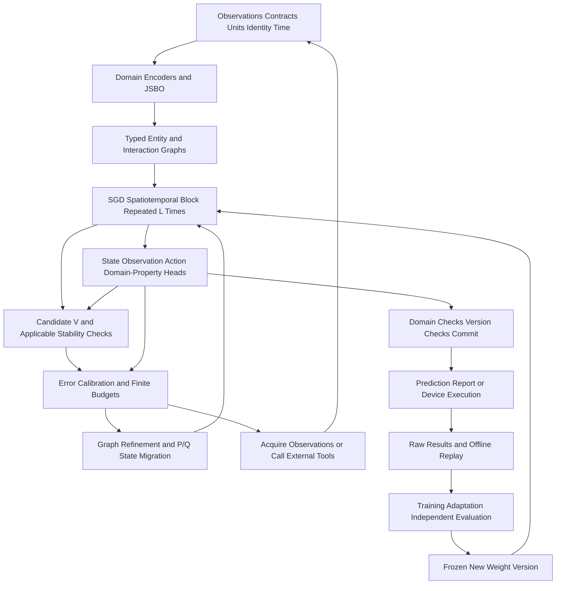

# 3. System Connection Diagram

The feedback edges have different temporal meanings: R does not advance real time; Q may wait for new physical measurements; G generates candidate weights that take effect after agreed validation and version release, potentially including restricted online adaptation and offline consolidation. D/E are neural forward computations; L contains a trainable V and conditional checks/corrections, while H belongs to the external runtime.

---

[← Previous](section-03.md) · [Contents](../../../SUMMARY.md) · [Next →](section-05.md)
