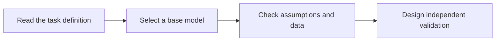

# Equation and diagram rendering checks

Use this page after publishing Pages or connecting GitBook to check equations, diagrams, and tables. It does not represent a model experiment.

**On this page**

- [Mathematical rendering](#section-001)
- [Mermaid diagram](#section-002)
- [Table rendering](#section-003)

---

## Mathematical rendering 

Inline equation: $$z_{t+1}=Az_t+Bu_t$$.

$$
V(e)=e^TPe,\qquad P\succ0.
$$

If you see literal dollar signs instead of equations, check the import method against the maintenance instructions. This package follows the mathematical notation described in GitBook's current documentation and preserves the original TeX content.

## Mermaid diagram 

This diagram describes only reading and research steps. The syntax and fonts of existing Mermaid diagrams may depend on the service's rendering version. Check the paper, architecture, and implementation chapters on first publication.

## Table rendering 

| Variable | Explanation |
|---|---|
| $$z_t$$ | State at time t |
| $$V$$ | Candidate function for the specified error |

[Return to home](../README.md)

---

[← Previous](../architecture/README.md) · [Full contents](../SUMMARY.md) · [Next →](../NOTICE.md)
