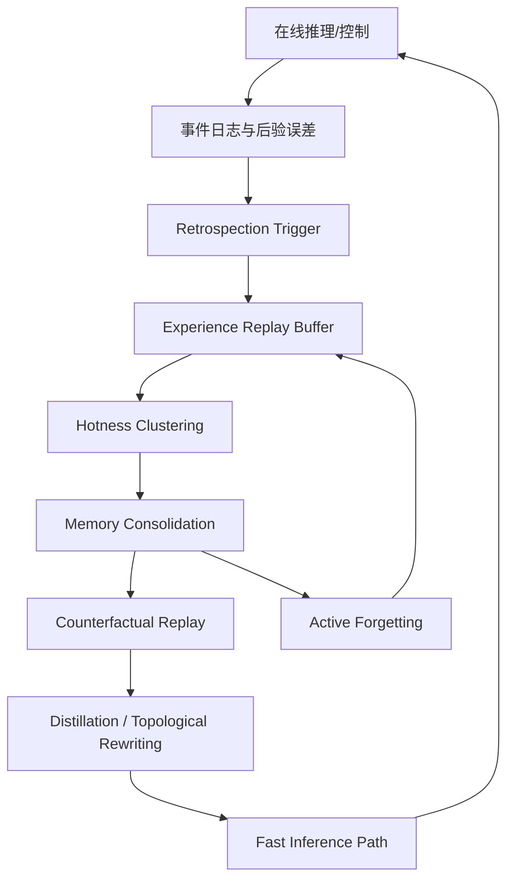
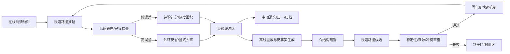

# SGD-Net 反省复盘与动态自进化机制白皮书

> 阅读边界：认知类比、专家视角推演与理论映射是作者的研究讨论，不表示接受过外部专家评审、获得研究机构背书或完成相应定理证明。

> 公开研究版 · 2026-09-12。保留模型方法、公式和组件设计；本文描述研究方案，未据此声称已有训练结果、完整实现或芯片性能。章节编号保留原研究索引，缺号表示未随包发布的独立规划内容。


> 版本：v1.0\
> 日期：2026-06-07\
> 来源：原始讨论材料（本包不附）\
> 关键词：反省、复盘、单步复盘、深度反省、动态整理、潜意识内化、显意识、离线海马重放、主动遗忘、突触修剪、动态自进化、SGD-Retrospection

**本页目录**

- [1. 研究定位](#section-001)
- [2. 核心结论](#section-002)
- [3. 人类反省机制的工程抽象](#section-003)
- [4. SGD-Net 已有机制与反省的关系](#section-008)
- [5. 核心新增：SGD-Retrospection Layer](#section-012)
- [6. 动态整理：把常用处理整理成快速推理机制](#section-015)
- [7. 显式处理向隐式快速机制的内化](#section-021)
- [8. 机制 A：离线海马重放与主动生成对抗进化](#section-025)
- [9. 机制 B：类脑突触衰减与多级记忆主动遗忘](#section-030)
- [10. 四大在线进化机制](#section-035)
- [11. 完整运行闭环](#section-042)
- [12. 工程模块建议](#section-043)
- [13. 验证指标](#section-047)
- [14. 与其他文档的关系](#section-048)
- [15. 风险与边界](#section-049)
- [16. 结论](#section-050)
- [反思、回顾与复盘补充（2026-09-12）](#section-051)

---

## 1. 研究定位 <a href="#section-001" id="section-001"></a>

此前文档已经定义了：

1. `SGD-Net` 的模型主干：SSM + GNN + Dynamic Tree + Posterior Error + Stability Projection；
2. `SGD-Control` 的双闭环控制：前馈预测 + 后验反馈 + 记忆 + 来源监控 + 知识分类；
3. `SGD-Ecosystem` 的虚实闭环：湿实验、数字孪生、双向流形折叠；
4. `SGD-XPU / SGD-XSoC` 的硬件底座：CPU/Fabric + PPU + SGD-TPU。

原始讨论材料（本包不附） 进一步提出一个关键问题：

> SGD-Net 既然被定位为能在实践、学习中持续进化的模型架构，那么它到底靠什么机制“越用越聪明”？

本文给出回答：

> SGD-Net 的自进化不应只靠传统反向传播，而应由“双闭环控制、多级记忆、知识分类、动态推理加速、离线复盘、主动遗忘”共同构成一套动态整理系统。该系统把常用、有效、稳定的复杂处理路径，从高成本显式推理逐步整理、压缩、蒸馏、固化为快速推理机制；同时把低价值、过期、冗余和非保结构细节主动遗忘。

本文是对 [SGD-Net双闭环控制与类脑认知架构](14.md) 的深化：`14` 号文档解释控制和认知骨架，本文解释这些骨架如何驱动模型持续改进。

## 2. 核心结论 <a href="#section-002" id="section-002"></a>

SGD-Net 的反省与改进机制可以概括为一句话：

> 在线阶段用后验误差发现“惊奇”，短期阶段用单步复盘纠偏，中期阶段用动态整理把高频成功路径内化为快速推理链路，离线阶段用反事实重放和主动遗忘完成长期自进化。

它包含四个层次：

| 层次 | 机制 | 作用 | 对应人类类比 |
|---|---|---|---|
| 单步复盘 | 内环误差纠偏 | 快速修正当前动作，不改变整体范式 | 开车时微调方向盘 |
| 深度反省 | 外环后验会审 | 质疑并修改当前策略、拓扑或知识分类 | 复盘失败原因 |
| 动态整理 | 记忆整合与快速链路固化 | 把常用处理整理成低延迟路径 | 技能内化、肌肉记忆 |
| 主动遗忘 | 衰减、剪枝、归一和压缩 | 防止模型越学越臃肿 | 突触修剪、忘掉噪声 |

需要强调：本文中的“潜意识/显意识”“海马体/睡眠”等均是启发式工程类比，不表示 SGD-Net 是生物脑的精确仿真。

原始讨论材料（本包不附） 进一步把自进化从单机复盘扩展为“端侧受限适应 + 云端安全合并”的代际机制：端侧只产生可审计、可脱敏的小 delta；云端通过冲突检测、沙箱合并、反向自蒸馏和回归门禁形成下一代候选内核。该机制仍然属于工程研究路线，不应被表述为无限制自我改写。

## 3. 人类反省机制的工程抽象 <a href="#section-003" id="section-003"></a>

人类反省和复盘可以抽象为四类机制。

### 3.1 经验重放 <a href="#section-004" id="section-004"></a>

人在休息、睡眠或停顿时，会对近期经历进行压缩重放。工程上对应：

```text
experience buffer
  → replay sampler
  → trajectory reconstruction
  → rule extraction
  → long-term consolidation
```

SGD-Net 中可表示为经验缓冲区：

$$
\mathcal{B}=\{(\mathcal{G}_t,a_t,\hat{y}_t,y_t,\eta_t,source_t,cost_t)\}_{t=1}^{T}
$$

其中：

- $$\mathcal{G}_t$$ 是图状态；
- $$a_t$$ 是控制动作；
- $$\hat{y}_t$$ 是模型预测；
- $$y_t$$ 是真实反馈或高可信仿真；
- $$\eta_t$$ 是后验误差；
- $$source_t$$ 是来源标签；
- $$cost_t$$ 是计算成本或延迟。

### 3.2 双系统冲突 <a href="#section-005" id="section-005"></a>

人类有快速直觉系统和慢速理性系统。SGD-Net 中对应：

| 人类认知 | SGD-Net 模型/系统映射 | 作用 |
|---|---|---|
| 系统1 / 快速直觉 | SSM + GNN + Dynamic Tree 快速路径 | 常规工况低成本前推 |
| 系统2 / 慢速理性 | 后验误差、稳定投影、PPU/高精度求解 | 异常工况重新会审 |
| 冲突信号 | 后验误差 $$\eta$$、漂移 $$r^{drift}$$、守恒违背 | 触发反省与重构 |

### 3.3 反事实推理 <a href="#section-006" id="section-006"></a>

反省不只是回放已经发生的事情，还会问：

> 如果当时换一个动作、换一个边界条件、换一个温度或压力，结果会怎样？

SGD-Net 中对应反事实沙箱：

$$
\tau^{cf}=\operatorname{Rollout}(f_{twin},s_t,a_t+\Delta a,b_t+\Delta b)
$$

其中 $$\Delta a,\Delta b$$ 是动作或边界条件扰动。

### 3.4 元认知监控 <a href="#section-007" id="section-007"></a>

人类会感知“自己不确定”“当前直觉不可靠”。SGD-Net 中对应元认知阈值：

$$
\Gamma_t=\phi_\Gamma(\eta_t,r_t^{drift},r_t^{source},V_t,uncertainty_t)
$$

当 $$\Gamma_t$$ 高时，系统进入谨慎模式：

- 提高后验检查频率；
- 降低前馈计划权重；
- 强制调用高精度校正；
- 增加数据采样或实验验证；
- 禁止假说直接晋升。

## 4. SGD-Net 已有机制与反省的关系 <a href="#section-008" id="section-008"></a>

### 4.1 双闭环控制 <a href="#section-009" id="section-009"></a>

双闭环控制是反省的控制论引擎。

| 控制层 | 复盘类型 | 作用 |
|---|---|---|
| 内环反馈 | 单步复盘 | 基于瞬时误差 $$\delta_t$$ 微调当前状态或动作 |
| 外环反馈 | 深度反省 | 基于长期后验误差 $$\eta_{t:t-k}$$ 修改策略、结构或知识分类 |

单步误差可写为：

$$
\delta_t=d(\hat{y}_t,y_t)
$$

外环反省误差可写为：

$$
\eta_t^{deep}=\sum_{k=0}^{K}\gamma^k\eta_{t-k}+\lambda_d r_t^{drift}+\lambda_s r_t^{source}
$$

当：

$$
\eta_t^{deep}>\epsilon_{reflect}
$$

触发深度反省。

### 4.2 多级记忆系统 <a href="#section-010" id="section-010"></a>

多级记忆为反省提供材料和时间尺度。

| 记忆层 | 反省用途 | 工程实现 |
|---|---|---|
| 瞬时记忆 | 当前单步纠偏 | register / current graph message |
| 短期记忆 | 最近片段复盘 | SSM hidden state / local cache |
| 中期记忆 | 近期经验重组 | dynamic tree leaves / adapters |
| 长期记忆 | 离线大反省 | replay buffer / evidence store / HBM |
| 影子记忆 | 低置信假说沙箱 | shadow graph-tree |

### 4.3 知识分类 <a href="#section-011" id="section-011"></a>

知识分类不是静态抽屉，而是反省结果的归宿。

| 反省结果 | 写入位置 | 后续行为 |
|---|---|---|
| 稳定有效路径 | 正例经验 / fast path | 优先使用并可固化 |
| 失败路径 | 教训禁区 / blocked path | 下次触发断路或回滚 |
| 未验证推断 | 影子图-树 | 只能在沙箱参与推理 |
| 过期路径 | 衰减候选 | 进入剪枝或遗忘流程 |
| 高价值异常 | replay buffer | 离线反事实复盘 |

## 5. 核心新增：SGD-Retrospection Layer <a href="#section-012" id="section-012"></a>

建议在完整 SGD-Net 中引入一个新层级：`SGD-Retrospection Layer`。

它不是普通前向 layer，而是跨在线/离线阶段运行的反省与动态整理层。



### 5.1 触发条件 <a href="#section-013" id="section-013"></a>

反省层可由以下条件触发：

| 条件 | 含义 |
|---|---|
| $$\eta_t>\epsilon$$ | 后验误差异常 |
| $$r_t^{drift}>\epsilon_d$$ | 概念漂移 |
| $$Cost(path)>\epsilon_c$$ | 常用路径成本过高 |
| $$freq(path)>\epsilon_f$$ | 某路径高频出现 |
| idle / offline | 系统进入空闲或离线窗口 |
| memory pressure | 多级记忆空间紧张 |

### 5.2 反省层输出 <a href="#section-014" id="section-014"></a>

| 输出 | 作用 |
|---|---|
| `FastPathCandidate` | 待固化的快速推理链路 |
| `LessonPatch` | 教训、阻断条件或风险墙 |
| `ForgetPlan` | 待剪枝、衰减或归一的记忆/拓扑 |
| `ThresholdUpdate` | 元认知阈值和仲裁策略更新 |
| `ReplayDataset` | 离线重放与反事实样本集 |

## 6. 动态整理：把常用处理整理成快速推理机制 <a href="#section-015" id="section-015"></a>

用户指出的关键点是“动态整理”。这不是简单加速，而是模型运行中的结构重写。

### 6.1 热度聚类 <a href="#section-016" id="section-016"></a>

对一条处理路径 $$p$$ 定义热度分数：

$$
H(p)=\frac{Freq(p)\cdot Gain(p)\cdot Trust(p)\cdot Stability(p)}{Cost(p)+\epsilon}
$$

其中：

- $$Freq(p)$$：调用频次；
- $$Gain(p)$$：该路径被快速化后可节省的延迟或算力；
- $$Trust(p)$$：后验验证置信度；
- $$Stability(p)$$：是否满足守恒/稳定约束；
- $$Cost(p)$$：存储、维护和推理成本。

当：

$$
H(p)>\tau_{hot}
$$

则进入动态整理候选集。

### 6.2 跨层级记忆整合 <a href="#section-017" id="section-017"></a>

同一处理路径可能分散在多个记忆层：

```text
instant messages
+ short-term SSM trace
+ medium-term tree leaves
+ long-term replay records
+ source/evidence tags
```

整理过程为：

$$
Z_p=\operatorname{Consolidate}(\mathcal{B}_p^{inst},\mathcal{B}_p^{short},\mathcal{B}_p^{mid},\mathcal{B}_p^{long})
$$

### 6.3 脱敏与因果骨架提取 <a href="#section-018" id="section-018"></a>

不是所有细节都应固化。保留的是：

- 可复现的输入-输出映射；
- 符合物理/逻辑守恒的主因果链；
- 与任务目标互信息高的特征；
- 后验误差低且来源可信的证据。

可定义：

$$
CausalCore(p)=\arg\max_{z\subset Z_p}\left[MI(z;y)-\lambda Noise(z)-\mu Complexity(z)\right]
$$

### 6.4 重构编译 <a href="#section-019" id="section-019"></a>

动态整理的核心是将高成本显式处理编译为快速推理链路：

$$
FastPath_p=\operatorname{Compile}_{retro}(CausalCore(p))
$$

工程上可表示为：

```text
high-cost explicit routine
  → causal feature chain
  → low-rank adapter / tree path / SSM state shortcut
  → fast inference path
```

### 6.5 固化条件 <a href="#section-020" id="section-020"></a>

快速路径不能只因“常用”而固化，还必须满足：

$$
\bar{\eta}_p<\epsilon_{fast},\quad
\Delta V_p\le \delta_V,\quad
Trust(p)>\tau_{trust},\quad
Conflict(p)=0
$$

若不满足，则只能保留为候选，不进入主干快速路径。

## 7. 显式处理向隐式快速机制的内化 <a href="#section-021" id="section-021"></a>

### 7.1 不是速度差异，而是结构迁移 <a href="#section-022" id="section-022"></a>

“显意识/潜意识”的关键不是快慢，而是：

| 维度 | 显式处理 | 隐式快速机制 |
|---|---|---|
| 表达方式 | 高维、可解释、保留自由度 | 低秩、压缩、拓扑化 |
| 运行方式 | 动态求解 | 直接路由/扫描 |
| 知识形态 | 方程、证据、反事实轨迹 | adapter、树路径、状态缓存、拓扑权重 |
| 触发方式 | 异常或高风险 | 常规高频 |

### 7.2 保结构蒸馏 <a href="#section-023" id="section-023"></a>

以高可信显式求解器或 PPU 轨迹作为教师：

$$
\mathcal{L}_{distill}=\|F_{fast}(x;\theta_f)-F_{explicit}(x)\|^2
+\lambda\mathcal{L}_{inv}+\mu\mathcal{L}_{complexity}
$$

其中 $$\mathcal{L}_{inv}$$ 表示守恒或不变量约束。

### 7.3 拓扑硬化 <a href="#section-024" id="section-024"></a>

当某路径长期高频、低误差、低风险时，使其局部参数更稳定：

$$
\theta_p \leftarrow (1-\alpha)\theta_p+\alpha\theta_p^{distilled}
$$

同时降低路径搜索成本：

$$
route(x)\rightarrow p^* \quad \text{if } condition_{p^*}(x)=1
$$

这就是模型层面的“常用处理内化”。

## 8. 机制 A：离线海马重放与主动生成对抗进化 <a href="#section-025" id="section-025"></a>

### 8.1 基本思想 <a href="#section-026" id="section-026"></a>

在线系统只能处理已经发生的误差。离线重放则可以在空闲期对历史错误和高价值异常进行高密度复盘。

更进一步，反事实重放可以主动生成未发生但合理的极端情境。

### 8.2 反事实生成 <a href="#section-027" id="section-027"></a>

对历史轨迹 $$\tau$$ 施加扰动：

$$
\tau^{cf}=\operatorname{Counterfactual}(\tau,\xi)
$$

其中扰动 $$\xi$$ 可包括：

- 边界条件变化；
- 动作变化；
- 环境参数变化；
- 传感器噪声变化；
- 材料参数变化；
- 图拓扑局部断裂或重连。

### 8.3 对抗式自进化目标 <a href="#section-028" id="section-028"></a>

可写成：

$$
\min_{\theta_{fast}}\max_{\xi\in\Xi}\ \mathcal{L}_{retro}(F_{fast}(\tau^{cf};\theta_{fast}),F_{teacher}(\tau^{cf}))
+\lambda\mathcal{L}_{stable}
$$

含义是：

- 生成器寻找更难的反事实工况；
- 快速路径学习在这些工况下保持低误差；
- 稳定项防止为了拟合极端样本破坏正常工况。

### 8.4 离线重放流程 <a href="#section-029" id="section-029"></a>

```text
collect surprise events
  → sample high-value replay traces
  → generate counterfactual perturbations
  → teacher solver / high-trust simulator evaluates
  → distill into fast path candidates
  → validate invariants
  → promote / quarantine / discard
```

## 9. 机制 B：类脑突触衰减与多级记忆主动遗忘 <a href="#section-030" id="section-030"></a>

### 9.1 为什么需要遗忘 <a href="#section-031" id="section-031"></a>

如果只学习和固化，不遗忘，系统会出现：

- 动态树无限膨胀；
- 快速路径冲突；
- HBM/replay buffer 被低价值样本撑爆；
- 旧环境经验干扰新环境；
- 推理越来越慢而不是越来越快。

因此，遗忘不是缺陷，而是自进化的必要组成。

### 9.2 路径价值状态 <a href="#section-032" id="section-032"></a>

对快速路径 $$p$$ 定义价值状态：

$$
S_p(t+1)=\beta S_p(t)+r_p(t)-\lambda_c Cost_p(t)-\lambda_r Risk_p(t)
$$

其中 $$r_p(t)$$ 来自成功预测、低误差和低延迟奖励。

若：

$$
S_p(t)<\tau_{decay}
$$

则进入衰减候选。

若长期低于：

$$
S_p(t)<\tau_{prune}
$$

则执行剪枝或归档。

### 9.3 三层主动遗忘过滤器 <a href="#section-033" id="section-033"></a>

| 层 | 对象 | 动作 |
|---|---|---|
| 噪声蒸发 | 瞬时噪声、无来源低置信数据 | 算完即删或只保留摘要 |
| 拓扑修剪 | 长期不激活或高风险快速路径 | 降权、熔断、归档 |
| 流形归一 | 多组相似经验 | 合并为不变量、删除冗余原始样本 |

### 9.4 遗忘不等于删除证据 <a href="#section-034" id="section-034"></a>

科学场景中，原始证据链可能必须保留用于审计。因此建议区分：

| 动作 | 含义 |
|---|---|
| `evaporate` | 删除瞬时低价值噪声 |
| `compress` | 保留摘要和指纹，删除冗余细节 |
| `archive` | 移入低成本长期存储，不参与快速推理 |
| `prune` | 从快速路径和动态树中移除 |
| `quarantine` | 隔离可疑知识，保留审计证据 |

## 10. 四大在线进化机制 <a href="#section-035" id="section-035"></a>

SGD-Net 当前可采用四类自进化机制。

### 10.1 动态拓扑可塑性 <a href="#section-036" id="section-036"></a>

对应人类突触可塑性。规则可写为局部 Hebbian / STDP-like 更新：

$$
\Delta w_{ij}=\alpha\cdot pre_i(t)\cdot post_j(t+\Delta t)\cdot R_t
$$

其中 $$R_t$$ 是后验验证奖励或稳定性奖励。

### 10.2 保结构蒸馏 <a href="#section-037" id="section-037"></a>

把高可信显式求解结果蒸馏到快速路径：

$$
\theta_{fast}^{*}=\arg\min_\theta \mathcal{L}_{distill}(\theta)
$$

### 10.3 跨层级记忆整合 <a href="#section-038" id="section-038"></a>

把多级记忆中的碎片经验整理为可复用技能：

$$
Skill_k=\operatorname{Consolidate}(\{\tau_i\}_{i\in\mathcal{I}_k})
$$

### 10.4 元认知阈值演化 <a href="#section-039" id="section-039"></a>

根据环境稳定性调整是否信任快速路径：

$$
\epsilon_{reflect}(t+1)=\epsilon_{reflect}(t)+\alpha(Trust_t-Risk_t)
$$

### 10.5 端侧增量快照与群体回流 <a href="#section-040" id="section-040"></a>

单个部署端的“越用越聪明”不应直接表现为在线改写主干权重。更安全的做法是：端侧在本地完成受限适应和复盘，只把经过脱敏、签名和本地验证的小增量上传为 `EvolutionaryDeltaSnapshot`。

建议快照字段如下：

```text
EvolutionaryDeltaSnapshot:
  device_id_hash: str
  model_version: str
  task_domain: str
  source_policy: str
  delta_type: ssm_bias | adapter | tree_rule | harness_threshold | jsbo_calibration
  delta_payload_ref: str
  validation_summary: dict
  safety_summary: dict
  privacy_summary: dict
  trace_refs: list[str]
  signature: str
```

云端收到 delta 后，必须经过：

```text
verify signature / source / privacy
  → cluster by domain and geometry
  → detect conflict and poisoned update
  → merge in sandbox
  → distill to candidate adapter or fast path
  → run Harness regression and replay benchmark
  → canary rollout / rollback
```

可选合并方法包括 FedAvg、Model Soup、Task Arithmetic、TIES-Merging，以及对流形参数先对齐到切空间再合并的 Riemannian / tangent-space merge。所有合并结果都必须记录 `ModelMergeTrace`，并且默认只晋升为候选 adapter、fast path 或局部 calibration，而不是直接覆盖主干。

### 10.6 反向自蒸馏与代际内核升级 <a href="#section-041" id="section-041"></a>

群体回流的目标不是把所有端侧经验机械平均，而是生成下一代可验证候选：

```text
G_k kernel
  + verified deltas
  + replay / counterfactual suite
  + Harness regression
  → distilled G_{k+1} candidate
  → canary rollout
  → rollback if safety metrics regress
```

这可被称为“反向自蒸馏”：端侧经验先汇聚为候选教师集合，再由云端把共同能力蒸馏回统一 adapter、fast path 或 calibration table。若回归测试显示遗忘、冲突或安全指标退化，则该候选进入 quarantine，而不是发布。

## 11. 完整运行闭环 <a href="#section-042" id="section-042"></a>



## 12. 工程模块建议 <a href="#section-043" id="section-043"></a>

### 12.1 主工程包 <a href="#section-044" id="section-044"></a>

建议在 Python 实现中增加 `sgd_net.retrospection` 包。

```text
sgd_net/retrospection/
  event_recorder.py             # 记录惊奇误差、控制动作、来源和成本
  replay_buffer.py              # 管理在线/离线经验缓冲区
  hotness_clustering.py          # 识别高频、高收益、可信处理路径
  memory_consolidator.py         # 跨层级记忆整合与因果骨架提取
  counterfactual_generator.py    # 生成反事实扰动和极端工况
  retrospection_compiler.py      # 将高成本处理编译为快速推理候选
  distillation_trainer.py        # 保结构蒸馏与快速路径训练
  fast_path_registry.py          # 管理已固化快速路径
  decay_pruner.py                # 衰减、剪枝、压缩和主动遗忘
  metacognitive_threshold.py     # 元认知阈值与反省触发策略
  delta_snapshot.py              # 端侧增量快照与脱敏摘要
  merge_trace.py                 # 群体合并过程与审计记录
sgd_net/collective/
  merge_sandbox.py               # 云端沙箱合并与回归门禁
  conflict_resolver.py           # delta 冲突、符号方向和投毒检测
  distillation_merger.py         # 反向自蒸馏与候选代际内核生成
```

### 12.1 关键数据结构 <a href="#section-045" id="section-045"></a>

```text
ReflectionEvent:
  event_id: str
  graph_state_ref: str
  action: str
  prediction_ref: str
  observation_ref: str
  posterior_error: float
  stability_delta: float
  source_report: dict
  compute_cost: dict
  timestamp: datetime
```

```text
FastPathCandidate:
  path_id: str
  trigger_condition: dict
  compressed_core: dict
  adapter_ref: str
  expected_gain: float
  validation_error: float
  stability_report: dict
  source_confidence: float
  status: candidate | promoted | quarantined | pruned
```

```text
ForgetPlan:
  target_id: str
  target_type: fast_path | replay_trace | tree_branch | memory_record
  action: evaporate | compress | archive | prune | quarantine
  reason: str
  expected_memory_saved: int
  audit_policy: dict
```

```text
EvolutionaryDeltaSnapshot:
  snapshot_id: str
  model_version: str
  task_domain: str
  delta_type: str
  delta_payload_ref: str
  validation_summary: dict
  safety_summary: dict
  privacy_summary: dict
  trace_refs: list[str]
  status: local_only | submitted | accepted | rejected | quarantined
```

```text
CollectiveMergeReport:
  merge_id: str
  input_snapshot_refs: list[str]
  merge_method: fedavg | model_soup | task_vector | ties | distillation | tangent_space
  conflict_summary: dict
  regression_summary: dict
  harness_summary: dict
  promoted_artifact_ref: str | None
  rollback_policy: dict
```

### 12.2 可选：叙事梦境创作子系统 <a href="#section-046" id="section-046"></a>

原始讨论材料（本包不附） 指出，Retrospection 的“离线重放 + 反事实扰动 + 动态整理 + 主动遗忘”也可以迁移到非工业创作场景。该能力建议作为独立子系统，而不是默认进入工业控制主干。

```text
sgd_net/retrospection/narrative/
  story_graph.py              # 人物、事件、地点、主题、伏笔图
  plot_tree.py                # 情节分叉、冲突升级、支线剪枝
  dream_perturbation.py       # 意象、情绪、冲突的随机扰动
  narrative_critic.py         # 世界观一致性、人物动机、因果闭环评分
  cliche_pruner.py            # 陈词滥调和重复桥段剪枝
  draft_consolidator.py       # 草稿复盘、桥段合并和伏笔回收
```

对应目标不是物理守恒，而是叙事一致性：

$$
\mathcal{L}_{story}=\lambda_1\mathcal{L}_{character}
+\lambda_2\mathcal{L}_{causality}
+\lambda_3\mathcal{L}_{theme}
+\lambda_4\mathcal{L}_{novelty}
-\lambda_5\mathcal{L}_{cliche}
$$

需要明确边界：叙事梦境输出只能作为创作候选，不得被标记为真实经验、实验事实或工程控制依据。

## 13. 验证指标 <a href="#section-047" id="section-047"></a>

| 指标 | 含义 |
|---|---|
| 单步复盘延迟 | 内环误差纠偏耗时 |
| 反省触发准确率 | 高价值异常是否被捕获 |
| 快速路径命中率 | 固化路径在后续任务中被命中的比例 |
| 快速路径误差 | 固化路径相对显式路径的误差 |
| 平均推理成本下降 | 动态整理后成本是否下降 |
| 复犯率下降 | 同类错误是否减少 |
| 记忆压缩率 | replay buffer / tree / fast path 的压缩收益 |
| 主动遗忘误删率 | 是否误删高价值路径 |
| OOD 安全率 | 分布外场景是否能触发外环反省 |

## 14. 与其他文档的关系 <a href="#section-048" id="section-048"></a>

| 文档 | 关系 |
|---|---|
| [SGD-Net模型架构与层算子详解](13.md) | 本文补充模型在 forward 之外的反省、动态整理和快速路径固化机制 |
| [SGD-Net双闭环控制与类脑认知架构](14.md) | 本文深化双闭环、多级记忆和知识分类如何转化为自进化能力 |
| [SGD-Ecosystem物理具身数字孪生与双向流形折叠](15.md) | 反事实重放和实验复盘依赖虚实闭环数据 |
| 独立研究材料（本包不附） | XPU/XSoC 为离线重放、统一内存和快速路径固化提供硬件底座 |
| [SGD-Net与JEPA世界模型融合及JSBO桥梁算子](18.md) | JEPA latent trace 可作为 replay 数据源，JSBO bridge path 可进入动态整理与快速路径固化 |
| [SGD-Net混合求解训练体系与世界模型研究路线](27.md) | 本文的自进化机制进一步扩展为端侧 delta、群体合并、反向自蒸馏和代际内核升级 |
| `03-06` 实现文档 | 应新增 `sgd_net.retrospection` 工程包、接口和开发计划 |

## 15. 风险与边界 <a href="#section-049" id="section-049"></a>

| 风险 | 说明 | 缓解 |
|---|---|---|
| 类脑类比过度 | 不能声称精确复刻生物脑 | 只使用工程启发式表述 |
| 快速路径过拟合 | 高频路径可能只适用于局部条件 | 固化前必须做来源、稳定性、反事实验证 |
| 主动遗忘误删 | 删除了低频但关键的安全知识 | 安全知识进入只读或归档，不直接 prune |
| 离线重放污染主干 | 生成反事实样本可能不真实 | 加物理守恒和来源标签，先入影子区 |
| 动态整理影响实时控制 | 后台整理抢占资源 | 设置离线窗口、优先级和锁保护协议 |
| 群体合并投毒 | 端侧 delta 可能包含恶意、冲突或隐私敏感信息 | 签名、脱敏、source tag、异常检测、sandbox merge、TIES-like 冲突消解和 rollback |

## 16. 结论 <a href="#section-050" id="section-050"></a>

原始讨论材料（本包不附） 的核心贡献，是把 SGD-Net 的“动态进化”从一句愿景，落到了可实现的机制链条上：

```text
后验误差发现惊奇
→ 单步复盘快速纠偏
→ 深度反省定位范式问题
→ 多级记忆动态整理
→ 常用处理固化为快速推理路径
→ 离线反事实重放提升鲁棒性
→ 端侧 delta 经安全合并形成代际候选
→ 主动遗忘释放容量并防止臃肿
```

这意味着 SGD-Net 的“越用越聪明”不是简单持续训练，而是：

> 通过反省复盘发现高价值经验，通过动态整理把常用处理内化为快速机制，通过主动遗忘保持模型轻盈，通过元认知阈值判断何时该信任直觉、何时必须重新反省。

因此，SGD-Net 不只是一个会推理的模型，而应是一个具备自我整理、自我压缩、自我修剪和自我进化能力的闭环模型架构。

## 反思、回顾与复盘补充（2026-09-12） <a href="#section-051" id="section-051"></a>

本轮补充区分回顾、复盘、反思，明确事件记忆、错误归因、反事实边界与后续验证。原文的人类认知类比不作为机制证明；真实反馈与仿真输出应分别记录。

详细职责、数学衔接、抓取案例与实验对照见 [50-SGD-Net反思回顾复盘的基础与闭环完善20260912](50.md)。本次为文档设计补全，尚未实现或训练验证。


---

[← 上一页](14.md) · [全书目录](../SUMMARY.md) · [下一页 →](50.md)
