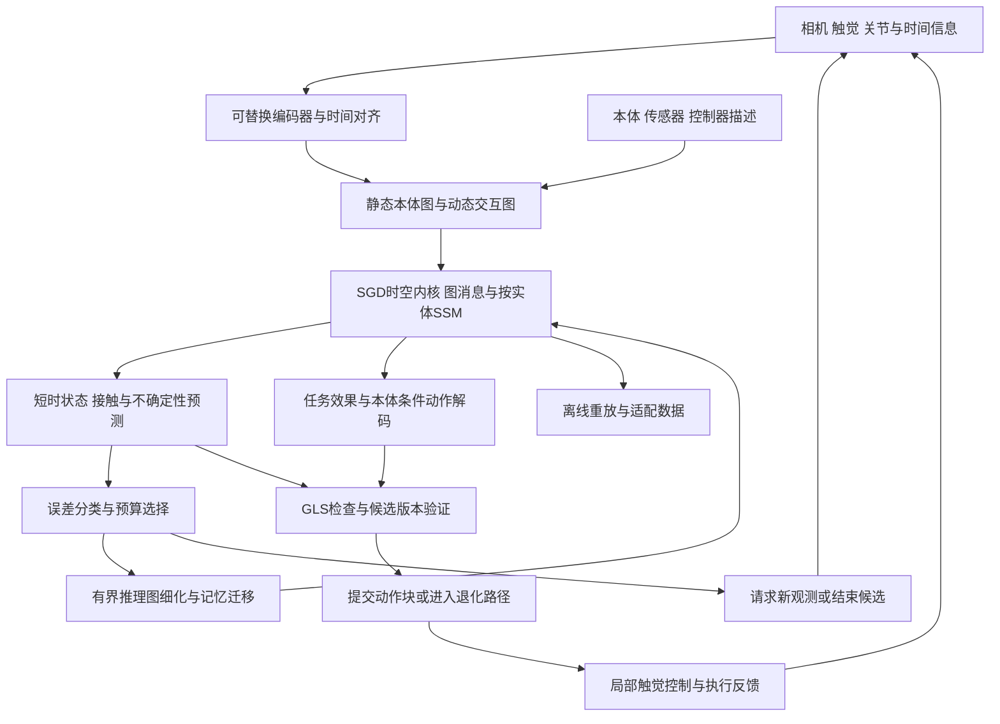

# SGD-Net-TC：拓扑与接触条件世界模型架构提案

> 公开研究版 · 2026-09-12。保留模型方法、公式和组件设计；本文描述研究方案，未据此声称已有训练结果、完整实现或芯片性能。章节编号保留原研究索引，缺号表示未随包发布的独立规划内容。

> v0.1研究提案 · 2026-09-12 · TC = Topology and Contact；名称为项目研究标识，不表示外部首创或已训练模型。
>
> [融合依据与创新边界](32.md) · [验证与软硬件方案](34.md)

**本页目录**

- [1. 目标](#section-001)
- [2. 总体结构](#section-002)
- [3. 三类图和两个状态域](#section-003)
- [4. 可训练时空内核](#section-006)
- [5. 任务效果与本体动作联合建模](#section-009)
- [6. 推理图细化时的记忆迁移](#section-010)
- [7. 不确定性驱动的有限计算](#section-013)
- [8. 不同速率与动作块内修正](#section-014)
- [9. 训练目标与顺序](#section-015)
- [10. 与GLS的连接与保证边界](#section-016)
- [11. 作为新模型的交付物](#section-017)
- [参考文献](#section-018)

---

## 1. 目标 

SGD-Net-TC拟学习“当前结构与历史＋候选动作→未来物体/机器人状态、接触和任务效果”，并在同一内核中生成与目标本体兼容的动作。与原SGD-Net相比，主要增量是明确区分本体、交互和推理拓扑，学习图细化时的状态迁移，按误差来源选择计算或观测，并让动作解码接受接触预测的训练约束。

首个任务域为固定机械臂与灵巧手的短时操作；语义/视觉编码可来自冻结模型。系统包括可训练模型与外部运行时两部分。可训练部分承担预测、表征和策略；GLS/Aegis相关部分承担资源边界、错误处置和动作提交。后者不能替代前者的训练，也不自动使其具有正确性保证。

## 2. 总体结构 

模型推理的循环有最大次数、时限和内存上界。请求观测是带等待/超时的系统动作，不是瞬间取得缺失真值。没有新观测的内部循环不得推进真实时间记忆。

## 3. 三类图和两个状态域 

### 3.1 结构定义 

$$
\mathcal B=(V_B,E_B,\beta),\qquad
\mathcal I_t=(V_O\cup V_B,E_{I,t},c_t),\qquad
\mathcal R_t^{\ell}=\operatorname{Refine}_{\ell}(\mathcal I_t).
$$

`B`是本体图：连杆、关节、传动耦合、关节限位、传感器位置和已知物理参数。它由版本化描述给定；本体更换是显式配置事件。URDF不一定覆盖摩擦、腱传动、迟滞及触觉标定，缺失参数带unknown或区间。

`I`是物体和本体之间的交互图：边包含邻近、估计接触、滑移与相对几何。邻近边不是已发生接触；必须有独立边类型、观测来源与不确定度。

`R`是推理图：将物体表面/接触区域粗分或细分以分配计算。推理节点的分裂不创造物理手指，不改变设备真实质量或关节数量。任务语义可作为额外条件，但不把语义边解释成识别后的因果关系。

### 3.2 状态域隔离 

$$
S_t^{obs}=(\hat x_t,h_t,\mathcal I_t,U_t,\nu_t),
\quad S_{t,k}^{imag}=F_\theta(S_t^{obs},a_{t:t+k-1},\mathcal B).
$$

$$\nu_t$$包含本体、模型、标定、控制器和观测版本。`obs`只由真实反馈和状态估计更新；`imag`保存独立候选的rollout。最终选中一个动作块，也不直接将预测的未来状态当作真实观测回写。新反馈到来后才校正历史状态。

时间使用三元组`(sensor_time, rollout_step, refinement_iter)`。节点使用稳定实体ID，不把数组下标当身份；对象跟踪身份不确定时清空或降级相关记忆，不能将甲物体历史赋给乙物体。

## 4. 可训练时空内核 

### 4.1 本体条件图传播与状态更新 

对实体$$i$$的当前可用输入$$u_{i,t}$$，采用共享参数消息聚合和沿物理时间的递归：

$$
m_{i,t}=\sum_{j\in\mathcal N(i)}\phi_\theta(h_{i,t-1},h_{j,t-1},e_{ij,t},\beta_i,\beta_j),
$$
$$
\bar h_{i,t}=\bar A_\theta(u_{i,t},m_{i,t},\Delta t_i)h_{i,t-1}
             +\bar B_\theta(u_{i,t},m_{i,t},\Delta t_i)u_{i,t},
$$
$$
h_{i,t}=\bar h_{i,t}+K_\theta(u_{i,t},m_{i,t},M_{i,t})\,\tilde r_{i,t}.
$$

$$M$$是模态有效性掩码；$$\tilde r$$是按量纲归一化并限幅的观测创新，即当前观测与此前对同一时刻预测之差。缺少匹配预测/观测时不伪造残差为零，应关闭此校正并标记unknown。该形式是研究设计，借鉴选择性状态空间，但不宣称所有门控组合天然稳定。[^R01][^R03]

SSM按每个稳定实体的时间序列推进，空间交互由置换不变聚合完成。训练可使用有mask的时间scan；不能任意按节点编号串行scan后宣称节点置换等变。输入包括重力方向和关节轴时，它们应随坐标变换同步；手性敏感任务优先验证SE(3)而非无条件反射对称。[^R05]

### 4.2 语义和物理桥接 

保持语义表征$$z_t$$与可测物理状态$$x_t$$分离：

$$
(\hat x_t,U_t)=\Psi_\omega(z_t,\text{proprio}_t,\text{touch}_t,\mathcal B,M_t).
$$

这继承JSBO的结构桥概念。物理头训练需要配对轨迹或可信仿真标签，不能仅依靠JEPA对齐损失获得牛顿、弧度等语义。JEPA可作为初始化/辅助目标，其可识别性结果依赖具体分布条件。[^R13][^R14]

未来预测头输出状态、接触模式与传感预测，物理量保留单位；隐藏向量可正则化，测量值不能被统一范数裁剪。首轮采用短视界显式预测。隐式求根、保辛层、多曲率与全局因果发现均不作为必要部件。

## 5. 任务效果与本体动作联合建模 

将任务相关效果记为$$y_{t:t+H}$$：可包括物体位姿变化、允许接触区域与触觉摘要。它是可迁移条件，而非假定不同手能实现完全相同的接触。

$$
y^*\sim\pi_{effect}(S_t^{obs},g),\qquad
a^B=D_\psi(S_t^{obs},y^*,\mathcal B,\kappa),
$$
$$
(\hat x^+,\hat c^+,\hat y^+)=F_\theta(S_t^{obs},a^B,\mathcal B,\kappa).
$$

$$g$$是任务，$$\kappa$$为控制器模式/标定条件。动作头可在早期采用固定步数flow head，也可先采用小型确定性头作为基线；不要求从零训练VLA。它可输出原生关节目标或关键点目标，但关键点路径必须包含可检查的IK映射。两种输出使用不同schema。

用真实转移监督$$F$$，再通过$$\|\hat y^+-y^*\|$$约束动作效果。为避免动作头钻世界模型误差的漏洞，训练时先固定或慢更新世界模型，使用数据支持域与动作幅值约束，并在独立真实回放中检查结果。想象奖励不是实际任务奖励。

本模块与CGP的状态—触觉—目标映射相关，也受跨本体图世界模型的先例约束；候选贡献在于与H1的状态迁移、H2的预算控制共同作用，而不是再次声称发现了动作条件预测。[^R06][^R07][^R09]

## 6. 推理图细化时的记忆迁移 

### 6.1 只在同一物理时刻改变表示 

令$$P_{\ell\to\ell+1}$$为细化延拓，$$Q_{\ell+1\to\ell}$$为限制；两者对标量、几何、广延物理量与隐状态分别定义。对相同的粗层状态，采用：

$$
\mathcal L_{transfer}=\|Q_hP_hh-h\|_W^2,
$$
$$
\mathcal L_{comm}=\|Q_hF_{\ell+1}(P_hh,a)-F_\ell(h,a)\|_W^2,
$$
$$
\mathcal L_{readout}=\|D_{\ell+1}(P_hh)-D_\ell(h)\|_{W_y}^2.
$$

上述关系是训练与诊断目标，不是已成立等式。第二项比较同一步未来预测，第三项比较**细化发生瞬间**的当前状态/任务摘要；不强迫细化后的未来预测永远与粗层相同，否则会压制细化收益。加入真实未来监督，防止以恒定输出满足一致性。

粗细层比较只对共有、可投影分量计算，新增细节不被错误要求重建为粗层真值。守恒量用体积/质量权重划分而非复制；姿态在局部切空间比较，不能直接对旋转矩阵逐元素平均。普通隐状态不强行宣称物理守恒。

### 6.2 推理与事务语义 

细化在预分配pool中创建候选结构，检查ID/形状、映射误差、预算与当前状态连续性后，才替换模型内部表示。失败则保留原表示。跨本体更换不沿用同一$$P_h$$映射，需目标本体适配或重新初始化；H1的跨分辨率一致性不自动解决跨手型迁移。

既有“复制父节点加噪声”作为基线保留；TC拟学习条件迁移并估计迁移误差。动态树只能细化物体/交互表示或增加候选分支，禁止修改动作门使用的权威本体拓扑。

## 7. 不确定性驱动的有限计算 

误差分为：可通过计算减少的离散/求解误差$$e_{comp}$$、观测/标定误差$$e_{obs}$$、模型认知不确定性$$e_{model}$$及接触随机性$$e_{noise}$$。这不是可精确识别的真值分解，而是带证据标签的估计。分解无法支持时标为unknown。

候选计算动作$$k$$包括保持当前表示、细化局部、增加一个rollout、使用更高精度、请求观测或结束候选。采用小型收益估计器：

$$
k^*=\arg\max_{k\in\mathcal K_{admissible}}
\{\widehat{\Delta L}(k)-\lambda_T\hat T_k-\lambda_M\hat M_k\},
$$
$$
\mathcal K_{admissible}=\{k:\hat T_k+T_{check}^{reserve}+T_{fallback}^{reserve}\leq T_{remain},\ M_k\leq M_{max}\}.
$$

预测时延只用于择优；硬期限由独立计时器、可中止边界和保留路径执行。估计时延不是WCET证明。算法相较传统自适应计算的拟增量，是把“增加计算”与“需要信息”区分，而非只有halt/continue。[^R15]

收益标签可由离线回放对每个候选计算动作的结果生成，不读取部署时的未来真值。安全阈值和最小检查强度不参与该模型的自由优化。高风险场景可能应更早放弃候选，而不是允许无限加深。

## 8. 不同速率与动作块内修正 

语义条件、视觉状态、触觉状态和伺服执行有不同更新频率。可借鉴T-Rex的块内触觉修正与RLDX-1的物理信号/记忆组织，但这些模块并不等价。[^R10][^R11]

TC将原动作块的已提交前缀与可替换后缀分开。局部修正只能在许可的控制空间、幅度和期限内调整；超出则重新生成候选。传感器30Hz不能被内部1000Hz循环解释为1000Hz真实触觉。具体频率由硬件与任务识别，不在本提案提前冻结。

## 9. 训练目标与顺序 

总体目标为：

$$
\mathcal L=\lambda_{pred}\mathcal L_{pred}+\lambda_{act}\mathcal L_{act}
+\lambda_{contact}\mathcal L_{contact}+\lambda_{effect}\mathcal L_{effect}
+\lambda_{transfer}\mathcal L_{transfer}+\lambda_{comm}\mathcal L_{comm}
+\lambda_{readout}\mathcal L_{readout}+\lambda_{cal}\mathcal L_{cal}.
$$

各项分别作用于带mask的真实未来、示范动作、接触标签、动作效果、记忆迁移、粗细预测、当前读出一致性和不确定性校准。不同单位按训练集固定尺度归一化；缺失触觉标签不作零触觉监督。校准用独立episode，不能用训练损失兼作覆盖率证据。

1. **基础动力学**：冻结外部感知；固定图与固定预算，训练状态、接触及动作头。
2. **本体适配**：混合已知本体，留出完整新本体；先训练小解码器或adapter，绘制适配数据曲线。
3. **结构迁移**：加入粗/细成对表示训练$$P,Q$$；先固定预选细化日程，避免路由与预测同时变化导致不可归因。
4. **预算器**：用离线收益标注训练小型排序器，随后在固定预算下比较。
5. **联合微调**：低学习率联合优化，保留原任务回放与每项消融；离线更新后再生成新检查点。

人类视频可预训练视觉和关键点分支，但没有直接触觉/力真值时只提供相应模态监督。DPP的零机器人示范经验不意味着TC也自动具备该性质。[^R12]

## 10. 与GLS的连接与保证边界 

物理预测误差集$$\mathcal E$$、本体及控制器版本、观测时效和模型域组成B层摘要。A层检查动作合同，SAFE/独立控制器处理最终限幅与失效。状态标签使用既有`CERTIFIED / VIOLATED / UNKNOWN`语义，不将低预测方差直接升级为证书。

一个可检查的局部示例：在给定状态域、动作和时间间隔下，若真实一步误差$$\|x^+-\hat x^+\|\leq\epsilon$$，安全函数$$b$$在该域为$$L_b$$-Lipschitz，计算值误差不超过$$\epsilon_b$$，并满足

$$
\tilde b(\hat x^+)\geq L_b\epsilon+\epsilon_b,
$$

则有$$b(x^+)\geq0$$。这是由三角不等式得到的一步条件结论；需要状态/动作确实在域内、时延与执行误差计入$$\epsilon$$。只检查终点不能证明动作过程无碰撞，多步不变性还需递归可行性和时域覆盖。

若$$\epsilon$$只是统计区间，则结论同样是统计的；分布漂移、在线自适应和选择性放行可能破坏覆盖率。区间覆盖必须针对经过预算器和动作选择后的分布重新评估。模型图边、Jacobian、注意力权重都不单独构成因果识别。

## 11. 作为新模型的交付物 

研究实现应最终交付：可训练模型配置、训练/评估代码、冻结数据切分、检查点、模型卡、候选与状态schema、可回放预测轨迹及消融结果。硬件侧另交付实际算子轨迹、内存生命周期和端到端延迟记录。当前文档仅定义这些工件，没有生成训练权重或性能结论。

成功标准不是所有组件同时启用，而是H1—H3中至少一个有可重复、可归因的收益，且整体成本可接受。若固定图模型已经满足任务，应停在固定图；若预算器弱于固定策略，不把它作为必要层；若本体条件解码无迁移收益，应调整问题定义而非提升宣传口径。

## 参考文献 

[^R01]: [Mamba: Linear-Time Sequence Modeling with Selective State Spaces](https://arxiv.org/abs/2312.00752)。2023；修订 2024。核验范围：摘要与机制；访问日期：2026-09-12。
[^R03]: [FACTS: A Factored State-Space Framework For World Modelling](https://arxiv.org/abs/2410.20922)。2024；修订 2025。核验范围：摘要；未完成代码复现；访问日期：2026-09-12。
[^R05]: [E(n) Equivariant Graph Neural Networks](https://proceedings.mlr.press/v139/satorras21a.html)。2021。核验范围：出版页与摘要；访问日期：2026-09-12。
[^R06]: [Scaling Cross-Embodiment World Models for Dexterous Manipulation](https://arxiv.org/html/2511.01177v3)。初稿 2025-11-03；v3 2026-07-21；摘要页标注 IROS 2026。核验范围：摘要及正文引言、方法表征；未复现；访问日期：2026-09-12。
[^R07]: [Graph-Operator World Models for Morphology-Parameter Generalization in Continuous Control](https://arxiv.org/abs/2608.20936)。2026-08-21。核验范围：摘要；不作统一 SOTA 性能结论；访问日期：2026-09-12。
[^R09]: [Contact-Grounded Policy (CGP)](https://arxiv.org/html/2603.05687v1)。2026-03-05。核验范围：论文；具体控制与传感条件需保留；访问日期：2026-09-12。
[^R10]: [T-Rex 官方代码仓库](https://github.com/ZhuoyangLiu2005/T-Rex)。动态仓库。核验范围：官方说明；未复现训练；访问日期：2026-09-12。
[^R11]: [RLDX-1 官方代码仓库](https://github.com/RLWRLD/RLDX-1)。动态仓库。核验范围：官方说明；代码与权重许可分开；访问日期：2026-09-12。
[^R12]: [Dexterous Point Policy: Learning Point-based Dexterous Hand Policies from Human Demonstrations](https://arxiv.org/html/2606.10614v1)。2026-06-09。核验范围：论文；零机器人示范不等于零数据；访问日期：2026-09-12。
[^R13]: [V-JEPA 2 官方代码仓库](https://github.com/facebookresearch/vjepa2)。动态仓库。核验范围：官方模型与代码说明；访问日期：2026-09-12。
[^R14]: [When Does LeJEPA Learn a World Model?](https://arxiv.org/abs/2605.26379)。2026-05-25。核验范围：摘要及假设范围；不推广为一般可识别性保证；访问日期：2026-09-12。
[^R15]: [Adaptive Computation Time for Recurrent Neural Networks](https://arxiv.org/abs/1603.08983)。2016。核验范围：摘要与自适应计算先例；访问日期：2026-09-12。

---

[← 上一页](18.md) · [全书目录](../SUMMARY.md) · [下一页 →](44.md)
